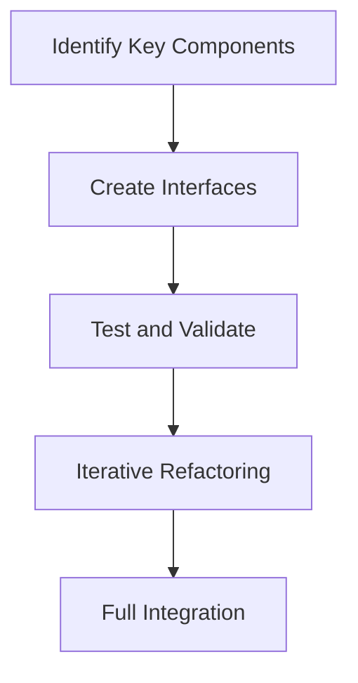

## 20.7 Migration from Other Languages to Lua

Migrating from one programming language to another is a significant undertaking that can yield substantial benefits, such as simplification of codebases and improved performance. This section delves into the reasons for migrating to Lua, the approaches to take, challenges to anticipate, and real-world use cases that illustrate the process.

### Reasons for Migration

#### Simplification

One of the primary motivations for migrating to Lua is the simplification of complex codebases. Lua's lightweight and flexible nature makes it an ideal choice for reducing the complexity inherent in larger systems. By leveraging Lua's straightforward syntax and powerful features, developers can streamline their code, making it more maintainable and easier to understand.

#### Performance

Lua is renowned for its performance, particularly when embedded in applications. Its efficient execution model and the availability of LuaJIT (Just-In-Time Compiler) can lead to significant performance improvements. Migrating to Lua can help optimize resource-intensive applications, resulting in faster execution times and reduced memory usage.

### Approach

#### Incremental Transition

Migrating an entire system to a new language can be daunting. An incremental transition strategy allows for a gradual introduction of Lua into existing projects. This approach involves:

1. **Identifying Key Components**: Start by identifying components or modules that would benefit most from Lua's features.
2. **Creating Interfaces**: Develop interfaces between existing code and new Lua modules to ensure seamless integration.
3. **Testing and Validation**: Rigorously test each migrated component to ensure functionality and performance are maintained or improved.
4. **Iterative Refactoring**: Continuously refactor and optimize the Lua code as more components are migrated.

#### Training and Support

Providing adequate training and support is crucial for a successful migration. Teams should be equipped with resources such as:

- **Lua Documentation**: Comprehensive guides and references to Lua's syntax and libraries.
- **Workshops and Tutorials**: Hands-on sessions to familiarize developers with Lua's features and best practices.
- **Mentorship Programs**: Pairing experienced Lua developers with team members to facilitate knowledge transfer.

### Challenges

#### Compatibility

Ensuring compatibility between Lua and existing systems is a common challenge. Strategies to address this include:

- **Interfacing with Other Languages**: Utilize Lua's C API or LuaJIT's FFI (Foreign Function Interface) to interface with code written in other languages.
- **Data Serialization**: Implement robust data serialization and deserialization mechanisms to facilitate data exchange between Lua and other systems.
- **Testing Frameworks**: Employ testing frameworks to validate the integration and functionality of Lua components within the larger system.

### Use Cases and Examples

#### Legacy Systems Update

Modernizing outdated applications is a compelling use case for migrating to Lua. Legacy systems often suffer from performance bottlenecks and maintenance challenges. By introducing Lua, organizations can:

- **Enhance Performance**: Replace performance-critical components with Lua to leverage its efficient execution.
- **Simplify Maintenance**: Refactor complex legacy code into more manageable Lua scripts.
- **Extend Functionality**: Use Lua's extensibility to add new features without overhauling the entire system.

**Example**: Consider a legacy system written in C++ with performance issues. By migrating computationally intensive modules to Lua, the system can achieve better performance while maintaining compatibility with existing C++ code through Lua's C API.

### Code Examples

Let's explore a simple example of migrating a function from Python to Lua. Suppose we have a Python function that calculates the factorial of a number:

```python
def factorial(n):
    if n == 0:
        return 1
    else:
        return n * factorial(n - 1)
```

The equivalent Lua function would look like this:

```lua
function factorial(n)
    if n == 0 then
        return 1
    else
        return n * factorial(n - 1)
    end
end
```

**Key Differences**:
- Lua uses `function` to define functions and `end` to close them.
- The `if` statement in Lua ends with `then` and is closed with `end`.

### Visualizing the Migration Process

Below is a flowchart illustrating the incremental migration process from another language to Lua:



**Description**: This flowchart outlines the steps involved in incrementally migrating components to Lua, ensuring a smooth transition and integration into the existing system.

### Try It Yourself

Experiment with migrating a simple script from another language to Lua. Start with a basic function, such as a string manipulation or mathematical operation, and rewrite it in Lua. Test the Lua version to ensure it behaves as expected. Consider the following:

- Modify the Lua script to handle edge cases.
- Optimize the Lua code for performance.
- Integrate the Lua script with a small application to see how it interacts with other components.

### Knowledge Check

- What are the primary reasons for migrating to Lua?
- Describe the incremental transition approach.
- How can compatibility challenges be addressed during migration?
- Provide an example of a legacy system update using Lua.

### Embrace the Journey

Remember, migrating to Lua is an opportunity to enhance your system's performance and maintainability. As you progress, you'll gain a deeper understanding of Lua's capabilities and how they can be leveraged to improve your applications. Keep experimenting, stay curious, and enjoy the journey!

## Quiz Time!



### What is one of the primary reasons for migrating to Lua?

- [x] Simplification of codebases
- [ ] Increased complexity
- [ ] Higher memory usage
- [ ] Reduced performance

> **Explanation:** Simplification of codebases is a key reason for migrating to Lua, as it helps reduce complexity and improve maintainability.

### Which approach is recommended for migrating to Lua?

- [x] Incremental Transition
- [ ] Immediate Overhaul
- [ ] Complete Rewrite
- [ ] Ignoring Compatibility

> **Explanation:** An incremental transition allows for a gradual introduction of Lua, minimizing disruption and ensuring seamless integration.

### How can compatibility challenges be addressed during migration?

- [x] Using Lua's C API
- [ ] Ignoring existing systems
- [ ] Disabling features
- [ ] Removing interfaces

> **Explanation:** Lua's C API can be used to interface with code written in other languages, ensuring compatibility.

### What is a common challenge when migrating to Lua?

- [x] Compatibility
- [ ] Lack of documentation
- [ ] High cost
- [ ] Limited community support

> **Explanation:** Compatibility is a common challenge, as it involves ensuring seamless integration with existing systems.

### What is a benefit of using LuaJIT during migration?

- [x] Improved performance
- [ ] Increased complexity
- [ ] Reduced functionality
- [ ] Higher memory usage

> **Explanation:** LuaJIT provides a Just-In-Time Compiler that can significantly improve the performance of Lua applications.

### What is a key step in the incremental transition approach?

- [x] Identifying Key Components
- [ ] Ignoring existing code
- [ ] Disabling features
- [ ] Removing interfaces

> **Explanation:** Identifying key components allows for a targeted approach to migration, focusing on areas that will benefit most from Lua's features.

### How can training and support be provided during migration?

- [x] Workshops and Tutorials
- [ ] Ignoring team needs
- [ ] Disabling features
- [ ] Removing interfaces

> **Explanation:** Workshops and tutorials help familiarize developers with Lua's features and best practices, facilitating a smoother migration process.

### What is a use case for migrating to Lua?

- [x] Legacy Systems Update
- [ ] Increasing complexity
- [ ] Reducing performance
- [ ] Ignoring compatibility

> **Explanation:** Updating legacy systems is a common use case for migrating to Lua, as it can enhance performance and simplify maintenance.

### What is a key feature of Lua that aids in migration?

- [x] Lightweight and Flexible Nature
- [ ] High memory usage
- [ ] Complex syntax
- [ ] Limited functionality

> **Explanation:** Lua's lightweight and flexible nature makes it an ideal choice for simplifying complex codebases and improving performance.

### True or False: Lua is known for its high memory usage.

- [ ] True
- [x] False

> **Explanation:** False. Lua is known for its efficient memory usage, making it suitable for performance-critical applications.


