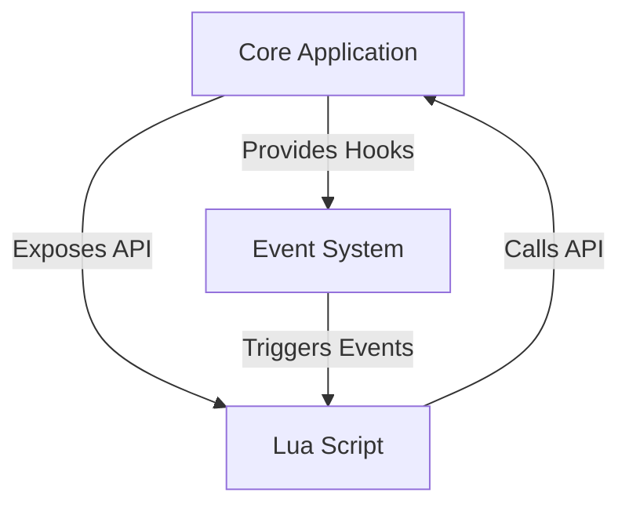

## 20.8 Integrating Lua into Existing Software Architectures

Integrating Lua into existing software architectures can significantly enhance the flexibility and extensibility of applications. Lua, a lightweight and embeddable scripting language, is renowned for its simplicity and efficiency, making it an excellent choice for adding scripting capabilities to existing systems. In this section, we will explore the various aspects of integrating Lua into existing software architectures, including enhancing applications, implementation techniques, benefits, and real-world use cases.

### Enhancing Applications with Lua

#### Extending Functionality

One of the primary reasons to integrate Lua into an existing software architecture is to extend its functionality. By embedding Lua, developers can add scripting capabilities that allow for dynamic behavior modification without altering the core application code. This approach is particularly beneficial in scenarios where frequent updates or customizations are required.

**Example:**

Consider a game engine that needs to support various game mechanics. By integrating Lua, developers can script different game behaviors, such as AI logic, event handling, and user interactions, without recompiling the entire engine. This flexibility allows for rapid prototyping and iteration.

```lua
-- Example of a Lua script controlling game character behavior
function onPlayerAttack()
    if playerHasWeapon() then
        dealDamageToEnemy()
    else
        print("Player needs a weapon to attack!")
    end
end
```

#### Implementation Techniques

Integrating Lua into an existing architecture involves several key techniques, including the use of APIs and hooks to enable Lua scripts to interact with the core application logic.

##### APIs and Hooks

APIs (Application Programming Interfaces) and hooks are essential for allowing Lua scripts to interact with the core application. By exposing certain functions and data structures to Lua, developers can create a bridge between the scripting environment and the main application.

**Example:**

In a web server application, you might expose functions for handling HTTP requests and responses to Lua scripts, allowing for custom request processing.

```lua
-- Lua script for handling HTTP requests
function handleRequest(request)
    if request.method == "GET" then
        return handleGetRequest(request)
    elseif request.method == "POST" then
        return handlePostRequest(request)
    else
        return "Unsupported HTTP method"
    end
end
```

**Diagram: API and Hook Integration**



### Benefits of Integrating Lua

#### User Customization

One of the standout benefits of integrating Lua is the empowerment of users to customize application behavior. By providing a scripting interface, users can tailor the application to their specific needs, enhancing user satisfaction and engagement.

**Example:**

In enterprise software, users can write Lua scripts to automate workflows, generate custom reports, or integrate with other systems, all without needing to modify the core software.

```lua
-- Lua script for generating a custom report
function generateReport(data)
    local report = {}
    for _, entry in ipairs(data) do
        if entry.status == "completed" then
            table.insert(report, entry)
        end
    end
    return report
end
```

### Use Cases and Examples

#### Enterprise Software

In the realm of enterprise software, integrating Lua can provide significant advantages by allowing businesses to tailor solutions to their specific needs. This flexibility is crucial in environments where requirements frequently change or where custom integrations are necessary.

**Example:**

A customer relationship management (CRM) system can use Lua scripts to automate data entry, customize user interfaces, or integrate with third-party services, providing a more personalized experience for each business.

```lua
-- Lua script for automating data entry in a CRM system
function automateDataEntry(customerData)
    for _, customer in ipairs(customerData) do
        if not customerExists(customer.id) then
            addCustomerToDatabase(customer)
        end
    end
end
```

### Implementation Strategies

#### Embedding Lua

To integrate Lua into an existing architecture, you need to embed the Lua interpreter within your application. This process involves linking the Lua library to your application and setting up the necessary environment for executing Lua scripts.

**Steps to Embed Lua:**

1. **Include Lua Headers and Libraries:** Ensure that your build system includes the Lua headers and libraries.
2. **Initialize the Lua State:** Create and initialize a Lua state, which serves as the execution environment for Lua scripts.
3. **Expose Application Functions:** Use the Lua C API to expose application functions and data to Lua scripts.
4. **Execute Lua Scripts:** Load and execute Lua scripts within the application context.

**Example:**

```c
#include <lua.h>
#include <lualib.h>
#include <lauxlib.h>

void integrateLua() {
    lua_State *L = luaL_newstate();  // Create a new Lua state
    luaL_openlibs(L);  // Open Lua standard libraries

    // Load and execute a Lua script
    if (luaL_dofile(L, "script.lua") != LUA_OK) {
        fprintf(stderr, "Error: %s\n", lua_tostring(L, -1));
    }

    lua_close(L);  // Close the Lua state
}
```

#### Providing a Scripting API

To maximize the benefits of Lua integration, provide a robust scripting API that exposes key functionalities of your application. This API should be well-documented and designed to be intuitive for script authors.

**Example:**

In a media player application, you might expose functions for controlling playback, managing playlists, and handling user input.

```lua
-- Lua script for controlling media playback
function onPlayButtonPressed()
    if isPlaying() then
        pausePlayback()
    else
        startPlayback()
    end
end
```

### Challenges and Considerations

#### Security Concerns

When integrating Lua, it is crucial to consider security implications, especially if scripts are user-generated. Implement measures to sandbox scripts and restrict access to sensitive functions and data.

**Example:**

Use Lua's debug library to monitor script execution and prevent unauthorized actions.

```lua
-- Example of restricting access to certain functions
function safeExecute(script)
    local env = {
        print = print,  -- Allow print function
        -- Restrict access to other functions
    }
    setfenv(script, env)
    return pcall(script)
end
```

#### Performance Implications

While Lua is lightweight, executing scripts can introduce performance overhead. Optimize script execution by pre-compiling scripts and minimizing context switching between Lua and the host application.

**Example:**

Use Lua's bytecode compilation to improve performance.

```lua
-- Pre-compile a Lua script to bytecode
local bytecode = string.dump(loadfile("script.lua"))
```

### Real-World Examples

#### Game Development

In game development, Lua is widely used for scripting game logic, AI behavior, and user interfaces. Its integration allows for rapid iteration and customization, making it a popular choice among game developers.

**Example:**

In a multiplayer online game, Lua scripts can be used to manage player interactions, handle events, and customize game rules.

```lua
-- Lua script for managing player interactions
function onPlayerJoin(player)
    welcomePlayer(player)
    assignDefaultRole(player)
end
```

#### Web Applications

Lua can be integrated into web applications to handle dynamic content generation, manage user sessions, and process server-side logic. Its lightweight nature makes it suitable for high-performance web environments.

**Example:**

In a content management system (CMS), Lua scripts can be used to generate custom page layouts, process form submissions, and interact with databases.

```lua
-- Lua script for generating a custom page layout
function generatePageLayout(content)
    local layout = "<html><body>"
    layout = layout .. "<h1>" .. content.title .. "</h1>"
    layout = layout .. "<p>" .. content.body .. "</p>"
    layout = layout .. "</body></html>"
    return layout
end
```

### Try It Yourself

To get hands-on experience with integrating Lua into an existing application, try the following exercise:

1. **Set Up a Lua Environment:** Install Lua on your system and set up a simple C or C++ application.
2. **Embed Lua:** Follow the steps outlined in the "Embedding Lua" section to integrate Lua into your application.
3. **Create a Scripting API:** Expose a few functions from your application to Lua scripts.
4. **Write Lua Scripts:** Create Lua scripts that interact with your application's API.
5. **Experiment:** Modify the Lua scripts to change application behavior and observe the results.

### Conclusion

Integrating Lua into existing software architectures offers numerous benefits, including enhanced flexibility, user customization, and rapid development capabilities. By embedding Lua and providing a robust scripting API, developers can empower users to tailor applications to their specific needs, ultimately leading to more dynamic and adaptable software solutions.

## Quiz Time!



### What is one primary reason for integrating Lua into existing software architectures?

- [x] To extend functionality without altering core code
- [ ] To replace the core programming language
- [ ] To increase the application's size
- [ ] To decrease the application's performance

> **Explanation:** Integrating Lua allows for extending functionality by adding scripting capabilities without altering the core application code.

### What is a key technique for enabling Lua scripts to interact with core application logic?

- [x] APIs and Hooks
- [ ] Direct memory access
- [ ] Recompiling the application
- [ ] Using global variables

> **Explanation:** APIs and hooks are essential for allowing Lua scripts to interact with the core application by exposing functions and data structures.

### What is one benefit of integrating Lua into enterprise software?

- [x] User customization
- [ ] Increased hardware requirements
- [ ] Reduced functionality
- [ ] Less flexibility

> **Explanation:** Integrating Lua allows users to customize application behavior, enhancing user satisfaction and engagement.

### What is a common use case for Lua in game development?

- [x] Scripting game logic and AI behavior
- [ ] Replacing the game engine
- [ ] Decreasing game performance
- [ ] Removing user interfaces

> **Explanation:** Lua is widely used in game development for scripting game logic, AI behavior, and user interfaces.

### What should be considered when integrating Lua to ensure security?

- [x] Implementing measures to sandbox scripts
- [ ] Allowing unrestricted access to all functions
- [ ] Ignoring user-generated scripts
- [ ] Disabling Lua's debug library

> **Explanation:** It is crucial to implement measures to sandbox scripts and restrict access to sensitive functions and data for security.

### How can performance be optimized when executing Lua scripts?

- [x] Pre-compiling scripts to bytecode
- [ ] Increasing the number of Lua states
- [ ] Using global variables
- [ ] Disabling Lua's garbage collector

> **Explanation:** Pre-compiling scripts to bytecode can improve performance by reducing the overhead of script execution.

### What is a potential challenge when integrating Lua into an application?

- [x] Performance overhead
- [ ] Decreased user engagement
- [ ] Increased application size
- [ ] Reduced functionality

> **Explanation:** Executing Lua scripts can introduce performance overhead, which needs to be managed effectively.

### What is a common use case for Lua in web applications?

- [x] Handling dynamic content generation
- [ ] Replacing HTML and CSS
- [ ] Decreasing server performance
- [ ] Removing user sessions

> **Explanation:** Lua can be used in web applications to handle dynamic content generation, manage user sessions, and process server-side logic.

### What is the first step in embedding Lua into an application?

- [x] Include Lua headers and libraries
- [ ] Write Lua scripts
- [ ] Create a scripting API
- [ ] Execute Lua scripts

> **Explanation:** The first step in embedding Lua is to include the Lua headers and libraries in your build system.

### True or False: Lua can only be integrated into new software architectures, not existing ones.

- [ ] True
- [x] False

> **Explanation:** Lua can be integrated into both new and existing software architectures to enhance flexibility and functionality.


