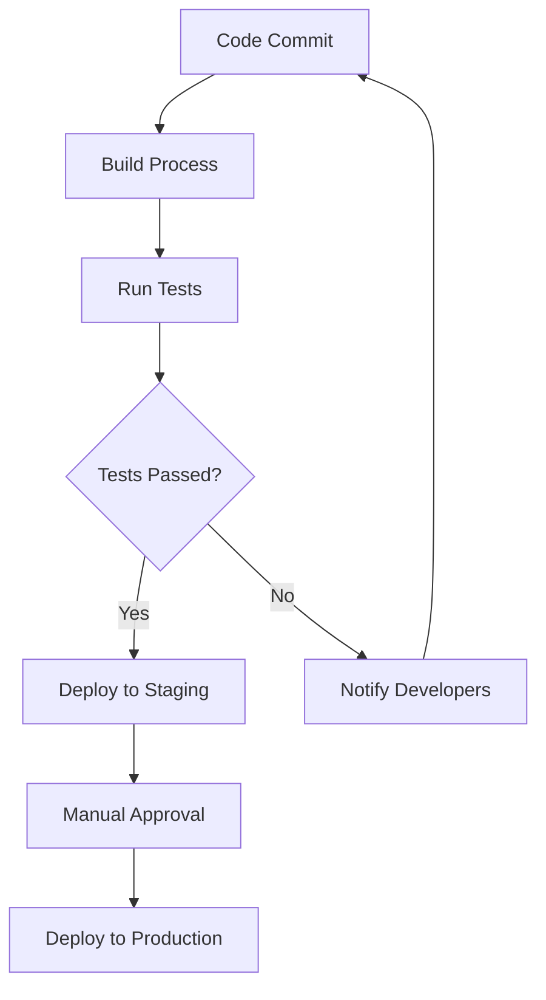

## 20.9 Leveraging Lua in Continuous Integration Pipelines

Continuous Integration (CI) is a cornerstone of modern software development, enabling teams to automate the building, testing, and deployment of applications. Lua, with its lightweight footprint and flexibility, is an excellent choice for scripting tasks within CI pipelines. In this section, we will explore how Lua can be leveraged to automate development processes, enhance flexibility, and ensure consistency in CI workflows.

### Automating Development Processes

#### Scripted Tasks: Using Lua for Build and Deployment Scripts

Lua's simplicity and ease of integration make it an ideal scripting language for automating various tasks in CI pipelines. By using Lua scripts, developers can automate build processes, manage dependencies, and deploy applications seamlessly. Let's delve into how Lua can be used for these purposes.

**Example: Automating a Build Process with Lua**

```lua
-- Lua script to automate a build process
local function runCommand(command)
    local handle = io.popen(command)
    local result = handle:read("*a")
    handle:close()
    return result
end

-- Define build steps
local buildSteps = {
    "gcc -o myapp main.c utils.c",
    "strip myapp",
    "tar -czvf myapp.tar.gz myapp"
}

-- Execute build steps
for _, step in ipairs(buildSteps) do
    print("Executing: " .. step)
    local output = runCommand(step)
    print(output)
end
```

In this example, we define a series of build steps and execute them using Lua's `io.popen` function to run shell commands. This script compiles a C application, strips the binary, and packages it into a tarball.

### Benefits of Using Lua in CI Pipelines

#### Flexibility: Customizing CI Workflows

Lua's flexibility allows developers to customize CI workflows to fit their specific needs. Whether it's integrating with third-party tools, managing environment variables, or handling complex logic, Lua provides the necessary tools to tailor CI processes.

**Example: Customizing Environment Variables**

```lua
-- Lua script to customize environment variables
local function setEnvVariable(name, value)
    os.setenv(name, value)
end

-- Customize environment variables for the build
setEnvVariable("BUILD_ENV", "production")
setEnvVariable("VERSION", "1.0.0")

print("Environment variables set for build.")
```

This script demonstrates how to set environment variables using Lua, allowing for dynamic configuration of build environments.

#### Consistency: Ensuring Reliable Processes

Consistency is crucial in CI pipelines to ensure that builds and deployments are reliable and repeatable. Lua scripts can help enforce consistency by standardizing tasks and reducing human error.

**Example: Standardizing Deployment Processes**

```lua
-- Lua script to standardize deployment processes
local function deployApplication(server, package)
    local command = string.format("scp %s %s:/var/www/html", package, server)
    local result = runCommand(command)
    print(result)
end

-- Deploy application to multiple servers
local servers = {"server1.example.com", "server2.example.com"}
local package = "myapp.tar.gz"

for _, server in ipairs(servers) do
    deployApplication(server, package)
end
```

In this example, we use Lua to deploy an application package to multiple servers, ensuring a consistent deployment process across environments.

### Use Cases and Examples

#### Testing Automation: Running Tests and Collecting Results

Automating testing is a critical component of CI pipelines. Lua can be used to run tests, collect results, and report outcomes, ensuring that code changes do not introduce regressions.

**Example: Automating Test Execution**

```lua
-- Lua script to automate test execution
local function runTests(testSuite)
    local command = string.format("lua %s", testSuite)
    local result = runCommand(command)
    print("Test Results:\n" .. result)
end

-- Run tests
local testSuites = {"test1.lua", "test2.lua", "test3.lua"}

for _, suite in ipairs(testSuites) do
    runTests(suite)
end
```

This script executes a series of Lua test suites and prints the results, facilitating automated testing in CI pipelines.

#### Deployment Automation: Streamlining Releases

Deployment automation is essential for efficient software delivery. Lua can streamline release processes by automating deployment tasks, reducing manual intervention, and minimizing downtime.

**Example: Automating Application Release**

```lua
-- Lua script to automate application release
local function releaseApplication(version)
    local tagCommand = string.format("git tag -a v%s -m 'Release version %s'", version, version)
    local pushCommand = "git push --tags"
    runCommand(tagCommand)
    runCommand(pushCommand)
    print("Application released: version " .. version)
end

-- Release new version
local newVersion = "1.0.1"
releaseApplication(newVersion)
```

In this example, we automate the release of a new application version by tagging the release in Git and pushing the tags to the remote repository.

### Visualizing Lua in CI Pipelines

To better understand how Lua fits into CI pipelines, let's visualize a typical CI workflow incorporating Lua scripts.



**Diagram Description**: This flowchart illustrates a CI pipeline where Lua scripts automate the build process, run tests, and handle deployments. If tests pass, the application is deployed to a staging environment, followed by manual approval for production deployment. If tests fail, developers are notified to address issues.

### References and Links

- [Lua Official Documentation](https://www.lua.org/manual/5.4/)
- [Continuous Integration with Jenkins](https://www.jenkins.io/doc/)
- [GitHub Actions for CI/CD](https://docs.github.com/en/actions)

### Knowledge Check

- What are the benefits of using Lua in CI pipelines?
- How can Lua scripts automate deployment processes?
- Describe how Lua can be used to customize CI workflows.

### Embrace the Journey

Remember, integrating Lua into your CI pipelines is just the beginning. As you progress, you'll discover more ways to enhance your development processes. Keep experimenting, stay curious, and enjoy the journey!

### Quiz Time!



### What is a primary benefit of using Lua in CI pipelines?

- [x] Flexibility in customizing workflows
- [ ] Increased memory usage
- [ ] Slower execution times
- [ ] Limited integration capabilities

> **Explanation:** Lua provides flexibility in customizing CI workflows, allowing developers to tailor processes to their specific needs.

### How can Lua scripts ensure consistency in CI pipelines?

- [x] By standardizing tasks and reducing human error
- [ ] By increasing manual intervention
- [ ] By introducing variability in processes
- [ ] By complicating deployment steps

> **Explanation:** Lua scripts can standardize tasks, reducing human error and ensuring consistent processes in CI pipelines.

### Which Lua function is used to run shell commands in the examples?

- [x] io.popen
- [ ] os.execute
- [ ] string.format
- [ ] table.insert

> **Explanation:** The `io.popen` function is used to run shell commands and capture their output in the examples.

### What is a use case for Lua in CI pipelines?

- [x] Automating test execution
- [ ] Manual code review
- [ ] Increasing build times
- [ ] Reducing code quality

> **Explanation:** Lua can automate test execution, ensuring that code changes do not introduce regressions.

### How does Lua contribute to deployment automation?

- [x] By automating deployment tasks and minimizing downtime
- [ ] By requiring manual deployment steps
- [ ] By increasing deployment complexity
- [ ] By reducing deployment frequency

> **Explanation:** Lua automates deployment tasks, reducing manual intervention and minimizing downtime.

### What is the role of environment variables in CI workflows?

- [x] They allow dynamic configuration of build environments
- [ ] They increase build times
- [ ] They complicate deployment processes
- [ ] They reduce flexibility

> **Explanation:** Environment variables allow for dynamic configuration of build environments, enhancing flexibility in CI workflows.

### How can Lua scripts handle multiple server deployments?

- [x] By iterating over a list of servers and deploying to each
- [ ] By deploying to a single server only
- [ ] By requiring manual server selection
- [ ] By increasing deployment errors

> **Explanation:** Lua scripts can iterate over a list of servers, deploying to each, ensuring consistent deployment processes.

### What is a key takeaway from using Lua in CI pipelines?

- [x] Lua enhances automation and consistency
- [ ] Lua complicates CI workflows
- [ ] Lua reduces automation capabilities
- [ ] Lua increases manual intervention

> **Explanation:** Lua enhances automation and consistency in CI pipelines, streamlining development processes.

### What is the purpose of the `runCommand` function in the examples?

- [x] To execute shell commands and capture their output
- [ ] To format strings
- [ ] To insert elements into tables
- [ ] To set environment variables

> **Explanation:** The `runCommand` function executes shell commands and captures their output, facilitating automation tasks.

### True or False: Lua can be used to automate both testing and deployment processes in CI pipelines.

- [x] True
- [ ] False

> **Explanation:** Lua can automate both testing and deployment processes, enhancing CI pipeline efficiency and reliability.


