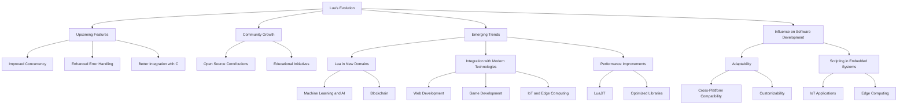

## 21.2 The Future of Lua and Emerging Trends

As we delve into the future of Lua, it's essential to understand the language's evolution, its current standing, and the emerging trends that are shaping its trajectory. Lua has long been celebrated for its simplicity, flexibility, and efficiency, making it a popular choice for scripting in various domains. Let's explore the potential future developments of Lua, the role of its community, and the exciting new areas where Lua is making its mark.

### Evolution of Lua

Lua, which means "moon" in Portuguese, was created in 1993 by Roberto Ierusalimschy, Luiz Henrique de Figueiredo, and Waldemar Celes at the Pontifical Catholic University of Rio de Janeiro, Brazil. Initially designed as a configuration language, Lua has evolved into a powerful, lightweight scripting language used in diverse applications, from game development to embedded systems.

#### Upcoming Features

Lua's development is guided by its creators and the vibrant community that surrounds it. While Lua 5.4, released in 2020, introduced several enhancements such as to-be-closed variables and improved garbage collection, the future promises even more exciting features. Anticipated enhancements include:

- **Improved Concurrency**: With the rise of multi-core processors, there is a growing demand for better concurrency support in scripting languages. Future versions of Lua may introduce more robust concurrency models, potentially leveraging coroutines and enhanced parallelism.
  
- **Enhanced Error Handling**: As applications become more complex, robust error handling becomes crucial. Future Lua versions may offer more sophisticated error handling mechanisms, making it easier for developers to write resilient code.

- **Better Integration with C**: Lua's ability to interface with C is one of its strengths. Future enhancements may focus on making this integration even more seamless, allowing for more efficient communication between Lua scripts and C libraries.

#### Community Growth

The Lua community plays a pivotal role in shaping the language's future. With active forums, mailing lists, and conferences like the Lua Workshop, the community fosters collaboration and innovation. The community's contributions, such as libraries, tools, and frameworks, significantly enhance Lua's capabilities and adoption.

- **Open Source Contributions**: The open-source nature of Lua encourages developers to contribute to its ecosystem. This collaborative environment accelerates the development of new features and tools, ensuring Lua remains relevant in a rapidly changing tech landscape.

- **Educational Initiatives**: The community's efforts to promote Lua in educational settings are crucial for its growth. By introducing Lua to students and new developers, the community ensures a steady influx of fresh ideas and perspectives.

### Emerging Trends

As Lua continues to evolve, several emerging trends are shaping its future. These trends highlight Lua's adaptability and potential to expand into new domains and integrate with modern technologies.

#### Lua in New Domains

Lua's lightweight nature and ease of embedding make it an attractive choice for emerging domains such as machine learning, artificial intelligence (AI), and blockchain.

- **Machine Learning and AI**: While Lua is not traditionally associated with machine learning, its simplicity and speed make it a viable option for scripting AI models. Frameworks like Torch, which was initially developed in Lua, demonstrate Lua's potential in this domain. As AI continues to evolve, Lua could play a role in developing lightweight, efficient AI applications.

- **Blockchain**: The blockchain industry values security and efficiency, both of which are strengths of Lua. Some blockchain platforms are exploring Lua as a scripting language for smart contracts, leveraging its simplicity and performance.

#### Integration with Modern Technologies

Lua's ability to integrate with various platforms and frameworks positions it well for future technological advancements.

- **Web Development**: With the rise of serverless architectures and microservices, Lua is finding its place in web development. Platforms like OpenResty, which combines Nginx with Lua, enable developers to build high-performance web applications.

- **Game Development**: Lua's popularity in game development continues to grow, with engines like Unity and Corona SDK supporting Lua scripting. As the gaming industry evolves, Lua's role in creating dynamic, interactive experiences is likely to expand.

- **IoT and Edge Computing**: Lua's small footprint and efficiency make it ideal for IoT and edge computing applications. As these technologies become more prevalent, Lua's role in scripting and controlling IoT devices is expected to increase.

#### Performance Improvements

Performance is a critical factor in Lua's continued success. Advances like LuaJIT (Just-In-Time Compiler) have significantly improved Lua's execution speed, making it competitive with other scripting languages.

- **LuaJIT**: LuaJIT is a powerful tool that enhances Lua's performance by compiling Lua scripts into machine code at runtime. This results in faster execution times and makes Lua suitable for performance-critical applications.

- **Optimized Libraries**: The development of optimized libraries and tools further enhances Lua's performance. As the demand for high-performance applications grows, the Lua community is likely to focus on creating and improving libraries that maximize Lua's efficiency.

### Influence on Software Development

Lua's adaptability and flexibility make it a valuable tool in modern software development. Its influence is evident in various areas, from scripting in embedded systems to its role in new technological domains.

#### Adaptability

Lua's ability to adapt to different environments and requirements is one of its greatest strengths. This adaptability positions Lua well for future challenges in software development.

- **Cross-Platform Compatibility**: Lua's cross-platform nature allows developers to write code that runs seamlessly on different operating systems and devices. This flexibility is crucial in a world where applications need to function across diverse platforms.

- **Customizability**: Lua's simplicity and extensibility make it easy to customize and extend, allowing developers to tailor it to their specific needs. This customizability is particularly valuable in industries where specialized solutions are required.

#### Scripting in Embedded Systems

Lua's lightweight design makes it an ideal choice for scripting in embedded systems, a field that is becoming increasingly important with the rise of IoT and edge computing.

- **IoT Applications**: Lua's small footprint and efficiency make it suitable for IoT devices, where resources are limited. As IoT continues to grow, Lua's role in scripting and controlling these devices is expected to expand.

- **Edge Computing**: In edge computing, where processing is done closer to the data source, Lua's efficiency and speed are valuable assets. Lua's ability to run on low-power devices makes it a strong candidate for edge computing applications.

### Visualizing Lua's Future

To better understand Lua's potential future, let's visualize its evolution and emerging trends using a flowchart.

This diagram illustrates the interconnected nature of Lua's evolution, emerging trends, and influence on software development. Each component builds upon the others, highlighting Lua's potential to adapt and thrive in a rapidly changing technological landscape.

### Conclusion

The future of Lua is bright, with numerous opportunities for growth and innovation. As Lua continues to evolve, its adaptability, efficiency, and simplicity will ensure its relevance in a wide range of applications. Whether it's expanding into new domains like machine learning and blockchain, integrating with modern technologies, or enhancing performance, Lua is well-positioned to meet the challenges of the future.

Remember, this is just the beginning. As you explore Lua's potential, keep experimenting, stay curious, and enjoy the journey. Lua's flexibility and power make it a valuable tool for developers, and its future is full of exciting possibilities.

## Quiz Time!



### What is one of the anticipated enhancements in future versions of Lua?

- [x] Improved concurrency
- [ ] Static typing
- [ ] Built-in machine learning libraries
- [ ] Native blockchain support

> **Explanation:** Improved concurrency is one of the anticipated enhancements in future versions of Lua, addressing the growing demand for better concurrency support in scripting languages.

### Which community initiative is crucial for Lua's growth?

- [x] Educational initiatives
- [ ] Proprietary software development
- [ ] Closed-source contributions
- [ ] Exclusive conferences

> **Explanation:** Educational initiatives are crucial for Lua's growth as they introduce the language to students and new developers, ensuring a steady influx of fresh ideas and perspectives.

### In which new domain is Lua expanding its usage?

- [x] Machine learning and AI
- [ ] Traditional desktop applications
- [ ] Legacy systems
- [ ] Mainframe computing

> **Explanation:** Lua is expanding its usage in machine learning and AI, leveraging its simplicity and speed to develop lightweight, efficient AI applications.

### What is LuaJIT?

- [x] A Just-In-Time Compiler for Lua
- [ ] A new version of Lua
- [ ] A web development framework
- [ ] A database management system

> **Explanation:** LuaJIT is a Just-In-Time Compiler for Lua that enhances Lua's performance by compiling Lua scripts into machine code at runtime.

### How does Lua's cross-platform compatibility benefit developers?

- [x] Allows code to run seamlessly on different operating systems
- [ ] Limits code execution to specific platforms
- [ ] Requires platform-specific modifications
- [ ] Increases development time

> **Explanation:** Lua's cross-platform compatibility allows developers to write code that runs seamlessly on different operating systems, providing flexibility and reducing development time.

### Which emerging trend highlights Lua's role in IoT?

- [x] Scripting in embedded systems
- [ ] Desktop application development
- [ ] Mainframe computing
- [ ] Legacy system integration

> **Explanation:** Scripting in embedded systems highlights Lua's role in IoT, where its small footprint and efficiency make it suitable for IoT devices.

### What is one of the performance improvements in Lua?

- [x] LuaJIT
- [ ] Increased memory usage
- [ ] Slower execution times
- [ ] Reduced code readability

> **Explanation:** LuaJIT is one of the performance improvements in Lua, enhancing execution speed by compiling Lua scripts into machine code at runtime.

### How does Lua's customizability benefit developers?

- [x] Allows tailoring to specific needs
- [ ] Limits flexibility
- [ ] Increases complexity
- [ ] Reduces adaptability

> **Explanation:** Lua's customizability allows developers to tailor it to their specific needs, providing flexibility and adaptability in various applications.

### What is one of the roles of the Lua community?

- [x] Shaping the language's future
- [ ] Restricting language development
- [ ] Limiting open-source contributions
- [ ] Discouraging educational initiatives

> **Explanation:** The Lua community plays a pivotal role in shaping the language's future through contributions, collaboration, and innovation.

### True or False: Lua is not suitable for edge computing applications.

- [ ] True
- [x] False

> **Explanation:** False. Lua's efficiency and speed make it suitable for edge computing applications, where processing is done closer to the data source.


