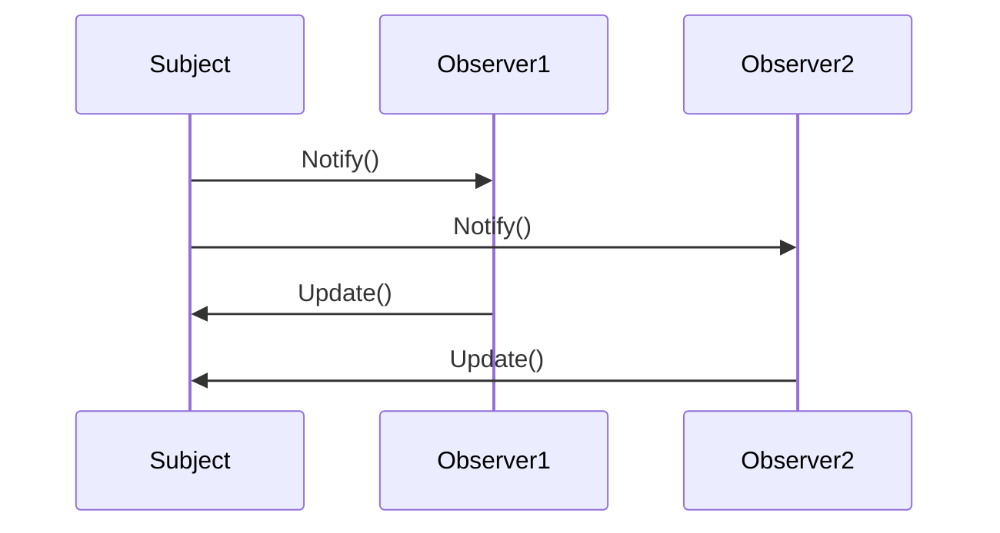

## 21.3 Final Thoughts on Design Patterns in Lua

As we reach the conclusion of our comprehensive guide on mastering Lua design patterns, it's essential to reflect on the pivotal role these patterns play in enhancing software development. Design patterns are not just theoretical constructs; they are practical solutions to common problems that developers face. In the context of Lua, a language known for its simplicity and flexibility, design patterns offer a structured approach to building robust and efficient applications.

### The Role of Design Patterns

Design patterns serve as a bridge between theoretical concepts and practical implementation. They encapsulate best practices and provide a shared language for developers to communicate complex ideas succinctly. In Lua, design patterns help developers leverage the language's unique features, such as first-class functions, metatables, and coroutines, to create elegant and maintainable code.

#### Benefits in Lua's Context

Lua's lightweight nature and dynamic typing make it an ideal candidate for implementing design patterns. Here are some benefits of using design patterns in Lua:

- **Modularity**: Design patterns encourage modular code, which is easier to maintain and extend. Lua's module system complements this by allowing developers to encapsulate functionality and manage dependencies effectively.
  
- **Reusability**: Patterns promote code reuse, reducing redundancy and improving efficiency. Lua's ability to handle first-class functions and closures makes it easy to implement reusable components.

- **Flexibility**: Lua's dynamic nature allows for flexible pattern implementations. Developers can adapt patterns to suit specific needs without being constrained by rigid type systems.

- **Performance**: By using patterns like the Flyweight or Proxy, developers can optimize performance-critical sections of their Lua applications, ensuring efficient resource utilization.

#### Adaptation and Innovation

While design patterns provide a solid foundation, they should not stifle creativity. Lua developers are encouraged to adapt and innovate when applying patterns. The language's flexibility allows for creative solutions that may not fit traditional pattern definitions but achieve the desired outcomes effectively.

Consider the Singleton pattern, often criticized for its potential to introduce global state. In Lua, developers can innovate by using metatables to control instance creation, ensuring that the pattern is applied judiciously and without the pitfalls associated with global variables.

### Common Misconceptions

Despite their benefits, design patterns are sometimes misunderstood or misapplied. Let's address some common misconceptions:

#### Overcomplication

One of the most significant risks when using design patterns is overcomplication. Developers may be tempted to apply patterns unnecessarily, leading to bloated and complex code. It's crucial to remember that patterns are tools, not mandates. They should be used to solve specific problems, not as a one-size-fits-all solution.

#### One-Size-Fits-All Mentality

Design patterns are guidelines, not strict rules. They provide a framework for solving problems but should be adapted to fit the context of the application. In Lua, this means considering the language's unique features and constraints when implementing patterns. For example, the Observer pattern can be implemented using Lua's coroutines for asynchronous event handling, providing a more efficient solution than traditional implementations.

### Encouraging Best Practices

To make the most of design patterns in Lua, developers should embrace best practices that foster continual learning and community contribution.

#### Continual Learning

The world of software development is ever-evolving, with new patterns and practices emerging regularly. Developers should stay updated with the latest trends and innovations in design patterns. Engaging with the Lua community, attending conferences, and participating in online forums are excellent ways to keep learning and growing.

#### Community Contribution

Sharing knowledge and collaborating with other developers is vital for personal and professional growth. By contributing to open-source projects, writing blog posts, or giving talks, developers can share their insights and learn from others. The Lua community is vibrant and welcoming, providing ample opportunities for collaboration and knowledge exchange.

### Code Examples and Visualizations

To solidify our understanding, let's explore some code examples and visualizations that illustrate the application of design patterns in Lua.

#### Singleton Pattern in Lua

```lua
-- Singleton pattern implementation in Lua
local Singleton = {}
Singleton.__index = Singleton

-- Private instance variable
local instance

-- Constructor
function Singleton:new()
    if not instance then
        instance = setmetatable({}, Singleton)
        -- Initialize instance variables here
        instance.value = 0
    end
    return instance
end

-- Method to increment value
function Singleton:increment()
    self.value = self.value + 1
end

-- Method to get current value
function Singleton:getValue()
    return self.value
end

-- Usage
local singleton1 = Singleton:new()
singleton1:increment()
print(singleton1:getValue()) -- Output: 1

local singleton2 = Singleton:new()
print(singleton2:getValue()) -- Output: 1 (same instance)
```

In this example, we use a metatable to control the creation of the Singleton instance, ensuring that only one instance exists.

#### Visualizing the Observer Pattern



This sequence diagram illustrates the flow of notifications in the Observer pattern. The Subject notifies all registered Observers, which then update themselves based on the received data.

### Try It Yourself

Experiment with the Singleton pattern by modifying the `increment` method to accept a parameter that specifies the increment value. Observe how this change affects the behavior of the Singleton instance.

### Knowledge Check

Reflect on the following questions to reinforce your understanding:

- How can design patterns improve code maintainability in Lua?
- What are the potential pitfalls of overusing design patterns?
- How can Lua's unique features be leveraged when implementing design patterns?

### Embrace the Journey

As we conclude this guide, remember that mastering design patterns in Lua is a journey, not a destination. The skills and knowledge you've gained here are just the beginning. Continue to explore, experiment, and innovate. Stay curious, and enjoy the process of becoming a more proficient and creative software engineer.

## Quiz Time!



### What is a primary benefit of using design patterns in Lua?

- [x] They promote code reusability and modularity.
- [ ] They enforce strict type checking.
- [ ] They eliminate the need for debugging.
- [ ] They automatically optimize code performance.

> **Explanation:** Design patterns promote code reusability and modularity, making it easier to maintain and extend applications.

### How does Lua's dynamic typing benefit the implementation of design patterns?

- [x] It allows for flexible pattern implementations.
- [ ] It enforces strict adherence to pattern definitions.
- [ ] It restricts the use of certain patterns.
- [ ] It simplifies error handling.

> **Explanation:** Lua's dynamic typing allows developers to adapt patterns to suit specific needs without being constrained by rigid type systems.

### What is a common misconception about design patterns?

- [x] They are a one-size-fits-all solution.
- [ ] They are only applicable to object-oriented languages.
- [ ] They are always easy to implement.
- [ ] They are unnecessary for small projects.

> **Explanation:** A common misconception is that design patterns are a one-size-fits-all solution, but they should be adapted to fit the context of the application.

### How can developers avoid overcomplicating their code with design patterns?

- [x] Use patterns only when they solve specific problems.
- [ ] Apply as many patterns as possible.
- [ ] Avoid using patterns altogether.
- [ ] Rely on patterns to dictate all design decisions.

> **Explanation:** Developers should use patterns only when they solve specific problems to avoid overcomplicating their code.

### What role does community contribution play in mastering design patterns?

- [x] It allows developers to share insights and learn from others.
- [ ] It is unnecessary for personal growth.
- [ ] It limits the ability to innovate.
- [ ] It focuses solely on open-source projects.

> **Explanation:** Community contribution allows developers to share insights and learn from others, fostering personal and professional growth.

### How can Lua's metatables be used creatively in design patterns?

- [x] By controlling instance creation in the Singleton pattern.
- [ ] By enforcing strict type checking.
- [ ] By eliminating the need for error handling.
- [ ] By automatically optimizing performance.

> **Explanation:** Lua's metatables can be used creatively to control instance creation in the Singleton pattern, ensuring only one instance exists.

### What is a potential pitfall of the Singleton pattern?

- [x] It can introduce global state.
- [ ] It is too complex to implement.
- [ ] It is incompatible with Lua.
- [ ] It requires extensive error handling.

> **Explanation:** The Singleton pattern can introduce global state, which needs to be managed carefully to avoid issues.

### How can developers stay updated with new design patterns and practices?

- [x] Engage with the community and participate in forums.
- [ ] Avoid reading new materials.
- [ ] Focus solely on legacy patterns.
- [ ] Rely on outdated resources.

> **Explanation:** Developers can stay updated by engaging with the community and participating in forums, conferences, and other learning opportunities.

### What is the primary goal of using design patterns in software development?

- [x] To provide structured solutions to common problems.
- [ ] To enforce strict coding standards.
- [ ] To eliminate the need for testing.
- [ ] To automatically generate code.

> **Explanation:** The primary goal of using design patterns is to provide structured solutions to common problems, enhancing code quality and maintainability.

### True or False: Design patterns in Lua should be applied rigidly without adaptation.

- [ ] True
- [x] False

> **Explanation:** Design patterns should not be applied rigidly; they should be adapted to fit the specific context and requirements of the application.


