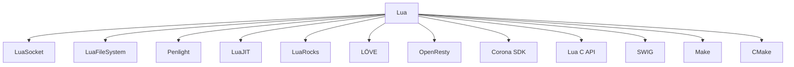

## 22.10 Additional Tools and Libraries

In the world of software development, leveraging the right tools and libraries can significantly enhance your productivity and the capabilities of your applications. Lua, known for its simplicity and flexibility, can be extended with a variety of tools and libraries to meet the demands of modern software engineering. In this section, we will explore popular libraries, frameworks, toolchains, and build systems that can be used to extend Lua's capabilities. We will also provide guidance on installation and usage, ensuring you can seamlessly integrate these resources into your projects.

### Extending Lua's Capabilities

Lua is a lightweight, high-level programming language designed for embedded use in applications. While it is powerful on its own, its true potential is unlocked when combined with additional libraries and tools. These extensions can provide functionalities such as graphical user interfaces (GUIs), networking capabilities, and more.

#### Popular Libraries

1. **LuaSocket**: A networking library that provides support for TCP, UDP, and HTTP protocols. LuaSocket is essential for applications that require network communication.

   ```lua
   local socket = require("socket")
   local tcp = assert(socket.tcp())

   tcp:connect("www.example.com", 80)
   tcp:send("GET / HTTP/1.1\r\nHost: www.example.com\r\n\r\n")

   local response = tcp:receive('*a')
   print(response)
   tcp:close()
   ```

   > **Explanation**: This code snippet demonstrates how to use LuaSocket to connect to a web server and send an HTTP GET request.

2. **LuaFileSystem (LFS)**: Provides functions for directory manipulation and file attribute queries, making it easier to interact with the file system.

   ```lua
   local lfs = require("lfs")

   for file in lfs.dir(".") do
       print("Found file: " .. file)
   end
   ```

   > **Explanation**: This example shows how to list all files in the current directory using LuaFileSystem.

3. **Penlight**: A comprehensive library that extends Lua with additional utilities for data structures, functional programming, and more.

   ```lua
   local pl = require("pl.import_into")()
   local list = pl.List({1, 2, 3, 4, 5})

   list:map(function(x) return x * 2 end)
   print(list)
   ```

   > **Explanation**: Penlight's List module is used here to create a list and apply a map function to double each element.

4. **LuaJIT**: A Just-In-Time Compiler for Lua that significantly improves performance. It is compatible with most Lua libraries and can be used as a drop-in replacement for the standard Lua interpreter.

   ```lua
   local ffi = require("ffi")

   ffi.cdef[[
   int printf(const char *fmt, ...);
   ]]

   ffi.C.printf("Hello, %s!\n", "world")
   ```

   > **Explanation**: LuaJIT's FFI library allows calling C functions directly from Lua, as shown in this example.

5. **LuaRocks**: A package manager for Lua modules, making it easy to install and manage libraries.

   ```bash
   luarocks install luasocket
   ```

   > **Explanation**: This command installs the LuaSocket library using LuaRocks.

#### Frameworks

Frameworks provide a structured environment for developing applications, often including libraries, tools, and best practices. Here are some popular frameworks for Lua:

1. **LÖVE**: A framework for 2D game development that uses Lua for scripting. It provides everything you need to create a game, from graphics and audio to input handling.

   ```lua
   function love.draw()
       love.graphics.print("Hello, LÖVE!", 400, 300)
   end
   ```

   > **Explanation**: This simple LÖVE script displays "Hello, LÖVE!" on the screen.

2. **OpenResty**: A web application platform based on Nginx and LuaJIT. It is designed for building scalable web applications, providing features like HTTP server, caching, and more.

   ```lua
   ngx.say("Hello, OpenResty!")
   ```

   > **Explanation**: This OpenResty script responds with "Hello, OpenResty!" to HTTP requests.

3. **Corona SDK**: A framework for building cross-platform mobile apps and games using Lua. It offers a rich set of APIs for graphics, audio, and more.

   ```lua
   local text = display.newText("Hello, Corona!", 160, 240, native.systemFont, 40)
   ```

   > **Explanation**: This Corona SDK script creates a text display object on the screen.

### Toolchains and Build Systems

Toolchains and build systems are essential for managing the development process, especially when integrating Lua with other programming languages or automating tasks.

#### Interfacing with C/C++

1. **Lua C API**: Allows Lua to be embedded in C/C++ applications, enabling seamless integration between the two languages.

   ```c
   #include <lua.h>
   #include <lauxlib.h>
   #include <lualib.h>

   int main(void) {
       lua_State *L = luaL_newstate();
       luaL_openlibs(L);

       luaL_dostring(L, "print('Hello from Lua!')");
       lua_close(L);
       return 0;
   }
   ```

   > **Explanation**: This C code snippet demonstrates how to execute a Lua script from a C application using the Lua C API.

2. **SWIG**: A tool that generates bindings between C/C++ code and various programming languages, including Lua.

   ```bash
   swig -lua example.i
   gcc -shared example_wrap.c -o example.so -I/usr/include/lua5.1
   ```

   > **Explanation**: This command sequence uses SWIG to create a Lua binding for a C library.

#### Automation Tools

1. **Make**: A build automation tool that can be used to compile and link Lua projects, especially when integrating with C/C++.

   ```makefile
   all:
       gcc -o myapp main.c -llua
   ```

   > **Explanation**: This Makefile compiles a C application that links against the Lua library.

2. **CMake**: A cross-platform build system that can generate build files for various platforms. It is useful for managing complex projects with multiple dependencies.

   ```cmake
   cmake_minimum_required(VERSION 3.0)
   project(MyLuaApp)

   find_package(Lua REQUIRED)
   add_executable(myapp main.c)
   target_link_libraries(myapp ${LUA_LIBRARIES})
   ```

   > **Explanation**: This CMake script configures a project to build a Lua application.

### Installation and Usage

To effectively use additional libraries and tools in your Lua projects, it's important to understand how to install and incorporate them.

#### Getting Started with Libraries

1. **Using LuaRocks**: LuaRocks is the most popular package manager for Lua, allowing you to easily install and manage libraries.

   ```bash
   luarocks install luafilesystem
   ```

   > **Explanation**: This command installs the LuaFileSystem library using LuaRocks.

2. **Manual Installation**: Some libraries may require manual installation. This typically involves downloading the library, extracting it, and placing it in your project's directory.

   ```bash
   wget http://example.com/mylibrary.tar.gz
   tar -xzf mylibrary.tar.gz
   ```

   > **Explanation**: This command sequence downloads and extracts a library archive.

#### Documentation Resources

Accessing documentation is crucial for understanding how to use libraries and tools effectively. Here are some resources:

1. **LuaRocks Documentation**: Provides comprehensive guides on using LuaRocks, including installation, configuration, and usage.

   - [LuaRocks Documentation](https://luarocks.org/doc)

2. **Lua Users Wiki**: A community-driven resource with tutorials, examples, and documentation for various Lua libraries.

   - [Lua Users Wiki](http://lua-users.org/wiki/)

3. **Official Lua Documentation**: The official reference for the Lua programming language, including the standard library.

   - [Lua 5.4 Reference Manual](https://www.lua.org/manual/5.4/)

### Visualizing Lua's Ecosystem

To better understand how these tools and libraries fit into the Lua ecosystem, let's visualize their relationships and interactions.



> **Explanation**: This diagram illustrates the various tools and libraries that extend Lua's capabilities, showing how they connect to the core Lua language.

### Try It Yourself

To gain hands-on experience with these tools and libraries, try the following exercises:

1. **Experiment with LuaSocket**: Modify the LuaSocket example to connect to a different server or send a POST request.

2. **Create a Simple Game with LÖVE**: Use the LÖVE framework to create a basic game, such as a pong or breakout clone.

3. **Integrate Lua with C**: Use the Lua C API to embed Lua in a C application, executing a Lua script that performs a simple calculation.

4. **Automate a Build Process**: Create a Makefile or CMake script to automate the build process for a Lua project that includes C/C++ components.

### Knowledge Check

Before moving on, let's review some key concepts:

- **What is LuaRocks, and how is it used?**
- **How can Lua be integrated with C/C++ applications?**
- **What are some popular frameworks for Lua, and what are their use cases?**

### Embrace the Journey

Remember, this is just the beginning. As you explore these tools and libraries, you'll discover new ways to enhance your Lua applications. Keep experimenting, stay curious, and enjoy the journey!

## Quiz Time!



### What is the primary purpose of LuaSocket?

- [x] To provide networking capabilities for Lua applications
- [ ] To manage file systems in Lua
- [ ] To enhance Lua's performance
- [ ] To create graphical user interfaces

> **Explanation:** LuaSocket is a library that provides networking capabilities, allowing Lua applications to communicate over TCP, UDP, and HTTP protocols.

### Which framework is specifically designed for 2D game development in Lua?

- [x] LÖVE
- [ ] OpenResty
- [ ] Corona SDK
- [ ] Penlight

> **Explanation:** LÖVE is a framework specifically designed for 2D game development using Lua.

### What tool is used to generate bindings between C/C++ code and Lua?

- [x] SWIG
- [ ] Make
- [ ] CMake
- [ ] LuaRocks

> **Explanation:** SWIG is a tool that generates bindings between C/C++ code and various programming languages, including Lua.

### How can LuaRocks be used in a Lua project?

- [x] To install and manage Lua libraries
- [ ] To compile Lua scripts
- [ ] To create graphical user interfaces
- [ ] To enhance Lua's performance

> **Explanation:** LuaRocks is a package manager for Lua that allows developers to install and manage Lua libraries.

### What is the role of the Lua C API?

- [x] To allow Lua to be embedded in C/C++ applications
- [ ] To provide networking capabilities for Lua
- [ ] To create graphical user interfaces
- [ ] To manage file systems in Lua

> **Explanation:** The Lua C API allows Lua to be embedded in C/C++ applications, enabling seamless integration between the two languages.

### Which library provides functions for directory manipulation in Lua?

- [x] LuaFileSystem
- [ ] LuaSocket
- [ ] Penlight
- [ ] LuaJIT

> **Explanation:** LuaFileSystem provides functions for directory manipulation and file attribute queries in Lua.

### What is the primary benefit of using LuaJIT?

- [x] Improved performance through Just-In-Time compilation
- [ ] Enhanced networking capabilities
- [ ] Simplified file system management
- [ ] Easier graphical user interface creation

> **Explanation:** LuaJIT is a Just-In-Time compiler for Lua that significantly improves performance.

### Which tool is used for build automation in Lua projects?

- [x] Make
- [ ] LuaRocks
- [ ] SWIG
- [ ] LuaJIT

> **Explanation:** Make is a build automation tool that can be used to compile and link Lua projects.

### What is the purpose of the Penlight library?

- [x] To extend Lua with additional utilities for data structures and functional programming
- [ ] To provide networking capabilities
- [ ] To enhance Lua's performance
- [ ] To create graphical user interfaces

> **Explanation:** Penlight is a comprehensive library that extends Lua with additional utilities for data structures, functional programming, and more.

### True or False: OpenResty is a framework for building scalable web applications using Lua.

- [x] True
- [ ] False

> **Explanation:** OpenResty is a web application platform based on Nginx and LuaJIT, designed for building scalable web applications.


