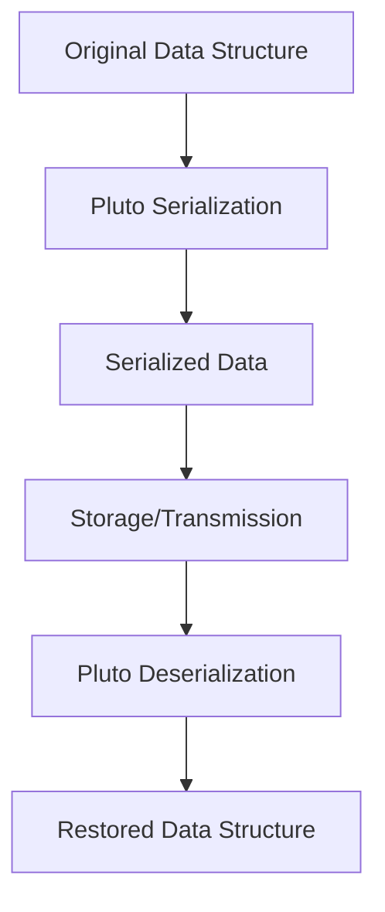

## 22.11 Serialization with Pluto Examples

Serialization is a crucial concept in software development, enabling the conversion of data structures or object states into a format that can be stored or transmitted and reconstructed later. In Lua, the Pluto library offers powerful serialization capabilities, allowing developers to persist complex states, including functions and closures. This section delves into advanced serialization techniques using Pluto, providing practical examples and addressing common challenges.

### Advanced Serialization Techniques

#### Pluto Library: An In-Depth Look

The Pluto library is a robust tool for serializing and deserializing Lua data structures. It supports a wide range of data types, including tables, functions, and closures, making it an ideal choice for applications requiring state persistence.

**Key Features of Pluto:**
- **Comprehensive Support**: Pluto can serialize almost any Lua object, including functions and closures, which are typically challenging to serialize.
- **Efficiency**: Designed for performance, Pluto efficiently handles large data structures.
- **Flexibility**: Allows customization and extension to cater to specific serialization needs.

#### Installation and Setup

To get started with Pluto, you need to install the library. You can download it from its [official repository](https://github.com/hoelzro/pluto) and include it in your Lua project.

```lua
-- Load the Pluto library
local pluto = require("pluto")
```

### Implementation Examples

#### Saving and Loading State

Serialization is particularly useful in scenarios where you need to save the state of an application and restore it later. Let's explore how to serialize and deserialize complex data structures using Pluto.

**Example: Serializing a Table with Functions**

```lua
-- Define a table with various data types, including a function
local gameState = {
    level = 5,
    score = 1200,
    player = {
        name = "Player1",
        health = 100,
        attack = function(target)
            print("Attacking " .. target)
        end
    }
}

-- Serialize the table
local serializedData = pluto.persist({}, gameState)

-- Save the serialized data to a file
local file = io.open("gameState.dat", "wb")
file:write(serializedData)
file:close()

-- Deserialize the data
local file = io.open("gameState.dat", "rb")
local serializedData = file:read("*all")
file:close()

local restoredGameState = pluto.unpersist({}, serializedData)

-- Use the deserialized function
restoredGameState.player.attack("Enemy")
```

**Explanation:**
- **Serialization**: The `pluto.persist` function is used to serialize the `gameState` table, including its nested function.
- **File Handling**: The serialized data is written to a file, which can be stored for later use.
- **Deserialization**: The `pluto.unpersist` function reconstructs the original table, allowing the function within it to be called.

#### Handling Edge Cases

Serialization can encounter edge cases, such as functions with upvalues or tables with metatables. Pluto provides mechanisms to handle these scenarios effectively.

**Example: Serializing Functions with Upvalues**

```lua
local function createCounter()
    local count = 0
    return function()
        count = count + 1
        return count
    end
end

local counter = createCounter()

-- Serialize the counter function
local serializedCounter = pluto.persist({}, counter)

-- Deserialize the counter function
local restoredCounter = pluto.unpersist({}, serializedCounter)

print(restoredCounter()) -- Output: 1
print(restoredCounter()) -- Output: 2
```

**Explanation:**
- **Upvalues**: The `createCounter` function maintains an internal state (`count`) using upvalues. Pluto correctly serializes and deserializes this state, preserving the function's behavior.

### Use Cases and Applications

#### Game Development: Persisting Game States

In game development, serialization is essential for saving player progress and game states. Pluto's ability to serialize complex data structures, including functions, makes it ideal for this purpose.

**Example: Saving Player Progress**

```lua
local playerProgress = {
    level = 10,
    inventory = {"sword", "shield", "potion"},
    abilities = {
        jump = function() print("Jumping") end,
        run = function() print("Running") end
    }
}

-- Serialize and save player progress
local serializedProgress = pluto.persist({}, playerProgress)
local file = io.open("playerProgress.dat", "wb")
file:write(serializedProgress)
file:close()
```

**Explanation:**
- **Inventory and Abilities**: The player's inventory and abilities, including functions, are serialized and saved, allowing the game to restore the player's state accurately.

#### Data Transfer: Sending Serialized Objects Over a Network

Serialization is also crucial for data transfer between systems. Pluto can serialize data into a format suitable for network transmission.

**Example: Sending Data Over a Network**

```lua
local socket = require("socket")

-- Serialize data
local data = {message = "Hello, World!", timestamp = os.time()}
local serializedData = pluto.persist({}, data)

-- Send serialized data over a network
local client = socket.tcp()
client:connect("localhost", 8080)
client:send(serializedData)
client:close()
```

**Explanation:**
- **Network Communication**: The serialized data is sent over a TCP connection, demonstrating how Pluto can facilitate data transfer between systems.

### Troubleshooting

#### Common Issues

Serialization can encounter challenges, such as version mismatches or unsupported data types. Here are some strategies to address these issues:

- **Version Mismatches**: Ensure that both the serialization and deserialization processes use the same version of Pluto to avoid compatibility issues.
- **Unsupported Data Types**: While Pluto supports a wide range of data types, certain types (e.g., userdata) may require custom handling.

#### Optimization Tips

When dealing with large amounts of data, performance optimization becomes crucial. Here are some tips to enhance serialization performance:

- **Batch Processing**: Serialize data in batches to reduce memory consumption and improve speed.
- **Selective Serialization**: Only serialize necessary data to minimize the size of the serialized output.
- **Compression**: Consider compressing serialized data to reduce storage and transmission costs.

### Visualizing Serialization with Pluto

To better understand the serialization process, let's visualize how Pluto handles data structures and functions.



**Diagram Explanation:**
- **Original Data Structure**: Represents the initial state of the data, including tables and functions.
- **Pluto Serialization**: The process of converting the data into a serialized format.
- **Serialized Data**: The output of the serialization process, ready for storage or transmission.
- **Pluto Deserialization**: The process of reconstructing the original data structure from the serialized data.
- **Restored Data Structure**: The final state, identical to the original data structure.

### Try It Yourself

Experiment with the provided code examples by modifying the data structures and functions. Try serializing different types of data, such as tables with metatables or functions with complex upvalues. Observe how Pluto handles these scenarios and explore the possibilities of serialization in your projects.

### References and Links

For further reading and resources on Lua serialization and the Pluto library, consider the following links:
- [Pluto GitHub Repository](https://github.com/hoelzro/pluto)
- [Lua User's Wiki on Serialization](http://lua-users.org/wiki/Serialization)
- [MDN Web Docs on Serialization](https://developer.mozilla.org/en-US/docs/Web/API/Web_Workers_API/Structured_clone_algorithm)

### Knowledge Check

To reinforce your understanding of serialization with Pluto, consider the following questions and challenges:
- What are the key features of the Pluto library?
- How does Pluto handle functions with upvalues during serialization?
- What are some common issues encountered during serialization, and how can they be addressed?

### Embrace the Journey

Remember, mastering serialization with Pluto is just the beginning. As you continue to explore Lua's capabilities, you'll discover new ways to leverage serialization in your projects. Keep experimenting, stay curious, and enjoy the journey!

## Quiz Time!



### What is the primary purpose of the Pluto library in Lua?

- [x] To serialize and deserialize Lua data structures
- [ ] To manage Lua memory allocation
- [ ] To enhance Lua's garbage collection
- [ ] To provide a GUI for Lua applications

> **Explanation:** The Pluto library is used for serializing and deserializing Lua data structures, including complex types like functions and closures.

### Which of the following data types can Pluto serialize?

- [x] Tables
- [x] Functions
- [ ] Userdata
- [x] Closures

> **Explanation:** Pluto can serialize tables, functions, and closures, but userdata may require custom handling.

### What is a common use case for serialization in game development?

- [x] Persisting game states and player progress
- [ ] Enhancing graphics rendering
- [ ] Managing network connections
- [ ] Optimizing AI algorithms

> **Explanation:** Serialization is commonly used in game development to save and restore game states and player progress.

### How does Pluto handle functions with upvalues during serialization?

- [x] It preserves the function's behavior by serializing the upvalues
- [ ] It ignores the upvalues and only serializes the function body
- [ ] It converts the function into a string representation
- [ ] It raises an error if upvalues are present

> **Explanation:** Pluto preserves the function's behavior by serializing the upvalues along with the function.

### What is a potential issue when using different versions of Pluto for serialization and deserialization?

- [x] Version mismatches can lead to compatibility issues
- [ ] The serialized data may become unreadable
- [ ] The deserialization process may be slower
- [ ] The data may be compressed incorrectly

> **Explanation:** Using different versions of Pluto can lead to compatibility issues, making it important to use the same version for both serialization and deserialization.

### Which optimization tip can help reduce the size of serialized data?

- [x] Selective Serialization
- [ ] Increasing memory allocation
- [ ] Using larger data structures
- [ ] Disabling compression

> **Explanation:** Selective serialization involves only serializing necessary data, which helps reduce the size of the serialized output.

### What is the role of compression in serialization?

- [x] To reduce storage and transmission costs
- [ ] To increase the speed of serialization
- [ ] To enhance data security
- [ ] To simplify the deserialization process

> **Explanation:** Compression reduces storage and transmission costs by minimizing the size of the serialized data.

### How can batch processing improve serialization performance?

- [x] By reducing memory consumption and improving speed
- [ ] By increasing the complexity of the data structures
- [ ] By simplifying the serialization code
- [ ] By enhancing the readability of the serialized data

> **Explanation:** Batch processing reduces memory consumption and improves speed by handling data in smaller, manageable chunks.

### What is a key advantage of using Pluto for network data transfer?

- [x] It can serialize data into a format suitable for transmission
- [ ] It automatically encrypts the data
- [ ] It provides real-time data synchronization
- [ ] It enhances network security

> **Explanation:** Pluto can serialize data into a format suitable for network transmission, facilitating data transfer between systems.

### True or False: Pluto can serialize userdata without any additional handling.

- [ ] True
- [x] False

> **Explanation:** Userdata may require custom handling when using Pluto for serialization, as it is not natively supported.


