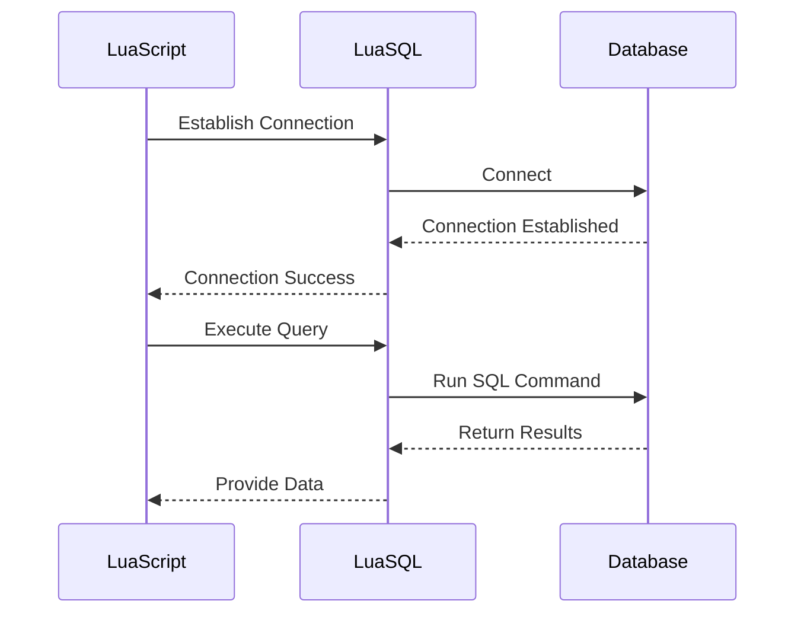

## 22.12 LuaSQL and Database Integration Samples

In this section, we delve into the powerful capabilities of LuaSQL, a library that provides database connectivity for Lua applications. We will explore how to connect to various databases, execute queries, and integrate these operations into practical applications. Additionally, we will cover best practices for security and performance optimization to ensure robust and efficient database interactions.

### Database Connectivity with LuaSQL

LuaSQL is a versatile library that allows Lua scripts to interact with databases. It supports a variety of databases, making it a flexible choice for developers. Let's explore the supported databases and how to establish connections.

#### Supported Databases

LuaSQL supports several popular databases, including:

- **MySQL**: A widely-used open-source relational database management system.
- **PostgreSQL**: An advanced open-source relational database known for its robustness and feature set.
- **SQLite**: A lightweight, self-contained database engine that is easy to set up and use.
- **ODBC**: Allows connection to any database that supports the Open Database Connectivity standard.

### Connecting to Databases

Establishing a connection to a database is the first step in interacting with it. Let's look at how to connect to different databases using LuaSQL.

#### Establishing Connections

Below are examples of how to establish connections to MySQL, PostgreSQL, and SQLite databases using LuaSQL.

**Connecting to MySQL**

```lua
local luasql = require "luasql.mysql"
local env = luasql.mysql()
local conn = env:connect('database_name', 'username', 'password', 'hostname', port)

if conn then
    print("Connected to MySQL database successfully!")
else
    print("Failed to connect to MySQL database.")
end
```

**Connecting to PostgreSQL**

```lua
local luasql = require "luasql.postgres"
local env = luasql.postgres()
local conn = env:connect('database_name', 'username', 'password', 'hostname', port)

if conn then
    print("Connected to PostgreSQL database successfully!")
else
    print("Failed to connect to PostgreSQL database.")
end
```

**Connecting to SQLite**

```lua
local luasql = require "luasql.sqlite3"
local env = luasql.sqlite3()
local conn = env:connect('database_file.db')

if conn then
    print("Connected to SQLite database successfully!")
else
    print("Failed to connect to SQLite database.")
end
```

### Executing Queries

Once connected, you can execute SQL queries to interact with the database. Let's explore how to perform CRUD operations.

#### Performing CRUD Operations

**Create (Insert Data)**

```lua
local insert_query = "INSERT INTO users (name, email) VALUES ('John Doe', 'john@example.com')"
local result = conn:execute(insert_query)

if result then
    print("Data inserted successfully!")
else
    print("Failed to insert data.")
end
```

**Read (Select Data)**

```lua
local select_query = "SELECT * FROM users"
local cursor = conn:execute(select_query)

if cursor then
    local row = cursor:fetch({}, "a")
    while row do
        print(string.format("Name: %s, Email: %s", row.name, row.email))
        row = cursor:fetch(row, "a")
    end
    cursor:close()
else
    print("Failed to retrieve data.")
end
```

**Update (Modify Data)**

```lua
local update_query = "UPDATE users SET email = 'john.doe@example.com' WHERE name = 'John Doe'"
local result = conn:execute(update_query)

if result then
    print("Data updated successfully!")
else
    print("Failed to update data.")
end
```

**Delete (Remove Data)**

```lua
local delete_query = "DELETE FROM users WHERE name = 'John Doe'"
local result = conn:execute(delete_query)

if result then
    print("Data deleted successfully!")
else
    print("Failed to delete data.")
end
```

### Practical Examples

Let's explore some practical examples of using LuaSQL for data management and web applications.

#### Data Management Scripts

Automate database tasks using Lua scripts. For instance, you can create a script to back up data or generate reports.

**Example: Data Backup Script**

```lua
local backup_query = "SELECT * INTO OUTFILE '/backup/users_backup.csv' FROM users"
local result = conn:execute(backup_query)

if result then
    print("Data backup completed successfully!")
else
    print("Failed to back up data.")
end
```

#### Web Applications

Integrate database interactions within web services to create dynamic and data-driven applications.

**Example: Web Service Integration**

Imagine a Lua-based web service that retrieves user data from a database and returns it as JSON.

```lua
local json = require "json"

function getUserData()
    local select_query = "SELECT * FROM users"
    local cursor = conn:execute(select_query)
    local users = {}

    if cursor then
        local row = cursor:fetch({}, "a")
        while row do
            table.insert(users, {name = row.name, email = row.email})
            row = cursor:fetch(row, "a")
        end
        cursor:close()
    end

    return json.encode(users)
end

print(getUserData())
```

### Best Practices

To ensure secure and efficient database interactions, follow these best practices.

#### Security Considerations

**Preventing SQL Injection**

Always use parameterized queries or prepared statements to prevent SQL injection attacks.

```lua
local stmt = conn:prepare("INSERT INTO users (name, email) VALUES (?, ?)")
stmt:execute('John Doe', 'john@example.com')
```

**Managing Credentials Securely**

Store database credentials securely, such as in environment variables or configuration files with restricted access.

#### Performance Optimization

**Efficiently Handling Connections**

Reuse database connections instead of opening and closing them frequently to reduce overhead.

**Optimizing Queries**

Use indexes and optimize SQL queries to improve performance, especially for large datasets.

### Visualizing Database Interaction

To better understand the flow of database interactions, let's visualize the process using a sequence diagram.



### Try It Yourself

Experiment with the provided code examples by modifying queries, changing database configurations, or integrating with different web frameworks. This hands-on approach will deepen your understanding of LuaSQL and its capabilities.

### Knowledge Check

To reinforce your learning, consider the following questions:

1. What are the benefits of using LuaSQL for database interactions?
2. How can you prevent SQL injection in LuaSQL?
3. What is the advantage of reusing database connections?

### Embrace the Journey

Remember, mastering database integration with LuaSQL is a journey. As you progress, you'll build more complex and efficient applications. Keep experimenting, stay curious, and enjoy the process!

## Quiz Time!



### Which databases are supported by LuaSQL?

- [x] MySQL
- [x] PostgreSQL
- [x] SQLite
- [ ] MongoDB

> **Explanation:** LuaSQL supports MySQL, PostgreSQL, and SQLite, but not MongoDB.

### How do you establish a connection to a MySQL database using LuaSQL?

- [x] Use `luasql.mysql()` to create an environment and `env:connect()` to connect.
- [ ] Use `luasql.connect_mysql()` directly.
- [ ] Use `mysql.connect()` from LuaSQL.
- [ ] Use `luasql.connect()` without parameters.

> **Explanation:** You need to create an environment using `luasql.mysql()` and then use `env:connect()` to establish a connection.

### What is the purpose of using parameterized queries?

- [x] To prevent SQL injection attacks.
- [ ] To increase query execution speed.
- [ ] To simplify query syntax.
- [ ] To allow multiple database connections.

> **Explanation:** Parameterized queries help prevent SQL injection by separating SQL code from data.

### What is the advantage of reusing database connections?

- [x] Reduces overhead and improves performance.
- [ ] Increases security.
- [ ] Simplifies code.
- [ ] Allows multiple queries simultaneously.

> **Explanation:** Reusing connections reduces the overhead of opening and closing connections, thus improving performance.

### How can you optimize SQL queries for better performance?

- [x] Use indexes.
- [ ] Use more complex queries.
- [ ] Avoid using WHERE clauses.
- [ ] Use only SELECT statements.

> **Explanation:** Using indexes can significantly improve query performance by speeding up data retrieval.

### What is a common security practice when handling database credentials?

- [x] Store them in environment variables.
- [ ] Hardcode them in the script.
- [ ] Share them with all team members.
- [ ] Use them in plain text files.

> **Explanation:** Storing credentials in environment variables is a secure practice to prevent unauthorized access.

### What is the role of the `luasql` module in Lua?

- [x] Provides database connectivity.
- [ ] Handles file I/O operations.
- [ ] Manages network connections.
- [ ] Performs mathematical calculations.

> **Explanation:** The `luasql` module is specifically designed for database connectivity in Lua.

### How can you execute a SELECT query in LuaSQL?

- [x] Use `conn:execute()` with the query string.
- [ ] Use `conn:select()` with the table name.
- [ ] Use `luasql.select()` with parameters.
- [ ] Use `env:query()` with the SQL command.

> **Explanation:** You execute a SELECT query using `conn:execute()` with the appropriate SQL command.

### What is the purpose of the `fetch` method in LuaSQL?

- [x] To retrieve rows from a query result.
- [ ] To execute a query.
- [ ] To close a database connection.
- [ ] To prepare a statement.

> **Explanation:** The `fetch` method is used to retrieve rows from the result set of a query.

### True or False: LuaSQL can be used to connect to NoSQL databases.

- [ ] True
- [x] False

> **Explanation:** LuaSQL is designed for relational databases and does not support NoSQL databases.


