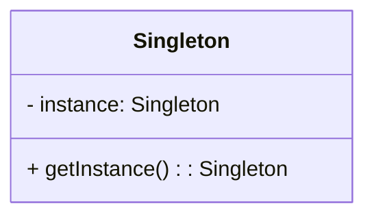

## 22.2 Bibliography and Further Reading

In the journey of mastering Lua design patterns, it is essential to have a robust set of resources at your disposal. This section provides a comprehensive bibliography and further reading suggestions that will enhance your understanding and application of design patterns in Lua. Whether you are an absolute beginner or an expert developer, these resources will serve as a valuable guide in your learning process.

### Recommended Books and Publications

#### Foundational Texts

1. **"Design Patterns: Elements of Reusable Object-Oriented Software" by Erich Gamma, Richard Helm, Ralph Johnson, and John Vlissides (Gang of Four)**
   - **Overview**: This seminal work introduced the concept of design patterns in software engineering. It provides a catalog of 23 classic design patterns, which are applicable across various programming languages, including Lua.
   - **Why Read It**: Understanding the foundational principles of design patterns will give you a solid base to apply these concepts in Lua.

2. **"Patterns of Enterprise Application Architecture" by Martin Fowler**
   - **Overview**: This book delves into enterprise-level design patterns, offering insights into architectural patterns that can be adapted for Lua applications.
   - **Why Read It**: It provides a broader perspective on how design patterns can be used in large-scale applications, which is crucial for software architects.

3. **"Refactoring: Improving the Design of Existing Code" by Martin Fowler**
   - **Overview**: This book focuses on the process of refactoring code to improve its structure and readability without changing its functionality.
   - **Why Read It**: Refactoring is an essential skill for maintaining and evolving Lua codebases, and this book provides practical techniques and examples.

#### Lua-Specific Resources

1. **"Programming in Lua" by Roberto Ierusalimschy**
   - **Overview**: Written by one of the creators of Lua, this book is an authoritative guide to the language, covering its features and idioms.
   - **Why Read It**: It is an essential resource for understanding Lua's syntax, semantics, and unique features, which are crucial for implementing design patterns effectively.

2. **"Lua Programming Gems" edited by Luiz Henrique de Figueiredo and Waldemar Celes**
   - **Overview**: This collection of articles covers advanced Lua programming techniques and best practices.
   - **Why Read It**: It provides insights into practical applications of Lua, including design patterns and performance optimization.

3. **"Beginning Lua Programming" by Kurt Jung and Aaron Brown**
   - **Overview**: This book offers a comprehensive introduction to Lua programming, suitable for beginners.
   - **Why Read It**: It provides a solid foundation in Lua, preparing you to explore more advanced topics like design patterns.

### Online Articles and Tutorials

#### Educational Websites

1. **Lua Users Wiki (http://lua-users.org/wiki/)**
   - **Overview**: A community-driven resource with tutorials, code snippets, and discussions on Lua programming.
   - **Why Visit**: It offers a wealth of practical examples and insights from the Lua community, making it a valuable resource for learning and troubleshooting.

2. **TutorialsPoint Lua Tutorial (https://www.tutorialspoint.com/lua/index.htm)**
   - **Overview**: A comprehensive online tutorial covering Lua basics to advanced topics.
   - **Why Visit**: It provides step-by-step guides and examples, making it easy to follow and understand Lua concepts.

3. **GeeksforGeeks Lua Programming Language (https://www.geeksforgeeks.org/lua-programming-language/)**
   - **Overview**: Offers articles and tutorials on various Lua programming topics.
   - **Why Visit**: It is a great resource for quick references and learning new Lua techniques.

#### Research Papers

1. **"The Design and Implementation of Lua" by Roberto Ierusalimschy, Luiz Henrique de Figueiredo, and Waldemar Celes**
   - **Overview**: This paper provides an in-depth look at the design decisions and implementation details of Lua.
   - **Why Read It**: Understanding the underlying architecture of Lua will enhance your ability to apply design patterns effectively.

2. **"Coroutines in Lua" by Roberto Ierusalimschy**
   - **Overview**: This paper explores the implementation and use of coroutines in Lua.
   - **Why Read It**: Coroutines are a powerful feature in Lua, and this paper provides insights into their use in design patterns.

### Keeping Updated

#### Blogs and Newsletters

1. **Lua Weekly (https://luaweekly.net/)**
   - **Overview**: A weekly newsletter that curates the latest news, articles, and resources on Lua programming.
   - **Why Subscribe**: Staying updated with the latest developments and trends in Lua will keep your skills sharp and relevant.

2. **The Lua Blog (https://blog.luapower.com/)**
   - **Overview**: A blog dedicated to Lua programming, covering various topics and projects.
   - **Why Visit**: It offers insights into real-world applications of Lua, including design patterns and best practices.

#### Academic Journals

1. **Journal of Functional Programming**
   - **Overview**: This journal publishes research on functional programming languages, including Lua.
   - **Why Read It**: For those interested in the theoretical aspects of programming languages, this journal provides advanced readings and research findings.

2. **Software: Practice and Experience**
   - **Overview**: A journal that covers practical and theoretical aspects of software development.
   - **Why Read It**: It offers insights into software design methodologies and patterns, which can be applied to Lua programming.

### Visualizing Design Patterns

To enhance your understanding of design patterns, it is beneficial to visualize them using diagrams. Below is an example of a class diagram for the Singleton pattern, a common design pattern used in Lua.



**Description**: This diagram illustrates the Singleton pattern, where a class has a single instance that is accessed through a static method.

### Try It Yourself

To deepen your understanding of the Singleton pattern, try modifying the code example below to implement a thread-safe Singleton in Lua.

```lua
-- Singleton pattern in Lua
local Singleton = {}
Singleton.__index = Singleton

local instance = nil

function Singleton:new()
    if not instance then
        instance = setmetatable({}, Singleton)
    end
    return instance
end

-- Usage
local singleton1 = Singleton:new()
local singleton2 = Singleton:new()

print(singleton1 == singleton2)  -- Output: true
```

**Challenge**: Modify the `Singleton:new()` method to ensure thread safety when creating the instance.

### Knowledge Check

To reinforce your learning, consider the following questions:

1. What are the key benefits of using design patterns in Lua?
2. How does the Singleton pattern ensure only one instance of a class is created?
3. What are some common pitfalls when implementing design patterns in Lua?

### Embrace the Journey

Remember, mastering design patterns in Lua is a journey. As you explore these resources, keep experimenting and applying what you learn. Stay curious, and don't hesitate to reach out to the Lua community for support and collaboration.

## Quiz Time!



### Which book is considered the foundational text for design patterns?

- [x] "Design Patterns: Elements of Reusable Object-Oriented Software" by Erich Gamma, Richard Helm, Ralph Johnson, and John Vlissides
- [ ] "Patterns of Enterprise Application Architecture" by Martin Fowler
- [ ] "Programming in Lua" by Roberto Ierusalimschy
- [ ] "Refactoring: Improving the Design of Existing Code" by Martin Fowler

> **Explanation:** The "Gang of Four" book is the seminal work that introduced design patterns to the software engineering community.

### What is the primary focus of "Programming in Lua" by Roberto Ierusalimschy?

- [x] Lua's syntax, semantics, and unique features
- [ ] Enterprise-level design patterns
- [ ] Refactoring techniques
- [ ] Functional programming concepts

> **Explanation:** "Programming in Lua" is an authoritative guide to the Lua programming language, covering its syntax and features.

### Which online resource is community-driven and offers tutorials and code snippets for Lua?

- [x] Lua Users Wiki
- [ ] TutorialsPoint Lua Tutorial
- [ ] GeeksforGeeks Lua Programming Language
- [ ] Lua Weekly

> **Explanation:** The Lua Users Wiki is a community-driven resource with a wealth of practical examples and discussions.

### What is the primary benefit of subscribing to Lua Weekly?

- [x] Staying updated with the latest developments and trends in Lua
- [ ] Access to research papers on functional programming
- [ ] Learning about enterprise-level design patterns
- [ ] Understanding the theoretical aspects of programming languages

> **Explanation:** Lua Weekly curates the latest news and resources, helping developers stay informed about Lua.

### Which journal publishes research on functional programming languages, including Lua?

- [x] Journal of Functional Programming
- [ ] Software: Practice and Experience
- [ ] Journal of Software Engineering
- [ ] Computer Science Review

> **Explanation:** The Journal of Functional Programming publishes research on functional programming languages, including Lua.

### What is the key feature of the Singleton pattern?

- [x] Ensures only one instance of a class is created
- [ ] Allows multiple instances of a class
- [ ] Provides a way to create families of related objects
- [ ] Defines a family of algorithms

> **Explanation:** The Singleton pattern ensures that a class has only one instance and provides a global point of access to it.

### Which book focuses on the process of refactoring code?

- [x] "Refactoring: Improving the Design of Existing Code" by Martin Fowler
- [ ] "Design Patterns: Elements of Reusable Object-Oriented Software" by Erich Gamma, Richard Helm, Ralph Johnson, and John Vlissides
- [ ] "Programming in Lua" by Roberto Ierusalimschy
- [ ] "Patterns of Enterprise Application Architecture" by Martin Fowler

> **Explanation:** Martin Fowler's book on refactoring provides techniques for improving the design of existing code.

### What is the primary focus of "Patterns of Enterprise Application Architecture" by Martin Fowler?

- [x] Enterprise-level design patterns
- [ ] Lua's syntax and features
- [ ] Refactoring techniques
- [ ] Functional programming concepts

> **Explanation:** This book delves into design patterns applicable to enterprise-level applications.

### Which online tutorial provides step-by-step guides and examples for learning Lua?

- [x] TutorialsPoint Lua Tutorial
- [ ] Lua Users Wiki
- [ ] GeeksforGeeks Lua Programming Language
- [ ] Lua Weekly

> **Explanation:** TutorialsPoint offers comprehensive online tutorials with step-by-step guides for learning Lua.

### True or False: "Lua Programming Gems" is a collection of articles covering advanced Lua programming techniques.

- [x] True
- [ ] False

> **Explanation:** "Lua Programming Gems" is indeed a collection of articles that cover advanced programming techniques and best practices in Lua.



By exploring these resources, you will gain a deeper understanding of Lua design patterns and enhance your skills as a software engineer and architect. Keep learning and experimenting, and enjoy the journey of mastering Lua!
