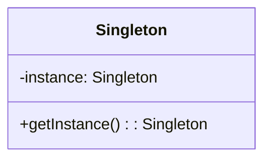
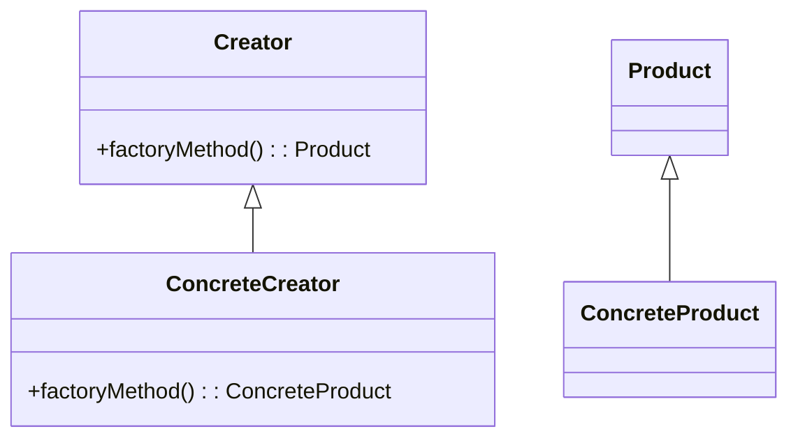

## 22.3 Design Pattern Reference Cheat Sheet

Welcome to the Design Pattern Reference Cheat Sheet, a comprehensive guide for software engineers and architects looking to master design patterns in Lua. This section provides at-a-glance summaries, structural diagrams, usage guidelines, and implementation tips for each pattern. Whether you're a beginner or an expert, this cheat sheet will serve as a valuable resource in your software development journey.

### At-a-Glance Summaries

#### Creational Patterns

1. **Singleton Pattern**
   - **Definition**: Ensures a class has only one instance and provides a global point of access to it.
   - **Diagram**:
     ```mermaid
     classDiagram
     class Singleton {
       -instance: Singleton
       +getInstance(): Singleton
     }
     ```
   - **When to Use**: When exactly one instance of a class is needed.
   - **Advantages**: Controlled access to sole instance, reduced namespace pollution.
   - **Disadvantages**: Can be difficult to test, potential for misuse as a global variable.

2. **Factory Method Pattern**
   - **Definition**: Defines an interface for creating an object, but lets subclasses alter the type of objects that will be created.
   - **Diagram**:
     ```mermaid
     classDiagram
     class Creator {
       +factoryMethod(): Product
     }
     class ConcreteCreator {
       +factoryMethod(): ConcreteProduct
     }
     class Product
     class ConcreteProduct
     Creator <|-- ConcreteCreator
     Product <|-- ConcreteProduct
     ```
   - **When to Use**: When a class can't anticipate the class of objects it must create.
   - **Advantages**: Promotes loose coupling, enhances scalability.
   - **Disadvantages**: Can lead to a proliferation of classes.

#### Structural Patterns

3. **Adapter Pattern**
   - **Definition**: Allows incompatible interfaces to work together by wrapping an existing class with a new interface.
   - **Diagram**:
     ```mermaid
     classDiagram
     class Target {
       +request()
     }
     class Adapter {
       +request()
     }
     class Adaptee {
       +specificRequest()
     }
     Target <|.. Adapter
     Adapter --> Adaptee
     ```
   - **When to Use**: When you want to use an existing class, and its interface does not match the one you need.
   - **Advantages**: Increases class reusability, simplifies client interface.
   - **Disadvantages**: Can make code more complex.

4. **Decorator Pattern**
   - **Definition**: Adds behavior to individual objects, without affecting the behavior of other objects from the same class.
   - **Diagram**:
     ```mermaid
     classDiagram
     class Component {
       +operation()
     }
     class ConcreteComponent {
       +operation()
     }
     class Decorator {
       +operation()
     }
     class ConcreteDecorator {
       +operation()
     }
     Component <|-- ConcreteComponent
     Component <|.. Decorator
     Decorator <|-- ConcreteDecorator
     Decorator --> Component
     ```
   - **When to Use**: To add responsibilities to individual objects dynamically and transparently.
   - **Advantages**: More flexible than inheritance, promotes code reuse.
   - **Disadvantages**: Can result in many small objects in a system.

#### Behavioral Patterns

5. **Observer Pattern**
   - **Definition**: Defines a one-to-many dependency between objects so that when one object changes state, all its dependents are notified and updated automatically.
   - **Diagram**:
     ```mermaid
     classDiagram
     class Subject {
       +attach(Observer)
       +detach(Observer)
       +notify()
     }
     class ConcreteSubject {
       -state
       +getState()
       +setState()
     }
     class Observer {
       +update()
     }
     class ConcreteObserver {
       -subjectState
       +update()
     }
     Subject <|-- ConcreteSubject
     Observer <|-- ConcreteObserver
     ConcreteSubject --> Observer
     ```
   - **When to Use**: When a change to one object requires changing others, and you don't know how many objects need to be changed.
   - **Advantages**: Promotes loose coupling, supports broadcast communication.
   - **Disadvantages**: Can lead to unexpected updates, potential performance issues.

6. **Strategy Pattern**
   - **Definition**: Defines a family of algorithms, encapsulates each one, and makes them interchangeable.
   - **Diagram**:
     ```mermaid
     classDiagram
     class Context {
       -strategy: Strategy
       +setStrategy(Strategy)
       +executeStrategy()
     }
     class Strategy {
       +algorithmInterface()
     }
     class ConcreteStrategyA {
       +algorithmInterface()
     }
     class ConcreteStrategyB {
       +algorithmInterface()
     }
     Context --> Strategy
     Strategy <|-- ConcreteStrategyA
     Strategy <|-- ConcreteStrategyB
     ```
   - **When to Use**: When you need to use different variants of an algorithm.
   - **Advantages**: Promotes code reuse, simplifies unit testing.
   - **Disadvantages**: Increases the number of objects.

### Usage Guidelines

#### When to Use

- **Singleton**: Use when a single instance is needed to coordinate actions across the system.
- **Factory Method**: Use when a class cannot anticipate the class of objects it must create.
- **Adapter**: Use when you want to use an existing class and its interface does not match the one you need.
- **Decorator**: Use to add responsibilities to individual objects dynamically.
- **Observer**: Use when a change to one object requires changing others.
- **Strategy**: Use when you need to use different variants of an algorithm.

#### Advantages and Disadvantages

- **Singleton**: 
  - **Advantages**: Controlled access, reduced namespace pollution.
  - **Disadvantages**: Difficult to test, potential misuse.
- **Factory Method**:
  - **Advantages**: Loose coupling, scalability.
  - **Disadvantages**: Class proliferation.
- **Adapter**:
  - **Advantages**: Reusability, simplified interface.
  - **Disadvantages**: Increased complexity.
- **Decorator**:
  - **Advantages**: Flexibility, code reuse.
  - **Disadvantages**: Many small objects.
- **Observer**:
  - **Advantages**: Loose coupling, broadcast communication.
  - **Disadvantages**: Unexpected updates, performance issues.
- **Strategy**:
  - **Advantages**: Code reuse, unit testing.
  - **Disadvantages**: Increased objects.

### Implementation Tips

#### Key Considerations

- **Singleton**: Ensure thread safety if needed, consider lazy initialization.
- **Factory Method**: Use abstract classes or interfaces to define the factory method.
- **Adapter**: Consider using multiple adapters for different interfaces.
- **Decorator**: Ensure decorators are interchangeable with the components they decorate.
- **Observer**: Use weak references to avoid memory leaks.
- **Strategy**: Define a clear interface for strategy classes.

#### Common Pitfalls

- **Singleton**: Avoid using it as a global variable.
- **Factory Method**: Avoid creating too many subclasses.
- **Adapter**: Avoid making the adapter too complex.
- **Decorator**: Avoid creating too many layers of decorators.
- **Observer**: Avoid circular dependencies.
- **Strategy**: Avoid unnecessary complexity in strategy classes.

### Code Examples

#### Singleton Pattern in Lua

```lua
-- Singleton Pattern
local Singleton = {}
Singleton.__index = Singleton

local instance = nil

function Singleton:new()
    if not instance then
        instance = setmetatable({}, Singleton)
    end
    return instance
end

function Singleton:doSomething()
    print("Doing something with the singleton instance.")
end

-- Usage
local singleton1 = Singleton:new()
local singleton2 = Singleton:new()
singleton1:doSomething()
print(singleton1 == singleton2)  -- Output: true
```

#### Factory Method Pattern in Lua

```lua
-- Factory Method Pattern
local Product = {}
Product.__index = Product

function Product:new(type)
    local instance = setmetatable({}, Product)
    instance.type = type
    return instance
end

function Product:describe()
    print("This is a " .. self.type .. " product.")
end

local Factory = {}
Factory.__index = Factory

function Factory:createProduct(type)
    return Product:new(type)
end

-- Usage
local factory = setmetatable({}, Factory)
local product1 = factory:createProduct("TypeA")
local product2 = factory:createProduct("TypeB")
product1:describe()
product2:describe()
```

### Try It Yourself

Experiment with the code examples by modifying them to suit different scenarios. For instance, try creating multiple singleton instances and observe the behavior, or add new product types in the factory method pattern.

### Visualizing Design Patterns

#### Singleton Pattern



#### Factory Method Pattern



### Knowledge Check

- **Question**: What is the primary purpose of the Singleton pattern?
- **Question**: When should you use the Factory Method pattern?
- **Question**: What is a key advantage of the Adapter pattern?

### Embrace the Journey

Remember, mastering design patterns is a journey. As you progress, you'll build more robust and efficient Lua applications. Keep experimenting, stay curious, and enjoy the journey!

## Quiz Time!



### What is the primary purpose of the Singleton pattern?

- [x] To ensure a class has only one instance and provide a global point of access to it.
- [ ] To create a family of related objects.
- [ ] To define a one-to-many dependency between objects.
- [ ] To encapsulate a request as an object.

> **Explanation:** The Singleton pattern ensures a class has only one instance and provides a global point of access to it.

### When should you use the Factory Method pattern?

- [x] When a class cannot anticipate the class of objects it must create.
- [ ] When you want to add behavior to individual objects.
- [ ] When you need to use different variants of an algorithm.
- [ ] When you want to use an existing class with a different interface.

> **Explanation:** The Factory Method pattern is used when a class cannot anticipate the class of objects it must create.

### What is a key advantage of the Adapter pattern?

- [x] It allows incompatible interfaces to work together.
- [ ] It ensures a class has only one instance.
- [ ] It defines a family of algorithms.
- [ ] It adds behavior to individual objects.

> **Explanation:** The Adapter pattern allows incompatible interfaces to work together by wrapping an existing class with a new interface.

### What is a disadvantage of the Singleton pattern?

- [x] It can be difficult to test.
- [ ] It increases the number of objects.
- [ ] It can lead to unexpected updates.
- [ ] It makes code more complex.

> **Explanation:** The Singleton pattern can be difficult to test because it controls the instantiation of a class.

### Which pattern is used to add responsibilities to individual objects dynamically?

- [x] Decorator Pattern
- [ ] Observer Pattern
- [ ] Strategy Pattern
- [ ] Adapter Pattern

> **Explanation:** The Decorator pattern is used to add responsibilities to individual objects dynamically and transparently.

### What is a common pitfall of the Observer pattern?

- [x] Circular dependencies.
- [ ] Too many subclasses.
- [ ] Increased complexity.
- [ ] Unnecessary complexity in strategy classes.

> **Explanation:** A common pitfall of the Observer pattern is circular dependencies, which can lead to issues in the system.

### What is a key consideration when implementing the Strategy pattern?

- [x] Define a clear interface for strategy classes.
- [ ] Ensure thread safety.
- [ ] Use weak references.
- [ ] Consider lazy initialization.

> **Explanation:** When implementing the Strategy pattern, it's important to define a clear interface for strategy classes to ensure they are interchangeable.

### What is a disadvantage of the Decorator pattern?

- [x] It can result in many small objects in a system.
- [ ] It can lead to unexpected updates.
- [ ] It increases the number of objects.
- [ ] It makes code more complex.

> **Explanation:** The Decorator pattern can result in many small objects in a system, which can complicate the design.

### Which pattern promotes loose coupling and supports broadcast communication?

- [x] Observer Pattern
- [ ] Singleton Pattern
- [ ] Factory Method Pattern
- [ ] Adapter Pattern

> **Explanation:** The Observer pattern promotes loose coupling and supports broadcast communication by defining a one-to-many dependency between objects.

### True or False: The Factory Method pattern is used to ensure a class has only one instance.

- [ ] True
- [x] False

> **Explanation:** False. The Singleton pattern is used to ensure a class has only one instance, not the Factory Method pattern.



By understanding and applying these design patterns, you'll be well-equipped to tackle complex software design challenges in Lua. Keep this cheat sheet handy as a quick reference guide, and continue to explore the vast world of design patterns.
