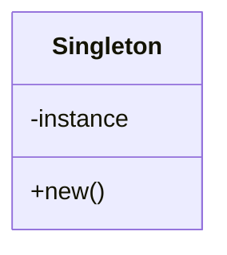

## 22.4 Common Interview Questions on Lua and Design Patterns

Preparing for technical interviews can be daunting, especially when it involves a language as versatile as Lua and the intricate world of design patterns. This section aims to equip you with the knowledge and confidence to tackle common interview questions related to Lua programming and design patterns. We will cover language fundamentals, design pattern understanding, practical coding challenges, and solution strategies.

### Preparing for Technical Interviews

#### Sample Questions

1. **What are the key features of Lua that make it suitable for embedding in applications?**
   - Lua is lightweight, fast, and has a simple syntax, making it ideal for embedding in applications. Its small footprint and ease of integration with C/C++ are significant advantages.

2. **Explain the concept of metatables in Lua. How do they enhance the language's capabilities?**
   - Metatables in Lua allow you to change the behavior of tables. By defining metamethods, you can customize operations like addition, subtraction, or even indexing, providing a powerful way to implement object-oriented programming features.

3. **How does Lua handle error management, and what are the best practices for error handling in Lua scripts?**
   - Lua uses the `pcall` and `xpcall` functions for error handling, allowing you to catch and manage errors gracefully. Best practices include using these functions to wrap potentially error-prone code and providing meaningful error messages.

4. **Describe the Singleton design pattern and provide an example of its implementation in Lua.**
   - The Singleton pattern ensures a class has only one instance and provides a global point of access to it. In Lua, this can be implemented using a table to store the instance and a function to return it.

```lua
-- Singleton Pattern in Lua
local Singleton = {}
Singleton.__index = Singleton

local instance

function Singleton:new()
    if not instance then
        instance = setmetatable({}, Singleton)
    end
    return instance
end

-- Usage
local singleInstance = Singleton:new()
```

5. **What is the role of coroutines in Lua, and how do they differ from threads?**
   - Coroutines in Lua provide a way to perform cooperative multitasking. Unlike threads, coroutines are not preemptive; they yield control back to the caller, allowing for more controlled execution flow.

#### Answer Guidelines

- **Understand the Question**: Take a moment to ensure you understand what is being asked. Clarify if needed.
- **Structure Your Answer**: Begin with a brief overview, followed by detailed explanations and examples.
- **Be Concise and Relevant**: Stick to the point and avoid unnecessary details.
- **Use Examples**: Where possible, provide code snippets or real-world scenarios to illustrate your points.
- **Stay Calm and Confident**: Confidence can make a significant difference in how your answers are perceived.

### Topics Covered

#### Language Fundamentals

1. **Syntax and Tables**: Explain the basic syntax of Lua and the importance of tables as the primary data structure.
2. **Functions and Closures**: Discuss how functions are first-class citizens in Lua and the concept of closures.
3. **Coroutines**: Describe how coroutines work and their use cases in asynchronous programming.

#### Design Patterns Understanding

1. **Factory Method Pattern**: Explain the Factory Method pattern and its implementation in Lua.
2. **Observer Pattern**: Describe the Observer pattern and provide an example of its use in Lua.
3. **Decorator Pattern**: Discuss the Decorator pattern and how it can be applied in Lua to extend functionality dynamically.

### Practical Problems

#### Coding Challenges

1. **Implement a Stack Using Lua Tables**: Write a Lua script to implement a stack with push, pop, and peek operations.

```lua
-- Stack Implementation in Lua
local Stack = {}
Stack.__index = Stack

function Stack:new()
    return setmetatable({items = {}}, Stack)
end

function Stack:push(item)
    table.insert(self.items, item)
end

function Stack:pop()
    return table.remove(self.items)
end

function Stack:peek()
    return self.items[#self.items]
end

-- Usage
local stack = Stack:new()
stack:push(10)
stack:push(20)
print(stack:pop()) -- Output: 20
```

2. **Create a Simple Event System Using the Observer Pattern**: Develop a Lua script that allows objects to subscribe to and receive notifications of events.

```lua
-- Observer Pattern in Lua
local Event = {}
Event.__index = Event

function Event:new()
    return setmetatable({listeners = {}}, Event)
end

function Event:subscribe(listener)
    table.insert(self.listeners, listener)
end

function Event:notify(...)
    for _, listener in ipairs(self.listeners) do
        listener(...)
    end
end

-- Usage
local event = Event:new()
event:subscribe(function(msg) print("Listener 1: " .. msg) end)
event:notify("Hello, World!")
```

#### Solution Strategies

- **Break Down the Problem**: Divide the problem into smaller, manageable parts.
- **Plan Before Coding**: Outline your approach before diving into coding.
- **Test Your Code**: Ensure your solution works as expected by testing with various inputs.
- **Optimize**: Look for ways to improve efficiency and readability.

### Visualizing Design Patterns

To enhance understanding, let's visualize the Singleton pattern using a class diagram.



**Diagram Description**: The diagram illustrates the Singleton pattern, showing the `Singleton` class with a private `instance` variable and a public `new()` method to access the instance.

### References and Links

- [Lua Official Documentation](https://www.lua.org/manual/5.4/)
- [Design Patterns in Lua](https://www.lua.org/pil/16.html)
- [MDN Web Docs on Design Patterns](https://developer.mozilla.org/en-US/docs/Web/JavaScript/Guide/Design_Patterns)

### Knowledge Check

- **Question**: What is the primary data structure in Lua, and why is it significant?
- **Exercise**: Implement a queue using Lua tables and test it with different operations.

### Embrace the Journey

Remember, mastering Lua and design patterns is a journey. Each challenge you face is an opportunity to learn and grow. Keep experimenting, stay curious, and enjoy the process!

## Quiz Time!



### What is a key feature of Lua that makes it suitable for embedding in applications?

- [x] Lightweight and fast
- [ ] Complex syntax
- [ ] Large memory footprint
- [ ] Lack of integration with C/C++

> **Explanation:** Lua's lightweight nature and simple syntax make it ideal for embedding in applications.

### How do metatables enhance Lua's capabilities?

- [x] By allowing customization of table behavior
- [ ] By increasing execution speed
- [ ] By providing built-in error handling
- [ ] By simplifying syntax

> **Explanation:** Metatables allow customization of operations on tables, enhancing Lua's flexibility.

### What is the purpose of the Singleton design pattern?

- [x] To ensure a class has only one instance
- [ ] To create multiple instances of a class
- [ ] To simplify code readability
- [ ] To enhance error handling

> **Explanation:** The Singleton pattern ensures a class has only one instance and provides a global access point.

### How do coroutines differ from threads in Lua?

- [x] Coroutines provide cooperative multitasking
- [ ] Coroutines are preemptive
- [ ] Coroutines run in parallel
- [ ] Coroutines are faster than threads

> **Explanation:** Coroutines allow cooperative multitasking, unlike threads which are preemptive.

### What is a best practice for error handling in Lua?

- [x] Using `pcall` and `xpcall`
- [ ] Ignoring errors
- [ ] Using global variables
- [ ] Relying on automatic error correction

> **Explanation:** `pcall` and `xpcall` are used to catch and manage errors gracefully in Lua.

### Which pattern is used to notify objects about changes in state?

- [x] Observer Pattern
- [ ] Singleton Pattern
- [ ] Factory Method Pattern
- [ ] Decorator Pattern

> **Explanation:** The Observer pattern is used to notify objects about changes in state.

### What is the primary data structure in Lua?

- [x] Tables
- [ ] Arrays
- [ ] Linked Lists
- [ ] Queues

> **Explanation:** Tables are the primary data structure in Lua, used for arrays, dictionaries, and more.

### How can you implement a stack in Lua?

- [x] Using tables with `push` and `pop` methods
- [ ] Using arrays with `add` and `remove` methods
- [ ] Using linked lists with `insert` and `delete` methods
- [ ] Using queues with `enqueue` and `dequeue` methods

> **Explanation:** A stack can be implemented using tables with `push` and `pop` methods in Lua.

### What is the role of closures in Lua?

- [x] To capture and remember the environment in which they were created
- [ ] To simplify syntax
- [ ] To enhance error handling
- [ ] To increase execution speed

> **Explanation:** Closures capture and remember the environment in which they were created, allowing for more flexible function usage.

### True or False: Lua supports preemptive multitasking.

- [ ] True
- [x] False

> **Explanation:** Lua supports cooperative multitasking through coroutines, not preemptive multitasking.


