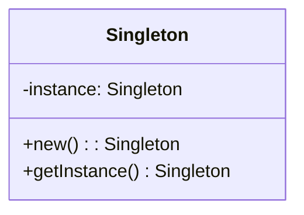

## 22.5 Online Resources and Community Links

As we delve deeper into mastering Lua design patterns, it's essential to leverage the wealth of online resources and community support available. Whether you're an absolute beginner or an experienced developer, these resources will provide you with the knowledge, tools, and community engagement necessary to excel in Lua programming.

### Official Lua Resources

#### Lua.org

The official Lua website, [Lua.org](https://www.lua.org/), is the primary source for all things Lua. It offers comprehensive documentation, downloads, and updates on the latest Lua releases. This site is indispensable for understanding Lua's core features and functionalities. 

- **Documentation**: Access detailed guides and reference manuals to understand Lua's syntax and semantics.
- **Downloads**: Obtain the latest Lua versions and installation packages.
- **News and Updates**: Stay informed about the latest developments and announcements in the Lua ecosystem.

#### Lua-Users Wiki

The [Lua-Users Wiki](http://lua-users.org/wiki/) is a community-driven platform that provides a wealth of information on Lua programming. It includes tutorials, code snippets, and discussions on various Lua topics. This resource is particularly useful for exploring practical applications and community-contributed insights.

- **Tutorials**: Learn Lua through step-by-step guides and examples.
- **Code Snippets**: Discover reusable code snippets for common programming tasks.
- **Community Contributions**: Engage with the community by contributing your own knowledge and experiences.

### Forums and Discussion Boards

#### Stack Overflow

[Stack Overflow](https://stackoverflow.com/questions/tagged/lua) is a popular platform for developers to ask and answer questions related to Lua programming. It's an excellent place to seek help, share knowledge, and learn from the experiences of other developers.

- **Q&A**: Post questions and receive answers from the community.
- **Tags**: Use the Lua tag to filter relevant questions and discussions.
- **Reputation System**: Earn reputation points by contributing valuable answers and insights.

#### Reddit's Lua Community

The [Lua subreddit](https://www.reddit.com/r/lua/) is an active community where Lua enthusiasts share news, projects, and discussions. It's a great place to connect with other Lua developers and stay updated on the latest trends and developments.

- **Discussions**: Participate in discussions on Lua programming and related topics.
- **Project Sharing**: Showcase your Lua projects and receive feedback from the community.
- **News and Updates**: Stay informed about the latest Lua news and announcements.

### Educational Platforms

#### Online Courses

Several online platforms offer structured courses on Lua programming and design patterns. These courses are designed to cater to different skill levels, from beginners to advanced developers.

- **Coursera**: Offers courses on Lua programming fundamentals and advanced topics.
- **Udemy**: Provides a wide range of Lua courses, including design patterns and game development.
- **edX**: Features Lua programming courses from top universities and institutions.

#### YouTube Channels

YouTube is a valuable resource for visual learners who prefer video tutorials and lectures. Many channels offer content on Lua programming and design patterns.

- **The Coding Train**: Offers engaging tutorials on Lua programming and creative coding.
- **Traversy Media**: Provides comprehensive tutorials on Lua and other programming languages.
- **Academind**: Features in-depth courses on Lua programming and software development.

### Contributing to the Community

#### Open Source Projects

Participating in open source projects is an excellent way to apply your Lua skills and contribute to the community. It provides opportunities to collaborate with other developers and gain practical experience.

- **GitHub**: Explore Lua repositories and contribute to open source projects.
- **SourceForge**: Find and participate in Lua projects hosted on SourceForge.
- **LuaRocks**: Contribute to the LuaRocks package manager by creating and maintaining Lua modules.

#### Local Meetups and Conferences

Attending local meetups and conferences is a great way to network with peers and learn from industry experts. These events provide opportunities to engage with the Lua community and stay updated on the latest trends and technologies.

- **Lua Workshops**: Participate in workshops and conferences dedicated to Lua programming.
- **Meetup.com**: Find local Lua meetups and events in your area.
- **Tech Conferences**: Attend technology conferences that feature Lua programming sessions and workshops.

### Code Examples and Visualizations

To enhance your understanding of Lua design patterns, let's explore some code examples and visualizations.

#### Singleton Pattern in Lua

The Singleton pattern ensures that a class has only one instance and provides a global point of access to it.

```lua
-- Singleton Pattern Example in Lua
local Singleton = {}
Singleton.__index = Singleton

function Singleton:new()
    if not Singleton.instance then
        Singleton.instance = setmetatable({}, Singleton)
    end
    return Singleton.instance
end

-- Usage
local instance1 = Singleton:new()
local instance2 = Singleton:new()

print(instance1 == instance2) -- Output: true
```

> **Explanation:** The Singleton pattern restricts the instantiation of a class to a single object. In this example, `Singleton:new()` checks if an instance already exists. If not, it creates one. Subsequent calls return the existing instance.

#### Visualizing the Singleton Pattern



> **Description:** This class diagram illustrates the Singleton pattern, showing the single instance and the method to access it.

### Knowledge Check

Let's reinforce your learning with some questions and exercises.

- **Question:** What is the primary purpose of the Singleton pattern?
- **Exercise:** Modify the Singleton pattern example to include a method that returns the instance's creation timestamp.

### Embrace the Journey

Remember, mastering Lua design patterns is a journey. As you explore these resources and engage with the community, you'll gain valuable insights and skills. Keep experimenting, stay curious, and enjoy the process of learning and growing as a Lua developer.

## Quiz Time!



### What is the primary source for Lua documentation and downloads?

- [x] Lua.org
- [ ] Stack Overflow
- [ ] Reddit's Lua Community
- [ ] GitHub

> **Explanation:** Lua.org is the official website for Lua documentation and downloads.

### Which platform is best for asking and answering Lua-related questions?

- [ ] Lua.org
- [x] Stack Overflow
- [ ] YouTube
- [ ] Meetup.com

> **Explanation:** Stack Overflow is a popular platform for asking and answering programming-related questions, including those about Lua.

### Where can you find community-driven content on Lua programming?

- [ ] Lua.org
- [x] Lua-Users Wiki
- [ ] Coursera
- [ ] SourceForge

> **Explanation:** The Lua-Users Wiki is a community-driven platform with content on Lua programming.

### Which subreddit is dedicated to Lua programming discussions?

- [ ] r/programming
- [x] r/lua
- [ ] r/learnprogramming
- [ ] r/coding

> **Explanation:** The r/lua subreddit is dedicated to Lua programming discussions.

### What is a benefit of participating in open source projects?

- [x] Gaining practical experience
- [ ] Earning money
- [ ] Avoiding collaboration
- [ ] Limiting learning opportunities

> **Explanation:** Participating in open source projects provides practical experience and collaboration opportunities.

### Which platform offers structured Lua programming courses?

- [x] Coursera
- [ ] Stack Overflow
- [ ] Reddit
- [ ] GitHub

> **Explanation:** Coursera offers structured courses on Lua programming.

### What is the purpose of the Singleton pattern?

- [x] To ensure a class has only one instance
- [ ] To create multiple instances of a class
- [ ] To organize code into modules
- [ ] To handle errors in Lua

> **Explanation:** The Singleton pattern ensures that a class has only one instance and provides a global point of access to it.

### Which diagram type is used to visualize the Singleton pattern?

- [x] Class diagram
- [ ] Sequence diagram
- [ ] Flowchart
- [ ] Network diagram

> **Explanation:** A class diagram is used to visualize the structure of the Singleton pattern.

### What is the primary focus of Lua workshops and conferences?

- [x] Networking and learning
- [ ] Selling products
- [ ] Avoiding collaboration
- [ ] Limiting learning opportunities

> **Explanation:** Lua workshops and conferences focus on networking and learning from industry experts.

### True or False: GitHub is a platform for contributing to open source Lua projects.

- [x] True
- [ ] False

> **Explanation:** GitHub is a popular platform for hosting and contributing to open source projects, including those written in Lua.



By leveraging these resources and engaging with the Lua community, you'll be well-equipped to master Lua design patterns and advance your skills as a software engineer and architect. Keep exploring, learning, and contributing to the vibrant world of Lua programming!
