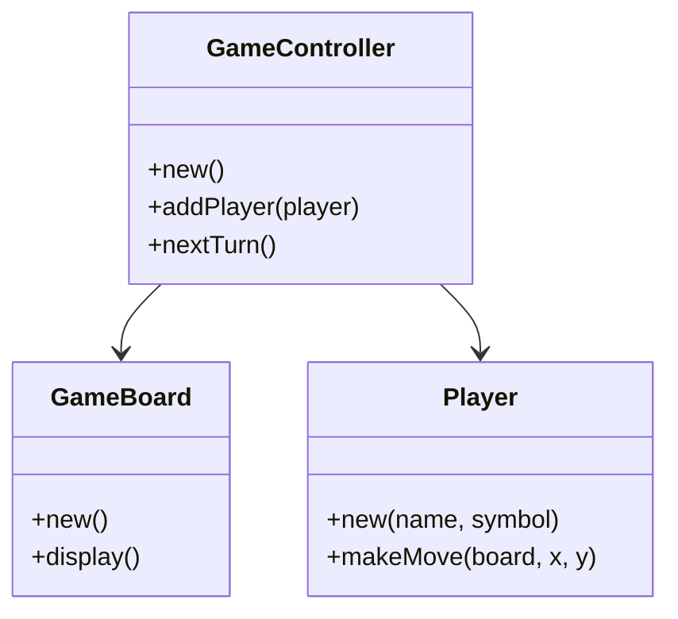

## 22.7 Sample Projects and Code Examples

Welcome to the hands-on section of our guide, where we delve into practical applications of Lua design patterns through sample projects and code examples. This section is designed to solidify your understanding of the concepts discussed throughout the guide by providing real-world applications and reusable code snippets.

### Hands-On Learning

#### Complete Projects

In this section, we present complete projects that demonstrate the application of various design patterns in Lua. These projects are designed to be comprehensive, allowing you to see how different patterns can be combined to create robust applications.

#### Code Snippets

Alongside complete projects, we provide reusable code snippets that illustrate specific patterns or techniques. These snippets are meant to be modular, allowing you to integrate them into your own projects with ease.

### Project Categories

#### Games

Lua is widely used in game development due to its lightweight nature and flexibility. In this section, we explore simple games that showcase Lua's capabilities in this domain.

##### Example Project: Lua Tic-Tac-Toe

**Intent**: Demonstrate the use of the State Pattern and Observer Pattern in a simple game.

**Key Participants**:
- **Game Board**: Represents the state of the game.
- **Player**: Observes the game state and makes moves.
- **Game Controller**: Manages the flow of the game.

**Sample Code Snippet**:

```lua
-- Define the Game Board
local GameBoard = {}
GameBoard.__index = GameBoard

function GameBoard:new()
    local board = {{"", "", ""}, {"", "", ""}, {"", "", ""}}
    setmetatable(board, GameBoard)
    return board
end

function GameBoard:display()
    for i = 1, 3 do
        print(table.concat(self[i], " | "))
    end
end

-- Define the Player
local Player = {}
Player.__index = Player

function Player:new(name, symbol)
    local player = {name = name, symbol = symbol}
    setmetatable(player, Player)
    return player
end

function Player:makeMove(board, x, y)
    if board[x][y] == "" then
        board[x][y] = self.symbol
    else
        print("Invalid move!")
    end
end

-- Define the Game Controller
local GameController = {}
GameController.__index = GameController

function GameController:new()
    local controller = {board = GameBoard:new(), players = {}, currentPlayerIndex = 1}
    setmetatable(controller, GameController)
    return controller
end

function GameController:addPlayer(player)
    table.insert(self.players, player)
end

function GameController:nextTurn()
    self.currentPlayerIndex = (self.currentPlayerIndex % #self.players) + 1
end

-- Initialize the game
local game = GameController:new()
local player1 = Player:new("Alice", "X")
local player2 = Player:new("Bob", "O")

game:addPlayer(player1)
game:addPlayer(player2)

-- Game loop
for i = 1, 9 do
    local currentPlayer = game.players[game.currentPlayerIndex]
    print(currentPlayer.name .. "'s turn:")
    game.board:display()
    print("Enter your move (row and column):")
    local x, y = io.read("*n", "*n")
    currentPlayer:makeMove(game.board, x, y)
    game:nextTurn()
end
```

**Try It Yourself**: Modify the game to include a win condition check and announce the winner.

#### Web Applications

Lua can also be used to build web applications, especially when combined with frameworks like OpenResty. Here, we provide examples of web services built with Lua.

##### Example Project: Simple REST API with OpenResty

**Intent**: Demonstrate the use of the MVC pattern in a web application.

**Key Participants**:
- **Model**: Represents the data and business logic.
- **View**: Handles the presentation of data.
- **Controller**: Manages the flow of data between the model and view.

**Sample Code Snippet**:

```lua
-- Define the Model
local Model = {}
Model.__index = Model

function Model:new(data)
    local model = {data = data or {}}
    setmetatable(model, Model)
    return model
end

function Model:getData()
    return self.data
end

-- Define the View
local View = {}
View.__index = View

function View:new()
    local view = {}
    setmetatable(view, View)
    return view
end

function View:render(data)
    ngx.say("Data: ", data)
end

-- Define the Controller
local Controller = {}
Controller.__index = Controller

function Controller:new(model, view)
    local controller = {model = model, view = view}
    setmetatable(controller, Controller)
    return controller
end

function Controller:handleRequest()
    local data = self.model:getData()
    self.view:render(data)
end

-- Initialize the application
local model = Model:new({name = "Lua", version = "5.4"})
local view = View:new()
local controller = Controller:new(model, view)

-- Handle a request
controller:handleRequest()
```

**Try It Yourself**: Extend the API to handle POST requests and update the model data.

#### Utilities and Tools

Lua's simplicity makes it an excellent choice for scripting utilities and tools. In this section, we explore scripts for automation and data processing.

##### Example Project: File Processing Script

**Intent**: Demonstrate the use of the Iterator Pattern for processing files.

**Key Participants**:
- **File Iterator**: Iterates over lines in a file.
- **Processor**: Processes each line.

**Sample Code Snippet**:

```lua
-- Define the File Iterator
local function fileIterator(filename)
    local file = io.open(filename, "r")
    return function()
        local line = file:read()
        if not line then file:close() end
        return line
    end
end

-- Define the Processor
local function processFile(filename)
    for line in fileIterator(filename) do
        print("Processing line: ", line)
    end
end

-- Process a file
processFile("sample.txt")
```

**Try It Yourself**: Modify the script to count the number of lines in the file.

### Accessing the Code

#### GitHub Repository

All sample projects and code examples are available in our [GitHub Repository](https://github.com/SoftwarePatternsLexicon/Lua-Design-Patterns). You can download the code, contribute to the projects, or use them as a starting point for your own applications.

#### Instructions

To set up and run the projects, follow these steps:

1. **Clone the Repository**: Use `git clone https://github.com/SoftwarePatternsLexicon/Lua-Design-Patterns.git` to download the code.
2. **Install Dependencies**: Follow the instructions in the `README.md` file for each project to install any necessary dependencies.
3. **Run the Projects**: Use the provided scripts or commands to run the projects and see the design patterns in action.

### Visualizing Project Structure

To better understand the structure of these projects, let's visualize the architecture of the Tic-Tac-Toe game using Mermaid.js:



**Description**: This diagram illustrates the relationships between the `GameBoard`, `Player`, and `GameController` classes in the Tic-Tac-Toe game.

### Knowledge Check

To reinforce your understanding, consider the following questions:

- How does the State Pattern help manage game state in the Tic-Tac-Toe example?
- What role does the Observer Pattern play in the game loop?
- How can the MVC pattern be applied to web applications using Lua?

### Embrace the Journey

Remember, this is just the beginning. As you progress, you'll build more complex and interactive applications. Keep experimenting, stay curious, and enjoy the journey!

## Quiz Time!



### Which design pattern is used to manage game state in the Tic-Tac-Toe example?

- [x] State Pattern
- [ ] Singleton Pattern
- [ ] Factory Pattern
- [ ] Adapter Pattern

> **Explanation:** The State Pattern is used to manage the game state, allowing the game to transition between different states.

### What is the primary role of the Observer Pattern in the Tic-Tac-Toe game?

- [x] To notify players of state changes
- [ ] To manage game state transitions
- [ ] To handle user input
- [ ] To render the game board

> **Explanation:** The Observer Pattern is used to notify players of changes in the game state, allowing them to react accordingly.

### In the REST API example, which component is responsible for rendering data?

- [ ] Model
- [x] View
- [ ] Controller
- [ ] Router

> **Explanation:** The View component is responsible for rendering data to the user.

### What pattern is demonstrated by the file processing script?

- [ ] Singleton Pattern
- [ ] Factory Pattern
- [x] Iterator Pattern
- [ ] Observer Pattern

> **Explanation:** The Iterator Pattern is used to iterate over lines in a file, processing each line in turn.

### How can the MVC pattern benefit web applications?

- [x] By separating concerns and improving maintainability
- [ ] By increasing performance
- [ ] By reducing code complexity
- [ ] By enhancing security

> **Explanation:** The MVC pattern separates concerns, making web applications easier to maintain and extend.

### What is the purpose of the GitHub repository mentioned in the guide?

- [x] To provide access to sample code and projects
- [ ] To host Lua documentation
- [ ] To offer a platform for Lua discussions
- [ ] To store Lua binaries

> **Explanation:** The GitHub repository provides access to sample code and projects, allowing users to download and contribute.

### Which Lua feature is highlighted in the file processing script?

- [ ] Metatables
- [x] Iterators
- [ ] Coroutines
- [ ] Modules

> **Explanation:** The file processing script highlights the use of iterators to process lines in a file.

### What is the first step to set up the sample projects from the GitHub repository?

- [x] Clone the repository
- [ ] Install dependencies
- [ ] Run the projects
- [ ] Configure environment variables

> **Explanation:** The first step is to clone the repository using `git clone`.

### True or False: The Tic-Tac-Toe game uses the Singleton Pattern.

- [ ] True
- [x] False

> **Explanation:** The Tic-Tac-Toe game does not use the Singleton Pattern; it uses the State and Observer Patterns.

### What is the key benefit of using design patterns in software development?

- [x] They provide proven solutions to common problems
- [ ] They increase code complexity
- [ ] They reduce code readability
- [ ] They limit flexibility

> **Explanation:** Design patterns provide proven solutions to common problems, improving code quality and maintainability.


