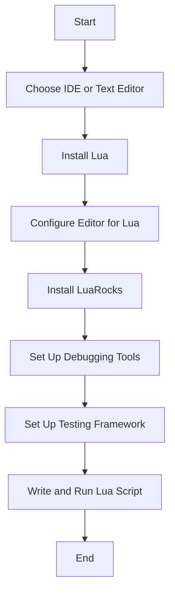

## 22.8 Setting Up Development Environments

Setting up a robust development environment is crucial for efficient software development. In this section, we will explore various tools and editors, environment configuration, and debugging and testing tools tailored for Lua development. Whether you're a beginner or an experienced developer, this guide will help you create a productive and streamlined workflow.

### Tools and Editors

#### IDEs for Lua

Integrated Development Environments (IDEs) provide a comprehensive suite of tools to facilitate coding, debugging, and testing. Here are some recommended IDEs for Lua development:

1. **ZeroBrane Studio**: A lightweight Lua IDE with features like syntax highlighting, code completion, and debugging support. It is particularly popular among game developers using Lua.

2. **Eclipse with Koneki**: Eclipse is a versatile IDE that can be extended with the Koneki plugin to support Lua development. It offers features like code navigation, syntax checking, and debugging.

3. **IntelliJ IDEA with Lua Plugin**: IntelliJ IDEA is a powerful IDE that can be enhanced with a Lua plugin to provide features like code completion, refactoring, and debugging.

#### Text Editors

Text editors are a flexible alternative to IDEs, allowing for customization and lightweight editing. Here’s how to configure popular text editors for Lua development:

- **Visual Studio Code**: 

  Visual Studio Code is a popular choice due to its extensive plugin ecosystem. To set it up for Lua:

  - Install the **Lua Language Server** extension for syntax highlighting and IntelliSense.
  - Configure the **Lua Debug** extension for debugging support.
  - Customize settings in `settings.json` to tailor the environment to your needs.

- **Sublime Text**:

  Sublime Text is known for its speed and simplicity. To configure it for Lua:

  - Install the **LuaSublime** package for syntax highlighting and snippets.
  - Use the **SublimeLinter** plugin with the **SublimeLinter-contrib-luacheck** linter for code analysis.

- **Vim**:

  Vim is a highly customizable text editor favored by many developers. To set it up for Lua:

  - Use the **vim-lua** plugin for syntax highlighting.
  - Install **ALE** (Asynchronous Lint Engine) for linting and code analysis.
  - Configure **Vim-Plug** or another plugin manager to manage these extensions.

### Environment Configuration

#### Lua Installation

Installing Lua is the first step in setting up your development environment. Here’s how to install Lua on different operating systems:

- **Windows**:

  1. Download the Lua binaries from the [LuaBinaries](https://luabinaries.sourceforge.net/) website.
  2. Extract the files to a directory, e.g., `C:\Lua`.
  3. Add the Lua directory to your system's PATH environment variable.

- **macOS**:

  1. Open Terminal.
  2. Use Homebrew to install Lua by running: `brew install lua`.
  3. Verify the installation with `lua -v`.

- **Linux**:

  1. Open Terminal.
  2. Use the package manager to install Lua. For example, on Ubuntu, run: `sudo apt-get install lua5.3`.
  3. Verify the installation with `lua -v`.

#### Managing Dependencies

Managing dependencies is crucial for maintaining a clean and efficient development environment. LuaRocks is the package manager for Lua, allowing you to install and manage libraries easily.

- **Installing LuaRocks**:

  1. Download LuaRocks from the [official website](https://luarocks.org/).
  2. Follow the installation instructions specific to your operating system.
  3. Verify the installation with `luarocks --version`.

- **Using LuaRocks**:

  - Install a package: `luarocks install <package_name>`.
  - List installed packages: `luarocks list`.
  - Remove a package: `luarocks remove <package_name>`.

### Debugging and Testing Tools

#### Debuggers

Debugging is an essential part of development, allowing you to step through code and inspect variables. Here are some tools to help you debug Lua code:

- **MobDebug**: A remote debugger that integrates with ZeroBrane Studio. It allows you to set breakpoints, inspect variables, and step through code.

- **Lua Debugger (ldb)**: A command-line debugger for Lua that provides basic debugging capabilities like breakpoints and variable inspection.

#### Testing Frameworks

Testing ensures that your code behaves as expected. Setting up a unit testing environment is crucial for maintaining code quality. Here are some testing frameworks for Lua:

- **Busted**: A unit testing framework that supports behavior-driven development (BDD). It provides a simple syntax for writing tests and supports mocking and stubbing.

- **LuaUnit**: A lightweight unit testing framework that provides assertions and test runners. It is easy to integrate into existing projects.

- **Telescope**: A testing framework that focuses on simplicity and ease of use. It provides a straightforward API for writing and running tests.

### Try It Yourself

To solidify your understanding, try setting up a Lua development environment using one of the tools or editors mentioned above. Experiment with installing Lua and LuaRocks, and try running a simple Lua script. Set up a testing framework and write a few unit tests to get a feel for the process.

### Visualizing the Development Environment Setup

To help you visualize the setup process, here is a flowchart illustrating the steps involved in setting up a Lua development environment:

This flowchart provides a high-level overview of the steps involved in setting up a Lua development environment. Each step builds upon the previous one, ensuring a smooth and efficient setup process.

### References and Links

For further reading and resources, consider exploring the following links:

- [Lua Official Website](https://www.lua.org/)
- [LuaRocks Official Website](https://luarocks.org/)
- [Visual Studio Code Marketplace](https://marketplace.visualstudio.com/)
- [Sublime Text Packages](https://packagecontrol.io/)
- [Vim Plugins](https://vimawesome.com/)

### Knowledge Check

To reinforce your learning, consider the following questions:

1. What are the benefits of using an IDE over a text editor for Lua development?
2. How can you install Lua on a Windows operating system?
3. What is LuaRocks, and how does it help manage dependencies?
4. Name two debugging tools available for Lua development.
5. Describe the process of setting up a unit testing environment for Lua.

### Embrace the Journey

Remember, setting up a development environment is just the beginning. As you progress, you'll become more familiar with the tools and processes, allowing you to focus on writing efficient and robust Lua code. Keep experimenting, stay curious, and enjoy the journey!

## Quiz Time!



### Which IDE is known for its lightweight nature and is popular among game developers using Lua?

- [x] ZeroBrane Studio
- [ ] Eclipse with Koneki
- [ ] IntelliJ IDEA with Lua Plugin
- [ ] Visual Studio Code

> **Explanation:** ZeroBrane Studio is a lightweight Lua IDE popular among game developers.

### What package manager is used for managing Lua dependencies?

- [x] LuaRocks
- [ ] npm
- [ ] pip
- [ ] Maven

> **Explanation:** LuaRocks is the package manager used for managing Lua dependencies.

### Which text editor is known for its speed and simplicity, and can be configured for Lua development?

- [ ] Visual Studio Code
- [x] Sublime Text
- [ ] Vim
- [ ] Eclipse

> **Explanation:** Sublime Text is known for its speed and simplicity and can be configured for Lua development.

### How can you install Lua on macOS using a package manager?

- [x] Use Homebrew and run `brew install lua`
- [ ] Use MacPorts and run `port install lua`
- [ ] Download from the Lua website and compile from source
- [ ] Use npm and run `npm install lua`

> **Explanation:** Homebrew is a package manager for macOS, and you can install Lua by running `brew install lua`.

### What is the purpose of a debugger in Lua development?

- [x] To step through code and inspect variables
- [ ] To compile Lua code into machine code
- [ ] To manage Lua dependencies
- [ ] To format Lua code

> **Explanation:** A debugger allows you to step through code and inspect variables to identify and fix issues.

### Which testing framework supports behavior-driven development (BDD) for Lua?

- [x] Busted
- [ ] LuaUnit
- [ ] Telescope
- [ ] Mocha

> **Explanation:** Busted is a testing framework that supports behavior-driven development (BDD) for Lua.

### What is the first step in setting up a Lua development environment?

- [x] Choose an IDE or text editor
- [ ] Install LuaRocks
- [ ] Set up a testing framework
- [ ] Configure debugging tools

> **Explanation:** The first step is to choose an IDE or text editor to use for Lua development.

### What tool can be used for linting and code analysis in Vim?

- [x] ALE (Asynchronous Lint Engine)
- [ ] LuaSublime
- [ ] Lua Language Server
- [ ] MobDebug

> **Explanation:** ALE (Asynchronous Lint Engine) is used for linting and code analysis in Vim.

### Which command is used to verify the installation of LuaRocks?

- [x] `luarocks --version`
- [ ] `luarocks install`
- [ ] `luarocks list`
- [ ] `luarocks remove`

> **Explanation:** The command `luarocks --version` is used to verify the installation of LuaRocks.

### True or False: Visual Studio Code can be configured for Lua development using extensions.

- [x] True
- [ ] False

> **Explanation:** Visual Studio Code can be configured for Lua development using extensions like the Lua Language Server and Lua Debug.


