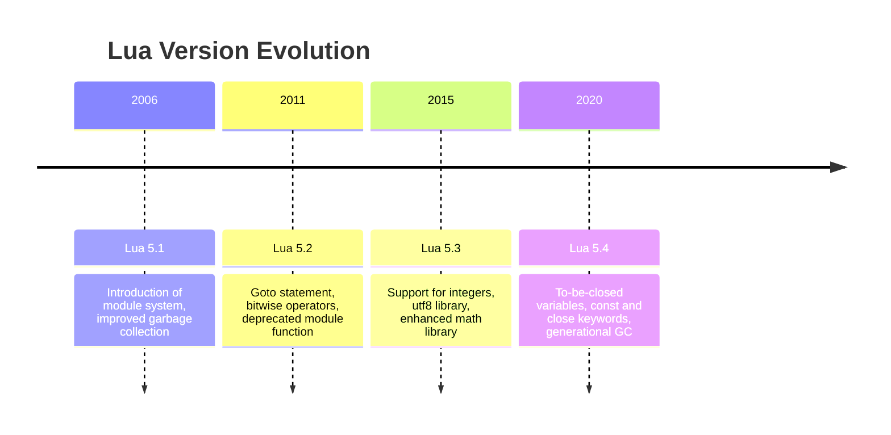

## 22.9 Lua Versions and Compatibility Considerations

Lua is a powerful, efficient, lightweight, embeddable scripting language. It is designed to be simple and flexible, making it a popular choice for a wide range of applications, from game development to web services. However, as with any programming language, different versions of Lua introduce new features, deprecate old ones, and sometimes change the way certain functionalities work. Understanding these changes is crucial for developers who want to maintain compatibility across different Lua environments.

### Understanding Lua Versions

Lua has undergone several major version changes, each bringing its own set of features and improvements. Let's delve into the key differences between the major versions of Lua: 5.1, 5.2, 5.3, 5.4, and LuaJIT.

#### Major Versions

- **Lua 5.1**: Released in 2006, Lua 5.1 introduced the module system, which allowed for better organization of code. It also brought improvements to the garbage collector and introduced the `__index` and `__newindex` metamethods for tables.

- **Lua 5.2**: Released in 2011, this version introduced several new features, such as the `goto` statement, bitwise operators, and the `__len` metamethod for tables. It also deprecated the `module` function, encouraging developers to use `require` and `package` for module management.

- **Lua 5.3**: Released in 2015, Lua 5.3 added support for integers and bitwise operations, making it easier to work with binary data. It also introduced the `utf8` library for handling UTF-8 encoded strings and improved the `math` library.

- **Lua 5.4**: Released in 2020, Lua 5.4 introduced the `to-be-closed` variables, which automatically close resources when they go out of scope. It also added support for `const` and `close` keywords and improved the garbage collector with a generational mode.

- **LuaJIT**: LuaJIT is a Just-In-Time Compiler for Lua, designed to offer high performance. It is based on Lua 5.1 but includes several extensions and optimizations, making it a popular choice for performance-critical applications.

#### New Features

Each version of Lua introduces new features that enhance the language's capabilities. Here are some notable additions or changes in each version:

- **Lua 5.1**: 
  - Introduction of the module system.
  - Improved garbage collection.
  - New metamethods for tables.

- **Lua 5.2**: 
  - `goto` statement for better control flow.
  - Bitwise operators for binary data manipulation.
  - Deprecation of the `module` function.

- **Lua 5.3**: 
  - Support for integers and bitwise operations.
  - `utf8` library for UTF-8 string handling.
  - Enhanced `math` library.

- **Lua 5.4**: 
  - `to-be-closed` variables for resource management.
  - `const` and `close` keywords.
  - Generational garbage collector.

- **LuaJIT**: 
  - High-performance Just-In-Time compilation.
  - Extensions for better performance and compatibility.

### Compatibility Challenges

As Lua evolves, developers may face compatibility challenges when porting code from one version to another. Understanding these challenges is crucial for maintaining a stable and functional codebase.

#### Deprecated Features

With each new version, some features may be deprecated or removed entirely. For example, the `module` function was deprecated in Lua 5.2, and developers were encouraged to use `require` and `package` instead. Similarly, certain functions and libraries may be altered or removed, requiring developers to update their code accordingly.

#### Porting Code

Porting code between different Lua versions can be challenging, especially if the code relies on deprecated features or version-specific behavior. Here are some strategies for updating code to run on different Lua versions:

- **Identify Deprecated Features**: Review the release notes and documentation for each Lua version to identify deprecated features and changes. Update your code to use the recommended alternatives.

- **Test Thoroughly**: Run your code on the target Lua version and test it thoroughly to identify any compatibility issues. Use automated testing tools to ensure that your code behaves as expected.

- **Use Compatibility Libraries**: Consider using compatibility libraries or shims that provide backward compatibility for deprecated features. These libraries can help bridge the gap between different Lua versions.

- **Gradual Migration**: If possible, migrate your codebase gradually, updating one module or feature at a time. This approach can help minimize disruptions and make it easier to identify and fix compatibility issues.

### Best Practices

Choosing the right Lua version and managing dependencies are crucial for ensuring compatibility and stability in your projects. Here are some best practices to consider:

#### Version Selection

Selecting the appropriate Lua version for your project depends on several factors, including performance requirements, available features, and compatibility with existing code and libraries. Here are some tips for choosing the right version:

- **Evaluate Features**: Consider the features and improvements introduced in each Lua version. Choose a version that offers the features you need for your project.

- **Consider Performance**: If performance is a critical factor, consider using LuaJIT, which offers high-performance Just-In-Time compilation.

- **Assess Compatibility**: Ensure that your chosen Lua version is compatible with your existing codebase and any external libraries or dependencies.

- **Stay Updated**: Keep an eye on the latest Lua releases and updates. Consider upgrading to newer versions to take advantage of new features and improvements.

#### Managing Dependencies

Managing dependencies is crucial for ensuring that your project remains compatible with your chosen Lua version. Here are some tips for managing dependencies effectively:

- **Use Package Managers**: Use package managers like LuaRocks to manage your project's dependencies. Package managers can help ensure that you have the correct versions of libraries and dependencies.

- **Check Compatibility**: Before adding a new dependency, check its compatibility with your chosen Lua version. Review the library's documentation and release notes for any compatibility issues.

- **Lock Dependencies**: Use dependency lock files to ensure that your project uses specific versions of libraries and dependencies. Lock files can help prevent compatibility issues caused by updates or changes to dependencies.

- **Regularly Update Dependencies**: Regularly update your project's dependencies to take advantage of bug fixes, security patches, and new features. Test your project thoroughly after updating dependencies to ensure compatibility.

### Code Examples

To illustrate the differences between Lua versions and compatibility considerations, let's look at some code examples.

#### Example 1: Using Bitwise Operators in Lua 5.2 and Later

```lua
-- Lua 5.2 and later: Using bitwise operators
local a = 5   -- 0101 in binary
local b = 3   -- 0011 in binary

-- Bitwise AND
local and_result = a & b  -- 0001 in binary
print("AND result:", and_result)  -- Output: 1

-- Bitwise OR
local or_result = a | b   -- 0111 in binary
print("OR result:", or_result)  -- Output: 7

-- Bitwise XOR
local xor_result = a ~ b  -- 0110 in binary
print("XOR result:", xor_result)  -- Output: 6
```

#### Example 2: Handling UTF-8 Strings in Lua 5.3 and Later

```lua
-- Lua 5.3 and later: Handling UTF-8 strings
local utf8_string = "Olá, mundo!"

-- Get the length of the UTF-8 string
local length = utf8.len(utf8_string)
print("Length of UTF-8 string:", length)  -- Output: 10

-- Iterate over each UTF-8 character
for p, c in utf8.codes(utf8_string) do
    print(string.format("Position: %d, Code point: %d", p, c))
end
```

#### Example 3: Using `to-be-closed` Variables in Lua 5.4

```lua
-- Lua 5.4: Using to-be-closed variables
local function open_file(filename)
    local file <close> = io.open(filename, "r")
    if not file then
        error("Could not open file")
    end
    return file
end

local file = open_file("example.txt")
-- The file will be automatically closed when it goes out of scope
```

### Try It Yourself

Experiment with the code examples provided above. Try modifying the bitwise operations, handling different UTF-8 strings, or using `to-be-closed` variables with different resources. This hands-on approach will help reinforce your understanding of Lua's features and compatibility considerations.

### Visualizing Lua Version Compatibility

To better understand the compatibility considerations between different Lua versions, let's visualize the evolution of Lua features using a timeline diagram.



This timeline provides a visual representation of the key features introduced in each Lua version, helping you understand the evolution of the language and its compatibility considerations.

### References and Links

For further reading on Lua versions and compatibility considerations, consider exploring the following resources:

- [Lua Official Website](https://www.lua.org/)
- [LuaJIT Official Website](https://luajit.org/)
- [LuaRocks Package Manager](https://luarocks.org/)
- [Lua 5.1 Reference Manual](https://www.lua.org/manual/5.1/)
- [Lua 5.2 Reference Manual](https://www.lua.org/manual/5.2/)
- [Lua 5.3 Reference Manual](https://www.lua.org/manual/5.3/)
- [Lua 5.4 Reference Manual](https://www.lua.org/manual/5.4/)

### Knowledge Check

To reinforce your understanding of Lua versions and compatibility considerations, consider the following questions:

- What are the key differences between Lua 5.1 and Lua 5.2?
- How do bitwise operators work in Lua 5.2 and later?
- What is the purpose of `to-be-closed` variables in Lua 5.4?
- How can you manage dependencies effectively in a Lua project?

### Embrace the Journey

Remember, understanding Lua versions and compatibility considerations is just the beginning. As you continue to explore Lua and its features, you'll gain a deeper understanding of how to build robust and efficient applications. Keep experimenting, stay curious, and enjoy the journey!

## Quiz Time!



### What is a notable feature introduced in Lua 5.1?

- [x] Introduction of the module system
- [ ] Support for integers
- [ ] `goto` statement
- [ ] `to-be-closed` variables

> **Explanation:** Lua 5.1 introduced the module system, which allowed for better organization of code.

### Which Lua version introduced bitwise operators?

- [ ] Lua 5.1
- [x] Lua 5.2
- [ ] Lua 5.3
- [ ] Lua 5.4

> **Explanation:** Lua 5.2 introduced bitwise operators, allowing for binary data manipulation.

### What is a key feature of Lua 5.3?

- [ ] `goto` statement
- [x] Support for integers
- [ ] `to-be-closed` variables
- [ ] Introduction of the module system

> **Explanation:** Lua 5.3 added support for integers and bitwise operations.

### Which Lua version deprecated the `module` function?

- [ ] Lua 5.1
- [x] Lua 5.2
- [ ] Lua 5.3
- [ ] Lua 5.4

> **Explanation:** Lua 5.2 deprecated the `module` function, encouraging developers to use `require` and `package` instead.

### What is a feature of Lua 5.4?

- [ ] Introduction of the module system
- [ ] `goto` statement
- [ ] Support for integers
- [x] `to-be-closed` variables

> **Explanation:** Lua 5.4 introduced `to-be-closed` variables for automatic resource management.

### Which Lua version introduced the `utf8` library?

- [ ] Lua 5.1
- [ ] Lua 5.2
- [x] Lua 5.3
- [ ] Lua 5.4

> **Explanation:** Lua 5.3 introduced the `utf8` library for handling UTF-8 encoded strings.

### What is LuaJIT known for?

- [ ] Deprecated features
- [x] High-performance Just-In-Time compilation
- [ ] `to-be-closed` variables
- [ ] `goto` statement

> **Explanation:** LuaJIT is known for its high-performance Just-In-Time compilation, making it a popular choice for performance-critical applications.

### How can you manage dependencies in a Lua project?

- [x] Use package managers like LuaRocks
- [ ] Avoid using external libraries
- [ ] Manually download and include libraries
- [ ] Use deprecated features

> **Explanation:** Using package managers like LuaRocks helps manage dependencies effectively, ensuring compatibility with your chosen Lua version.

### What is a strategy for porting code between Lua versions?

- [x] Identify deprecated features and update code
- [ ] Ignore compatibility issues
- [ ] Use only Lua 5.1 features
- [ ] Avoid testing the code

> **Explanation:** Identifying deprecated features and updating code to use recommended alternatives is a key strategy for porting code between Lua versions.

### True or False: Lua 5.4 introduced the `goto` statement.

- [ ] True
- [x] False

> **Explanation:** The `goto` statement was introduced in Lua 5.2, not Lua 5.4.


