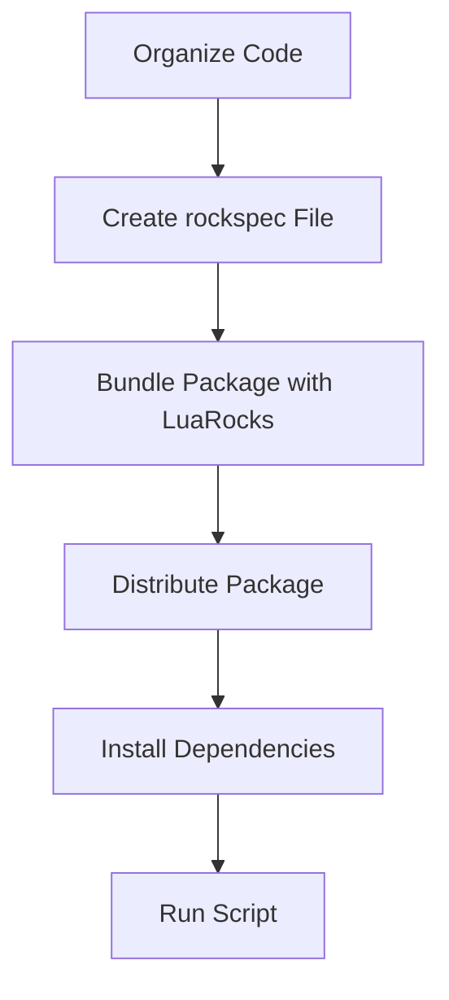

## 3.10 Lua Script Packaging and Distribution

In the world of software development, the ability to package and distribute scripts efficiently is crucial. Lua, with its lightweight and flexible nature, provides several ways to package scripts for distribution. This section will guide you through the process of bundling Lua scripts, addressing deployment considerations, incorporating third-party modules, and managing versioning and compatibility.

### Packaging Scripts: Bundling Lua Scripts for Distribution

Packaging Lua scripts involves creating a bundle that can be easily distributed and executed on different systems. This process ensures that all necessary components are included and that the script can run without additional setup.

#### Creating a Lua Package

To create a Lua package, follow these steps:

1. **Organize Your Code**: Structure your Lua scripts and modules in a logical directory hierarchy. This organization helps in maintaining the code and makes it easier to package.

2. **Create a `rockspec` File**: LuaRocks, the package manager for Lua, uses a `.rockspec` file to define the package. This file includes metadata such as the package name, version, dependencies, and build instructions.

   ```lua
   package = "my_lua_package"
   version = "1.0-1"
   source = {
       url = "https://example.com/my_lua_package-1.0.tar.gz"
   }
   dependencies = {
       "lua >= 5.1"
   }
   build = {
       type = "builtin",
       modules = {
           ["my_module"] = "src/my_module.lua"
       }
   }
   ```

3. **Bundle the Package**: Use LuaRocks to create a rock (package) from the `.rockspec` file. This command will generate a `.rock` file that can be distributed.

   ```bash
   luarocks pack my_lua_package-1.0-1.rockspec
   ```

4. **Distribute the Package**: Share the `.rock` file with users or upload it to a LuaRocks repository for public access.

#### Deployment Considerations: Platform-Specific Issues and Solutions

When deploying Lua scripts, consider the following platform-specific issues:

- **Operating System Differences**: Lua scripts may behave differently on various operating systems due to differences in file paths, environment variables, and system libraries. Use Lua's `os` library to handle OS-specific functionality.

- **File Permissions**: Ensure that your scripts have the appropriate permissions for execution. Use the `chmod` command on Unix-based systems to set executable permissions.

- **Environment Configuration**: Set environment variables and paths correctly to ensure that Lua and its dependencies are accessible. Use shell scripts or batch files to automate this setup.

- **Cross-Platform Compatibility**: Write scripts that are platform-agnostic by avoiding OS-specific features or by providing alternative implementations for different platforms.

#### Third-Party Modules: Incorporating External Libraries

Incorporating third-party modules can enhance the functionality of your Lua scripts. Here's how to manage external libraries:

1. **Identify Dependencies**: Determine the external libraries your script requires. List these dependencies in the `.rockspec` file.

2. **Install Dependencies**: Use LuaRocks to install the required modules. This command will download and install the dependencies specified in the `.rockspec` file.

   ```bash
   luarocks install my_lua_package-1.0-1.rock
   ```

3. **Manage Conflicts**: Be aware of potential conflicts between different versions of the same library. Use version constraints in the `.rockspec` file to specify compatible versions.

4. **Local vs. Global Installation**: Decide whether to install modules locally (for the current user) or globally (system-wide). Use the `--local` flag with LuaRocks for local installations.

#### Versioning and Compatibility: Managing Different Lua Versions and Dependencies

Managing versioning and compatibility is crucial for ensuring that your Lua scripts run smoothly across different environments.

1. **Semantic Versioning**: Use semantic versioning (e.g., `1.0.0`) to indicate changes in your package. This practice helps users understand the impact of updates.

2. **Compatibility with Lua Versions**: Specify the compatible Lua versions in the `.rockspec` file. Test your scripts with different Lua versions to ensure compatibility.

3. **Dependency Management**: Regularly update your dependencies to the latest stable versions. Use version constraints to avoid breaking changes.

4. **Backward Compatibility**: Maintain backward compatibility by avoiding breaking changes in your API. If breaking changes are necessary, increment the major version number.

5. **Testing Across Environments**: Test your scripts in different environments and configurations to identify compatibility issues early.

### Code Examples

Let's explore some code examples to illustrate the concepts discussed.

#### Example 1: Creating a Simple Lua Package

```lua
-- src/my_module.lua
local my_module = {}

function my_module.greet(name)
    return "Hello, " .. name .. "!"
end

return my_module
```

Create a `rockspec` file for the package:

```lua
-- my_lua_package-1.0-1.rockspec
package = "my_lua_package"
version = "1.0-1"
source = {
    url = "https://example.com/my_lua_package-1.0.tar.gz"
}
dependencies = {
    "lua >= 5.1"
}
build = {
    type = "builtin",
    modules = {
        ["my_module"] = "src/my_module.lua"
    }
}
```

#### Example 2: Handling Platform-Specific Code

```lua
-- platform_specific.lua
local platform_specific = {}

if package.config:sub(1,1) == '\\' then
    -- Windows-specific code
    function platform_specific.get_os()
        return "Windows"
    end
else
    -- Unix-based code
    function platform_specific.get_os()
        return "Unix-based"
    end
end

return platform_specific
```

### Visualizing Lua Script Packaging and Distribution

To better understand the process of Lua script packaging and distribution, let's visualize it using a flowchart.



**Figure 1**: Flowchart of the Lua Script Packaging and Distribution Process

### Try It Yourself

Experiment with the code examples provided. Try modifying the `my_module` to include additional functions, or create a new module and update the `rockspec` file accordingly. Test the package creation and installation process using LuaRocks.

### References and Links

- [LuaRocks Documentation](https://luarocks.org/)
- [Lua Programming Language](https://www.lua.org/)
- [Semantic Versioning](https://semver.org/)

### Knowledge Check

- What are the key steps in creating a Lua package?
- How can you handle platform-specific code in Lua?
- Why is semantic versioning important for Lua script distribution?

### Embrace the Journey

Remember, mastering Lua script packaging and distribution is a journey. As you continue to explore and experiment, you'll gain a deeper understanding of how to effectively manage and distribute your Lua scripts. Keep learning, stay curious, and enjoy the process!

## Quiz Time!



### What is the purpose of a `.rockspec` file in Lua?

- [x] To define the package metadata and build instructions
- [ ] To store the Lua script's runtime data
- [ ] To compile Lua scripts into bytecode
- [ ] To manage Lua script execution permissions

> **Explanation:** A `.rockspec` file is used to define the package metadata, including the package name, version, dependencies, and build instructions.

### Which command is used to create a Lua package with LuaRocks?

- [x] `luarocks pack`
- [ ] `luarocks build`
- [ ] `luarocks compile`
- [ ] `luarocks deploy`

> **Explanation:** The `luarocks pack` command is used to create a Lua package from a `.rockspec` file.

### How can you specify compatible Lua versions in a `.rockspec` file?

- [x] By using the `dependencies` field
- [ ] By using the `source` field
- [ ] By using the `build` field
- [ ] By using the `package` field

> **Explanation:** The `dependencies` field in a `.rockspec` file is used to specify compatible Lua versions and other dependencies.

### What is a common issue when deploying Lua scripts across different platforms?

- [x] Operating system differences
- [ ] Lack of LuaRocks support
- [ ] Inability to compile Lua scripts
- [ ] Excessive memory usage

> **Explanation:** Operating system differences, such as file paths and environment variables, can affect the behavior of Lua scripts on different platforms.

### How can you manage conflicts between different versions of the same library in Lua?

- [x] Use version constraints in the `.rockspec` file
- [ ] Use global variables to store library versions
- [ ] Avoid using third-party libraries
- [ ] Use a single version for all projects

> **Explanation:** Version constraints in the `.rockspec` file help manage conflicts by specifying compatible versions of libraries.

### What is the benefit of using semantic versioning for Lua packages?

- [x] It helps users understand the impact of updates
- [ ] It reduces the package size
- [ ] It improves script execution speed
- [ ] It simplifies the Lua syntax

> **Explanation:** Semantic versioning helps users understand the impact of updates by indicating changes in the package version.

### How can you ensure backward compatibility in Lua scripts?

- [x] Avoid breaking changes in the API
- [ ] Use global variables extensively
- [ ] Write platform-specific code
- [ ] Ignore versioning

> **Explanation:** Ensuring backward compatibility involves avoiding breaking changes in the API, allowing existing code to continue functioning.

### What is the purpose of the `os` library in Lua?

- [x] To handle operating system-specific functionality
- [ ] To manage Lua script execution
- [ ] To compile Lua scripts
- [ ] To store runtime data

> **Explanation:** The `os` library in Lua is used to handle operating system-specific functionality, such as file paths and environment variables.

### Which flag is used with LuaRocks for local installations?

- [x] `--local`
- [ ] `--global`
- [ ] `--user`
- [ ] `--system`

> **Explanation:** The `--local` flag is used with LuaRocks to install modules locally for the current user.

### True or False: Lua scripts can only be distributed as source code.

- [x] False
- [ ] True

> **Explanation:** Lua scripts can be distributed as source code or as packaged modules using tools like LuaRocks.


