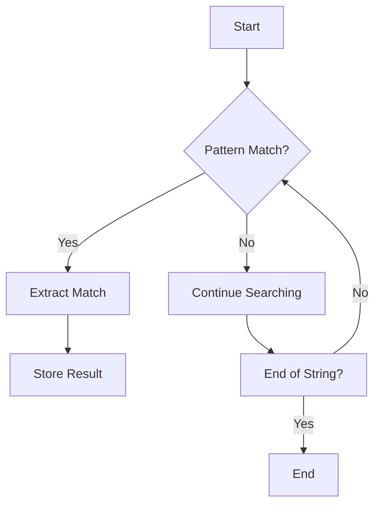

## 3.2 Strings and Pattern Matching

Strings are a fundamental data type in Lua, used extensively for text manipulation and data processing. Understanding how to work with strings efficiently is crucial for any Lua developer. In this section, we will delve into string operations, explore Lua's string library, and master pattern matching, which is Lua's way of handling regular expressions.

### String Operations

Lua provides a rich set of operations for manipulating strings. Let's explore some of the basic operations you can perform on strings in Lua.

#### Concatenation

Concatenation is the process of joining two or more strings together. In Lua, the concatenation operator is `..`.

```lua
local firstName = "John"
local lastName = "Doe"
local fullName = firstName .. " " .. lastName
print(fullName)  -- Output: John Doe
```

#### Length

To find the length of a string, use the `#` operator.

```lua
local name = "Lua"
print(#name)  -- Output: 3
```

#### Indexing

Lua strings are indexed starting from 1. You can access individual characters using the `string.sub` function.

```lua
local word = "Hello"
print(string.sub(word, 1, 1))  -- Output: H
```

### String Functions

Lua's standard string library provides a variety of functions for string manipulation. Here are some of the most commonly used functions:

#### string.upper and string.lower

These functions convert a string to uppercase or lowercase, respectively.

```lua
local text = "Lua Programming"
print(string.upper(text))  -- Output: LUA PROGRAMMING
print(string.lower(text))  -- Output: lua programming
```

#### string.find

The `string.find` function searches for a pattern in a string and returns the start and end indices of the match.

```lua
local text = "Hello, Lua!"
local start, finish = string.find(text, "Lua")
print(start, finish)  -- Output: 8 10
```

#### string.sub

The `string.sub` function extracts a substring from a string.

```lua
local text = "Hello, Lua!"
local subText = string.sub(text, 8, 10)
print(subText)  -- Output: Lua
```

#### string.format

The `string.format` function formats a string in a manner similar to `printf` in C.

```lua
local name = "Lua"
local version = 5.4
local formattedString = string.format("Welcome to %s version %.1f", name, version)
print(formattedString)  -- Output: Welcome to Lua version 5.4
```

### Pattern Matching

Pattern matching in Lua is a powerful feature that allows you to search and manipulate strings using patterns. Lua's pattern matching is not as complex as regular expressions, but it is sufficient for many tasks.

#### Basic Patterns

- **`.`**: Matches any character except a newline.
- **`%a`**: Matches any letter.
- **`%d`**: Matches any digit.
- **`%s`**: Matches any space character.
- **`%w`**: Matches any alphanumeric character.

#### Character Classes

Character classes are used to match specific sets of characters.

- **`[%a%d]`**: Matches any letter or digit.
- **`[^%a]`**: Matches any character except letters.

#### Repetition

- **`*`**: Matches 0 or more occurrences.
- **`+`**: Matches 1 or more occurrences.
- **`-`**: Matches 0 or more occurrences (non-greedy).
- **`?`**: Matches 0 or 1 occurrence.

#### Captures

Captures allow you to extract parts of a string that match a pattern.

```lua
local date = "2024-11-17"
local year, month, day = string.match(date, "(%d+)-(%d+)-(%d+)")
print(year, month, day)  -- Output: 2024 11 17
```

### Emulating Regular Expressions

While Lua's pattern matching is not as powerful as full regular expressions, you can emulate many regex behaviors using Lua's patterns.

#### Anchors

- **`^`**: Matches the start of a string.
- **`$`**: Matches the end of a string.

```lua
local text = "Hello, world!"
print(string.match(text, "^Hello"))  -- Output: Hello
print(string.match(text, "world!$"))  -- Output: world!
```

#### Escaping Special Characters

To match special characters, you need to escape them with a `%`.

```lua
local pattern = "%."
local text = "Find the dot."
print(string.find(text, pattern))  -- Output: 13 13
```

#### Advanced Pattern Matching

For more complex pattern matching, you can use nested patterns and captures.

```lua
local text = "The price is $123.45"
local price = string.match(text, "%$(%d+%.%d+)")
print(price)  -- Output: 123.45
```

### Try It Yourself

Experiment with the following code by modifying the patterns and strings to see how Lua's pattern matching works.

```lua
local text = "Lua is fun!"
local pattern = "%a+"
for word in string.gmatch(text, pattern) do
    print(word)
end
```

### Visualizing Pattern Matching

To better understand how pattern matching works, let's visualize the process using a flowchart.



This flowchart represents the process of searching for a pattern in a string, extracting matches, and continuing the search until the end of the string is reached.

### References and Links

- [Lua 5.4 Reference Manual - String Manipulation](https://www.lua.org/manual/5.4/manual.html#6.4)
- [Programming in Lua - String Manipulation](https://www.lua.org/pil/20.html)

### Knowledge Check

- What is the concatenation operator in Lua?
- How do you find the length of a string in Lua?
- What does the `string.find` function return?
- How can you extract a substring from a string in Lua?
- What is the difference between `*` and `+` in Lua patterns?

### Embrace the Journey

Remember, mastering strings and pattern matching in Lua is just the beginning. As you progress, you'll be able to handle more complex text processing tasks. Keep experimenting, stay curious, and enjoy the journey!

## Quiz Time!



### What operator is used for string concatenation in Lua?

- [x] `..`
- [ ] `+`
- [ ] `&`
- [ ] `||`

> **Explanation:** In Lua, the `..` operator is used for concatenating strings.

### How do you find the length of a string in Lua?

- [x] Using the `#` operator
- [ ] Using `string.length()`
- [ ] Using `strlen()`
- [ ] Using `length()`

> **Explanation:** The `#` operator is used to find the length of a string in Lua.

### What does the `string.find` function return?

- [x] Start and end indices of the match
- [ ] Only the start index
- [ ] Only the end index
- [ ] The matched string

> **Explanation:** `string.find` returns the start and end indices of the first occurrence of the pattern.

### How can you extract a substring from a string in Lua?

- [x] Using `string.sub()`
- [ ] Using `substring()`
- [ ] Using `substr()`
- [ ] Using `slice()`

> **Explanation:** `string.sub()` is used to extract a substring from a string in Lua.

### What is the difference between `*` and `+` in Lua patterns?

- [x] `*` matches 0 or more occurrences, `+` matches 1 or more occurrences
- [ ] `*` matches 1 or more occurrences, `+` matches 0 or more occurrences
- [ ] `*` matches exactly 1 occurrence, `+` matches 0 or more occurrences
- [ ] `*` matches 0 or 1 occurrence, `+` matches 1 or more occurrences

> **Explanation:** In Lua patterns, `*` matches 0 or more occurrences, while `+` matches 1 or more occurrences.

### Which function converts a string to uppercase in Lua?

- [x] `string.upper()`
- [ ] `string.toUpperCase()`
- [ ] `toupper()`
- [ ] `string.capitalize()`

> **Explanation:** `string.upper()` is used to convert a string to uppercase in Lua.

### How do you match any letter in Lua patterns?

- [x] `%a`
- [ ] `%l`
- [ ] `%c`
- [ ] `%w`

> **Explanation:** `%a` matches any letter in Lua patterns.

### What does the `^` symbol represent in Lua patterns?

- [x] Start of a string
- [ ] End of a string
- [ ] Any character
- [ ] A newline character

> **Explanation:** The `^` symbol is used to match the start of a string in Lua patterns.

### How do you escape special characters in Lua patterns?

- [x] Using `%`
- [ ] Using `\`
- [ ] Using `@`
- [ ] Using `#`

> **Explanation:** In Lua patterns, special characters are escaped using `%`.

### True or False: Lua's pattern matching is as powerful as regular expressions.

- [ ] True
- [x] False

> **Explanation:** Lua's pattern matching is not as powerful as full regular expressions but is sufficient for many tasks.


