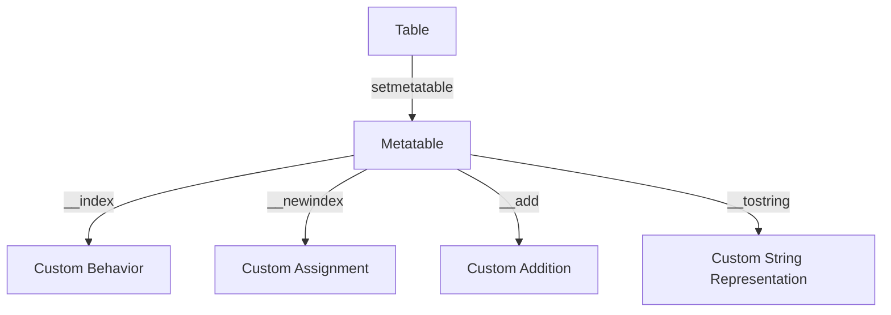

## 3.3 Metatables and Metamethods

In the world of Lua programming, metatables and metamethods are powerful tools that allow developers to extend the language's capabilities beyond its core syntax. By understanding and utilizing these features, you can create more flexible and dynamic applications. This section will guide you through the concepts of metatables and metamethods, providing practical examples and insights into their use.

### Introduction to Metatables

Metatables in Lua are a mechanism that allows you to change the behavior of tables. By assigning a metatable to a table, you can define custom behavior for operations on that table, such as arithmetic operations, indexing, and more. This is achieved through metamethods, which are special functions defined within the metatable.

#### Assigning Metatables to Tables

To assign a metatable to a table, you use the `setmetatable` function. This function takes two arguments: the table to which you want to assign the metatable and the metatable itself.

```lua
-- Define a simple table
local myTable = {}

-- Define a metatable
local myMetatable = {}

-- Assign the metatable to the table
setmetatable(myTable, myMetatable)
```

You can retrieve the metatable of a table using the `getmetatable` function:

```lua
-- Retrieve the metatable of myTable
local retrievedMetatable = getmetatable(myTable)
```

### Metamethods: Defining Behavior for Operators and Special Functions

Metamethods are special keys in a metatable that define how operations on the associated table should behave. They allow you to override default behaviors and implement custom logic.

#### Common Metamethods

- `__index`: Used to define behavior for table indexing.
- `__newindex`: Used to define behavior for assigning values to table keys.
- `__add`, `__sub`, `__mul`, `__div`: Define behavior for arithmetic operations.
- `__eq`, `__lt`, `__le`: Define behavior for comparison operations.
- `__call`: Allows a table to be called like a function.
- `__tostring`: Defines how a table is converted to a string.

#### Using the `__index` Metamethod

The `__index` metamethod is one of the most commonly used metamethods. It allows you to define what happens when you try to access a key that doesn't exist in a table.

```lua
-- Define a metatable with an __index metamethod
local myMetatable = {
    __index = function(table, key)
        return "Key " .. key .. " not found!"
    end
}

-- Assign the metatable to a table
local myTable = setmetatable({}, myMetatable)

-- Access a non-existent key
print(myTable.someKey)  -- Output: Key someKey not found!
```

#### Using the `__newindex` Metamethod

The `__newindex` metamethod is used to define behavior when assigning values to keys in a table.

```lua
-- Define a metatable with a __newindex metamethod
local myMetatable = {
    __newindex = function(table, key, value)
        print("Assigning " .. value .. " to key " .. key)
        rawset(table, key, value)
    end
}

-- Assign the metatable to a table
local myTable = setmetatable({}, myMetatable)

-- Assign a value to a key
myTable.someKey = "Hello"  -- Output: Assigning Hello to key someKey
```

### Object-Oriented Behavior: Using Metatables to Simulate Classes and Inheritance

Lua does not have built-in support for object-oriented programming (OOP), but you can simulate OOP concepts using metatables. By using the `__index` metamethod, you can create objects and implement inheritance.

#### Creating a Class-Like Structure

```lua
-- Define a base class
local Animal = {}
Animal.__index = Animal

function Animal:new(name)
    local instance = setmetatable({}, self)
    instance.name = name
    return instance
end

function Animal:speak()
    print("Animal sound")
end

-- Create an instance of Animal
local animal = Animal:new("Generic Animal")
animal:speak()  -- Output: Animal sound
```

#### Implementing Inheritance

```lua
-- Define a derived class
local Dog = setmetatable({}, Animal)
Dog.__index = Dog

function Dog:new(name)
    local instance = Animal.new(self, name)
    return instance
end

function Dog:speak()
    print(self.name .. " says Woof!")
end

-- Create an instance of Dog
local dog = Dog:new("Buddy")
dog:speak()  -- Output: Buddy says Woof!
```

### Practical Examples: Overloading Operators and Customizing Table Behavior

Metatables allow you to overload operators, enabling custom behavior for arithmetic and comparison operations.

#### Overloading the Addition Operator

```lua
-- Define a metatable with an __add metamethod
local vectorMetatable = {
    __add = function(v1, v2)
        return { x = v1.x + v2.x, y = v1.y + v2.y }
    end
}

-- Create two vectors
local vector1 = setmetatable({ x = 1, y = 2 }, vectorMetatable)
local vector2 = setmetatable({ x = 3, y = 4 }, vectorMetatable)

-- Add the vectors
local result = vector1 + vector2
print(result.x, result.y)  -- Output: 4 6
```

#### Customizing Table Behavior with `__tostring`

```lua
-- Define a metatable with a __tostring metamethod
local myMetatable = {
    __tostring = function(table)
        return "This is a custom string representation of the table."
    end
}

-- Assign the metatable to a table
local myTable = setmetatable({}, myMetatable)

-- Print the table
print(myTable)  -- Output: This is a custom string representation of the table.
```

### Visualizing Metatable Relationships

To better understand how metatables and metamethods work, let's visualize the relationship between tables and their metatables.



This diagram illustrates how a table can be associated with a metatable, which in turn defines custom behaviors through metamethods.

### Try It Yourself

Experiment with the code examples provided in this section. Try modifying the metamethods to see how they affect the behavior of tables. For instance, you can:

- Change the `__index` metamethod to return a default value for missing keys.
- Implement additional arithmetic operations using metamethods like `__sub` or `__mul`.
- Create a new class-like structure and implement inheritance.

### Knowledge Check

Before moving on, let's review some key concepts:

- Metatables allow you to change the behavior of tables in Lua.
- Metamethods are special functions that define custom behavior for operations on tables.
- You can simulate object-oriented programming in Lua using metatables and the `__index` metamethod.

### References and Links

For further reading on metatables and metamethods, consider exploring the following resources:

- [Lua 5.4 Reference Manual - Metatables and Metamethods](https://www.lua.org/manual/5.4/manual.html#2.4)
- [Programming in Lua - Metatables](https://www.lua.org/pil/13.html)

### Embrace the Journey

Remember, mastering metatables and metamethods is a journey. As you continue to explore Lua, you'll discover new ways to leverage these powerful features. Keep experimenting, stay curious, and enjoy the process of learning and growing as a developer.

## Quiz Time!



### What is the primary purpose of a metatable in Lua?

- [x] To change the behavior of a table
- [ ] To store additional data in a table
- [ ] To create a new table
- [ ] To delete a table

> **Explanation:** Metatables allow you to change the behavior of a table by defining custom operations through metamethods.

### Which metamethod is used to define behavior for table indexing?

- [x] __index
- [ ] __newindex
- [ ] __add
- [ ] __tostring

> **Explanation:** The `__index` metamethod is used to define behavior when accessing a key that doesn't exist in a table.

### How do you assign a metatable to a table in Lua?

- [x] Using the setmetatable function
- [ ] Using the getmetatable function
- [ ] Using the assignmetatable function
- [ ] Using the createmetatable function

> **Explanation:** The `setmetatable` function is used to assign a metatable to a table.

### What does the __tostring metamethod do?

- [x] Defines how a table is converted to a string
- [ ] Defines how a table is indexed
- [ ] Defines how a table is added
- [ ] Defines how a table is subtracted

> **Explanation:** The `__tostring` metamethod defines how a table is converted to a string when printed.

### Which metamethod allows a table to be called like a function?

- [x] __call
- [ ] __index
- [ ] __newindex
- [ ] __add

> **Explanation:** The `__call` metamethod allows a table to be called like a function.

### What is the result of using the __add metamethod?

- [x] Custom behavior for the addition operator
- [ ] Custom behavior for the subtraction operator
- [ ] Custom behavior for the multiplication operator
- [ ] Custom behavior for the division operator

> **Explanation:** The `__add` metamethod defines custom behavior for the addition operator.

### How can you simulate inheritance in Lua?

- [x] Using metatables and the __index metamethod
- [ ] Using built-in inheritance functions
- [ ] Using the __inherit metamethod
- [ ] Using the __parent metamethod

> **Explanation:** Inheritance can be simulated in Lua using metatables and the `__index` metamethod to delegate method calls to a parent table.

### What does the __newindex metamethod do?

- [x] Defines behavior for assigning values to table keys
- [ ] Defines behavior for accessing table keys
- [ ] Defines behavior for adding table keys
- [ ] Defines behavior for removing table keys

> **Explanation:** The `__newindex` metamethod defines behavior for assigning values to table keys.

### True or False: Metatables can only be assigned to tables in Lua.

- [x] True
- [ ] False

> **Explanation:** Metatables are specifically designed to be associated with tables in Lua to modify their behavior.

### Which of the following is NOT a common metamethod?

- [x] __multiply
- [ ] __index
- [ ] __newindex
- [ ] __add

> **Explanation:** `__multiply` is not a standard metamethod in Lua. The correct metamethod for multiplication is `__mul`.




