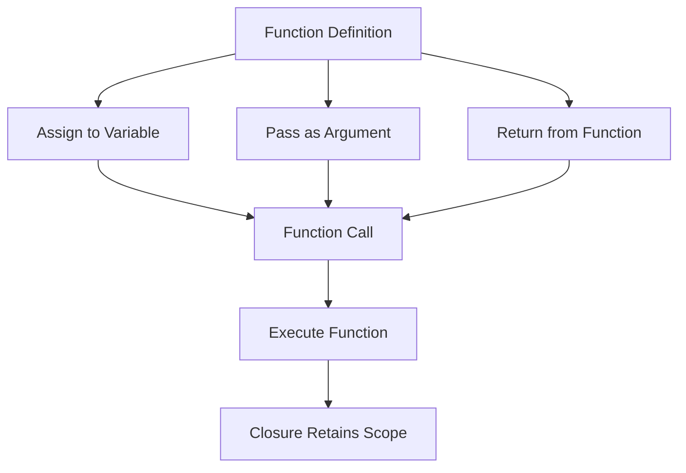

## 3.4 First-Class Functions and Closures

In the realm of Lua programming, understanding first-class functions and closures is pivotal for mastering the language's functional programming capabilities. These concepts allow developers to write more flexible, reusable, and expressive code. In this section, we will delve into the intricacies of first-class functions, closures, higher-order functions, and anonymous functions, providing you with the tools to elevate your Lua programming skills.

### Function Values: Treating Functions as Variables

In Lua, functions are first-class citizens. This means they can be treated like any other variable. You can assign functions to variables, pass them as arguments to other functions, and return them from functions. This flexibility is foundational to functional programming.

#### Assigning Functions to Variables

Let's start by demonstrating how functions can be assigned to variables:

```lua
-- Define a simple function
function greet(name)
    return "Hello, " .. name
end

-- Assign the function to a variable
local sayHello = greet

-- Call the function using the new variable
print(sayHello("Alice"))  -- Output: Hello, Alice
```

In this example, `greet` is a function that takes a name and returns a greeting. We assign this function to the variable `sayHello`, which can then be used to call the function.

#### Passing Functions as Arguments

Functions can also be passed as arguments to other functions, enabling higher-order functions:

```lua
-- Define a function that takes another function as an argument
function executeFunction(func, value)
    return func(value)
end

-- Define a simple function to be passed
function square(x)
    return x * x
end

-- Pass the square function as an argument
print(executeFunction(square, 5))  -- Output: 25
```

Here, `executeFunction` takes a function `func` and a value `value`, then calls `func` with `value`. We pass the `square` function to `executeFunction`, demonstrating how functions can be used as parameters.

#### Returning Functions from Functions

Returning functions from other functions is another powerful feature of first-class functions:

```lua
-- Define a function that returns another function
function createMultiplier(factor)
    return function(x)
        return x * factor
    end
end

-- Create a new function by calling createMultiplier
local double = createMultiplier(2)

-- Use the new function
print(double(10))  -- Output: 20
```

The `createMultiplier` function returns a new function that multiplies its input by a given factor. This demonstrates how functions can be dynamically created and returned.

### Closures: Functions Retaining Access to Their Lexical Scope

Closures are functions that capture and retain access to their lexical scope, even after the scope has exited. This allows functions to maintain state across multiple invocations.

#### Understanding Closures

Consider the following example:

```lua
-- Define a function that creates a closure
function createCounter()
    local count = 0
    return function()
        count = count + 1
        return count
    end
end

-- Create a counter
local counter = createCounter()

-- Use the counter
print(counter())  -- Output: 1
print(counter())  -- Output: 2
```

In this example, `createCounter` returns a closure that increments and returns the `count` variable. The closure retains access to `count`, even though `createCounter` has finished executing.

#### Practical Use Cases for Closures

Closures are particularly useful for creating encapsulated state and implementing data hiding:

- **Encapsulation**: Closures can encapsulate state, providing a clean interface for interacting with it.
- **Data Hiding**: By retaining access to private variables, closures can hide implementation details from the outside world.

### Higher-Order Functions: Functions That Accept or Return Other Functions

Higher-order functions are functions that take other functions as arguments or return them as results. They are a cornerstone of functional programming and enable powerful abstractions.

#### Creating Higher-Order Functions

Let's explore how to create and use higher-order functions:

```lua
-- Define a higher-order function
function map(func, tbl)
    local result = {}
    for i, v in ipairs(tbl) do
        result[i] = func(v)
    end
    return result
end

-- Define a simple function to be used with map
function increment(x)
    return x + 1
end

-- Use the map function
local numbers = {1, 2, 3, 4}
local incrementedNumbers = map(increment, numbers)

-- Print the result
for i, v in ipairs(incrementedNumbers) do
    print(v)  -- Output: 2, 3, 4, 5
end
```

The `map` function is a higher-order function that applies a given function `func` to each element of a table `tbl`, returning a new table with the results.

#### Benefits of Higher-Order Functions

Higher-order functions provide several benefits:

- **Code Reusability**: They allow you to abstract common patterns and reuse code.
- **Flexibility**: They enable you to pass different functions to customize behavior.
- **Expressiveness**: They make code more expressive and concise.

### Anonymous Functions: Lambda-Like Functions for Concise Code

Anonymous functions, also known as lambda functions, are functions defined without a name. They are useful for short, throwaway functions that are used only once.

#### Defining Anonymous Functions

Here's how to define and use anonymous functions in Lua:

```lua
-- Define an anonymous function and assign it to a variable
local add = function(a, b)
    return a + b
end

-- Use the anonymous function
print(add(3, 4))  -- Output: 7

-- Use an anonymous function directly as an argument
local numbers = {1, 2, 3, 4}
local doubledNumbers = map(function(x) return x * 2 end, numbers)

-- Print the result
for i, v in ipairs(doubledNumbers) do
    print(v)  -- Output: 2, 4, 6, 8
end
```

In this example, we define an anonymous function for addition and use it directly as an argument to the `map` function.

#### Advantages of Anonymous Functions

Anonymous functions offer several advantages:

- **Conciseness**: They allow you to define functions inline, reducing boilerplate code.
- **Readability**: They can make code more readable by keeping related logic together.
- **Flexibility**: They are ideal for short-lived functions that don't need a name.

### Visualizing First-Class Functions and Closures

To better understand the flow of first-class functions and closures, let's visualize the concept using a diagram.



**Diagram Description**: This flowchart illustrates how functions in Lua can be defined, assigned to variables, passed as arguments, and returned from other functions. It also shows how closures retain access to their lexical scope.

### Try It Yourself

Experiment with the concepts covered in this section by modifying the code examples:

- **Create a closure** that maintains a list of items and provides functions to add and remove items.
- **Implement a higher-order function** that filters elements from a table based on a predicate function.
- **Use anonymous functions** to perform operations on tables, such as sorting or transforming data.

### Knowledge Check

Before we conclude, let's reinforce your understanding with a few questions:

- What are first-class functions, and how do they differ from regular functions?
- How do closures retain access to their lexical scope?
- What are the benefits of using higher-order functions in Lua?
- How can anonymous functions improve code readability and conciseness?

### Embrace the Journey

Remember, mastering first-class functions and closures is just the beginning of your journey into functional programming with Lua. As you continue to explore these concepts, you'll discover new ways to write more efficient and expressive code. Keep experimenting, stay curious, and enjoy the journey!

## Quiz Time!



### What is a first-class function in Lua?

- [x] A function that can be treated like any other variable
- [ ] A function that is defined at the top of a script
- [ ] A function that cannot be passed as an argument
- [ ] A function that must return a value

> **Explanation:** First-class functions in Lua can be assigned to variables, passed as arguments, and returned from other functions, just like any other variable.

### How do closures retain access to their lexical scope?

- [x] By capturing and retaining the environment in which they were created
- [ ] By storing all variables in a global table
- [ ] By using special syntax to access outer variables
- [ ] By copying the entire scope into the function

> **Explanation:** Closures capture and retain the environment in which they were created, allowing them to access variables from their lexical scope even after that scope has exited.

### What is a higher-order function?

- [x] A function that takes other functions as arguments or returns them
- [ ] A function that is defined at a higher level in the code
- [ ] A function that always returns a function
- [ ] A function that cannot be nested

> **Explanation:** Higher-order functions are functions that take other functions as arguments or return them as results, enabling powerful abstractions and code reuse.

### What is an anonymous function?

- [x] A function defined without a name
- [ ] A function that is always defined inside another function
- [ ] A function that cannot be assigned to a variable
- [ ] A function that must be defined at the top of a script

> **Explanation:** Anonymous functions are functions defined without a name, often used for short, throwaway functions that are used only once.

### Which of the following is a benefit of using closures?

- [x] Encapsulation of state
- [ ] Increased memory usage
- [x] Data hiding
- [ ] Reduced code readability

> **Explanation:** Closures allow for encapsulation of state and data hiding, making them useful for creating clean interfaces and hiding implementation details.

### How can higher-order functions improve code reusability?

- [x] By abstracting common patterns and allowing code to be reused
- [ ] By making code more complex and harder to understand
- [ ] By requiring more boilerplate code
- [ ] By limiting the use of functions to specific cases

> **Explanation:** Higher-order functions abstract common patterns and allow code to be reused, making them a powerful tool for improving code reusability.

### What is a common use case for anonymous functions?

- [x] Short-lived functions used only once
- [ ] Functions that need to be called multiple times
- [x] Inline functions for concise code
- [ ] Functions that require a name for clarity

> **Explanation:** Anonymous functions are often used for short-lived functions that are used only once, and they allow for concise, inline code.

### What is the main advantage of using closures in Lua?

- [x] Retaining access to variables from their lexical scope
- [ ] Reducing the number of global variables
- [ ] Increasing the complexity of the code
- [ ] Making functions harder to understand

> **Explanation:** The main advantage of closures is their ability to retain access to variables from their lexical scope, even after that scope has exited.

### What is a key characteristic of first-class functions?

- [x] They can be passed as arguments to other functions
- [ ] They must be defined at the top of a script
- [ ] They cannot be returned from other functions
- [ ] They must always return a value

> **Explanation:** A key characteristic of first-class functions is that they can be passed as arguments to other functions, allowing for flexible and reusable code.

### True or False: Closures in Lua can only access global variables.

- [ ] True
- [x] False

> **Explanation:** False. Closures in Lua can access variables from their lexical scope, not just global variables.




