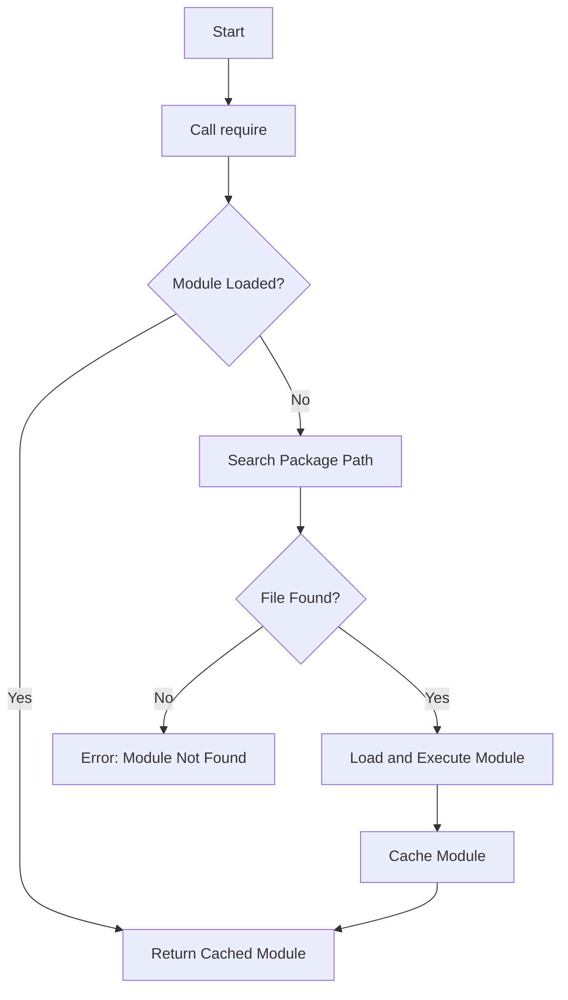

## 3.5 Modules and Packages

In the world of software development, organizing code into reusable components is crucial for maintainability, scalability, and collaboration. Lua, a lightweight and flexible scripting language, offers powerful mechanisms for modular programming through its modules and packages system. In this section, we will delve into the concepts of modules and packages in Lua, explore how to create and manage them, and discuss best practices for modular programming.

### Creating Modules: Organizing Code into Reusable Components

Modules in Lua are akin to libraries or namespaces in other programming languages. They allow developers to encapsulate functionality, promote code reuse, and maintain a clean separation of concerns. Let's explore how to create and use modules in Lua.

#### Defining a Module

To define a module in Lua, we typically create a new Lua file and return a table containing the module's functions and variables. Here's a simple example:

```lua
-- math_utils.lua
local math_utils = {}

function math_utils.add(a, b)
    return a + b
end

function math_utils.subtract(a, b)
    return a - b
end

return math_utils
```

In this example, we define a module `math_utils` with two functions: `add` and `subtract`. The module is represented as a table, and we return this table at the end of the file.

#### Using a Module

To use a module in another Lua script, we employ the `require` function. This function loads the module and returns the table defined in the module file:

```lua
-- main.lua
local math_utils = require("math_utils")

local sum = math_utils.add(5, 3)
print("Sum:", sum)  -- Output: Sum: 8

local difference = math_utils.subtract(10, 4)
print("Difference:", difference)  -- Output: Difference: 6
```

The `require` function searches for the module file in the directories specified by the package path, loads it, and returns the module table.

### `require` and `module` Functions: Loading and Managing Modules

The `require` function is the primary mechanism for loading modules in Lua. It ensures that each module is loaded only once, caching the result for subsequent calls. This behavior prevents redundant loading and execution of module code.

#### The `require` Function

The `require` function takes a module name as an argument and returns the module table. It follows these steps:

1. **Search**: Looks for the module file in the directories specified by the package path.
2. **Load**: Loads the module file if it hasn't been loaded already.
3. **Execute**: Executes the module file, caching the result.
4. **Return**: Returns the cached module table.

Here's an example of using `require`:

```lua
local my_module = require("my_module")
```

#### The `module` Function

Lua also provides a `module` function, which was used in older versions of Lua to define modules. However, its use is discouraged in favor of the simpler approach of returning a table. The `module` function modifies the global environment, which can lead to unexpected behavior and conflicts.

### Package Paths: Configuring Where Lua Looks for Modules

Lua uses a package path to determine where to look for module files. The package path is a string containing a list of directories and patterns. By default, Lua searches in the current directory and the standard library paths.

#### Modifying the Package Path

You can modify the package path by setting the `package.path` variable. Here's an example:

```lua
package.path = package.path .. ";./modules/?.lua"

local custom_module = require("custom_module")
```

In this example, we append `./modules/?.lua` to the package path, allowing Lua to search for modules in the `modules` directory.

### Best Practices: Modular Programming Techniques for Maintainability

Adopting best practices for modular programming enhances code maintainability, readability, and reusability. Here are some key practices to consider:

#### 1. Encapsulation

Encapsulate functionality within modules to promote separation of concerns. Each module should have a clear purpose and expose only the necessary functions and variables.

#### 2. Naming Conventions

Use consistent naming conventions for module files and functions. This practice improves code readability and helps developers understand the module's purpose at a glance.

#### 3. Avoid Global Variables

Avoid using global variables within modules. Instead, define variables within the module table to prevent naming conflicts and unintended side effects.

#### 4. Documentation

Document your modules thoroughly. Include comments and documentation strings to explain the purpose, usage, and behavior of each function and variable.

#### 5. Testing

Write tests for your modules to ensure their correctness and reliability. Automated tests help catch bugs early and provide confidence when making changes.

#### 6. Dependency Management

Manage dependencies between modules carefully. Avoid circular dependencies, and use dependency injection where appropriate to decouple modules.

#### 7. Version Control

Use version control systems to track changes to your modules. This practice facilitates collaboration, code review, and rollback of changes if needed.

### Try It Yourself

Experiment with creating your own modules and using them in Lua scripts. Try modifying the code examples provided, adding new functions to the modules, and exploring how changes affect the behavior of your scripts.

### Visualizing Module Loading

To better understand how Lua loads modules, let's visualize the process using a flowchart:



This flowchart illustrates the steps Lua takes when loading a module using the `require` function.

### Knowledge Check

- What is the primary purpose of modules in Lua?
- How does the `require` function prevent redundant loading of modules?
- What are some best practices for modular programming in Lua?

### Summary

In this section, we've explored the concepts of modules and packages in Lua, learned how to create and manage them, and discussed best practices for modular programming. By organizing code into reusable modules, we can enhance maintainability, scalability, and collaboration in our Lua projects. Remember, this is just the beginning. As you progress, you'll build more complex and interactive Lua applications. Keep experimenting, stay curious, and enjoy the journey!

## Quiz Time!



### What is the primary purpose of modules in Lua?

- [x] To encapsulate functionality and promote code reuse
- [ ] To increase the execution speed of Lua scripts
- [ ] To provide a graphical user interface for Lua applications
- [ ] To enable Lua to interact with hardware devices

> **Explanation:** Modules in Lua are used to encapsulate functionality and promote code reuse, making it easier to manage and maintain code.

### How does the `require` function prevent redundant loading of modules?

- [x] By caching the result of the module after the first load
- [ ] By executing the module code multiple times
- [ ] By deleting the module file after loading
- [ ] By using a different function for each module

> **Explanation:** The `require` function caches the result of the module after the first load, preventing redundant loading and execution of the module code.

### What is a key benefit of using modules in Lua?

- [x] Improved code organization and separation of concerns
- [ ] Faster execution of Lua scripts
- [ ] Automatic error handling
- [ ] Built-in support for graphical interfaces

> **Explanation:** Modules improve code organization and separation of concerns, making it easier to manage and maintain code.

### Which function is discouraged in modern Lua for defining modules?

- [x] `module`
- [ ] `require`
- [ ] `load`
- [ ] `dofile`

> **Explanation:** The `module` function is discouraged in modern Lua because it modifies the global environment, which can lead to unexpected behavior and conflicts.

### How can you modify the package path in Lua?

- [x] By setting the `package.path` variable
- [ ] By using the `module` function
- [ ] By editing the Lua interpreter source code
- [ ] By creating a new Lua file

> **Explanation:** You can modify the package path by setting the `package.path` variable, allowing Lua to search for modules in specified directories.

### What is a best practice for naming module files and functions?

- [x] Use consistent naming conventions
- [ ] Use random names for uniqueness
- [ ] Use long and descriptive names
- [ ] Use single-letter names for brevity

> **Explanation:** Using consistent naming conventions improves code readability and helps developers understand the module's purpose at a glance.

### Why should you avoid using global variables within modules?

- [x] To prevent naming conflicts and unintended side effects
- [ ] To make the code run faster
- [ ] To reduce memory usage
- [ ] To enable automatic error handling

> **Explanation:** Avoiding global variables within modules prevents naming conflicts and unintended side effects, ensuring that the module's behavior is predictable and isolated.

### What is the purpose of documenting modules?

- [x] To explain the purpose, usage, and behavior of each function and variable
- [ ] To increase the execution speed of Lua scripts
- [ ] To provide a graphical user interface for Lua applications
- [ ] To enable Lua to interact with hardware devices

> **Explanation:** Documenting modules helps explain the purpose, usage, and behavior of each function and variable, making it easier for developers to understand and use the module.

### What is a common practice for managing dependencies between modules?

- [x] Avoid circular dependencies and use dependency injection
- [ ] Use global variables to share data between modules
- [ ] Load all modules at the start of the program
- [ ] Use the `module` function to define dependencies

> **Explanation:** Avoiding circular dependencies and using dependency injection helps decouple modules, making the code more modular and maintainable.

### True or False: The `require` function executes the module code every time it is called.

- [ ] True
- [x] False

> **Explanation:** False. The `require` function executes the module code only once and caches the result, returning the cached module table for subsequent calls.


