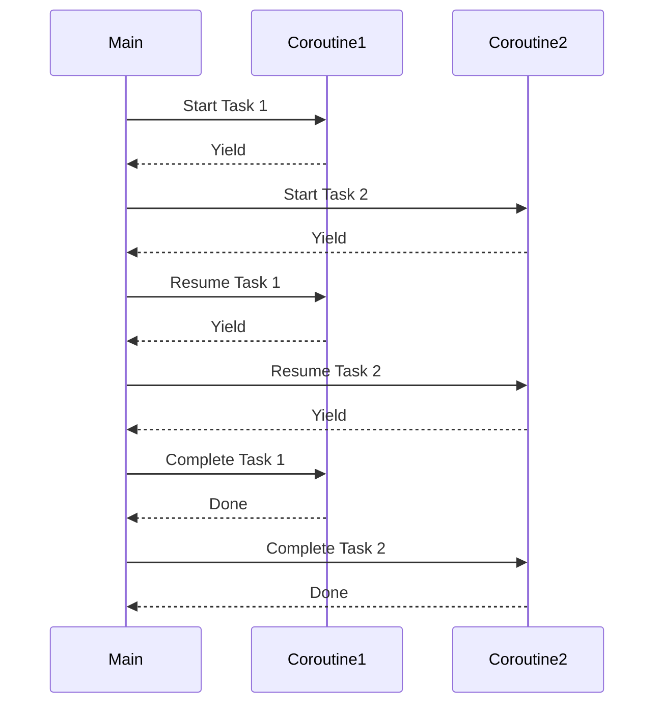

## 3.6 Coroutines and Asynchronous Programming Basics

Coroutines are a powerful feature in Lua that allow developers to implement cooperative multitasking and manage asynchronous tasks efficiently. In this section, we will delve into the concept of coroutines, how to create and manage them, and explore their application in asynchronous programming through practical examples.

### Understanding Coroutines

Coroutines in Lua are akin to lightweight threads that enable cooperative multitasking. Unlike traditional threads, coroutines do not preemptively interrupt each other; instead, they yield control explicitly, allowing developers to manage execution flow more predictably.

#### Key Characteristics of Coroutines

- **Cooperative Multitasking**: Coroutines yield control voluntarily, making them ideal for tasks that require precise control over execution order.
- **Lightweight**: Coroutines have minimal overhead compared to threads, making them efficient for concurrent operations.
- **Stateful**: Coroutines maintain their state between yields, allowing them to resume execution from where they left off.

### Creating Coroutines

In Lua, coroutines are created using the `coroutine.create()` function, which returns a coroutine object. This object can be resumed using `coroutine.resume()`, and it can yield control using `coroutine.yield()`.

#### Basic Coroutine Example

Let's start with a simple example to illustrate the creation and management of coroutines:

```lua
-- Define a simple coroutine function
function simpleCoroutine()
    print("Coroutine started")
    coroutine.yield()  -- Yield control back to the caller
    print("Coroutine resumed")
end

-- Create a coroutine
local co = coroutine.create(simpleCoroutine)

-- Resume the coroutine
coroutine.resume(co)  -- Output: Coroutine started

-- Resume the coroutine again
coroutine.resume(co)  -- Output: Coroutine resumed
```

In this example, the coroutine `simpleCoroutine` is created and resumed twice. The first call to `coroutine.resume(co)` starts the coroutine, and the second call resumes it after yielding.

### Producer-Consumer Patterns

Coroutines are particularly useful for implementing producer-consumer patterns, where one coroutine produces data and another consumes it. This pattern is common in scenarios where data needs to be processed asynchronously.

#### Producer-Consumer Example

Consider a scenario where a producer generates numbers, and a consumer processes them:

```lua
-- Producer coroutine
function producer()
    for i = 1, 5 do
        print("Producing:", i)
        coroutine.yield(i)  -- Yield the produced value
    end
end

-- Consumer coroutine
function consumer(prod)
    while true do
        local status, value = coroutine.resume(prod)
        if not status then break end  -- Exit if the producer is done
        print("Consuming:", value)
    end
end

-- Create the producer coroutine
local prod = coroutine.create(producer)

-- Start the consumer coroutine
consumer(prod)
```

In this example, the producer coroutine generates numbers from 1 to 5 and yields each number. The consumer coroutine resumes the producer, retrieves the yielded value, and processes it.

### Asynchronous Programming

Asynchronous programming involves executing tasks concurrently without blocking the main execution flow. Coroutines provide a natural way to handle asynchronous tasks in Lua, allowing developers to write non-blocking code that is easy to understand and maintain.

#### Handling Asynchronous Tasks

To handle asynchronous tasks with coroutines, we can use a combination of yielding and resuming to simulate asynchronous behavior. Consider a scenario where we need to perform a series of tasks asynchronously:

```lua
-- Asynchronous task function
function asyncTask(name, delay)
    for i = 1, delay do
        print(name, "working...")
        coroutine.yield()  -- Simulate asynchronous work
    end
    print(name, "completed")
end

-- Scheduler to manage asynchronous tasks
function scheduler(tasks)
    while #tasks > 0 do
        for i = #tasks, 1, -1 do
            local task = tasks[i]
            local status = coroutine.resume(task)
            if not status then
                table.remove(tasks, i)  -- Remove completed tasks
            end
        end
    end
end

-- Create asynchronous tasks
local task1 = coroutine.create(function() asyncTask("Task 1", 3) end)
local task2 = coroutine.create(function() asyncTask("Task 2", 2) end)

-- Start the scheduler
scheduler({task1, task2})
```

In this example, two asynchronous tasks are created, each simulating work by yielding control. The `scheduler` function manages these tasks, resuming each one in turn until all tasks are completed.

### Visualizing Coroutine Execution

To better understand how coroutines manage execution flow, let's visualize the process using a sequence diagram:



This diagram illustrates how the main execution flow interacts with two coroutines, alternating between them as they yield and resume.

### Try It Yourself

To deepen your understanding of coroutines and asynchronous programming, try modifying the examples above:

- **Experiment with Different Delays**: Change the delay values in the `asyncTask` function to see how it affects execution order.
- **Add More Tasks**: Create additional tasks and observe how the scheduler manages them.
- **Implement Error Handling**: Introduce error handling in the `scheduler` to gracefully handle coroutine errors.

### Key Takeaways

- **Coroutines**: Lightweight threads for cooperative multitasking, allowing precise control over execution flow.
- **Producer-Consumer Patterns**: Coroutines facilitate asynchronous data processing through producer-consumer patterns.
- **Asynchronous Programming**: Coroutines enable non-blocking code execution, improving application responsiveness.

### References and Further Reading

- [Lua 5.4 Reference Manual](https://www.lua.org/manual/5.4/)
- [Programming in Lua](https://www.lua.org/pil/)

Remember, mastering coroutines and asynchronous programming in Lua is a journey. Keep experimenting, stay curious, and enjoy the process of building efficient, responsive applications!

## Quiz Time!



### What is a coroutine in Lua?

- [x] A lightweight thread for cooperative multitasking
- [ ] A preemptive thread for parallel execution
- [ ] A function that runs in the background
- [ ] A data structure for storing tasks

> **Explanation:** Coroutines in Lua are lightweight threads that allow cooperative multitasking, enabling precise control over execution flow.

### How do you create a coroutine in Lua?

- [x] Using `coroutine.create()`
- [ ] Using `thread.new()`
- [ ] Using `async.create()`
- [ ] Using `task.start()`

> **Explanation:** Coroutines are created using the `coroutine.create()` function, which returns a coroutine object.

### What function is used to yield control in a coroutine?

- [x] `coroutine.yield()`
- [ ] `coroutine.pause()`
- [ ] `coroutine.stop()`
- [ ] `coroutine.wait()`

> **Explanation:** The `coroutine.yield()` function is used to yield control back to the caller, allowing the coroutine to be resumed later.

### In a producer-consumer pattern, what role does the producer play?

- [x] Generates data to be consumed
- [ ] Consumes data generated by others
- [ ] Manages the execution of tasks
- [ ] Handles errors in the system

> **Explanation:** The producer generates data that is then consumed by the consumer, forming the basis of the producer-consumer pattern.

### What is the purpose of the `scheduler` function in the asynchronous task example?

- [x] To manage and resume asynchronous tasks
- [ ] To create new tasks
- [ ] To terminate completed tasks
- [ ] To handle errors in tasks

> **Explanation:** The `scheduler` function manages and resumes asynchronous tasks, ensuring they are executed in the correct order.

### What is the main advantage of using coroutines for asynchronous programming?

- [x] Non-blocking code execution
- [ ] Faster execution speed
- [ ] Simplified error handling
- [ ] Reduced memory usage

> **Explanation:** Coroutines allow for non-blocking code execution, improving application responsiveness and efficiency.

### How can you visualize the execution flow of coroutines?

- [x] Using sequence diagrams
- [ ] Using bar charts
- [ ] Using pie charts
- [ ] Using scatter plots

> **Explanation:** Sequence diagrams effectively illustrate the execution flow and interaction between coroutines and the main program.

### What happens when a coroutine is resumed?

- [x] It continues execution from where it last yielded
- [ ] It starts execution from the beginning
- [ ] It terminates immediately
- [ ] It pauses execution

> **Explanation:** When a coroutine is resumed, it continues execution from the point where it last yielded control.

### Can coroutines be used for parallel execution in Lua?

- [ ] Yes, they run in parallel
- [x] No, they are for cooperative multitasking
- [ ] Yes, but only with special libraries
- [ ] No, they are only for sequential execution

> **Explanation:** Coroutines in Lua are designed for cooperative multitasking, not parallel execution.

### True or False: Coroutines in Lua are preemptive.

- [ ] True
- [x] False

> **Explanation:** Coroutines in Lua are not preemptive; they require explicit yielding to switch control.


