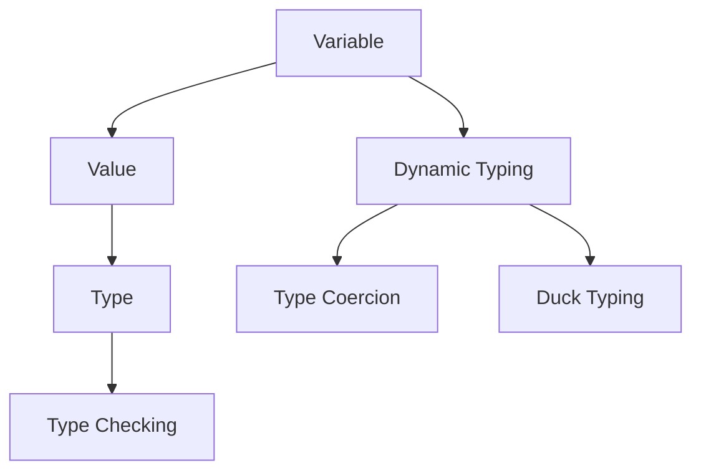

## 3.7 Lua's Type System and Dynamic Typing

Lua is a powerful, efficient, lightweight, embeddable scripting language. It is designed with a simple syntax and semantics, making it easy to learn and use. One of the core features of Lua is its dynamic typing system, which allows for flexibility and ease of use in programming. In this section, we will delve into Lua's type system and dynamic typing, exploring how it works, its benefits, and how to effectively use it in your Lua programs.

### Dynamic Typing in Lua

Dynamic typing is a characteristic of programming languages where variables do not have a fixed type. Instead, the type is associated with the value that the variable holds. This means that a variable can hold a value of any type at any time, and the type can change as the program executes.

#### Key Concepts of Dynamic Typing

- **Variables Don't Have Types, Values Do**: In Lua, variables are simply references to values, and it is the values that have types. This allows for great flexibility in programming, as you can assign different types of values to the same variable without any type declaration.

- **Type Checking**: Lua provides a built-in function `type()` that allows you to check the type of a value at runtime. This is useful for debugging and ensuring that your program behaves as expected.

- **Duck Typing**: Lua follows the principle of duck typing, where the type of a value is determined by its behavior rather than its explicit declaration. If a value behaves like a certain type, it is treated as that type.

- **Type Coercion**: Lua automatically converts values between types when necessary, such as in arithmetic operations or string concatenation. This is known as type coercion and can simplify code by reducing the need for explicit conversions.

### Exploring Lua's Type System

Lua's type system is simple and consists of a few basic types. Understanding these types is crucial for effective programming in Lua.

#### Basic Types in Lua

1. **Nil**: Represents the absence of a value. It is the default value of uninitialized variables.
2. **Boolean**: Represents true or false values.
3. **Number**: Represents numeric values. Lua uses double-precision floating-point numbers.
4. **String**: Represents sequences of characters.
5. **Table**: Lua's primary data structure, used for arrays, dictionaries, and more.
6. **Function**: Represents executable code blocks.
7. **Userdata**: Represents arbitrary C data.
8. **Thread**: Represents independent threads of execution.
9. **Light Userdata**: Similar to userdata but represents a pointer to a C object.

#### Using the `type()` Function

The `type()` function is a simple yet powerful tool for checking the type of a value. Here's how you can use it:

```lua
local a = 10
print(type(a))  -- Output: number

local b = "Hello, Lua!"
print(type(b))  -- Output: string

local c = true
print(type(c))  -- Output: boolean

local d = nil
print(type(d))  -- Output: nil

local e = {}
print(type(e))  -- Output: table

local f = function() end
print(type(f))  -- Output: function
```

### Embracing Duck Typing

Duck typing is a concept that emphasizes the behavior of a value over its explicit type. In Lua, this means that if a value behaves like a certain type, it is treated as that type. This allows for more flexible and dynamic code.

#### Example of Duck Typing

Consider the following example where we define a function that accepts any value that behaves like a table:

```lua
function printTable(t)
    for key, value in pairs(t) do
        print(key, value)
    end
end

local myTable = {name = "Lua", version = 5.4}
printTable(myTable)  -- Works because myTable behaves like a table

local myObject = setmetatable({}, {
    __index = function(_, key)
        return "Value for " .. key
    end
})
printTable(myObject)  -- Works because myObject behaves like a table
```

In this example, `printTable` works with both `myTable` and `myObject` because they both behave like tables, even though `myObject` is not explicitly defined as a table.

### Understanding Type Coercion

Type coercion is the automatic conversion of values between types. Lua performs type coercion in certain situations to simplify code and reduce the need for explicit conversions.

#### Examples of Type Coercion

1. **Arithmetic Operations**: Lua automatically converts strings to numbers when performing arithmetic operations.

```lua
local result = "10" + 5
print(result)  -- Output: 15
```

2. **String Concatenation**: Lua converts numbers to strings when concatenating with the `..` operator.

```lua
local message = "The answer is " .. 42
print(message)  -- Output: The answer is 42
```

3. **Boolean Contexts**: In Lua, only `nil` and `false` are considered false in boolean contexts. All other values are considered true, including `0` and empty strings.

```lua
if 0 then
    print("0 is true")  -- Output: 0 is true
end

if "" then
    print("Empty string is true")  -- Output: Empty string is true
end
```

### Visualizing Lua's Type System

To better understand Lua's type system and dynamic typing, let's visualize the relationships between variables, values, and types.



**Diagram Description**: This diagram illustrates the relationship between variables, values, and types in Lua's dynamic typing system. Variables reference values, which have types. Dynamic typing allows for type coercion and duck typing, and type checking can be performed using the `type()` function.

### Best Practices for Using Lua's Type System

- **Embrace Flexibility**: Take advantage of Lua's dynamic typing to write flexible and adaptable code.
- **Use Type Checking Wisely**: Use the `type()` function to ensure that your code behaves as expected, especially when dealing with external input.
- **Avoid Over-Reliance on Type Coercion**: While type coercion can simplify code, it can also lead to unexpected behavior. Be mindful of when and how it occurs.
- **Leverage Duck Typing**: Design functions and modules that work with any value that behaves like the expected type, rather than requiring explicit types.

### Try It Yourself

Experiment with Lua's type system and dynamic typing by modifying the code examples provided. Try creating your own functions that utilize duck typing and explore how type coercion affects your code.

### Knowledge Check

- What is dynamic typing, and how does it differ from static typing?
- How does Lua's `type()` function work, and when should you use it?
- What is duck typing, and how can it be beneficial in Lua programming?
- How does type coercion work in Lua, and what are some common scenarios where it occurs?

### Embrace the Journey

Remember, understanding Lua's type system and dynamic typing is just the beginning. As you continue to explore Lua, you'll discover more advanced concepts and techniques that will enhance your programming skills. Keep experimenting, stay curious, and enjoy the journey!

## Quiz Time!



### What is dynamic typing in Lua?

- [x] Variables don't have types, but values do.
- [ ] Variables have fixed types.
- [ ] Values don't have types.
- [ ] Lua doesn't support dynamic typing.

> **Explanation:** In Lua, dynamic typing means that variables don't have types, but the values they hold do.

### How can you check the type of a value in Lua?

- [x] Using the `type()` function.
- [ ] Using the `typeof()` function.
- [ ] Using the `checkType()` function.
- [ ] Using the `getType()` function.

> **Explanation:** The `type()` function is used in Lua to check the type of a value.

### What does duck typing emphasize?

- [x] Behavior over type names.
- [ ] Type names over behavior.
- [ ] Static typing.
- [ ] Type safety.

> **Explanation:** Duck typing emphasizes the behavior of a value rather than its explicit type name.

### What is type coercion in Lua?

- [x] Automatic conversion between types in expressions.
- [ ] Manual conversion between types.
- [ ] Preventing type conversion.
- [ ] Static type checking.

> **Explanation:** Type coercion in Lua refers to the automatic conversion between types in expressions.

### Which of the following is considered false in Lua's boolean context?

- [x] `nil`
- [ ] `0`
- [ ] `""` (empty string)
- [ ] `false`

> **Explanation:** In Lua, only `nil` and `false` are considered false in boolean contexts.

### What type does the `type()` function return for a table?

- [x] "table"
- [ ] "object"
- [ ] "array"
- [ ] "list"

> **Explanation:** The `type()` function returns "table" for table values in Lua.

### Which of the following is a basic type in Lua?

- [x] Number
- [ ] Integer
- [ ] Character
- [ ] Byte

> **Explanation:** "Number" is a basic type in Lua, representing numeric values.

### What is the default value of uninitialized variables in Lua?

- [x] `nil`
- [ ] `0`
- [ ] `false`
- [ ] `undefined`

> **Explanation:** In Lua, the default value of uninitialized variables is `nil`.

### How does Lua handle string concatenation with numbers?

- [x] Converts numbers to strings.
- [ ] Converts strings to numbers.
- [ ] Throws an error.
- [ ] Ignores the operation.

> **Explanation:** Lua converts numbers to strings when performing string concatenation.

### True or False: In Lua, a variable can change its type during execution.

- [x] True
- [ ] False

> **Explanation:** In Lua, due to dynamic typing, a variable can hold values of different types during execution.


