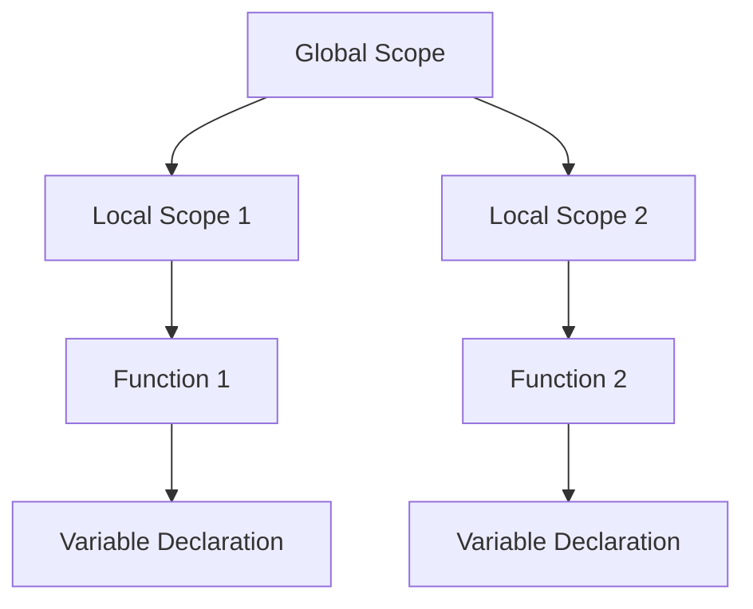

## 3.8 Best Practices for Lua Coding Style

In the world of software development, writing code that is not only functional but also clean and maintainable is crucial. Lua, known for its simplicity and flexibility, allows developers to express their ideas with minimal syntax. However, this flexibility can sometimes lead to inconsistencies and readability issues if not handled with care. In this section, we will explore best practices for Lua coding style, focusing on naming conventions, indentation, commenting, and avoiding global variables. By adhering to these practices, you can ensure that your Lua code is both efficient and easy to understand.

### Naming Conventions

Naming conventions are essential for creating readable and maintainable code. They help convey the purpose of variables, functions, and other identifiers, making it easier for others (and yourself) to understand the code.

#### Variable Names

- **Use Descriptive Names**: Choose names that clearly describe the purpose of the variable. For example, use `totalScore` instead of `ts`.

- **CamelCase for Local Variables**: Use camelCase for local variables to distinguish them from global variables. For example, `playerScore`.

- **Uppercase for Constants**: Use uppercase letters for constants to indicate that their values should not change. For example, `MAX_PLAYERS`.

- **Avoid Single-Letter Names**: Except for loop counters, avoid using single-letter variable names as they do not convey meaningful information.

```lua
-- Bad Example
local a = 10
local b = 20

-- Good Example
local playerScore = 10
local maxScore = 20
```

#### Function Names

- **Use Verb-Noun Pairs**: Function names should be verb-noun pairs that describe the action and the object. For example, `calculateTotal`.

- **Consistent Naming Scheme**: Use a consistent naming scheme throughout your codebase. For example, if you start with camelCase, continue using it for all function names.

- **Avoid Abbreviations**: Avoid using abbreviations unless they are widely recognized. For example, use `initializeGame` instead of `initGame`.

```lua
-- Bad Example
function calc()
    -- function body
end

-- Good Example
function calculateTotalScore()
    -- function body
end
```

### Indentation and Formatting

Consistent indentation and formatting are crucial for enhancing code readability. They help in visually structuring the code, making it easier to follow.

#### Indentation

- **Use Spaces or Tabs Consistently**: Choose either spaces or tabs for indentation and stick to it throughout the codebase. A common practice is to use 4 spaces per indentation level.

- **Indent Code Blocks**: Indent code blocks within control structures (e.g., `if`, `for`, `while`) to clearly delineate the scope.

```lua
-- Bad Example
if condition then
doSomething()
end

-- Good Example
if condition then
    doSomething()
end
```

#### Line Length

- **Limit Line Length**: Keep line lengths to a maximum of 80-100 characters to ensure readability across different devices and editors.

#### Blank Lines

- **Use Blank Lines Sparingly**: Use blank lines to separate logical sections of code, but avoid excessive use that can lead to fragmented code.

```lua
-- Good Example
function calculateTotalScore()
    local total = 0

    for i = 1, 10 do
        total = total + i
    end

    return total
end
```

### Commenting

Comments are an essential part of code documentation. They provide context and explanations for complex logic, making the code easier to understand and maintain.

#### Effective Use of Comments

- **Explain Why, Not What**: Focus on explaining why a particular piece of code exists rather than what it does, as the code itself should be self-explanatory.

- **Use Comments Sparingly**: Avoid over-commenting, which can clutter the code. Instead, write clear and self-explanatory code that requires minimal comments.

- **Update Comments**: Ensure comments are updated when the code changes to prevent them from becoming misleading.

```lua
-- Bad Example
-- Increment i by 1
i = i + 1

-- Good Example
-- Increment the counter to move to the next player
i = i + 1
```

#### Documentation Strings

- **Use Documentation Strings for Functions**: Provide a brief description of the function's purpose, parameters, and return values using documentation strings.

```lua
--[[
    Calculates the total score for a player.
    @param scores: A table containing individual scores.
    @return: The total score.
]]
function calculateTotalScore(scores)
    local total = 0
    for _, score in ipairs(scores) do
        total = total + score
    end
    return total
end
```

### Avoiding Globals

Global variables can lead to unintended side effects and make the code difficult to debug and maintain. It is best to minimize their use.

#### Techniques to Minimize Globals

- **Use Local Variables**: Declare variables as local whenever possible to limit their scope and prevent accidental overwrites.

```lua
-- Bad Example
playerScore = 100

-- Good Example
local playerScore = 100
```

- **Encapsulate Code in Functions**: Encapsulate code within functions to create local scopes and avoid polluting the global namespace.

```lua
-- Good Example
local function calculateScore()
    local score = 0
    -- calculation logic
    return score
end
```

- **Use Modules**: Organize code into modules to encapsulate functionality and expose only necessary parts to the global scope.

```lua
-- mymodule.lua
local M = {}

function M.calculateScore()
    local score = 0
    -- calculation logic
    return score
end

return M
```

- **Avoid Implicit Globals**: Always declare variables with `local` to avoid creating implicit global variables.

```lua
-- Bad Example
function calculate()
    result = 0 -- Implicit global
end

-- Good Example
function calculate()
    local result = 0 -- Local variable
end
```

### Try It Yourself

To solidify your understanding of Lua coding style best practices, try modifying the following code snippet to adhere to the guidelines discussed:

```lua
-- Original Code
function calc()
    a = 10
    b = 20
    return a + b
end

-- Modified Code
-- Try to apply best practices here
```

### Visualizing Lua Code Structure

To better understand how Lua code is structured, let's visualize the scope and flow of a Lua script using a Mermaid.js diagram.



**Diagram Description**: This diagram illustrates the hierarchical structure of scopes in a Lua script. The global scope contains two local scopes, each with its own functions and variable declarations.

### Key Takeaways

- **Consistent Naming**: Use descriptive and consistent naming conventions for variables and functions.
- **Readable Formatting**: Maintain consistent indentation and formatting for better readability.
- **Effective Commenting**: Use comments to explain the purpose and logic of the code, not just the mechanics.
- **Minimize Globals**: Use local variables and encapsulation to avoid global namespace pollution.

### Embrace the Journey

Remember, mastering coding style is a continuous journey. As you practice these best practices, you'll find your Lua code becoming more readable, maintainable, and efficient. Keep experimenting, stay curious, and enjoy the process of writing clean and elegant code!

## Quiz Time!



### What is the recommended naming convention for local variables in Lua?

- [x] CamelCase
- [ ] snake_case
- [ ] ALL_CAPS
- [ ] PascalCase

> **Explanation:** CamelCase is recommended for local variables to distinguish them from global variables.

### Why should you avoid using single-letter variable names?

- [x] They do not convey meaningful information.
- [ ] They are harder to type.
- [ ] They are not supported in Lua.
- [ ] They are reserved for loop counters.

> **Explanation:** Single-letter variable names do not convey meaningful information, making the code harder to understand.

### What is the purpose of using uppercase letters for constants?

- [x] To indicate that their values should not change.
- [ ] To make them stand out in the code.
- [ ] To follow Lua's syntax rules.
- [ ] To avoid conflicts with function names.

> **Explanation:** Uppercase letters are used for constants to indicate that their values should not change.

### What is the recommended indentation level in Lua?

- [x] 4 spaces
- [ ] 2 spaces
- [ ] 1 tab
- [ ] 8 spaces

> **Explanation:** 4 spaces per indentation level is a common practice for readability.

### How should you document a function in Lua?

- [x] Use documentation strings to describe its purpose, parameters, and return values.
- [ ] Use single-line comments for each line of code.
- [ ] Use uppercase letters for function names.
- [ ] Avoid comments to keep the code clean.

> **Explanation:** Documentation strings provide a clear description of a function's purpose, parameters, and return values.

### What is a common technique to avoid global variables?

- [x] Use local variables
- [ ] Use uppercase variable names
- [ ] Use single-letter variable names
- [ ] Use global keyword

> **Explanation:** Declaring variables as local limits their scope and prevents accidental overwrites.

### Why should you encapsulate code in functions?

- [x] To create local scopes and avoid polluting the global namespace.
- [ ] To make the code longer.
- [ ] To increase the number of global variables.
- [ ] To make the code harder to understand.

> **Explanation:** Encapsulating code in functions creates local scopes and avoids polluting the global namespace.

### What is the purpose of using modules in Lua?

- [x] To organize code and encapsulate functionality.
- [ ] To increase the number of global variables.
- [ ] To make the code harder to understand.
- [ ] To avoid using functions.

> **Explanation:** Modules help organize code and encapsulate functionality, exposing only necessary parts to the global scope.

### What should you focus on when writing comments?

- [x] Explaining why a particular piece of code exists.
- [ ] Describing every single line of code.
- [ ] Using as many comments as possible.
- [ ] Avoiding comments to keep the code clean.

> **Explanation:** Comments should focus on explaining why a particular piece of code exists, as the code itself should be self-explanatory.

### True or False: It is acceptable to have implicit global variables in Lua.

- [ ] True
- [x] False

> **Explanation:** Implicit global variables can lead to unintended side effects and should be avoided by declaring variables with `local`.


