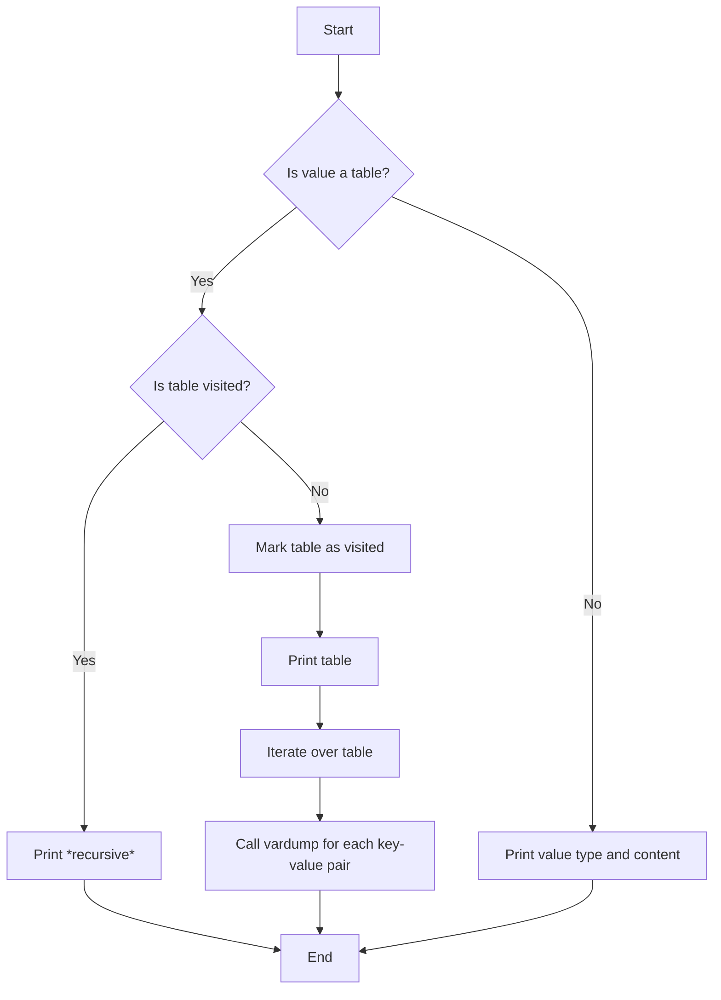

## 3.9 `vardump`: The Power of Seeing What's Behind

In the world of software development, debugging is an essential skill that every developer must master. In Lua, a dynamic and flexible language, understanding the contents of variables, especially complex tables, can be challenging. This is where the `vardump` function comes into play. It serves as a powerful tool for inspecting variables, providing insights into their structure and contents. In this section, we will explore how to implement and use `vardump` effectively to enhance your debugging capabilities.

### Inspecting Variables: Implementing a `vardump` Function

The `vardump` function is a custom utility that allows developers to print the contents of a variable in a readable format. This is particularly useful when dealing with tables, Lua's primary data structure, which can contain nested tables and various data types.

#### Implementing `vardump`

Let's start by implementing a basic version of the `vardump` function. This function will take a variable as input and print its contents, including nested tables.

```lua
function vardump(value, depth, key)
    local linePrefix = ""
    local spaces = ""

    if key ~= nil then
        linePrefix = "[" .. key .. "] = "
    end

    if depth == nil then
        depth = 0
    else
        depth = depth + 1
    end

    for i = 1, depth do
        spaces = spaces .. "  "
    end

    if type(value) == "table" then
        mtable = getmetatable(value)
        if mtable == nil then
            print(spaces .. linePrefix .. "(table) ")
        else
            print(spaces .. "(metatable) ")
            value = mtable
        end
        for tableKey, tableValue in pairs(value) do
            vardump(tableValue, depth, tableKey)
        end
    elseif type(value) == "function" or 
           type(value) == "thread" or 
           type(value) == "userdata" then
        print(spaces .. linePrefix .. tostring(value))
    else
        print(spaces .. linePrefix .. "(" .. type(value) .. ") " .. tostring(value))
    end
end
```

**Explanation:**

- **Parameters**: The function takes three parameters: `value` (the variable to inspect), `depth` (the current depth of recursion), and `key` (the key associated with the value in a table).
- **Indentation**: The `spaces` variable is used to create indentation based on the depth of recursion, making the output more readable.
- **Type Checking**: The function checks the type of the variable. If it's a table, it recursively calls `vardump` on each key-value pair.
- **Metatables**: If a table has a metatable, it prints `(metatable)` and inspects the metatable instead.

### Debugging Aid: Using `vardump` to Understand Complex Tables and Structures

The `vardump` function is invaluable when debugging complex data structures. It allows you to visualize the contents of tables, including nested tables, in a structured format. This can help identify issues such as incorrect data types, unexpected values, or missing keys.

#### Example: Debugging a Nested Table

Consider a scenario where you have a nested table representing a configuration for a game:

```lua
local gameConfig = {
    player = {
        name = "Hero",
        level = 5,
        stats = {
            health = 100,
            mana = 50,
            strength = 10
        }
    },
    settings = {
        difficulty = "hard",
        sound = true
    }
}

vardump(gameConfig)
```

**Output:**

```
(table) 
  [player] = (table) 
    [name] = (string) Hero
    [level] = (number) 5
    [stats] = (table) 
      [health] = (number) 100
      [mana] = (number) 50
      [strength] = (number) 10
  [settings] = (table) 
    [difficulty] = (string) hard
    [sound] = (boolean) true
```

**Explanation:**

- The `vardump` function recursively prints each level of the table, providing a clear view of the structure and contents.
- This output helps you verify that the configuration is set up correctly and can quickly identify any discrepancies.

### Recursive Dumping: Handling Nested Tables and Avoiding Infinite Loops

When dealing with deeply nested tables, recursion is necessary to explore all levels. However, care must be taken to avoid infinite loops, especially when tables reference themselves.

#### Avoiding Infinite Loops

To prevent infinite loops, we can enhance the `vardump` function by keeping track of tables that have already been visited. This can be done using a table to store references to visited tables.

```lua
function vardump(value, depth, key, visited)
    local linePrefix = ""
    local spaces = ""

    if key ~= nil then
        linePrefix = "[" .. key .. "] = "
    end

    if depth == nil then
        depth = 0
    else
        depth = depth + 1
    end

    if visited == nil then
        visited = {}
    end

    for i = 1, depth do
        spaces = spaces .. "  "
    end

    if type(value) == "table" then
        if visited[value] then
            print(spaces .. linePrefix .. "(table) *recursive*")
            return
        end
        visited[value] = true
        mtable = getmetatable(value)
        if mtable == nil then
            print(spaces .. linePrefix .. "(table) ")
        else
            print(spaces .. "(metatable) ")
            value = mtable
        end
        for tableKey, tableValue in pairs(value) do
            vardump(tableValue, depth, tableKey, visited)
        end
    elseif type(value) == "function" or 
           type(value) == "thread" or 
           type(value) == "userdata" then
        print(spaces .. linePrefix .. tostring(value))
    else
        print(spaces .. linePrefix .. "(" .. type(value) .. ") " .. tostring(value))
    end
end
```

**Explanation:**

- **Visited Table**: A `visited` table is used to track tables that have already been processed. If a table is encountered again, it prints `*recursive*` to indicate a recursive reference.
- **Prevention**: This enhancement prevents infinite loops and provides a clear indication of recursive structures.

### Practical Usage: Examples Where `vardump` Simplifies Debugging

The `vardump` function is versatile and can be used in various scenarios to simplify debugging and provide insights into data structures.

#### Example 1: Debugging API Responses

When working with APIs, responses are often returned as JSON objects, which can be converted to Lua tables. Using `vardump`, you can inspect the structure of these tables to ensure the data is as expected.

```lua
local jsonResponse = {
    status = "success",
    data = {
        user = {
            id = 123,
            name = "Alice",
            email = "alice@example.com"
        },
        posts = {
            { id = 1, title = "Hello World" },
            { id = 2, title = "Lua Rocks" }
        }
    }
}

vardump(jsonResponse)
```

**Output:**

```
(table) 
  [status] = (string) success
  [data] = (table) 
    [user] = (table) 
      [id] = (number) 123
      [name] = (string) Alice
      [email] = (string) alice@example.com
    [posts] = (table) 
      [1] = (table) 
        [id] = (number) 1
        [title] = (string) Hello World
      [2] = (table) 
        [id] = (number) 2
        [title] = (string) Lua Rocks
```

**Explanation:**

- The `vardump` function provides a clear view of the API response, making it easier to verify the data structure and contents.

#### Example 2: Debugging Configuration Files

Configuration files are often loaded into Lua tables. Using `vardump`, you can inspect these tables to ensure the configuration is correct.

```lua
local config = {
    database = {
        host = "localhost",
        port = 3306,
        username = "root",
        password = "password"
    },
    logging = {
        level = "info",
        file = "/var/log/app.log"
    }
}

vardump(config)
```

**Output:**

```
(table) 
  [database] = (table) 
    [host] = (string) localhost
    [port] = (number) 3306
    [username] = (string) root
    [password] = (string) password
  [logging] = (table) 
    [level] = (string) info
    [file] = (string) /var/log/app.log
```

**Explanation:**

- The `vardump` function helps verify the configuration structure and values, ensuring they match the expected format.

### Try It Yourself

To fully grasp the power of `vardump`, try modifying the code examples provided. Experiment with different data structures, add more nested tables, or introduce recursive references. Observe how `vardump` handles these scenarios and how it aids in debugging.

### Visualizing `vardump` Functionality

To better understand how the `vardump` function works, let's visualize the process using a flowchart.



**Description:**

- The flowchart illustrates the decision-making process within the `vardump` function.
- It shows how the function handles tables, checks for recursion, and prints values.

### References and Links

For further reading on Lua and debugging techniques, consider the following resources:

- [Lua 5.1 Reference Manual](https://www.lua.org/manual/5.1/)
- [Programming in Lua](https://www.lua.org/pil/)
- [Lua Users Wiki](http://lua-users.org/wiki/)

### Knowledge Check

To reinforce your understanding of the `vardump` function and its applications, consider the following questions:

1. What is the primary purpose of the `vardump` function in Lua?
2. How does the `vardump` function handle recursive tables?
3. Why is it important to track visited tables in the `vardump` function?
4. How can `vardump` be used to debug API responses?
5. What are some practical scenarios where `vardump` can simplify debugging?

### Embrace the Journey

Remember, mastering debugging is a journey. The `vardump` function is just one tool in your arsenal. As you continue to explore Lua and its capabilities, you'll discover more techniques and strategies to enhance your debugging skills. Keep experimenting, stay curious, and enjoy the journey!

## Quiz Time!



### What is the primary purpose of the `vardump` function in Lua?

- [x] To inspect and print the contents of variables, especially tables
- [ ] To execute Lua scripts
- [ ] To compile Lua code
- [ ] To manage memory allocation

> **Explanation:** The `vardump` function is used to inspect and print the contents of variables, providing insights into their structure and contents, which is especially useful for debugging tables.

### How does the `vardump` function handle recursive tables?

- [x] It tracks visited tables to avoid infinite loops
- [ ] It ignores recursive tables
- [ ] It crashes the program
- [ ] It prints only the first level of the table

> **Explanation:** The `vardump` function uses a visited table to track tables that have already been processed, preventing infinite loops and indicating recursive references.

### Why is it important to track visited tables in the `vardump` function?

- [x] To prevent infinite loops when inspecting recursive tables
- [ ] To improve performance
- [ ] To reduce memory usage
- [ ] To enhance security

> **Explanation:** Tracking visited tables is crucial to prevent infinite loops when a table references itself, ensuring the `vardump` function can handle recursive structures safely.

### How can `vardump` be used to debug API responses?

- [x] By inspecting the structure and contents of the response tables
- [ ] By sending requests to the API
- [ ] By modifying API endpoints
- [ ] By encrypting API data

> **Explanation:** `vardump` can be used to inspect the structure and contents of API response tables, helping verify that the data is as expected and aiding in debugging.

### What are some practical scenarios where `vardump` can simplify debugging?

- [x] Debugging configuration files
- [x] Inspecting API responses
- [ ] Compiling Lua code
- [ ] Managing memory allocation

> **Explanation:** `vardump` is useful in scenarios like debugging configuration files and inspecting API responses, where understanding the structure and contents of tables is crucial.

### What is the role of indentation in the `vardump` function?

- [x] To make the output more readable by indicating the depth of nested tables
- [ ] To execute Lua scripts
- [ ] To compile Lua code
- [ ] To manage memory allocation

> **Explanation:** Indentation in the `vardump` function helps make the output more readable by indicating the depth of nested tables, providing a clear view of the data structure.

### What does the `vardump` function print for a table with a metatable?

- [x] It prints "(metatable)" and inspects the metatable
- [ ] It ignores the metatable
- [ ] It crashes the program
- [ ] It prints only the first level of the table

> **Explanation:** For a table with a metatable, the `vardump` function prints "(metatable)" and inspects the metatable, providing insights into the table's behavior.

### How can you modify the `vardump` function to handle more complex data types?

- [x] By adding additional type checks and handling logic
- [ ] By reducing the number of parameters
- [ ] By removing recursion
- [ ] By ignoring complex data types

> **Explanation:** To handle more complex data types, you can modify the `vardump` function by adding additional type checks and handling logic, ensuring it can process various data structures.

### What is the benefit of using `vardump` in Lua development?

- [x] It aids in debugging by providing insights into variable contents
- [ ] It compiles Lua code
- [ ] It manages memory allocation
- [ ] It encrypts data

> **Explanation:** The primary benefit of using `vardump` in Lua development is that it aids in debugging by providing insights into variable contents, especially for complex tables.

### True or False: The `vardump` function can only be used with tables.

- [ ] True
- [x] False

> **Explanation:** False. The `vardump` function can be used with various data types, not just tables. It inspects and prints the contents of any variable, providing insights into its structure and contents.


