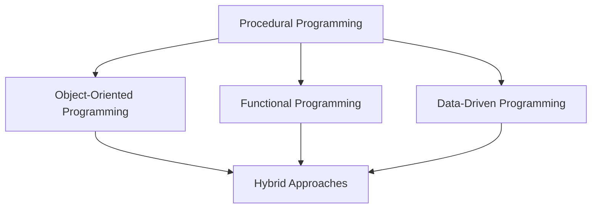

## 4.1 Programming Paradigms in Lua

Lua is a versatile and powerful scripting language that supports multiple programming paradigms, making it an excellent choice for a wide range of applications. In this section, we will explore the various paradigms Lua supports, including procedural, object-oriented, functional, and data-driven programming. We will also provide guidelines for selecting the appropriate paradigm for your project and discuss how to combine paradigms for optimal solutions.

### Multi-Paradigm Language

Lua's flexibility as a multi-paradigm language allows developers to choose the most suitable programming style for their needs. This adaptability is one of Lua's greatest strengths, enabling it to be used in diverse domains such as game development, web applications, and embedded systems.

#### Procedural Programming

Procedural programming is one of the most straightforward paradigms and is often the first style learned by new programmers. It involves writing sequences of instructions that operate on data, typically using functions to encapsulate code blocks.

**Key Concepts:**
- **Functions**: Encapsulate reusable code blocks.
- **Control Structures**: Use loops and conditionals to control the flow of execution.
- **State Management**: Maintain and manipulate program state through variables.

**Example:**

```lua
-- Define a function to calculate the factorial of a number
function factorial(n)
    if n == 0 then
        return 1
    else
        return n * factorial(n - 1)
    end
end

-- Calculate and print the factorial of 5
print(factorial(5))  -- Output: 120
```

In this example, we define a recursive function `factorial` to demonstrate procedural programming in Lua.

#### Object-Oriented Programming (OOP)

Lua supports object-oriented programming, allowing developers to create objects that encapsulate data and behavior. Lua's approach to OOP is flexible and can be implemented using tables and metatables.

**Key Concepts:**
- **Tables**: Use tables to represent objects.
- **Metatables**: Define behavior for tables, such as inheritance.
- **Encapsulation**: Group related data and functions into objects.

**Example:**

```lua
-- Define a class-like table
Account = {balance = 0}

-- Define a method to deposit money
function Account:deposit(amount)
    self.balance = self.balance + amount
end

-- Define a method to withdraw money
function Account:withdraw(amount)
    if amount <= self.balance then
        self.balance = self.balance - amount
    else
        print("Insufficient funds")
    end
end

-- Create an instance of Account
local myAccount = {balance = 100}
setmetatable(myAccount, {__index = Account})

-- Use the methods
myAccount:deposit(50)
print(myAccount.balance)  -- Output: 150
myAccount:withdraw(30)
print(myAccount.balance)  -- Output: 120
```

In this example, we demonstrate how to use tables and metatables to implement a simple object-oriented structure in Lua.

#### Functional Programming

Functional programming is a paradigm that treats computation as the evaluation of mathematical functions and avoids changing state or mutable data. Lua supports functional programming through first-class functions and closures.

**Key Concepts:**
- **First-Class Functions**: Treat functions as first-class citizens.
- **Higher-Order Functions**: Pass functions as arguments and return them as results.
- **Closures**: Capture and remember the environment in which they were created.

**Example:**

```lua
-- Define a higher-order function that applies a function to each element of a table
function map(tbl, func)
    local result = {}
    for i, v in ipairs(tbl) do
        result[i] = func(v)
    end
    return result
end

-- Define a function to square a number
function square(x)
    return x * x
end

-- Use the map function to apply square to each element
local numbers = {1, 2, 3, 4, 5}
local squares = map(numbers, square)

-- Print the result
for i, v in ipairs(squares) do
    print(v)  -- Output: 1, 4, 9, 16, 25
end
```

This example illustrates the use of higher-order functions and closures in Lua.

#### Data-Driven Programming

Data-driven programming focuses on defining the behavior of a program through data rather than code. Lua's dynamic nature and flexible data structures make it well-suited for data-driven approaches.

**Key Concepts:**
- **Configuration Files**: Use data files to configure application behavior.
- **Dynamic Behavior**: Modify program behavior at runtime based on data.
- **Separation of Concerns**: Separate data from logic to improve maintainability.

**Example:**

```lua
-- Define a configuration table
local config = {
    window = {width = 800, height = 600},
    title = "My Application",
    fullscreen = false
}

-- Use the configuration to set up the application
function setupApplication(cfg)
    print("Setting up application with title: " .. cfg.title)
    print("Window size: " .. cfg.window.width .. "x" .. cfg.window.height)
    if cfg.fullscreen then
        print("Running in fullscreen mode")
    else
        print("Running in windowed mode")
    end
end

-- Apply the configuration
setupApplication(config)
```

In this example, we use a configuration table to drive the setup of an application, demonstrating a data-driven approach.

### Choosing the Right Paradigm

Selecting the appropriate programming paradigm depends on the specific requirements and constraints of your project. Here are some guidelines to help you choose:

- **Procedural Programming**: Use when the problem is straightforward and can be solved with a sequence of steps.
- **Object-Oriented Programming**: Choose when you need to model complex systems with interacting objects.
- **Functional Programming**: Opt for when you want to leverage immutability and higher-order functions to simplify code.
- **Data-Driven Programming**: Use when you need to separate data from logic and allow for dynamic behavior changes.

### Hybrid Approaches

In many cases, combining paradigms can lead to more robust and flexible solutions. Lua's support for multiple paradigms allows you to mix and match styles as needed.

**Example:**

```lua
-- Define a class-like table with functional methods
Shape = {area = 0}

function Shape:new(o, side)
    o = o or {}
    setmetatable(o, self)
    self.__index = self
    self.side = side or 0
    return o
end

function Shape:calculateArea()
    return self.side * self.side
end

-- Define a higher-order function to apply a method to a list of shapes
function applyToShapes(shapes, method)
    for _, shape in ipairs(shapes) do
        print(method(shape))
    end
end

-- Create instances of Shape
local square1 = Shape:new(nil, 4)
local square2 = Shape:new(nil, 5)

-- Use the higher-order function
applyToShapes({square1, square2}, Shape.calculateArea)
```

This example demonstrates a hybrid approach, combining object-oriented and functional programming paradigms.

### Visualizing Programming Paradigms

To better understand the relationships and interactions between different programming paradigms in Lua, let's visualize them using a diagram.



**Diagram Description:** This diagram illustrates how procedural programming serves as a foundation for other paradigms, which can be combined into hybrid approaches for more complex solutions.

### References and Links

- [Lua Official Documentation](https://www.lua.org/manual/5.4/)
- [Programming in Lua](https://www.lua.org/pil/contents.html)
- [Functional Programming in Lua](https://www.lua.org/pil/6.1.html)

### Knowledge Check

- What are the key concepts of procedural programming in Lua?
- How can you implement object-oriented programming using tables and metatables?
- What are higher-order functions, and how are they used in functional programming?
- How does data-driven programming separate data from logic?
- When should you choose a hybrid approach to programming in Lua?

### Embrace the Journey

Remember, this is just the beginning. As you progress, you'll discover more ways to leverage Lua's flexibility and power. Keep experimenting, stay curious, and enjoy the journey!

## Quiz Time!



### What is a key concept of procedural programming in Lua?

- [x] Functions
- [ ] Classes
- [ ] Closures
- [ ] Metatables

> **Explanation:** Functions are a fundamental concept in procedural programming, encapsulating reusable code blocks.

### How can you implement object-oriented programming in Lua?

- [x] Using tables and metatables
- [ ] Using classes and inheritance
- [ ] Using closures and functions
- [ ] Using configuration files

> **Explanation:** Lua implements object-oriented programming using tables to represent objects and metatables to define behavior.

### What is a higher-order function?

- [x] A function that takes other functions as arguments or returns them as results
- [ ] A function that operates on numbers
- [ ] A function that modifies global variables
- [ ] A function that reads from files

> **Explanation:** Higher-order functions can take other functions as arguments or return them as results, enabling functional programming techniques.

### What is the main advantage of data-driven programming?

- [x] Separation of data from logic
- [ ] Faster execution speed
- [ ] Easier debugging
- [ ] More complex code

> **Explanation:** Data-driven programming separates data from logic, allowing for dynamic behavior changes and improved maintainability.

### When should you choose a hybrid approach in Lua?

- [x] When combining paradigms leads to more robust solutions
- [ ] When procedural programming is sufficient
- [ ] When object-oriented programming is not needed
- [ ] When functional programming is not applicable

> **Explanation:** A hybrid approach is beneficial when combining paradigms results in more flexible and robust solutions.

### What is a closure in Lua?

- [x] A function that captures and remembers the environment in which it was created
- [ ] A function that operates on strings
- [ ] A function that modifies tables
- [ ] A function that reads from files

> **Explanation:** Closures capture and remember the environment in which they were created, allowing them to maintain state across calls.

### What is the purpose of metatables in Lua?

- [x] To define behavior for tables, such as inheritance
- [ ] To store global variables
- [ ] To read from configuration files
- [ ] To perform mathematical operations

> **Explanation:** Metatables define behavior for tables, enabling object-oriented programming features like inheritance.

### What is a common use case for functional programming in Lua?

- [x] Simplifying code with immutability and higher-order functions
- [ ] Modeling complex systems with interacting objects
- [ ] Configuring application behavior through data files
- [ ] Writing sequences of instructions that operate on data

> **Explanation:** Functional programming simplifies code by leveraging immutability and higher-order functions.

### What is the role of configuration files in data-driven programming?

- [x] To define the behavior of a program through data
- [ ] To encapsulate reusable code blocks
- [ ] To model complex systems with objects
- [ ] To perform mathematical calculations

> **Explanation:** Configuration files define the behavior of a program through data, allowing for dynamic changes without altering code.

### True or False: Lua supports only one programming paradigm.

- [ ] True
- [x] False

> **Explanation:** Lua is a multi-paradigm language, supporting procedural, object-oriented, functional, and data-driven programming.




