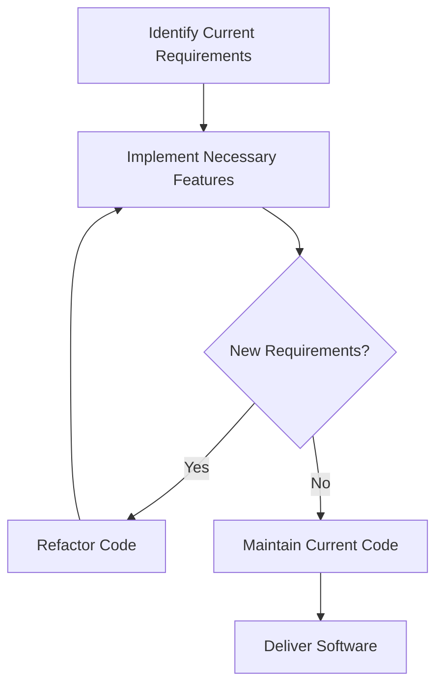

## 4.10 YAGNI (You Aren't Gonna Need It)

In the realm of software development, the YAGNI principle—short for "You Aren't Gonna Need It"—serves as a guiding beacon for developers striving to create efficient, maintainable, and agile codebases. This principle is particularly relevant in Lua programming, where simplicity and flexibility are key attributes. In this section, we will explore the YAGNI principle in depth, understand its implications in Lua design patterns, and learn how to apply it effectively to prevent feature creep and maintain focus on current needs.

### Understanding YAGNI

YAGNI is a core tenet of agile software development that emphasizes the importance of not implementing features until they are absolutely necessary. The principle encourages developers to focus on the immediate requirements of a project rather than anticipating future needs that may never materialize. By adhering to YAGNI, developers can avoid unnecessary complexity, reduce development time, and improve the overall quality of the software.

#### Key Concepts of YAGNI

- **Preventing Feature Creep**: Feature creep occurs when additional features are continuously added to a project, often leading to increased complexity and reduced focus. YAGNI helps prevent this by ensuring that only essential features are implemented.
- **Agile Development Practices**: YAGNI aligns with agile methodologies, which prioritize delivering functional software quickly and iteratively. By focusing on current needs, developers can adapt to changing requirements more effectively.
- **Code Refactoring**: As requirements evolve, code may need to be adjusted or refactored. YAGNI supports this by encouraging developers to write simple, adaptable code that can be easily modified when necessary.

### Applying YAGNI in Lua

Lua, known for its lightweight and flexible nature, is an ideal language for applying the YAGNI principle. By leveraging Lua's features, developers can create efficient and maintainable codebases that adhere to YAGNI.

#### Example: Implementing a Simple Calculator

Let's consider a scenario where we need to implement a basic calculator in Lua. The initial requirement is to support addition and subtraction. Instead of anticipating future needs like multiplication or division, we will focus solely on the current requirements.

```lua
-- Simple Calculator in Lua
local Calculator = {}

function Calculator:add(a, b)
    return a + b
end

function Calculator:subtract(a, b)
    return a - b
end

-- Usage
local calc = Calculator
print(calc:add(5, 3))        -- Output: 8
print(calc:subtract(10, 4))  -- Output: 6
```

In this example, we have implemented only the necessary functions for addition and subtraction. By adhering to YAGNI, we avoid the complexity of implementing additional operations that are not currently required.

#### Refactoring as Needs Evolve

As the project evolves, new requirements may emerge. For instance, if multiplication and division become necessary, we can refactor the code to accommodate these changes without disrupting the existing functionality.

```lua
-- Extended Calculator in Lua
local Calculator = {}

function Calculator:add(a, b)
    return a + b
end

function Calculator:subtract(a, b)
    return a - b
end

function Calculator:multiply(a, b)
    return a * b
end

function Calculator:divide(a, b)
    if b == 0 then
        error("Division by zero is not allowed.")
    end
    return a / b
end

-- Usage
local calc = Calculator
print(calc:multiply(5, 3))   -- Output: 15
print(calc:divide(10, 2))    -- Output: 5
```

By refactoring the code to include multiplication and division, we maintain the simplicity and clarity of the original implementation while accommodating new requirements.

### Benefits of YAGNI in Lua Development

Applying the YAGNI principle in Lua development offers several benefits:

- **Reduced Complexity**: By avoiding unnecessary features, the codebase remains simple and easy to understand.
- **Improved Maintainability**: Simple code is easier to maintain and modify, reducing the likelihood of introducing bugs during changes.
- **Faster Development**: Focusing on current needs allows developers to deliver functional software more quickly.
- **Enhanced Flexibility**: Agile practices, supported by YAGNI, enable developers to adapt to changing requirements with minimal disruption.

### Visualizing YAGNI in Software Development

To better understand the impact of YAGNI on software development, let's visualize the process of feature implementation and refactoring using a flowchart.



**Figure 1: YAGNI in Software Development**  
This flowchart illustrates the YAGNI process, where developers focus on current requirements, implement necessary features, and refactor code as new requirements emerge.

### Challenges and Considerations

While YAGNI offers numerous benefits, it is important to consider potential challenges:

- **Balancing Simplicity and Future Needs**: Striking the right balance between simplicity and potential future needs can be challenging. Developers must carefully assess the likelihood of future requirements and weigh them against the benefits of simplicity.
- **Communication with Stakeholders**: Stakeholders may have differing opinions on what features are necessary. Clear communication and alignment with project goals are essential to ensure that YAGNI is applied effectively.
- **Avoiding Over-Refactoring**: While refactoring is a key aspect of YAGNI, excessive refactoring can lead to instability. Developers should refactor only when necessary and ensure that changes are thoroughly tested.

### Try It Yourself

To gain a deeper understanding of YAGNI, try modifying the calculator example to include additional operations, such as exponentiation or modulus. Consider the impact of these changes on the code's complexity and maintainability. Experiment with refactoring the code to accommodate new requirements while maintaining simplicity.

### Further Reading and Resources

For more information on YAGNI and agile development practices, consider exploring the following resources:

- [Agile Alliance: YAGNI](https://www.agilealliance.org/glossary/yagni/)
- [Martin Fowler's Refactoring](https://martinfowler.com/books/refactoring.html)
- [Clean Code: A Handbook of Agile Software Craftsmanship](https://www.oreilly.com/library/view/clean-code/9780136083238/)

### Knowledge Check

To reinforce your understanding of YAGNI, consider the following questions:

1. What is the primary goal of the YAGNI principle?
2. How does YAGNI help prevent feature creep?
3. Why is refactoring important in the context of YAGNI?
4. How can YAGNI be applied in Lua development?
5. What are some potential challenges of applying YAGNI?

### Embrace the Journey

Remember, mastering YAGNI is a journey. As you continue to develop your skills in Lua and software design, keep experimenting, stay curious, and enjoy the process. By applying YAGNI, you'll create more efficient, maintainable, and agile software that meets the needs of today while remaining adaptable for tomorrow.

## Quiz Time!



### What is the primary goal of the YAGNI principle?

- [x] To prevent unnecessary features and complexity
- [ ] To implement all possible features upfront
- [ ] To focus on future requirements
- [ ] To avoid refactoring

> **Explanation:** The primary goal of YAGNI is to prevent unnecessary features and complexity by focusing on current requirements.

### How does YAGNI help prevent feature creep?

- [x] By ensuring only essential features are implemented
- [ ] By adding features continuously
- [ ] By anticipating future needs
- [ ] By avoiding refactoring

> **Explanation:** YAGNI helps prevent feature creep by ensuring that only essential features are implemented, avoiding unnecessary additions.

### Why is refactoring important in the context of YAGNI?

- [x] It allows code to adapt to new requirements
- [ ] It adds complexity to the code
- [ ] It prevents code changes
- [ ] It focuses on future needs

> **Explanation:** Refactoring is important in YAGNI as it allows code to adapt to new requirements while maintaining simplicity.

### How can YAGNI be applied in Lua development?

- [x] By focusing on current needs and avoiding unnecessary features
- [ ] By implementing all possible features
- [ ] By anticipating future requirements
- [ ] By avoiding code changes

> **Explanation:** YAGNI can be applied in Lua development by focusing on current needs and avoiding unnecessary features.

### What are some potential challenges of applying YAGNI?

- [x] Balancing simplicity and future needs
- [x] Communication with stakeholders
- [ ] Implementing all features upfront
- [ ] Avoiding code changes

> **Explanation:** Challenges of applying YAGNI include balancing simplicity and future needs, and ensuring clear communication with stakeholders.

### What does YAGNI stand for?

- [x] You Aren't Gonna Need It
- [ ] You Always Gonna Need It
- [ ] You Aren't Gonna Implement It
- [ ] You Always Gonna Implement It

> **Explanation:** YAGNI stands for "You Aren't Gonna Need It," emphasizing the avoidance of unnecessary features.

### Which development methodology aligns with YAGNI?

- [x] Agile
- [ ] Waterfall
- [ ] Spiral
- [ ] V-Model

> **Explanation:** YAGNI aligns with agile methodologies, which prioritize delivering functional software quickly and iteratively.

### What is feature creep?

- [x] The continuous addition of unnecessary features
- [ ] The removal of essential features
- [ ] The focus on current requirements
- [ ] The avoidance of refactoring

> **Explanation:** Feature creep refers to the continuous addition of unnecessary features, leading to increased complexity.

### Why is simplicity important in software development?

- [x] It improves maintainability and reduces complexity
- [ ] It increases development time
- [ ] It adds unnecessary features
- [ ] It prevents code changes

> **Explanation:** Simplicity is important as it improves maintainability and reduces complexity, making the software easier to manage.

### True or False: YAGNI encourages implementing all features upfront.

- [ ] True
- [x] False

> **Explanation:** False. YAGNI discourages implementing all features upfront, focusing instead on current needs.




