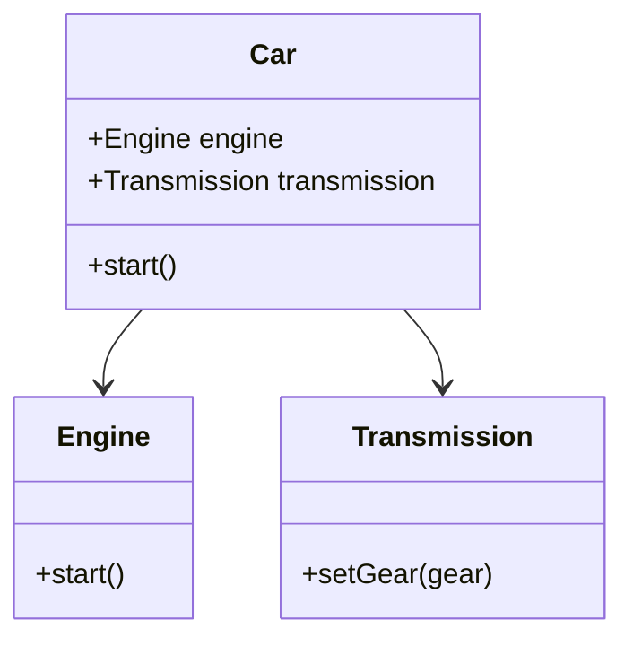

## 4.11 Law of Demeter in Lua

In the realm of software design, the Law of Demeter, also known as the Principle of Least Knowledge, is a fundamental guideline that promotes loose coupling and high cohesion within software systems. This principle is particularly relevant in Lua, a dynamic and flexible language, where maintaining clear boundaries between components can be challenging yet crucial for robust software architecture.

### Understanding the Law of Demeter

The Law of Demeter is a design guideline for developing software, particularly object-oriented programs. It suggests that a module should have limited knowledge about other modules. Specifically, a module should only interact with its immediate friends and not with the friends of its friends. This principle can be summarized as "talk only to your immediate friends."

#### Key Concepts of the Law of Demeter

1. **Encapsulation**: The principle encourages encapsulation by limiting the exposure of internal details of a module to other modules.
2. **Reduced Dependencies**: By minimizing the knowledge a module has about others, the system becomes less dependent on the internal workings of its components.
3. **Improved Maintainability**: Systems adhering to this principle are easier to maintain and extend because changes in one module have minimal impact on others.

### Implementing the Law of Demeter in Lua

Lua, being a dynamically typed language, offers both challenges and opportunities when it comes to implementing the Law of Demeter. The language's flexibility allows for creative solutions, but it also requires discipline to avoid excessive coupling.

#### Techniques to Adhere to the Law of Demeter in Lua

1. **Use of Tables and Metatables**: Lua's table structure can be leveraged to encapsulate data and behavior, providing a clear interface for interaction.
2. **Modular Design**: Lua's module system can be used to create well-defined boundaries between components.
3. **Function Encapsulation**: Encapsulating functionality within functions and limiting the exposure of internal logic.
4. **Avoiding Chain Calls**: Refrain from making calls that traverse multiple objects or tables, which can lead to tight coupling.

### Code Example: Applying the Law of Demeter

Let's explore a practical example to understand how the Law of Demeter can be applied in Lua.

```lua
-- Define a Car class with encapsulated components
Car = {}
Car.__index = Car

function Car:new(engine, transmission)
    local car = setmetatable({}, Car)
    car.engine = engine
    car.transmission = transmission
    return car
end

function Car:start()
    self.engine:start()
    self.transmission:setGear(1)
end

-- Define an Engine class
Engine = {}
Engine.__index = Engine

function Engine:new()
    local engine = setmetatable({}, Engine)
    return engine
end

function Engine:start()
    print("Engine started")
end

-- Define a Transmission class
Transmission = {}
Transmission.__index = Transmission

function Transmission:new()
    local transmission = setmetatable({}, Transmission)
    return transmission
end

function Transmission:setGear(gear)
    print("Gear set to " .. gear)
end

-- Usage
local engine = Engine:new()
local transmission = Transmission:new()
local car = Car:new(engine, transmission)
car:start()
```

In this example, the `Car` class interacts directly with its components, `Engine` and `Transmission`, without delving into their internal details. This encapsulation aligns with the Law of Demeter by ensuring that `Car` only communicates with its direct components.

### Visualizing the Law of Demeter

To better understand the relationships and interactions in the example above, let's visualize the structure using a class diagram.



This diagram illustrates that the `Car` class only interacts with the `Engine` and `Transmission` classes, adhering to the Law of Demeter.

### Benefits of Following the Law of Demeter

1. **Enhanced Encapsulation**: By limiting the exposure of internal details, components remain encapsulated, reducing the risk of unintended interactions.
2. **Reduced Complexity**: Systems become less complex as modules have fewer dependencies on each other.
3. **Ease of Maintenance**: Changes in one module are less likely to impact others, making the system easier to maintain and extend.
4. **Improved Testability**: With clear boundaries, modules can be tested in isolation, improving the overall testability of the system.

### Challenges in Applying the Law of Demeter

While the Law of Demeter offers numerous benefits, it also presents challenges, especially in a dynamic language like Lua:

1. **Overhead of Abstraction**: Adhering strictly to the principle may lead to excessive abstraction, potentially complicating the design.
2. **Performance Considerations**: Additional layers of abstraction can introduce performance overhead, which needs to be balanced against the benefits of loose coupling.
3. **Cultural Shift**: Developers accustomed to tightly coupled designs may find it challenging to adopt this principle.

### Best Practices for Implementing the Law of Demeter in Lua

1. **Define Clear Interfaces**: Ensure that each module exposes a well-defined interface for interaction.
2. **Limit Direct Access**: Avoid accessing the internals of other modules directly; use accessor methods instead.
3. **Encapsulate Behavior**: Group related behavior within modules to minimize the need for external interactions.
4. **Use Dependency Injection**: Inject dependencies rather than creating them internally, allowing for greater flexibility and testability.

### Try It Yourself

To deepen your understanding, try modifying the code example to include additional components, such as a `FuelSystem` or `BrakingSystem`, and ensure that the `Car` class interacts with these components in a manner consistent with the Law of Demeter.

### Knowledge Check

Before we conclude, let's reinforce what we've learned with a few questions:

- What is the primary goal of the Law of Demeter?
- How does Lua's dynamic nature impact the implementation of the Law of Demeter?
- What are some techniques to adhere to this principle in Lua?

### Embrace the Journey

Remember, mastering the Law of Demeter is a journey. As you continue to develop your skills, you'll find that this principle not only enhances your software design but also fosters a deeper understanding of modularity and encapsulation. Keep experimenting, stay curious, and enjoy the journey!

## Quiz Time!



### What is the Law of Demeter primarily concerned with?

- [x] Limiting the knowledge a module has about other modules
- [ ] Increasing the performance of a system
- [ ] Enhancing the graphical user interface
- [ ] Reducing the number of lines of code

> **Explanation:** The Law of Demeter focuses on limiting the knowledge a module has about other modules to reduce dependencies and enhance encapsulation.

### Which of the following is a benefit of adhering to the Law of Demeter?

- [x] Improved maintainability
- [ ] Increased code complexity
- [ ] Higher coupling between modules
- [ ] Reduced encapsulation

> **Explanation:** Adhering to the Law of Demeter improves maintainability by reducing dependencies and promoting encapsulation.

### In the provided Lua example, which class does the `Car` class directly interact with?

- [x] Engine and Transmission
- [ ] Engine and FuelSystem
- [ ] Transmission and BrakingSystem
- [ ] BrakingSystem and FuelSystem

> **Explanation:** The `Car` class directly interacts with the `Engine` and `Transmission` classes, adhering to the Law of Demeter.

### What is a potential challenge when applying the Law of Demeter in Lua?

- [x] Overhead of abstraction
- [ ] Increased graphical capabilities
- [ ] Simplified code structure
- [ ] Enhanced user interface design

> **Explanation:** A potential challenge is the overhead of abstraction, which can complicate the design if not managed properly.

### Which technique can help adhere to the Law of Demeter in Lua?

- [x] Use of tables and metatables
- [ ] Direct access to module internals
- [ ] Increasing the number of global variables
- [ ] Reducing the number of functions

> **Explanation:** Using tables and metatables can help encapsulate data and behavior, aligning with the Law of Demeter.

### What does the Law of Demeter encourage in terms of module interaction?

- [x] Interaction only with immediate friends
- [ ] Interaction with all modules
- [ ] Interaction with the user interface
- [ ] Interaction with the database

> **Explanation:** The Law of Demeter encourages interaction only with immediate friends to limit dependencies.

### How does the Law of Demeter affect testability?

- [x] Improves testability by allowing modules to be tested in isolation
- [ ] Decreases testability by increasing dependencies
- [ ] Has no effect on testability
- [ ] Makes testing more complex

> **Explanation:** By promoting clear boundaries, the Law of Demeter improves testability, allowing modules to be tested in isolation.

### What is a key principle of the Law of Demeter?

- [x] Encapsulation
- [ ] Global access
- [ ] Direct manipulation
- [ ] Increased complexity

> **Explanation:** Encapsulation is a key principle of the Law of Demeter, as it limits the exposure of internal details.

### Which of the following is NOT a benefit of the Law of Demeter?

- [ ] Enhanced encapsulation
- [ ] Reduced complexity
- [x] Increased coupling
- [ ] Improved maintainability

> **Explanation:** Increased coupling is not a benefit of the Law of Demeter; the principle aims to reduce coupling.

### True or False: The Law of Demeter is also known as the Principle of Least Knowledge.

- [x] True
- [ ] False

> **Explanation:** True. The Law of Demeter is also referred to as the Principle of Least Knowledge, emphasizing minimal knowledge between modules.




