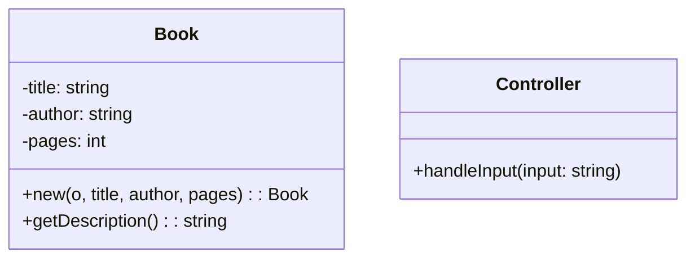

## 4.12 GRASP Principles in Lua

In the realm of software design, understanding how to effectively assign responsibilities to classes and objects is crucial for creating robust, maintainable, and scalable applications. The **General Responsibility Assignment Software Patterns (GRASP)** provide a set of guidelines to help software engineers and architects make informed decisions about responsibility assignment. In this section, we will delve into the GRASP principles and explore how they can be applied in Lua, a powerful and flexible programming language.

### Introduction to GRASP Principles

GRASP principles are a set of nine fundamental principles that guide the assignment of responsibilities in object-oriented design. These principles help developers create systems that are easy to understand, maintain, and extend. The key GRASP principles include:

1. **Information Expert**: Assign responsibility to the class that has the necessary information to fulfill it.
2. **Creator**: Assign responsibility for creating an instance of a class to the class that aggregates, contains, or closely uses the created instance.
3. **Controller**: Assign responsibility for handling system events to a controller class.
4. **Low Coupling**: Minimize dependencies between classes to reduce the impact of changes.
5. **High Cohesion**: Ensure that a class has a single, well-defined purpose.
6. **Polymorphism**: Use polymorphism to handle variations in behavior.
7. **Pure Fabrication**: Create a class that does not represent a concept in the problem domain to achieve low coupling and high cohesion.
8. **Indirection**: Use an intermediary to decouple classes or components.
9. **Protected Variations**: Protect elements from variations in other elements by encapsulating the point of variation.

In this guide, we will focus on the **Information Expert** and **Controller** principles, as they are particularly relevant to Lua's dynamic and flexible nature.

### Information Expert in Lua

The Information Expert principle suggests that responsibility should be assigned to the class that has the information necessary to fulfill it. This principle helps in distributing responsibilities effectively and ensures that each class has a clear purpose.

#### Implementing Information Expert in Lua

In Lua, tables are the primary data structure and can be used to represent objects. Let's explore how the Information Expert principle can be applied using tables and functions.

```lua
-- Define a table to represent a Book object
Book = {
    title = "",
    author = "",
    pages = 0
}

-- Function to create a new Book object
function Book:new(o, title, author, pages)
    o = o or {}
    setmetatable(o, self)
    self.__index = self
    self.title = title or ""
    self.author = author or ""
    self.pages = pages or 0
    return o
end

-- Function to get the book's description
function Book:getDescription()
    return "Title: " .. self.title .. ", Author: " .. self.author .. ", Pages: " .. self.pages
end

-- Create a new book instance
local myBook = Book:new(nil, "The Lua Guide", "John Doe", 300)

-- Get the book's description
print(myBook:getDescription())
```

In this example, the `Book` table is responsible for managing its own data and providing a method to get its description. The `getDescription` function is assigned to the `Book` table because it has all the necessary information to fulfill this responsibility.

#### Try It Yourself

Experiment with the code by adding more attributes to the `Book` table, such as `publisher` or `year`, and update the `getDescription` function to include these new attributes.

### Controller Patterns in Lua

The Controller pattern assigns the responsibility of handling system events to a controller class. This pattern helps in managing the flow of logic within an application and decouples the user interface from the business logic.

#### Implementing Controller Patterns in Lua

In Lua, we can use tables to represent controllers that manage the flow of logic. Let's create a simple example of a controller that handles user input.

```lua
-- Define a table to represent a Controller
Controller = {}

-- Function to handle user input
function Controller:handleInput(input)
    if input == "start" then
        print("Starting the application...")
    elseif input == "stop" then
        print("Stopping the application...")
    else
        print("Unknown command: " .. input)
    end
end

-- Create a new controller instance
local appController = Controller

-- Handle user input
appController:handleInput("start")
appController:handleInput("stop")
appController:handleInput("restart")
```

In this example, the `Controller` table is responsible for handling user input and managing the flow of logic based on the input received. The `handleInput` function acts as the entry point for processing commands.

#### Try It Yourself

Modify the `handleInput` function to add more commands, such as `pause` or `resume`, and implement the corresponding logic.

### Visualizing GRASP Principles in Lua

To better understand how the GRASP principles can be applied in Lua, let's visualize the relationship between the `Book` and `Controller` tables using a class diagram.



In this diagram, the `Book` class is responsible for managing its own data and providing a description, while the `Controller` class handles user input and manages the flow of logic.

### Key Takeaways

- **Information Expert**: Assign responsibility to the class that has the necessary information to fulfill it. In Lua, use tables to represent objects and assign responsibilities accordingly.
- **Controller**: Assign responsibility for handling system events to a controller class. Use tables to represent controllers that manage the flow of logic.
- **GRASP Principles**: Provide a set of guidelines for responsibility assignment, helping create systems that are easy to understand, maintain, and extend.

### Further Reading

For more information on GRASP principles and their application in software design, consider exploring the following resources:

- [Object-Oriented Analysis and Design with Applications](https://www.amazon.com/Object-Oriented-Analysis-Design-Applications-3rd/dp/020189551X) by Grady Booch
- [Design Patterns: Elements of Reusable Object-Oriented Software](https://www.amazon.com/Design-Patterns-Elements-Reusable-Object-Oriented/dp/0201633612) by Erich Gamma, Richard Helm, Ralph Johnson, and John Vlissides

### Embrace the Journey

Remember, mastering GRASP principles is just the beginning. As you progress, you'll build more complex and interactive Lua applications. Keep experimenting, stay curious, and enjoy the journey!

## Quiz Time!



### What is the primary purpose of the Information Expert principle?

- [x] Assign responsibility to the class that has the necessary information to fulfill it.
- [ ] Minimize dependencies between classes.
- [ ] Use polymorphism to handle variations in behavior.
- [ ] Create a class that does not represent a concept in the problem domain.

> **Explanation:** The Information Expert principle focuses on assigning responsibility to the class that has the necessary information to fulfill it, ensuring that each class has a clear purpose.

### Which GRASP principle suggests using an intermediary to decouple classes?

- [ ] Information Expert
- [ ] Controller
- [x] Indirection
- [ ] Low Coupling

> **Explanation:** The Indirection principle suggests using an intermediary to decouple classes or components, promoting flexibility and reducing dependencies.

### In Lua, what data structure is primarily used to represent objects?

- [x] Tables
- [ ] Arrays
- [ ] Strings
- [ ] Functions

> **Explanation:** In Lua, tables are the primary data structure used to represent objects, allowing for flexible and dynamic data management.

### What is the role of a controller in the Controller pattern?

- [ ] Manage data storage
- [x] Handle system events and manage the flow of logic
- [ ] Perform calculations
- [ ] Render user interfaces

> **Explanation:** In the Controller pattern, the controller is responsible for handling system events and managing the flow of logic within an application.

### Which GRASP principle focuses on minimizing dependencies between classes?

- [ ] Information Expert
- [ ] Controller
- [x] Low Coupling
- [ ] High Cohesion

> **Explanation:** The Low Coupling principle focuses on minimizing dependencies between classes to reduce the impact of changes and promote flexibility.

### How can the Information Expert principle be applied in Lua?

- [x] By assigning responsibility to tables that have the necessary information
- [ ] By creating global variables
- [ ] By using metatables
- [ ] By implementing inheritance

> **Explanation:** In Lua, the Information Expert principle can be applied by assigning responsibility to tables that have the necessary information to fulfill it.

### What is the benefit of using the Controller pattern?

- [x] It decouples the user interface from the business logic.
- [ ] It increases the complexity of the application.
- [ ] It reduces the need for testing.
- [ ] It simplifies data storage.

> **Explanation:** The Controller pattern helps in decoupling the user interface from the business logic, making the application easier to maintain and extend.

### Which GRASP principle encourages creating a class that does not represent a concept in the problem domain?

- [ ] Information Expert
- [ ] Controller
- [ ] Low Coupling
- [x] Pure Fabrication

> **Explanation:** The Pure Fabrication principle encourages creating a class that does not represent a concept in the problem domain to achieve low coupling and high cohesion.

### What is the primary focus of the High Cohesion principle?

- [ ] Assign responsibility to the class with the necessary information
- [ ] Minimize dependencies between classes
- [x] Ensure that a class has a single, well-defined purpose
- [ ] Use polymorphism to handle variations in behavior

> **Explanation:** The High Cohesion principle focuses on ensuring that a class has a single, well-defined purpose, promoting clarity and maintainability.

### True or False: GRASP principles are only applicable to object-oriented programming languages.

- [ ] True
- [x] False

> **Explanation:** While GRASP principles are often associated with object-oriented programming, they can be applied to any programming paradigm to guide responsibility assignment and improve software design.


