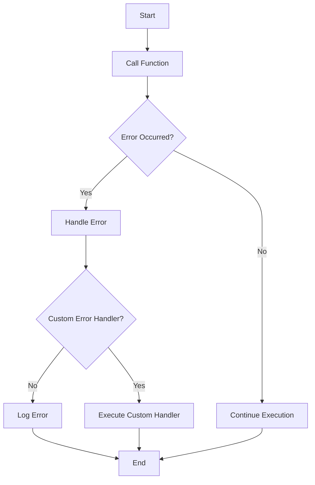

## 4.13 Exceptions in Lua: Error Handling Techniques

In the world of software development, handling errors gracefully is crucial for building robust applications. Lua, known for its simplicity and flexibility, offers unique approaches to error handling that differ from traditional exception handling mechanisms found in other programming languages. In this section, we will delve into Lua's error handling techniques, explore the differences between errors and exceptions, and provide best practices for managing errors effectively.

### Error vs. Exception: Understanding Lua's Approach to Errors

In many programming languages, exceptions are used to handle unexpected events or errors during program execution. Lua, however, does not have a built-in exception handling mechanism. Instead, it uses a simple error handling model based on functions and protected calls. Understanding this model is key to mastering error handling in Lua.

#### Errors in Lua

In Lua, an error is a condition that disrupts the normal flow of program execution. Errors can be triggered by various factors, such as invalid input, resource unavailability, or logical mistakes in the code. When an error occurs, Lua provides mechanisms to catch and handle it, preventing the program from crashing.

#### Protected Calls

Lua uses protected calls to handle errors. A protected call is a function call that is wrapped in a mechanism to catch errors and prevent them from propagating to the top level of the program. Lua provides two functions for making protected calls: `pcall()` and `xpcall()`.

### Protected Calls: Using `pcall()` and `xpcall()` for Error Handling

Protected calls are the cornerstone of error handling in Lua. They allow you to execute a function and catch any errors that occur during its execution. Let's explore how `pcall()` and `xpcall()` work and how they can be used to handle errors effectively.

#### `pcall()`: Basic Error Handling

The `pcall()` function is used to call a function in protected mode. It returns a boolean indicating whether the function call was successful and any return values from the function.

```lua
-- Define a function that may cause an error
local function riskyFunction()
    error("An unexpected error occurred!")
end

-- Use pcall to call the function in protected mode
local status, err = pcall(riskyFunction)

if not status then
    print("Error caught: " .. err)
else
    print("Function executed successfully")
end
```

In this example, `pcall()` is used to call `riskyFunction()`. If an error occurs, `pcall()` returns `false` and the error message, allowing us to handle the error gracefully.

#### `xpcall()`: Advanced Error Handling with Custom Error Handlers

While `pcall()` is useful for basic error handling, `xpcall()` provides more advanced capabilities by allowing you to specify a custom error handler function. This function can perform additional processing or logging when an error occurs.

```lua
-- Define a custom error handler
local function errorHandler(err)
    return "Custom error handler: " .. err
end

-- Use xpcall to call the function with a custom error handler
local status, err = xpcall(riskyFunction, errorHandler)

if not status then
    print(err)
else
    print("Function executed successfully")
end
```

In this example, `xpcall()` is used with a custom error handler that prefixes the error message with "Custom error handler:". This allows for more flexible and informative error handling.

### Custom Error Handling: Creating Robust Error Management Systems

While `pcall()` and `xpcall()` provide the foundation for error handling in Lua, building a robust error management system often requires custom solutions tailored to your application's needs. Let's explore some strategies for creating effective error handling systems.

#### Centralized Error Logging

One effective strategy is to centralize error logging. By directing all error messages to a central logging system, you can monitor and analyze errors more effectively. This approach is particularly useful in large applications where errors may occur in different parts of the codebase.

```lua
-- Define a centralized error logger
local function logError(err)
    -- Log the error to a file or external system
    print("Logging error: " .. err)
end

-- Use xpcall with the centralized error logger
local status, err = xpcall(riskyFunction, logError)

if not status then
    print("Error handled and logged")
else
    print("Function executed successfully")
end
```

#### Error Propagation and Recovery

In some cases, you may want to propagate errors up the call stack to allow higher-level functions to handle them. This can be achieved by re-throwing errors or using return values to indicate error conditions.

```lua
-- Define a function that propagates errors
local function propagateError()
    local status, err = pcall(riskyFunction)
    if not status then
        return nil, err
    end
    return true
end

-- Call the function and handle propagated errors
local success, err = propagateError()
if not success then
    print("Error propagated: " .. err)
else
    print("Function executed successfully")
end
```

#### Graceful Degradation

Graceful degradation involves designing your application to continue functioning even when errors occur. This can be achieved by providing fallback mechanisms or alternative workflows when errors are encountered.

```lua
-- Define a function with graceful degradation
local function performTask()
    local status, err = pcall(riskyFunction)
    if not status then
        print("Error occurred, using fallback mechanism")
        -- Perform alternative actions
    else
        print("Task completed successfully")
    end
end

performTask()
```

### Best Practices: Handling Errors Gracefully Without Crashing the Program

To build robust Lua applications, it's essential to follow best practices for error handling. Here are some key principles to keep in mind:

#### 1. Anticipate and Handle Errors

Always anticipate potential errors and handle them appropriately. Use `pcall()` and `xpcall()` to catch errors and prevent them from crashing your program.

#### 2. Provide Meaningful Error Messages

Ensure that error messages are clear and informative. This will help you diagnose and fix issues more efficiently.

#### 3. Use Custom Error Handlers

Leverage custom error handlers with `xpcall()` to perform additional processing or logging when errors occur.

#### 4. Centralize Error Logging

Implement a centralized error logging system to monitor and analyze errors across your application.

#### 5. Design for Graceful Degradation

Design your application to continue functioning even when errors occur. Provide fallback mechanisms or alternative workflows to handle errors gracefully.

#### 6. Test Error Handling Code

Regularly test your error handling code to ensure it works as expected. Simulate error conditions and verify that your application handles them correctly.

#### 7. Document Error Handling Strategies

Document your error handling strategies and guidelines to ensure consistency across your codebase.

### Visualizing Error Handling in Lua

To better understand how error handling works in Lua, let's visualize the process using a flowchart. This diagram illustrates the flow of a function call with error handling using `pcall()` and `xpcall()`.



**Figure 1: Flowchart of Error Handling in Lua**

This flowchart shows the decision points and actions taken during a function call with error handling. It highlights the use of `pcall()` and `xpcall()` to catch and handle errors, as well as the role of custom error handlers.

### Try It Yourself

Now that we've covered the fundamentals of error handling in Lua, it's time to experiment with the concepts. Try modifying the code examples provided in this section to explore different error handling scenarios. Here are some suggestions:

- Modify the `riskyFunction()` to trigger different types of errors and observe how they are handled.
- Implement a custom error handler that logs errors to a file instead of printing them to the console.
- Create a function that uses error propagation to allow higher-level functions to handle errors.

### Knowledge Check

To reinforce your understanding of error handling in Lua, let's summarize the key takeaways:

- Lua uses protected calls (`pcall()` and `xpcall()`) to handle errors.
- `pcall()` provides basic error handling, while `xpcall()` allows for custom error handlers.
- Centralized error logging and graceful degradation are effective strategies for robust error management.
- Best practices include anticipating errors, providing meaningful error messages, and designing for graceful degradation.

Remember, mastering error handling in Lua is an ongoing journey. As you continue to build and refine your applications, keep experimenting with different techniques and strategies to enhance your error management capabilities.

## Quiz Time!



### What is the primary mechanism Lua uses for error handling?

- [x] Protected calls
- [ ] Try-catch blocks
- [ ] Exception objects
- [ ] Error codes

> **Explanation:** Lua uses protected calls (`pcall()` and `xpcall()`) as its primary mechanism for error handling, rather than try-catch blocks or exception objects.

### Which function allows you to specify a custom error handler in Lua?

- [ ] pcall()
- [x] xpcall()
- [ ] try()
- [ ] catch()

> **Explanation:** `xpcall()` allows you to specify a custom error handler, providing more advanced error handling capabilities compared to `pcall()`.

### What is a key benefit of centralized error logging?

- [ ] It makes the code run faster.
- [x] It allows for better monitoring and analysis of errors.
- [ ] It prevents all errors from occurring.
- [ ] It simplifies the codebase.

> **Explanation:** Centralized error logging allows for better monitoring and analysis of errors, making it easier to diagnose and fix issues.

### What does graceful degradation involve?

- [ ] Ignoring errors completely
- [ ] Crashing the program on error
- [x] Designing the application to continue functioning despite errors
- [ ] Removing error handling code

> **Explanation:** Graceful degradation involves designing the application to continue functioning despite errors, often by providing fallback mechanisms or alternative workflows.

### Which of the following is NOT a best practice for error handling in Lua?

- [ ] Anticipate and handle errors
- [ ] Provide meaningful error messages
- [x] Ignore errors to simplify code
- [ ] Use custom error handlers

> **Explanation:** Ignoring errors is not a best practice. Instead, you should anticipate and handle errors, provide meaningful error messages, and use custom error handlers.

### What is the purpose of a custom error handler in `xpcall()`?

- [ ] To make the code run faster
- [ ] To ignore errors
- [x] To perform additional processing or logging when errors occur
- [ ] To automatically fix errors

> **Explanation:** A custom error handler in `xpcall()` is used to perform additional processing or logging when errors occur, providing more flexibility in error handling.

### How can you propagate errors up the call stack in Lua?

- [ ] By using global variables
- [x] By re-throwing errors or using return values
- [ ] By ignoring them
- [ ] By using `try-catch` blocks

> **Explanation:** In Lua, you can propagate errors up the call stack by re-throwing errors or using return values to indicate error conditions.

### What is a key advantage of using `xpcall()` over `pcall()`?

- [ ] It is faster
- [x] It allows for custom error handlers
- [ ] It automatically fixes errors
- [ ] It requires less code

> **Explanation:** The key advantage of `xpcall()` over `pcall()` is that it allows for custom error handlers, providing more advanced error handling capabilities.

### What should you do to ensure your error handling code works as expected?

- [ ] Ignore it
- [ ] Write it once and never check it again
- [x] Regularly test it by simulating error conditions
- [ ] Assume it always works

> **Explanation:** To ensure your error handling code works as expected, you should regularly test it by simulating error conditions and verifying that your application handles them correctly.

### True or False: Lua has a built-in exception handling mechanism similar to Java or Python.

- [ ] True
- [x] False

> **Explanation:** False. Lua does not have a built-in exception handling mechanism like Java or Python. Instead, it uses protected calls (`pcall()` and `xpcall()`) for error handling.



Remember, this is just the beginning. As you progress, you'll build more complex and robust Lua applications. Keep experimenting, stay curious, and enjoy the journey!
