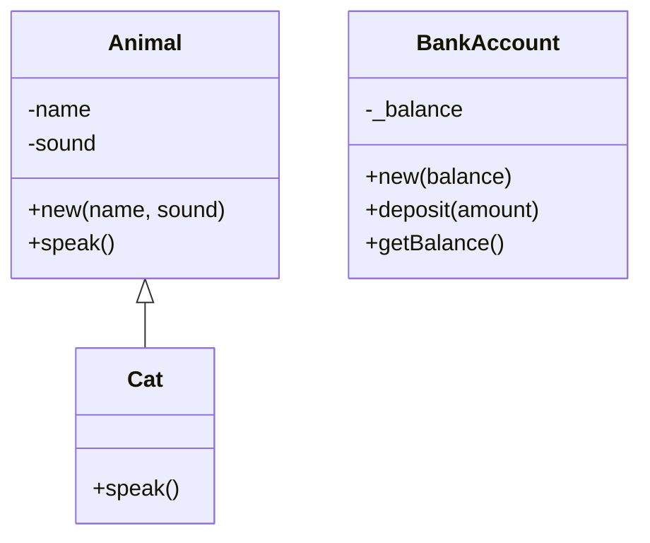

## 4.2 Object-Oriented Programming (OOP) in Lua

Lua is a lightweight, high-level, multi-paradigm programming language designed primarily for embedded use in applications. While it doesn't natively support Object-Oriented Programming (OOP) in the way languages like Java or C++ do, Lua provides powerful mechanisms to implement OOP concepts using tables and metatables. In this section, we will explore how Lua's flexibility allows us to simulate classes, implement inheritance, and achieve encapsulation.

### Lua's OOP Capabilities

Lua's approach to OOP is unique and relies heavily on its core data structure: tables. Tables in Lua are versatile and can be used to represent arrays, dictionaries, and objects. By leveraging tables and metatables, we can mimic the behavior of classes and objects, implement inheritance, and encapsulate data.

#### Classes and Objects

In Lua, a class can be simulated using a table that holds methods and properties. Objects are instances of these tables. Let's start by creating a simple class-like structure in Lua.

```lua
-- Define a class-like table
local Animal = {}

-- Constructor function for creating new instances
function Animal:new(name, sound)
    local instance = setmetatable({}, { __index = self })
    instance.name = name
    instance.sound = sound
    return instance
end

-- Method to make the animal speak
function Animal:speak()
    print(self.name .. " says " .. self.sound)
end

-- Create an instance of Animal
local dog = Animal:new("Dog", "Woof")
dog:speak()  -- Output: Dog says Woof
```

In this example, `Animal` acts as a class, and `dog` is an instance of that class. The `new` method serves as a constructor, and we use `setmetatable` to set the `__index` metamethod, allowing the instance to inherit methods from the `Animal` table.

#### Inheritance

Inheritance in Lua can be achieved by setting up a prototype chain using metatables. This allows one table to inherit properties and methods from another.

```lua
-- Define a subclass-like table
local Cat = Animal:new()

-- Override the speak method
function Cat:speak()
    print(self.name .. " says Meow")
end

-- Create an instance of Cat
local cat = Cat:new("Cat", "Meow")
cat:speak()  -- Output: Cat says Meow
```

In this example, `Cat` inherits from `Animal`. We override the `speak` method to provide specific behavior for `Cat` instances. The `new` method in `Animal` is reused to create instances of `Cat`.

#### Encapsulation

Encapsulation in Lua can be achieved by controlling access to table fields. We can use metatables to hide internal details and expose only the necessary interface.

```lua
-- Define a class with encapsulation
local BankAccount = {}
BankAccount.__index = BankAccount

-- Constructor
function BankAccount:new(balance)
    local instance = setmetatable({}, self)
    instance._balance = balance or 0  -- Private field
    return instance
end

-- Public method to deposit money
function BankAccount:deposit(amount)
    if amount > 0 then
        self._balance = self._balance + amount
    end
end

-- Public method to get the balance
function BankAccount:getBalance()
    return self._balance
end

-- Create an instance of BankAccount
local account = BankAccount:new(100)
account:deposit(50)
print(account:getBalance())  -- Output: 150
```

In this example, `_balance` is a private field, and we provide public methods `deposit` and `getBalance` to interact with it. This encapsulation ensures that the internal state of the `BankAccount` is protected from unauthorized access.

### Visualizing OOP in Lua

To better understand how Lua implements OOP, let's visualize the relationships between classes, objects, and metatables using a class diagram.



In this diagram, `Animal` is a base class with a constructor and a `speak` method. `Cat` inherits from `Animal` and overrides the `speak` method. `BankAccount` is a separate class with encapsulated fields and methods.

### Key Participants

- **Tables**: The primary data structure used to simulate classes and objects.
- **Metatables**: Used to implement inheritance and encapsulation by controlling table behavior.
- **Metamethods**: Special functions like `__index` that define how tables interact with each other.

### Applicability

Lua's OOP capabilities are suitable for scenarios where lightweight and flexible object-oriented design is required. It's particularly useful in embedded systems, game development, and applications where performance and simplicity are priorities.

### Sample Code Snippet

Here's a complete example that demonstrates OOP in Lua, including class creation, inheritance, and encapsulation.

```lua
-- Base class
local Vehicle = {}
Vehicle.__index = Vehicle

function Vehicle:new(type, speed)
    local instance = setmetatable({}, self)
    instance.type = type
    instance.speed = speed
    return instance
end

function Vehicle:move()
    print(self.type .. " moves at " .. self.speed .. " km/h")
end

-- Subclass
local Car = Vehicle:new()

function Car:new(speed, brand)
    local instance = Vehicle.new(self, "Car", speed)
    instance.brand = brand
    return instance
end

function Car:move()
    print(self.brand .. " car moves at " .. self.speed .. " km/h")
end

-- Encapsulation example
local Account = {}
Account.__index = Account

function Account:new(balance)
    local instance = setmetatable({}, self)
    instance._balance = balance or 0
    return instance
end

function Account:deposit(amount)
    if amount > 0 then
        self._balance = self._balance + amount
    end
end

function Account:getBalance()
    return self._balance
end

-- Create instances
local myCar = Car:new(120, "Toyota")
myCar:move()  -- Output: Toyota car moves at 120 km/h

local myAccount = Account:new(200)
myAccount:deposit(100)
print(myAccount:getBalance())  -- Output: 300
```

### Design Considerations

- **When to Use**: Use Lua's OOP capabilities when you need a lightweight, flexible object model without the overhead of traditional OOP languages.
- **Pitfalls**: Be cautious with metatables, as improper use can lead to hard-to-debug code. Ensure encapsulation is respected to maintain data integrity.

### Differences and Similarities

Lua's OOP approach is similar to JavaScript's prototype-based inheritance but differs from class-based languages like Java or C++. Understanding these differences is crucial for effectively using Lua in object-oriented designs.

### Try It Yourself

Experiment with the code examples provided. Try creating new classes, adding methods, and implementing inheritance. Modify the encapsulation example to add more private fields and methods. This hands-on approach will deepen your understanding of Lua's OOP capabilities.

### Knowledge Check

- What are the key components of OOP in Lua?
- How do tables and metatables work together to simulate classes?
- What are the benefits of encapsulation in Lua?

### Embrace the Journey

Remember, mastering OOP in Lua is a journey. As you explore these concepts, you'll gain a deeper understanding of Lua's flexibility and power. Keep experimenting, stay curious, and enjoy the process of learning and applying these techniques in your projects.

## Quiz Time!



### What is the primary data structure used to simulate classes in Lua?

- [x] Tables
- [ ] Arrays
- [ ] Functions
- [ ] Strings

> **Explanation:** Tables are the primary data structure used in Lua to simulate classes and objects.

### How can inheritance be implemented in Lua?

- [x] Using metatables and the `__index` metamethod
- [ ] Using the `extends` keyword
- [ ] Using the `inherit` function
- [ ] Using the `super` keyword

> **Explanation:** Inheritance in Lua is implemented using metatables and the `__index` metamethod to create prototype chains.

### What is the purpose of encapsulation in Lua?

- [x] To hide internal details and protect data
- [ ] To increase code complexity
- [ ] To make all data public
- [ ] To improve performance

> **Explanation:** Encapsulation hides internal details and protects data from unauthorized access, ensuring data integrity.

### Which metamethod is commonly used to implement inheritance in Lua?

- [x] `__index`
- [ ] `__newindex`
- [ ] `__call`
- [ ] `__tostring`

> **Explanation:** The `__index` metamethod is used to implement inheritance by directing access to a prototype table.

### What is a common pitfall when using metatables in Lua?

- [x] Hard-to-debug code due to improper use
- [ ] Increased memory usage
- [ ] Slower execution speed
- [ ] Lack of flexibility

> **Explanation:** Improper use of metatables can lead to hard-to-debug code, making it important to use them carefully.

### How can you create a new instance of a class-like table in Lua?

- [x] Using a constructor function with `setmetatable`
- [ ] Using the `new` keyword
- [ ] Using the `create` function
- [ ] Using the `instanceof` operator

> **Explanation:** A constructor function with `setmetatable` is used to create new instances of class-like tables in Lua.

### What is the role of the `__index` metamethod in Lua?

- [x] It allows a table to inherit methods from another table
- [ ] It prevents access to table fields
- [ ] It initializes table fields
- [ ] It converts tables to strings

> **Explanation:** The `__index` metamethod allows a table to inherit methods from another table, enabling prototype-based inheritance.

### How can you override a method in a subclass in Lua?

- [x] By defining a method with the same name in the subclass
- [ ] By using the `override` keyword
- [ ] By using the `super` keyword
- [ ] By using the `extends` keyword

> **Explanation:** In Lua, you can override a method in a subclass by defining a method with the same name in the subclass.

### What is a benefit of using Lua's OOP capabilities?

- [x] Lightweight and flexible object model
- [ ] Built-in class hierarchy
- [ ] Automatic memory management
- [ ] Static typing

> **Explanation:** Lua's OOP capabilities provide a lightweight and flexible object model, suitable for various applications.

### True or False: Lua natively supports class-based OOP like Java.

- [ ] True
- [x] False

> **Explanation:** False. Lua does not natively support class-based OOP like Java; it uses tables and metatables to simulate OOP concepts.


