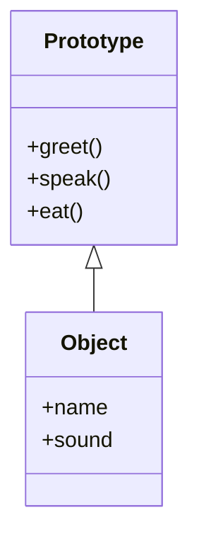

## 4.3 Objects, Lua-Style: Implementing OOP Concepts

In this section, we delve into the fascinating world of Object-Oriented Programming (OOP) in Lua. Lua, being a lightweight and flexible scripting language, does not have built-in support for OOP like some other languages. However, its powerful metatable feature allows us to implement OOP concepts effectively. We will explore how to leverage metatables for method lookup, implement prototype-based inheritance, and define class constructors and methods.

### Metatables for OOP

Metatables are a powerful feature in Lua that allow you to change the behavior of tables. By using metatables, we can simulate object-oriented behavior. One of the key metamethods for OOP is `__index`, which is used for method lookup.

#### Leveraging `__index` Metamethod for Method Lookup

The `__index` metamethod is crucial for implementing OOP in Lua. It allows us to define a table that acts as a prototype for other tables. When a table does not have a requested key, Lua looks for the key in the table's metatable's `__index`.

```lua
-- Define a prototype table with a method
local prototype = {
    greet = function(self)
        print("Hello, " .. self.name)
    end
}

-- Create a new object with a metatable
local object = { name = "Lua" }
setmetatable(object, { __index = prototype })

-- Call the method
object:greet()  -- Output: Hello, Lua
```

In this example, `object` does not have a `greet` method. When we call `object:greet()`, Lua uses the `__index` metamethod to look up `greet` in `prototype`.

### Prototype-Based Inheritance

Prototype-based inheritance is a style of object-oriented programming where objects inherit directly from other objects. In Lua, this is achieved by using tables and metatables.

#### Sharing Methods Through Prototype Tables

By using prototype tables, we can share methods among multiple objects. This is akin to class-based inheritance in other languages.

```lua
-- Define a prototype table
local Animal = {
    speak = function(self)
        print(self.sound)
    end
}

-- Create a new object inheriting from Animal
local dog = { sound = "Woof" }
setmetatable(dog, { __index = Animal })

-- Create another object inheriting from Animal
local cat = { sound = "Meow" }
setmetatable(cat, { __index = Animal })

-- Call the method on both objects
dog:speak()  -- Output: Woof
cat:speak()  -- Output: Meow
```

In this example, both `dog` and `cat` inherit the `speak` method from `Animal`. This demonstrates how prototype-based inheritance allows for method sharing.

### Class Constructors

In Lua, constructors are functions that initialize new objects. They typically set up the object's initial state and return the new object.

#### Writing Constructor Functions for Object Instantiation

To create a constructor in Lua, we define a function that returns a new table with a metatable set to a prototype.

```lua
-- Define a constructor function
local function newAnimal(sound)
    local animal = { sound = sound }
    setmetatable(animal, { __index = Animal })
    return animal
end

-- Use the constructor to create new objects
local cow = newAnimal("Moo")
local sheep = newAnimal("Baa")

-- Call the method on the new objects
cow:speak()  -- Output: Moo
sheep:speak()  -- Output: Baa
```

Here, `newAnimal` is a constructor function that creates and returns a new object with the `Animal` prototype.

### Method Definitions

Methods in Lua are functions that operate on objects. They are typically defined within the prototype or class table.

#### Defining Methods Within Objects and Classes

Methods can be defined directly within the prototype table or added later.

```lua
-- Define a method within the prototype
function Animal:eat()
    print(self.sound .. " is eating")
end

-- Call the new method on an object
dog:eat()  -- Output: Woof is eating
```

In this example, we add an `eat` method to the `Animal` prototype, which is then available to all objects inheriting from `Animal`.

### Visualizing Lua's OOP Concepts

To better understand how Lua's OOP concepts work, let's visualize the relationship between objects, prototypes, and metatables.



In this diagram, `Prototype` represents the prototype table with methods like `greet`, `speak`, and `eat`. `Object` represents individual objects that inherit from `Prototype`.

### Try It Yourself

Experiment with the code examples provided. Try modifying the `Animal` prototype to include additional methods or properties. Create new objects with different sounds and see how they interact with the methods.

### Knowledge Check

- What is the role of the `__index` metamethod in Lua's OOP implementation?
- How does prototype-based inheritance differ from class-based inheritance?
- Write a constructor function for a new prototype called `Vehicle` with a method `drive`.

### Embrace the Journey

Remember, mastering OOP in Lua is a journey. As you explore these concepts, you'll gain a deeper understanding of how to design robust and efficient applications. Keep experimenting, stay curious, and enjoy the process!

### References and Links

- [Lua 5.1 Reference Manual](https://www.lua.org/manual/5.1/)
- [Programming in Lua](https://www.lua.org/pil/)

## Quiz Time!



### What is the primary purpose of the `__index` metamethod in Lua?

- [x] To provide a mechanism for method lookup in tables
- [ ] To handle arithmetic operations
- [ ] To define custom equality checks
- [ ] To manage garbage collection

> **Explanation:** The `__index` metamethod is used to look up methods in a prototype table when they are not found in the current table.

### How does prototype-based inheritance work in Lua?

- [x] Objects inherit directly from other objects or prototype tables
- [ ] Objects inherit from classes defined with the `class` keyword
- [ ] Objects inherit from a global prototype object
- [ ] Objects do not support inheritance in Lua

> **Explanation:** Prototype-based inheritance in Lua allows objects to inherit directly from other objects or prototype tables using metatables.

### What is a constructor function in Lua?

- [x] A function that initializes and returns a new object
- [ ] A function that destroys an object
- [ ] A function that modifies an existing object
- [ ] A function that performs arithmetic operations

> **Explanation:** A constructor function in Lua initializes a new object and returns it, often setting up its initial state.

### Which metamethod is used for method lookup in Lua's OOP implementation?

- [x] `__index`
- [ ] `__newindex`
- [ ] `__call`
- [ ] `__tostring`

> **Explanation:** The `__index` metamethod is used for method lookup in Lua's OOP implementation.

### What is the benefit of using prototype-based inheritance?

- [x] It allows for method sharing among multiple objects
- [ ] It eliminates the need for metatables
- [x] It provides a class-based inheritance model
- [ ] It simplifies memory management

> **Explanation:** Prototype-based inheritance allows for method sharing among multiple objects, enabling efficient code reuse.

### How can you define a method within a prototype table?

- [x] By adding a function to the prototype table
- [ ] By using the `class` keyword
- [ ] By modifying the `__call` metamethod
- [ ] By creating a new metatable

> **Explanation:** Methods can be defined by adding functions directly to the prototype table.

### What is the role of metatables in Lua's OOP implementation?

- [x] They allow tables to behave like objects with inheritance
- [ ] They manage memory allocation
- [ ] They provide syntax for defining classes
- [ ] They handle input/output operations

> **Explanation:** Metatables allow tables to behave like objects with inheritance, enabling OOP in Lua.

### What is the output of the following code snippet?

```lua
local prototype = { greet = function(self) print("Hello, " .. self.name) end }
local object = { name = "Lua" }
setmetatable(object, { __index = prototype })
object:greet()
```

- [x] Hello, Lua
- [ ] Lua, Hello
- [ ] Error: greet not found
- [ ] Hello, World

> **Explanation:** The `greet` method is looked up in the prototype table using the `__index` metamethod, resulting in "Hello, Lua".

### True or False: Lua has built-in support for classes and objects.

- [ ] True
- [x] False

> **Explanation:** Lua does not have built-in support for classes and objects, but these can be implemented using tables and metatables.

### What is the key difference between prototype-based and class-based inheritance?

- [x] Prototype-based inheritance uses objects as prototypes, while class-based inheritance uses classes
- [ ] Prototype-based inheritance requires the `class` keyword
- [ ] Class-based inheritance does not support method sharing
- [ ] Prototype-based inheritance is only available in Lua

> **Explanation:** Prototype-based inheritance uses objects as prototypes, allowing for direct inheritance, while class-based inheritance relies on class definitions.




