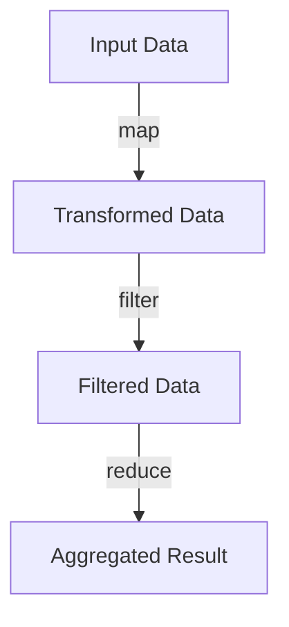

## 4.4 Functional Programming Concepts in Lua

Functional programming is a paradigm that treats computation as the evaluation of mathematical functions and avoids changing state or mutable data. In Lua, a language known for its simplicity and flexibility, functional programming can be a powerful tool for creating clean, efficient, and maintainable code. In this section, we will explore key functional programming concepts in Lua, including immutability, higher-order functions, closures, currying, and functional patterns such as map, filter, and reduce.

### Immutability: Embracing Stateless Functions

Immutability is a core principle of functional programming. It refers to the idea that data should not be modified after it is created. Instead, new data structures are created from existing ones. This approach leads to more predictable and bug-free code, as functions do not have side effects that alter the state of the program.

In Lua, tables are the primary data structure, and they are mutable by default. However, we can adopt practices to simulate immutability:

```lua
-- Function to create an immutable table
function immutableTable(t)
    return setmetatable({}, {
        __index = t,
        __newindex = function()
            error("Attempt to modify immutable table")
        end
    })
end

-- Example usage
local original = {a = 1, b = 2}
local immutable = immutableTable(original)

print(immutable.a) -- Output: 1

-- Attempting to modify the table will result in an error
immutable.a = 3 -- Error: Attempt to modify immutable table
```

By using metatables, we can prevent modifications to a table, effectively making it immutable. This approach helps in maintaining the integrity of data throughout the application.

### Higher-Order Functions: Functions that Manipulate Other Functions

Higher-order functions are functions that take other functions as arguments or return them as results. They are a hallmark of functional programming and allow for powerful abstractions and code reuse.

#### Example: Using `map` to Transform Data

The `map` function applies a given function to each element of a table, returning a new table with the transformed elements.

```lua
-- Define a map function
function map(func, tbl)
    local new_tbl = {}
    for i, v in ipairs(tbl) do
        new_tbl[i] = func(v)
    end
    return new_tbl
end

-- Example usage
local numbers = {1, 2, 3, 4, 5}
local squares = map(function(x) return x * x end, numbers)

for _, v in ipairs(squares) do
    print(v) -- Output: 1, 4, 9, 16, 25
end
```

In this example, `map` is a higher-order function that takes a function and a table as arguments, applying the function to each element of the table.

### Closures and Currying: Creating Specialized Functions

Closures are functions that capture the environment in which they are defined. They allow for the creation of functions with private variables, enabling powerful patterns like currying.

#### Closures in Lua

A closure in Lua is created when a function is defined inside another function and captures variables from the outer function's scope.

```lua
-- Closure example
function makeCounter()
    local count = 0
    return function()
        count = count + 1
        return count
    end
end

local counter = makeCounter()
print(counter()) -- Output: 1
print(counter()) -- Output: 2
```

In this example, the inner function captures the `count` variable, maintaining its state across multiple calls.

#### Currying in Lua

Currying is the process of transforming a function that takes multiple arguments into a sequence of functions that each take a single argument.

```lua
-- Currying example
function curry(func, arg1)
    return function(arg2)
        return func(arg1, arg2)
    end
end

-- Example usage
function add(x, y)
    return x + y
end

local addFive = curry(add, 5)
print(addFive(10)) -- Output: 15
```

Currying allows for the creation of specialized functions from more general ones, enhancing code modularity and reuse.

### Functional Patterns: Map, Filter, and Reduce Implementations

Functional programming often involves using patterns like map, filter, and reduce to process collections of data.

#### Filter: Selecting Elements Based on a Condition

The `filter` function creates a new table containing only the elements that satisfy a given predicate function.

```lua
-- Define a filter function
function filter(predicate, tbl)
    local new_tbl = {}
    for i, v in ipairs(tbl) do
        if predicate(v) then
            table.insert(new_tbl, v)
        end
    end
    return new_tbl
end

-- Example usage
local numbers = {1, 2, 3, 4, 5}
local evenNumbers = filter(function(x) return x % 2 == 0 end, numbers)

for _, v in ipairs(evenNumbers) do
    print(v) -- Output: 2, 4
end
```

#### Reduce: Aggregating Values into a Single Result

The `reduce` function applies a binary function to accumulate a result from the elements of a table.

```lua
-- Define a reduce function
function reduce(func, tbl, initial)
    local result = initial
    for i, v in ipairs(tbl) do
        result = func(result, v)
    end
    return result
end

-- Example usage
local numbers = {1, 2, 3, 4, 5}
local sum = reduce(function(acc, x) return acc + x end, numbers, 0)

print(sum) -- Output: 15
```

### Visualizing Functional Programming Concepts

To better understand how these functional programming concepts interact, let's visualize the flow of data through a series of transformations using a Mermaid.js diagram.



This diagram illustrates how data flows through a sequence of functional transformations, starting with `map`, followed by `filter`, and finally `reduce`.

### Try It Yourself

Experiment with the code examples provided by modifying the functions or creating your own. For instance, try implementing a `map` function that works with key-value pairs in a table, or create a `filter` function that selects elements based on multiple conditions.

### References and Links

- [Lua 5.4 Reference Manual](https://www.lua.org/manual/5.4/)
- [Functional Programming in Lua](https://www.lua.org/pil/16.html)
- [Higher-Order Functions](https://en.wikipedia.org/wiki/Higher-order_function)

### Knowledge Check

1. What is immutability, and why is it important in functional programming?
2. How do higher-order functions enhance code reuse?
3. Explain the concept of closures with an example.
4. What is currying, and how does it benefit function specialization?
5. Describe how the `map`, `filter`, and `reduce` functions work.

### Embrace the Journey

Remember, mastering functional programming in Lua is a journey. As you explore these concepts, you'll discover new ways to write cleaner, more efficient code. Keep experimenting, stay curious, and enjoy the process!

## Quiz Time!



### What is a key principle of functional programming that involves not modifying data?

- [x] Immutability
- [ ] Mutability
- [ ] Statefulness
- [ ] Side Effects

> **Explanation:** Immutability is a key principle of functional programming that involves not modifying data after it is created.

### What is a higher-order function?

- [x] A function that takes other functions as arguments or returns them as results
- [ ] A function that only operates on numbers
- [ ] A function that modifies global variables
- [ ] A function that is defined inside another function

> **Explanation:** A higher-order function is one that takes other functions as arguments or returns them as results, allowing for powerful abstractions.

### What is a closure in Lua?

- [x] A function that captures variables from its surrounding scope
- [ ] A function that is defined globally
- [ ] A function that only takes one argument
- [ ] A function that modifies its arguments

> **Explanation:** A closure in Lua is a function that captures variables from its surrounding scope, allowing it to maintain state across calls.

### What is currying in functional programming?

- [x] Transforming a function that takes multiple arguments into a sequence of functions that each take a single argument
- [ ] A method of sorting data
- [ ] A way to handle errors in functions
- [ ] A technique for optimizing loops

> **Explanation:** Currying is the process of transforming a function that takes multiple arguments into a sequence of functions that each take a single argument.

### Which function applies a given function to each element of a table?

- [x] map
- [ ] filter
- [ ] reduce
- [ ] fold

> **Explanation:** The `map` function applies a given function to each element of a table, returning a new table with the transformed elements.

### What does the `filter` function do?

- [x] Selects elements from a table based on a condition
- [ ] Aggregates values into a single result
- [ ] Transforms each element of a table
- [ ] Sorts elements in a table

> **Explanation:** The `filter` function selects elements from a table based on a condition, creating a new table with the selected elements.

### What is the purpose of the `reduce` function?

- [x] To aggregate values into a single result
- [ ] To transform each element of a table
- [ ] To select elements based on a condition
- [ ] To sort elements in a table

> **Explanation:** The `reduce` function applies a binary function to accumulate a result from the elements of a table.

### How can you create an immutable table in Lua?

- [x] By using metatables to prevent modifications
- [ ] By declaring the table as `const`
- [ ] By using a special keyword
- [ ] By storing the table in a global variable

> **Explanation:** You can create an immutable table in Lua by using metatables to prevent modifications to the table.

### What is a benefit of using closures?

- [x] They allow functions to maintain state across calls
- [ ] They make functions run faster
- [ ] They simplify error handling
- [ ] They reduce memory usage

> **Explanation:** Closures allow functions to maintain state across calls by capturing variables from their surrounding scope.

### True or False: Functional programming in Lua requires the use of immutable data structures.

- [x] True
- [ ] False

> **Explanation:** While Lua does not enforce immutability, adopting immutable data structures is a common practice in functional programming to ensure predictability and reduce side effects.


