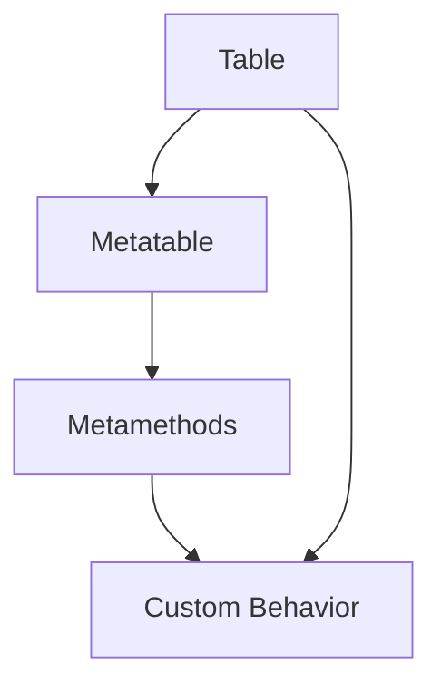

## 4.5 Metaprogramming and Reflection

In the realm of software engineering, metaprogramming and reflection stand as powerful techniques that allow developers to write code that can generate and modify other code at runtime. This capability is particularly potent in Lua, a language known for its flexibility and dynamic nature. In this section, we will delve into the concepts of metaprogramming and reflection, exploring how they can be leveraged to create adaptable and efficient Lua applications.

### Understanding Metaprogramming

**Metaprogramming** refers to the practice of writing programs that can manipulate other programs or themselves. This can include generating code, modifying existing code, or even creating entirely new code structures during execution. In Lua, metaprogramming is facilitated by its dynamic typing, first-class functions, and powerful table constructs.

#### Key Concepts in Metaprogramming

1. **Code Generation**: The ability to produce code dynamically based on certain conditions or inputs.
2. **Code Modification**: Altering existing code structures to change behavior or add functionality.
3. **Code Introspection**: Examining code structures to understand their properties and behaviors.

### Reflection in Lua

**Reflection** is a subset of metaprogramming that focuses on introspection and modification of program structures at runtime. In Lua, reflection allows you to inspect tables, functions, and other data structures to understand their properties and behaviors.

#### Reflection Mechanisms in Lua

1. **Introspecting Tables**: Tables in Lua are versatile and can be used to represent objects, arrays, and more. Reflection allows you to inspect the contents and structure of tables.
2. **Introspecting Functions**: Lua functions are first-class citizens, meaning they can be passed around and manipulated like any other data type. Reflection enables you to examine function properties and behaviors.

### Dynamic Behavior in Lua

Dynamic behavior in Lua refers to the ability of a program to adapt its behavior during execution. This can be achieved through metaprogramming techniques such as:

1. **Dynamic Code Execution**: Running code that is generated or modified at runtime.
2. **Adapting Program Logic**: Changing the flow or logic of a program based on runtime conditions.

### Metatables and Metamethods

Metatables and metamethods are core components of Lua's metaprogramming capabilities. They allow you to define custom behaviors for tables, enabling you to override default operations such as addition, subtraction, and more.

#### Using Metatables

A metatable is a table that defines how another table behaves. By setting a metatable for a table, you can control its behavior in various ways.

```lua
-- Define a metatable with a custom __index metamethod
local myMetatable = {
    __index = function(table, key)
        return "Key not found: " .. key
    end
}

-- Create a table and set its metatable
local myTable = {}
setmetatable(myTable, myMetatable)

-- Access a non-existent key
print(myTable.someKey)  -- Output: Key not found: someKey
```

#### Metamethods

Metamethods are special functions that define how a table responds to certain operations. Common metamethods include `__add`, `__sub`, `__index`, and `__newindex`.

```lua
-- Define a metatable with custom __add metamethod
local vectorMetatable = {
    __add = function(vec1, vec2)
        return { x = vec1.x + vec2.x, y = vec1.y + vec2.y }
    end
}

-- Create two vectors and set their metatable
local vector1 = { x = 1, y = 2 }
local vector2 = { x = 3, y = 4 }
setmetatable(vector1, vectorMetatable)
setmetatable(vector2, vectorMetatable)

-- Add the vectors using the custom __add metamethod
local result = vector1 + vector2
print(result.x, result.y)  -- Output: 4 6
```

### Practical Applications of Metaprogramming

Metaprogramming can be used in a variety of practical applications, including:

1. **Domain-Specific Languages (DSLs)**: Creating specialized languages for specific problem domains.
2. **Code Optimization**: Generating optimized code paths based on runtime conditions.
3. **Dynamic Configuration**: Adjusting program behavior based on configuration files or user input.

### Try It Yourself

Experiment with the following code to better understand metaprogramming in Lua. Try modifying the metatable to add new behaviors or create your own metamethods.

```lua
-- Define a metatable with custom __tostring metamethod
local customMetatable = {
    __tostring = function(table)
        local result = "{"
        for k, v in pairs(table) do
            result = result .. k .. ": " .. v .. ", "
        end
        return result .. "}"
    end
}

-- Create a table and set its metatable
local myData = { name = "Lua", version = "5.4" }
setmetatable(myData, customMetatable)

-- Print the table using the custom __tostring metamethod
print(myData)  -- Output: {name: Lua, version: 5.4, }
```

### Visualizing Metaprogramming in Lua

To better understand the flow of metaprogramming in Lua, consider the following diagram that illustrates how metatables and metamethods interact with tables.



**Diagram Description**: This diagram shows the relationship between a table, its metatable, and the metamethods that define custom behavior. The table interacts with the metatable, which contains metamethods that determine how the table behaves under certain operations.

### References and Further Reading

- [Lua 5.4 Reference Manual](https://www.lua.org/manual/5.4/)
- [Programming in Lua](https://www.lua.org/pil/)
- [MDN Web Docs on Metaprogramming](https://developer.mozilla.org/en-US/docs/Glossary/Metaprogramming)

### Knowledge Check

- What is the primary purpose of metaprogramming in Lua?
- How do metatables and metamethods enhance Lua's capabilities?
- Can you create a custom behavior for a table using metatables? How?

### Embrace the Journey

Remember, metaprogramming and reflection are advanced topics that can greatly enhance your Lua programming skills. As you explore these concepts, keep experimenting and pushing the boundaries of what you can achieve with Lua. Stay curious and enjoy the journey!

## Quiz Time!



### What is metaprogramming?

- [x] Writing programs that manipulate other programs or themselves
- [ ] Writing programs that only perform mathematical calculations
- [ ] Writing programs that only handle user input
- [ ] Writing programs that only display output

> **Explanation:** Metaprogramming involves writing programs that can manipulate other programs or themselves, allowing for dynamic code generation and modification.

### What is reflection in Lua?

- [x] Introspection and modification of program structures at runtime
- [ ] A method for optimizing code execution
- [ ] A technique for handling errors
- [ ] A way to manage memory

> **Explanation:** Reflection in Lua allows for introspection and modification of program structures at runtime, enabling dynamic behavior.

### What is a metatable in Lua?

- [x] A table that defines custom behavior for another table
- [ ] A table that stores only numeric values
- [ ] A table that cannot be modified
- [ ] A table that is used for error handling

> **Explanation:** A metatable in Lua is a table that defines custom behavior for another table, allowing for the use of metamethods.

### What is a metamethod?

- [x] A special function that defines how a table responds to certain operations
- [ ] A function that only performs mathematical operations
- [ ] A function that handles user input
- [ ] A function that displays output

> **Explanation:** A metamethod is a special function in Lua that defines how a table responds to certain operations, such as addition or indexing.

### How can you inspect the contents of a table in Lua?

- [x] Using reflection mechanisms
- [ ] Using only print statements
- [ ] Using error handling techniques
- [ ] Using memory management functions

> **Explanation:** Reflection mechanisms in Lua allow you to inspect the contents and structure of tables, providing insights into their properties and behaviors.

### What is the purpose of the `__index` metamethod?

- [x] To define behavior for accessing non-existent keys in a table
- [ ] To perform mathematical operations
- [ ] To handle user input
- [ ] To display output

> **Explanation:** The `__index` metamethod in Lua is used to define behavior for accessing non-existent keys in a table, allowing for custom responses.

### What is dynamic behavior in Lua?

- [x] The ability of a program to adapt its behavior during execution
- [ ] The ability of a program to run faster
- [ ] The ability of a program to handle more data
- [ ] The ability of a program to use less memory

> **Explanation:** Dynamic behavior in Lua refers to the ability of a program to adapt its behavior during execution, often achieved through metaprogramming techniques.

### What is the benefit of using metaprogramming in Lua?

- [x] It allows for dynamic code generation and modification
- [ ] It makes programs run slower
- [ ] It increases memory usage
- [ ] It complicates code structure

> **Explanation:** Metaprogramming in Lua allows for dynamic code generation and modification, enabling more flexible and adaptable programs.

### Can metatables be used to create custom behaviors for tables?

- [x] True
- [ ] False

> **Explanation:** Metatables in Lua can be used to create custom behaviors for tables by defining metamethods that override default operations.

### Is metaprogramming an advanced topic in Lua?

- [x] True
- [ ] False

> **Explanation:** Metaprogramming is considered an advanced topic in Lua, as it involves writing code that can manipulate other code at runtime.




