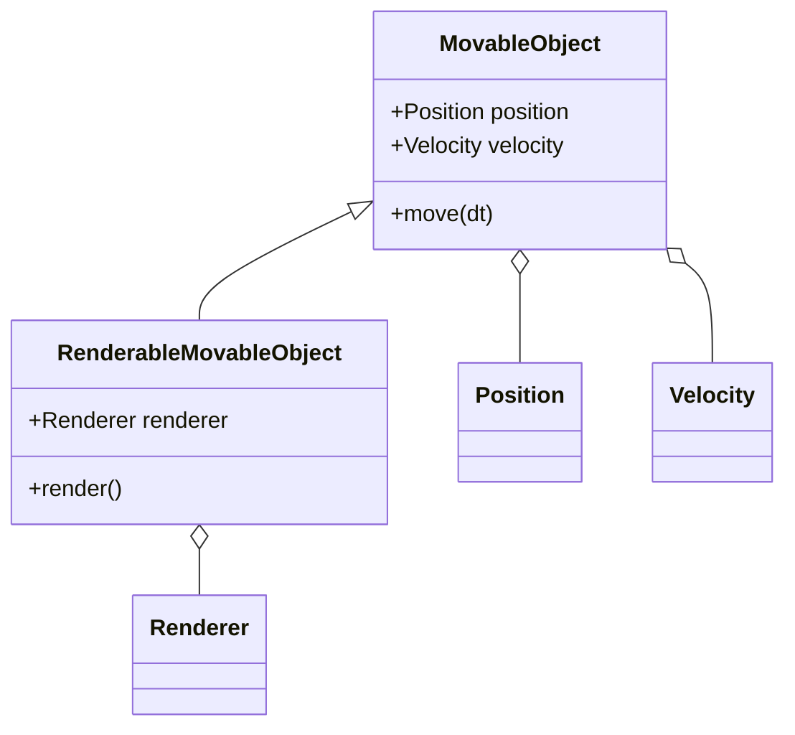

## 4.6 Composition Over Inheritance

In the realm of software design, the debate between composition and inheritance is a long-standing one. Both are powerful tools for code reuse and organization, but they serve different purposes and come with their own sets of advantages and disadvantages. In this section, we will delve into the concept of "Composition Over Inheritance," particularly in the context of Lua programming. We will explore how favoring composition can lead to more flexible, maintainable, and scalable code.

### Understanding Composition and Inheritance

Before we dive into the specifics of composition over inheritance, let's clarify what these terms mean:

- **Inheritance** is a mechanism where a new class is created from an existing class by extending it. This allows the new class to inherit properties and behaviors (methods) from the parent class. Inheritance is a key feature of object-oriented programming (OOP).

- **Composition**, on the other hand, involves building complex functionality by combining simpler, reusable components. Instead of inheriting behavior from a parent class, an object is composed of other objects that provide the desired functionality.

### Why Favor Composition Over Inheritance?

1. **Flexibility**: Composition allows you to change the behavior of a class at runtime by composing it with different objects. This is not possible with inheritance, where the behavior is fixed at compile time.

2. **Reusability**: Components used in composition can be reused across different classes, promoting code reuse without the constraints of a class hierarchy.

3. **Maintainability**: Composition leads to a more modular design. Changes in one component do not necessarily affect others, making the system easier to maintain and extend.

4. **Avoiding the Fragile Base Class Problem**: Inheritance can lead to tightly coupled code, where changes in a base class can inadvertently affect derived classes. Composition avoids this by decoupling the components.

5. **Encapsulation**: Composition promotes encapsulation by keeping the internal workings of components hidden from the rest of the system.

### Composition in Lua

Lua is a flexible language that supports multiple programming paradigms, including procedural, functional, and object-oriented programming. While Lua does not have built-in support for classes and inheritance like some other languages, it provides powerful mechanisms for composition through tables and metatables.

#### Using Tables for Composition

In Lua, tables are the primary data structure and can be used to represent objects. By composing tables, we can build complex objects from simpler ones.

```lua
-- Define a basic component
local function createPositionComponent(x, y)
    return { x = x, y = y }
end

-- Define another component
local function createVelocityComponent(vx, vy)
    return { vx = vx, vy = vy }
end

-- Compose an object using the components
local function createMovableObject(x, y, vx, vy)
    local position = createPositionComponent(x, y)
    local velocity = createVelocityComponent(vx, vy)

    return {
        position = position,
        velocity = velocity,
        move = function(self, dt)
            self.position.x = self.position.x + self.velocity.vx * dt
            self.position.y = self.position.y + self.velocity.vy * dt
        end
    }
end

-- Create a movable object
local obj = createMovableObject(0, 0, 1, 1)
obj:move(1)
print(obj.position.x, obj.position.y)  -- Output: 1 1
```

In this example, we create a `MovableObject` by composing it from `Position` and `Velocity` components. This approach allows us to easily modify or extend the behavior of the object by changing its components.

#### Delegation in Composition

Delegation is a key concept in composition, where an object delegates tasks to its composed objects. This allows for flexible and dynamic behavior.

```lua
-- Define a renderer component
local function createRendererComponent()
    return {
        render = function(self, position)
            print("Rendering at position:", position.x, position.y)
        end
    }
end

-- Extend the movable object with rendering capability
local function createRenderableMovableObject(x, y, vx, vy)
    local obj = createMovableObject(x, y, vx, vy)
    local renderer = createRendererComponent()

    -- Delegate rendering to the renderer component
    obj.render = function(self)
        renderer:render(self.position)
    end

    return obj
end

-- Create a renderable movable object
local renderableObj = createRenderableMovableObject(0, 0, 1, 1)
renderableObj:move(1)
renderableObj:render()  -- Output: Rendering at position: 1 1
```

In this example, the `RenderableMovableObject` delegates the rendering task to the `RendererComponent`. This separation of concerns makes the code more modular and easier to maintain.

### Advantages of Composition

1. **Dynamic Behavior**: By composing objects at runtime, you can change their behavior dynamically without altering their structure.

2. **Simplified Testing**: Each component can be tested independently, making unit testing more straightforward.

3. **Reduced Complexity**: Composition leads to simpler class hierarchies, reducing the complexity of the codebase.

4. **Enhanced Modularity**: Components can be developed and maintained independently, promoting a modular architecture.

### Visualizing Composition Over Inheritance

To better understand the concept, let's visualize the relationship between objects in composition and inheritance using a class diagram.



In this diagram, `MovableObject` is composed of `Position` and `Velocity`, while `RenderableMovableObject` extends `MovableObject` and is composed of a `Renderer`. This illustrates how composition can be used to build complex objects from simpler components.

### When to Use Composition Over Inheritance

- **When you need flexibility**: If your application requires dynamic behavior changes, composition is the way to go.

- **When you want to promote code reuse**: Composition allows you to reuse components across different parts of your application without the constraints of a class hierarchy.

- **When you aim for a modular design**: Composition encourages a modular architecture, making your codebase easier to maintain and extend.

- **When you want to avoid tight coupling**: Composition decouples components, reducing dependencies and making your code more robust.

### Design Considerations

While composition offers many advantages, it's important to consider the following:

- **Complexity**: Overusing composition can lead to a large number of small components, which can be difficult to manage.

- **Performance**: Composing objects at runtime may introduce performance overhead, especially in performance-critical applications.

- **Balance**: Striking the right balance between composition and inheritance is key. Use inheritance when there is a clear "is-a" relationship and composition when there is a "has-a" relationship.

### Differences and Similarities

- **Inheritance** is best suited for situations where there is a clear hierarchical relationship, while **composition** is ideal for building flexible and reusable components.

- Both inheritance and composition can be used to achieve code reuse, but composition offers more flexibility and modularity.

- Inheritance can lead to tightly coupled code, while composition promotes loose coupling.

### Try It Yourself

To deepen your understanding of composition over inheritance, try modifying the code examples provided:

1. **Add a new component**: Create a new component, such as a `HealthComponent`, and integrate it into the `MovableObject`.

2. **Experiment with delegation**: Modify the `RenderableMovableObject` to delegate additional tasks, such as collision detection.

3. **Test dynamic behavior**: Change the components of an object at runtime and observe how it affects the object's behavior.

### Conclusion

Composition over inheritance is a powerful design principle that can lead to more flexible, maintainable, and scalable code. By favoring composition, you can build complex functionality from simple, reusable components, promoting a modular and decoupled architecture. Remember, this is just the beginning. As you progress, you'll discover more ways to leverage composition in your Lua applications. Keep experimenting, stay curious, and enjoy the journey!

## Quiz Time!



### What is the primary advantage of using composition over inheritance?

- [x] Flexibility and dynamic behavior
- [ ] Simplicity and ease of use
- [ ] Stronger type safety
- [ ] Faster execution time

> **Explanation:** Composition allows for flexibility and dynamic behavior by enabling objects to be composed of different components at runtime.

### In Lua, what data structure is primarily used for composition?

- [x] Tables
- [ ] Arrays
- [ ] Strings
- [ ] Functions

> **Explanation:** Tables are the primary data structure in Lua and are used to represent objects and their composition.

### What is delegation in the context of composition?

- [x] Passing tasks to composed objects
- [ ] Inheriting methods from a parent class
- [ ] Overloading operators
- [ ] Encapsulating data

> **Explanation:** Delegation involves passing tasks to composed objects, allowing for flexible and dynamic behavior.

### Which of the following is a disadvantage of overusing composition?

- [x] Complexity in managing numerous small components
- [ ] Tightly coupled code
- [ ] Lack of code reuse
- [ ] Inability to change behavior at runtime

> **Explanation:** Overusing composition can lead to a large number of small components, which can be difficult to manage.

### When should you prefer inheritance over composition?

- [x] When there is a clear "is-a" relationship
- [ ] When you need dynamic behavior
- [ ] When you want to promote loose coupling
- [ ] When you aim for a modular design

> **Explanation:** Inheritance is preferred when there is a clear "is-a" relationship between classes.

### What is the "fragile base class problem"?

- [x] Changes in a base class affecting derived classes
- [ ] Difficulty in managing numerous components
- [ ] Lack of flexibility in behavior
- [ ] Overhead of runtime composition

> **Explanation:** The fragile base class problem occurs when changes in a base class inadvertently affect derived classes.

### How does composition promote encapsulation?

- [x] By keeping the internal workings of components hidden
- [ ] By allowing direct access to component data
- [ ] By inheriting methods from a parent class
- [ ] By using global variables

> **Explanation:** Composition promotes encapsulation by keeping the internal workings of components hidden from the rest of the system.

### What is a key benefit of testing components independently?

- [x] Simplified unit testing
- [ ] Increased execution speed
- [ ] Stronger type safety
- [ ] Reduced memory usage

> **Explanation:** Testing components independently simplifies unit testing, as each component can be tested in isolation.

### What is the relationship between objects in composition?

- [x] "Has-a" relationship
- [ ] "Is-a" relationship
- [ ] "Uses-a" relationship
- [ ] "Depends-on" relationship

> **Explanation:** Composition involves a "has-a" relationship, where objects are composed of other objects.

### True or False: Composition allows for behavior changes at runtime.

- [x] True
- [ ] False

> **Explanation:** Composition allows for behavior changes at runtime by composing objects with different components.


