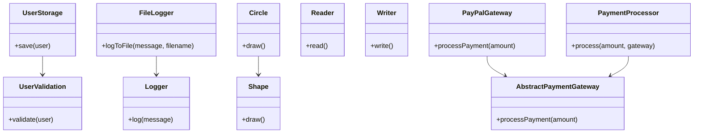

## 4.7 The SOLID Principles Applied to Lua

The SOLID principles are a set of design principles that help software developers create more understandable, flexible, and maintainable software. These principles are particularly useful in object-oriented programming but can be adapted to Lua, which supports multiple programming paradigms, including procedural, object-oriented, and functional programming. In this section, we'll explore how each of the SOLID principles can be applied to Lua, providing you with practical insights and examples to enhance your software design skills.

### Single Responsibility Principle (SRP)

**Definition**: A class or module should have one, and only one, reason to change. This means that each class or module should have only one responsibility or job.

**Application in Lua**: Lua's flexibility allows us to create modules and functions that adhere to the SRP. By ensuring that each function or module has a single responsibility, we can make our code more modular and easier to maintain.

#### Example

Let's consider a simple example where we have a module responsible for handling user data. Initially, this module might handle both data storage and data validation, violating the SRP.

```lua
-- user_module.lua
local UserModule = {}

function UserModule.saveUser(user)
    -- Save user data to a database
    print("User saved:", user.name)
end

function UserModule.validateUser(user)
    -- Validate user data
    if user.name == "" then
        error("User name cannot be empty")
    end
end

return UserModule
```

To adhere to the SRP, we can separate the responsibilities into two distinct modules: one for saving user data and another for validating user data.

```lua
-- user_storage.lua
local UserStorage = {}

function UserStorage.save(user)
    -- Save user data to a database
    print("User saved:", user.name)
end

return UserStorage
```

```lua
-- user_validation.lua
local UserValidation = {}

function UserValidation.validate(user)
    -- Validate user data
    if user.name == "" then
        error("User name cannot be empty")
    end
end

return UserValidation
```

By separating these responsibilities, we make our code more modular and easier to maintain. Each module has a single responsibility and can be modified independently.

### Open/Closed Principle (OCP)

**Definition**: Software entities should be open for extension but closed for modification. This means that the behavior of a module can be extended without modifying its source code.

**Application in Lua**: Lua's metatables and functions allow us to extend the behavior of existing modules without modifying their code directly.

#### Example

Consider a logging module that logs messages to the console. We want to extend this module to log messages to a file without modifying the original code.

```lua
-- logger.lua
local Logger = {}

function Logger.log(message)
    print("Log:", message)
end

return Logger
```

To adhere to the OCP, we can create a new module that extends the behavior of the original logger.

```lua
-- file_logger.lua
local Logger = require("logger")

local FileLogger = {}
setmetatable(FileLogger, { __index = Logger })

function FileLogger.logToFile(message, filename)
    local file = io.open(filename, "a")
    file:write("Log: " .. message .. "\n")
    file:close()
end

return FileLogger
```

In this example, we use Lua's metatables to extend the `Logger` module. The `FileLogger` module can now log messages to both the console and a file without modifying the original `Logger` code.

### Liskov Substitution Principle (LSP)

**Definition**: Subtypes must be substitutable for their base types. This means that objects of a derived class should be able to replace objects of the base class without affecting the correctness of the program.

**Application in Lua**: Lua's prototype-based inheritance allows us to create objects that adhere to the LSP by ensuring that derived objects can be used in place of their base objects.

#### Example

Let's consider a simple example with a base class `Shape` and a derived class `Circle`.

```lua
-- shape.lua
local Shape = {}
Shape.__index = Shape

function Shape:new()
    local instance = setmetatable({}, self)
    return instance
end

function Shape:draw()
    print("Drawing a shape")
end

return Shape
```

```lua
-- circle.lua
local Shape = require("shape")

local Circle = setmetatable({}, { __index = Shape })
Circle.__index = Circle

function Circle:new()
    local instance = setmetatable(Shape:new(), self)
    return instance
end

function Circle:draw()
    print("Drawing a circle")
end

return Circle
```

In this example, the `Circle` class can be used in place of the `Shape` class without affecting the correctness of the program, adhering to the LSP.

### Interface Segregation Principle (ISP)

**Definition**: Prefer many specific interfaces over one general-purpose interface. This means that clients should not be forced to depend on interfaces they do not use.

**Application in Lua**: Lua does not have interfaces in the traditional sense, but we can apply the ISP by creating specific modules or functions that only expose the necessary functionality.

#### Example

Consider a module that provides both reading and writing capabilities. Instead of creating a single module with both capabilities, we can create two separate modules.

```lua
-- reader.lua
local Reader = {}

function Reader.read()
    print("Reading data")
end

return Reader
```

```lua
-- writer.lua
local Writer = {}

function Writer.write()
    print("Writing data")
end

return Writer
```

By separating the reading and writing capabilities into two distinct modules, we adhere to the ISP, allowing clients to depend only on the functionality they need.

### Dependency Inversion Principle (DIP)

**Definition**: Depend on abstractions, not on concrete implementations. This means that high-level modules should not depend on low-level modules, but both should depend on abstractions.

**Application in Lua**: Lua's dynamic typing and flexible module system allow us to implement the DIP by depending on abstract modules or functions rather than concrete implementations.

#### Example

Let's consider a simple example where a `PaymentProcessor` depends on a `PaymentGateway`.

```lua
-- payment_gateway.lua
local PaymentGateway = {}

function PaymentGateway.processPayment(amount)
    print("Processing payment of $" .. amount)
end

return PaymentGateway
```

```lua
-- payment_processor.lua
local PaymentGateway = require("payment_gateway")

local PaymentProcessor = {}

function PaymentProcessor.process(amount)
    PaymentGateway.processPayment(amount)
end

return PaymentProcessor
```

To adhere to the DIP, we can create an abstract `PaymentGateway` interface and implement it with different payment gateways.

```lua
-- abstract_payment_gateway.lua
local AbstractPaymentGateway = {}

function AbstractPaymentGateway.processPayment(amount)
    error("This method should be overridden")
end

return AbstractPaymentGateway
```

```lua
-- paypal_gateway.lua
local AbstractPaymentGateway = require("abstract_payment_gateway")

local PayPalGateway = setmetatable({}, { __index = AbstractPaymentGateway })

function PayPalGateway.processPayment(amount)
    print("Processing PayPal payment of $" .. amount)
end

return PayPalGateway
```

```lua
-- payment_processor.lua
local PaymentProcessor = {}

function PaymentProcessor.process(amount, gateway)
    gateway.processPayment(amount)
end

return PaymentProcessor
```

In this example, the `PaymentProcessor` depends on the abstract `PaymentGateway` interface, allowing us to switch between different payment gateways without modifying the `PaymentProcessor` code.

### Visualizing SOLID Principles in Lua

To better understand how these principles interact, let's visualize the relationships between modules and their responsibilities using a class diagram.



This diagram illustrates how each module adheres to the SOLID principles, promoting modularity, flexibility, and maintainability in your Lua applications.

### Try It Yourself

To reinforce your understanding of the SOLID principles in Lua, try modifying the examples provided:

1. **Single Responsibility Principle**: Create a new module for logging errors separately from general logging.
2. **Open/Closed Principle**: Extend the `FileLogger` to support logging to a network location.
3. **Liskov Substitution Principle**: Add a new shape, such as `Rectangle`, and ensure it can replace `Shape` without issues.
4. **Interface Segregation Principle**: Create a new module for deleting data, separate from reading and writing.
5. **Dependency Inversion Principle**: Implement a new payment gateway, such as `StripeGateway`, and integrate it with the `PaymentProcessor`.

### Knowledge Check

- **What is the main goal of the Single Responsibility Principle?**
- **How can Lua's metatables help in adhering to the Open/Closed Principle?**
- **Why is the Liskov Substitution Principle important in software design?**
- **How can you apply the Interface Segregation Principle in Lua?**
- **What is the benefit of the Dependency Inversion Principle?**

### Embrace the Journey

Remember, mastering the SOLID principles is a journey. As you continue to apply these principles in your Lua projects, you'll find that your code becomes more robust, flexible, and easier to maintain. Keep experimenting, stay curious, and enjoy the process of becoming a more skilled software engineer.

## Quiz Time!



### What does the Single Responsibility Principle (SRP) emphasize?

- [x] Each module or class should have one responsibility.
- [ ] Each module should handle multiple responsibilities.
- [ ] Modules should be open for modification.
- [ ] Modules should depend on concrete implementations.

> **Explanation:** The SRP emphasizes that each module or class should have one responsibility, making it easier to maintain and modify.

### How can the Open/Closed Principle (OCP) be applied in Lua?

- [x] By using metatables to extend functionality without modifying existing code.
- [ ] By modifying existing code directly to add new features.
- [ ] By creating a single module for all functionalities.
- [ ] By using global variables for configuration.

> **Explanation:** The OCP can be applied in Lua by using metatables to extend functionality without modifying existing code, keeping the codebase stable.

### What is the key idea behind the Liskov Substitution Principle (LSP)?

- [x] Subtypes must be substitutable for their base types.
- [ ] Subtypes should have different interfaces than their base types.
- [ ] Subtypes should not be used in place of base types.
- [ ] Subtypes must depend on concrete implementations.

> **Explanation:** The LSP states that subtypes must be substitutable for their base types, ensuring that derived classes can replace base classes without affecting program correctness.

### How does the Interface Segregation Principle (ISP) benefit Lua programming?

- [x] By creating specific modules that expose only necessary functionality.
- [ ] By creating a single module with all functionalities.
- [ ] By using global variables for configuration.
- [ ] By depending on concrete implementations.

> **Explanation:** The ISP benefits Lua programming by creating specific modules that expose only necessary functionality, reducing dependencies and improving modularity.

### What is the main advantage of the Dependency Inversion Principle (DIP)?

- [x] It allows high-level modules to depend on abstractions rather than concrete implementations.
- [ ] It encourages the use of global variables.
- [ ] It requires modifying existing code for new features.
- [ ] It promotes the use of single, large modules.

> **Explanation:** The DIP allows high-level modules to depend on abstractions rather than concrete implementations, promoting flexibility and reducing coupling.

### Which principle suggests that software entities should be open for extension but closed for modification?

- [x] Open/Closed Principle (OCP)
- [ ] Single Responsibility Principle (SRP)
- [ ] Liskov Substitution Principle (LSP)
- [ ] Dependency Inversion Principle (DIP)

> **Explanation:** The Open/Closed Principle (OCP) suggests that software entities should be open for extension but closed for modification.

### How can Lua's prototype-based inheritance support the Liskov Substitution Principle?

- [x] By ensuring derived objects can be used in place of their base objects.
- [ ] By requiring derived objects to have different interfaces.
- [ ] By using global variables for configuration.
- [ ] By modifying base objects directly.

> **Explanation:** Lua's prototype-based inheritance supports the LSP by ensuring derived objects can be used in place of their base objects without affecting program correctness.

### What is a practical way to implement the Interface Segregation Principle in Lua?

- [x] By creating separate modules for different functionalities.
- [ ] By combining all functionalities into a single module.
- [ ] By using global variables for configuration.
- [ ] By depending on concrete implementations.

> **Explanation:** A practical way to implement the ISP in Lua is by creating separate modules for different functionalities, allowing clients to depend only on what they need.

### Why is the Dependency Inversion Principle important in software design?

- [x] It reduces coupling between high-level and low-level modules.
- [ ] It encourages the use of global variables.
- [ ] It requires modifying existing code for new features.
- [ ] It promotes the use of single, large modules.

> **Explanation:** The DIP is important because it reduces coupling between high-level and low-level modules, promoting flexibility and maintainability.

### True or False: The SOLID principles are only applicable to object-oriented programming languages.

- [ ] True
- [x] False

> **Explanation:** False. The SOLID principles can be adapted to various programming paradigms, including procedural and functional programming, as demonstrated with Lua.


