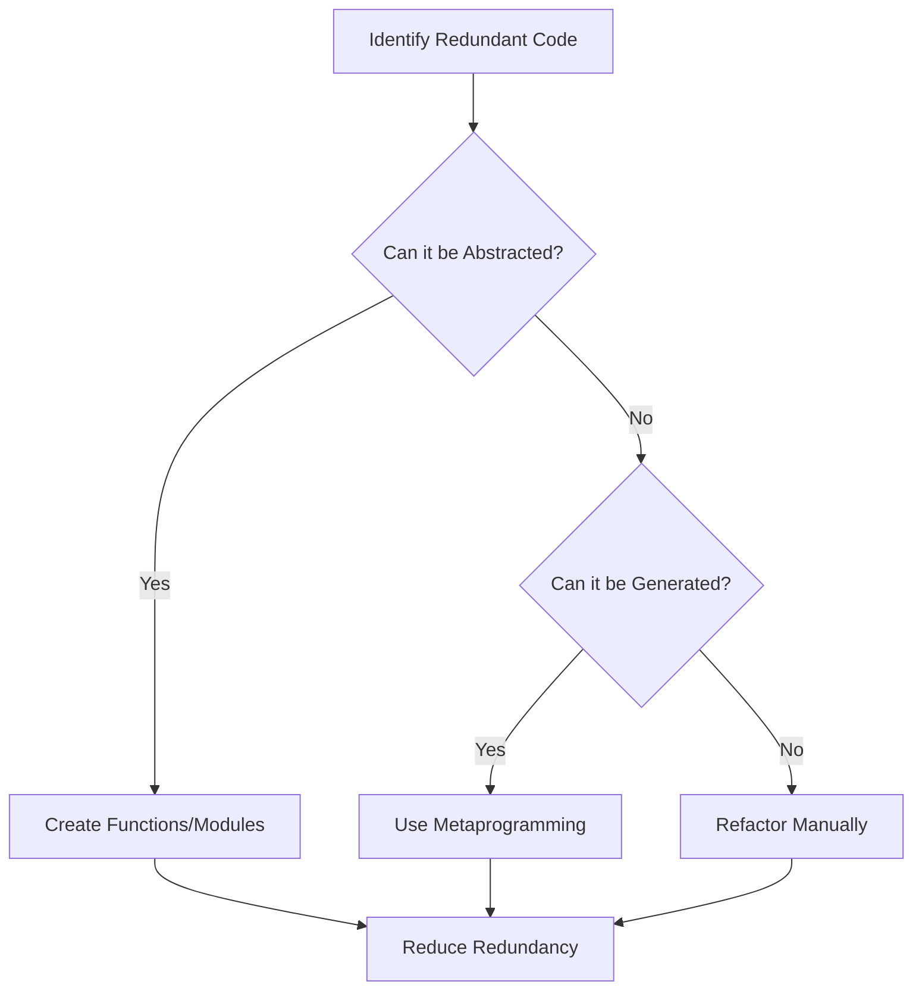

## 4.8 DRY (Don't Repeat Yourself) Principle

In the realm of software development, the DRY (Don't Repeat Yourself) principle stands as a cornerstone of efficient and maintainable code. This principle advocates for the elimination of redundancy by ensuring that every piece of knowledge in a system is represented in a single, unambiguous way. In this section, we will delve into the DRY principle within the context of Lua programming, exploring techniques such as abstraction and code generation to avoid redundant code.

### Understanding the DRY Principle

The DRY principle is a fundamental concept in software engineering that emphasizes the importance of reducing repetition in code. By adhering to this principle, developers can create more maintainable, scalable, and efficient applications. The core idea is to ensure that every piece of knowledge or logic is represented only once within a codebase.

#### Why DRY Matters

- **Maintainability**: Redundant code is harder to maintain. Changes need to be made in multiple places, increasing the risk of errors.
- **Scalability**: As applications grow, duplicated code can lead to inconsistencies and bugs.
- **Efficiency**: Reducing repetition can lead to more efficient code execution and easier optimization.

### Techniques to Avoid Redundant Code

To effectively implement the DRY principle in Lua, we can employ several techniques, including abstraction and code generation. Let's explore these techniques in detail.

#### Abstraction: Creating Functions or Modules for Common Tasks

Abstraction is a powerful tool for reducing code duplication. By abstracting common tasks into functions or modules, we can encapsulate logic and reuse it across different parts of an application.

##### Example: Abstracting Common Logic into Functions

Consider a scenario where we need to calculate the area of different shapes. Instead of writing separate code for each shape, we can abstract the logic into functions.

```lua
-- Function to calculate the area of a rectangle
function calculateRectangleArea(length, width)
    return length * width
end

-- Function to calculate the area of a circle
function calculateCircleArea(radius)
    return math.pi * radius * radius
end

-- Using the functions
local rectangleArea = calculateRectangleArea(5, 10)
local circleArea = calculateCircleArea(7)

print("Rectangle Area: " .. rectangleArea)
print("Circle Area: " .. circleArea)
```

In this example, we have abstracted the logic for calculating areas into separate functions. This approach not only reduces code duplication but also makes the code more readable and maintainable.

##### Creating Reusable Modules

Lua's module system allows us to encapsulate related functions and data into reusable modules. This is particularly useful for organizing code and promoting reuse.

```lua
-- shapes.lua module
local shapes = {}

function shapes.rectangleArea(length, width)
    return length * width
end

function shapes.circleArea(radius)
    return math.pi * radius * radius
end

return shapes
```

```lua
-- main.lua
local shapes = require("shapes")

local rectangleArea = shapes.rectangleArea(5, 10)
local circleArea = shapes.circleArea(7)

print("Rectangle Area: " .. rectangleArea)
print("Circle Area: " .. circleArea)
```

By using modules, we can easily reuse the `shapes` module in different parts of our application, adhering to the DRY principle.

#### Code Generation: Using Metaprogramming to Reduce Repetition

Metaprogramming is a technique that involves writing code that can generate other code. In Lua, metaprogramming can be achieved using features like metatables and metamethods. This approach can be particularly useful for reducing repetition in scenarios where similar code patterns are required.

##### Example: Using Metatables for Dynamic Behavior

Metatables in Lua allow us to define custom behavior for tables, enabling dynamic code generation.

```lua
-- Define a metatable with a custom __index metamethod
local shapeMetatable = {
    __index = function(table, key)
        if key == "area" then
            if table.type == "rectangle" then
                return table.length * table.width
            elseif table.type == "circle" then
                return math.pi * table.radius * table.radius
            end
        end
    end
}

-- Create a rectangle and a circle using the metatable
local rectangle = {type = "rectangle", length = 5, width = 10}
setmetatable(rectangle, shapeMetatable)

local circle = {type = "circle", radius = 7}
setmetatable(circle, shapeMetatable)

print("Rectangle Area: " .. rectangle.area)
print("Circle Area: " .. circle.area)
```

In this example, we use a metatable to dynamically calculate the area of different shapes based on their type. This approach reduces the need for repetitive code and allows for flexible behavior.

### Visualizing the DRY Principle

To better understand the DRY principle and its application in Lua, let's visualize the process of abstraction and code generation using a flowchart.



**Figure 1: Visualizing the DRY Principle in Lua**

This flowchart illustrates the decision-making process for applying the DRY principle. By identifying redundant code, we can determine whether it can be abstracted into functions or modules, generated using metaprogramming, or refactored manually.

### Try It Yourself

To reinforce your understanding of the DRY principle, try modifying the code examples provided. Experiment with creating additional shapes and calculating their areas using abstraction and metaprogramming techniques. Consider how you might further reduce redundancy in your own projects.

### Knowledge Check

- **Question**: What is the primary goal of the DRY principle?
- **Challenge**: Refactor a piece of code in your current project to adhere to the DRY principle.

### Embrace the Journey

Remember, mastering the DRY principle is an ongoing journey. As you continue to develop your skills in Lua, keep exploring new ways to eliminate redundancy and improve code efficiency. Stay curious, experiment with different techniques, and enjoy the process of creating clean and maintainable code.

## Quiz Time!



### What is the main purpose of the DRY principle?

- [x] To eliminate code redundancy
- [ ] To increase code complexity
- [ ] To make code harder to read
- [ ] To reduce code efficiency

> **Explanation:** The DRY principle aims to eliminate code redundancy, making code more maintainable and efficient.

### Which technique is used to encapsulate logic for reuse?

- [x] Abstraction
- [ ] Duplication
- [ ] Hardcoding
- [ ] Obfuscation

> **Explanation:** Abstraction involves encapsulating logic into functions or modules for reuse, reducing redundancy.

### What is metaprogramming used for in Lua?

- [x] Generating code dynamically
- [ ] Increasing code duplication
- [ ] Making code less readable
- [ ] Reducing code efficiency

> **Explanation:** Metaprogramming in Lua is used to generate code dynamically, helping to reduce redundancy.

### What is a benefit of using modules in Lua?

- [x] Code reuse
- [ ] Code duplication
- [ ] Increased complexity
- [ ] Reduced maintainability

> **Explanation:** Modules in Lua promote code reuse, making applications more maintainable and efficient.

### How can metatables help in reducing code repetition?

- [x] By defining custom behavior for tables
- [ ] By increasing code duplication
- [ ] By making code less readable
- [ ] By reducing code efficiency

> **Explanation:** Metatables allow for defining custom behavior for tables, enabling dynamic code generation and reducing repetition.

### What is a key advantage of adhering to the DRY principle?

- [x] Improved maintainability
- [ ] Increased redundancy
- [ ] Reduced readability
- [ ] Increased complexity

> **Explanation:** Adhering to the DRY principle improves maintainability by reducing redundancy and making code easier to manage.

### Which Lua feature is used for dynamic behavior in metaprogramming?

- [x] Metatables
- [ ] Variables
- [ ] Constants
- [ ] Functions

> **Explanation:** Metatables in Lua are used for defining dynamic behavior, aiding in metaprogramming.

### What should you do if code cannot be abstracted or generated?

- [x] Refactor manually
- [ ] Increase duplication
- [ ] Ignore the redundancy
- [ ] Make code less readable

> **Explanation:** If code cannot be abstracted or generated, it should be refactored manually to reduce redundancy.

### What is the result of applying the DRY principle?

- [x] Reduced redundancy
- [ ] Increased complexity
- [ ] Decreased maintainability
- [ ] Increased code duplication

> **Explanation:** Applying the DRY principle results in reduced redundancy, improving code maintainability and efficiency.

### True or False: The DRY principle is only applicable to Lua programming.

- [ ] True
- [x] False

> **Explanation:** The DRY principle is a universal software engineering concept applicable to all programming languages, not just Lua.



By embracing the DRY principle and applying the techniques discussed, you can create more efficient and maintainable Lua applications. Keep experimenting, stay curious, and enjoy the journey of mastering code efficiency!
