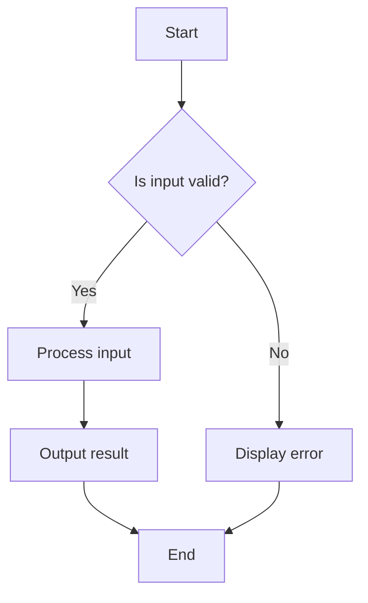

## 4.9 KISS (Keep It Simple, Stupid)

In the realm of software engineering, the KISS principle—Keep It Simple, Stupid—is a guiding philosophy that emphasizes simplicity in design and implementation. This principle is particularly relevant in Lua programming, where the language's flexibility and dynamic nature can sometimes lead developers to create overly complex solutions. In this section, we will delve into the importance of the KISS principle, how it can be applied in Lua, and the benefits it brings to software development.

### Simplicity in Design

The core idea of the KISS principle is to strive for straightforward solutions that are easy to understand and maintain. Simplicity in design does not mean sacrificing functionality or robustness; rather, it involves finding the most efficient way to achieve a goal without unnecessary complexity.

#### Why Simplicity Matters

1. **Ease of Understanding**: Simple code is easier to read and understand, which is crucial for collaboration and future maintenance.
2. **Reduced Errors**: Complex code is more prone to bugs and errors. By keeping things simple, you minimize the risk of introducing defects.
3. **Faster Development**: Simplicity often leads to faster development times, as there are fewer components to design, implement, and test.
4. **Improved Maintainability**: Simple code is easier to modify and extend, making it more adaptable to changing requirements.

### Avoiding Over-Engineering

Over-engineering occurs when developers add unnecessary features or complexity to a system. This can happen when trying to anticipate future needs or when attempting to create a "perfect" solution. In Lua, over-engineering can manifest as overly complex metatables, intricate coroutine structures, or excessive use of global variables.

#### Strategies to Avoid Over-Engineering

- **Focus on Current Requirements**: Implement only what is necessary to meet the current requirements. Avoid adding features that are not immediately needed.
- **Iterative Development**: Use an iterative approach to development, where features are added incrementally based on feedback and evolving needs.
- **Refactoring**: Regularly refactor code to simplify and improve it, removing any unnecessary complexity that may have been introduced.
- **Use Design Patterns Wisely**: While design patterns can be powerful, they should be used judiciously. Avoid applying patterns that add unnecessary complexity.

### Readability and Maintenance

Readable code is a cornerstone of maintainable software. By adhering to the KISS principle, you enhance the readability of your Lua code, making it easier for others (and yourself) to work with it in the future.

#### Tips for Enhancing Readability

- **Consistent Naming Conventions**: Use clear and consistent naming conventions for variables, functions, and modules.
- **Commenting and Documentation**: Provide meaningful comments and documentation to explain the purpose and functionality of code segments.
- **Modular Code**: Break down complex functions into smaller, more manageable pieces. Use modules to organize related functionality.
- **Avoid Deep Nesting**: Limit the depth of nested structures, such as loops and conditionals, to improve readability.

### Code Examples

Let's explore some Lua code examples that illustrate the KISS principle in action.

#### Example 1: Simple Function Design

Consider a function that calculates the factorial of a number. A simple implementation might look like this:

```lua
-- Function to calculate factorial
local function factorial(n)
    if n == 0 then
        return 1
    else
        return n * factorial(n - 1)
    end
end

-- Test the function
print(factorial(5))  -- Output: 120
```

This implementation is straightforward and easy to understand. It uses recursion to calculate the factorial, which is a simple and elegant solution for this problem.

#### Example 2: Avoiding Over-Engineering

Suppose you need to create a configuration loader for a Lua application. An over-engineered solution might involve complex metatables and dynamic loading mechanisms. Instead, a simple approach could be:

```lua
-- Simple configuration loader
local config = {
    database = {
        host = "localhost",
        port = 3306,
        user = "root",
        password = "password"
    },
    application = {
        name = "MyApp",
        version = "1.0"
    }
}

-- Access configuration
print(config.database.host)  -- Output: localhost
```

This approach uses a simple table to store configuration settings, making it easy to read and modify.

### Visualizing Simplicity

To better understand the impact of simplicity in design, let's visualize the difference between a simple and a complex solution using a flowchart.



This flowchart represents a simple decision-making process. By keeping the logic straightforward, we ensure that the process is easy to follow and understand.

### Try It Yourself

To reinforce the KISS principle, try modifying the code examples above. For instance, experiment with adding error handling to the factorial function or extending the configuration loader to support additional settings. Remember to keep your changes simple and focused on the task at hand.

### References and Further Reading

For more information on the KISS principle and its application in software development, consider exploring the following resources:

- [Wikipedia: KISS Principle](https://en.wikipedia.org/wiki/KISS_principle)
- [MDN Web Docs: Simplicity](https://developer.mozilla.org/en-US/docs/MDN/Guidelines/Writing_style_guide/Simplicity)
- [W3Schools: Lua Tutorial](https://www.w3schools.com/lua/)

### Knowledge Check

To test your understanding of the KISS principle, consider the following questions:

1. What are the main benefits of keeping code simple?
2. How can over-engineering negatively impact a project?
3. What strategies can be used to enhance code readability?
4. Why is it important to focus on current requirements rather than future possibilities?

### Embrace the Journey

Remember, simplicity is a journey, not a destination. As you continue to develop your skills in Lua programming, strive to keep your solutions simple and elegant. By doing so, you'll create software that is not only effective but also enjoyable to work with. Keep experimenting, stay curious, and enjoy the journey!

## Quiz Time!



### What is the primary goal of the KISS principle in software design?

- [x] To simplify code and make it easier to understand and maintain
- [ ] To add as many features as possible
- [ ] To use complex algorithms for efficiency
- [ ] To prioritize future requirements over current needs

> **Explanation:** The KISS principle emphasizes simplicity in code design, making it easier to understand and maintain.

### Which of the following is a benefit of simple code?

- [x] Easier to read and understand
- [ ] More prone to errors
- [ ] Requires more time to develop
- [ ] Harder to modify

> **Explanation:** Simple code is easier to read and understand, which reduces the likelihood of errors and makes it easier to modify.

### What is a common pitfall of over-engineering?

- [x] Adding unnecessary complexity
- [ ] Simplifying code too much
- [ ] Ignoring future requirements
- [ ] Using too few design patterns

> **Explanation:** Over-engineering involves adding unnecessary complexity, which can make code harder to understand and maintain.

### How can you enhance the readability of your code?

- [x] Use consistent naming conventions
- [ ] Avoid commenting
- [ ] Use deep nesting
- [ ] Write long, complex functions

> **Explanation:** Consistent naming conventions improve code readability, while deep nesting and long functions can hinder it.

### Why is it important to focus on current requirements?

- [x] To avoid over-engineering
- [ ] To anticipate all future needs
- [ ] To use the latest technologies
- [ ] To implement complex solutions

> **Explanation:** Focusing on current requirements helps avoid over-engineering by preventing the addition of unnecessary features.

### What is a simple way to store configuration settings in Lua?

- [x] Use a table
- [ ] Use a complex metatable
- [ ] Use a dynamic loading mechanism
- [ ] Use global variables

> **Explanation:** Using a table is a simple and effective way to store configuration settings in Lua.

### What is the impact of deep nesting on code readability?

- [x] It decreases readability
- [ ] It increases readability
- [ ] It has no impact
- [ ] It simplifies the code

> **Explanation:** Deep nesting decreases readability by making code harder to follow.

### What is a key characteristic of simple code?

- [x] It is easy to modify and extend
- [ ] It is difficult to understand
- [ ] It requires more resources
- [ ] It is less efficient

> **Explanation:** Simple code is easy to modify and extend, which enhances maintainability.

### What should you avoid when applying design patterns?

- [x] Adding unnecessary complexity
- [ ] Using patterns judiciously
- [ ] Simplifying code
- [ ] Enhancing readability

> **Explanation:** Design patterns should be used judiciously to avoid adding unnecessary complexity.

### True or False: The KISS principle encourages adding features for future needs.

- [ ] True
- [x] False

> **Explanation:** The KISS principle discourages adding features for future needs, focusing instead on current requirements.


