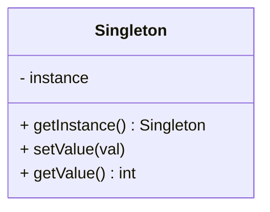

## 5.1 Singleton Pattern

The Singleton Pattern is a creational design pattern that ensures a class has only one instance and provides a global point of access to that instance. This pattern is particularly useful in scenarios where a single object is needed to coordinate actions across a system, such as managing configuration settings or handling resource management. In this section, we will delve into the Singleton Pattern in Lua, exploring its implementation, variations, and practical applications.

### Intent

The primary intent of the Singleton Pattern is to restrict the instantiation of a class to a single object. This is achieved by:

- Ensuring that only one instance of the class exists.
- Providing a global point of access to the instance.
- Controlling access to shared resources or configurations.

### Implementing Singleton in Lua

Lua, being a lightweight and flexible scripting language, provides unique ways to implement the Singleton Pattern. Let's explore how we can achieve this using Lua's features.

#### Utilizing Tables to Store the Single Instance

In Lua, tables are the primary data structure and can be used to store the single instance of a class. Here's a basic implementation of the Singleton Pattern using tables:

```lua
-- Singleton.lua
local Singleton = {}
Singleton.__index = Singleton

-- Private instance variable
local instance

-- Private constructor
local function new()
    local self = setmetatable({}, Singleton)
    -- Initialize your singleton instance variables here
    self.value = 0
    return self
end

-- Public method to get the instance
function Singleton:getInstance()
    if not instance then
        instance = new()
    end
    return instance
end

-- Example method
function Singleton:setValue(val)
    self.value = val
end

function Singleton:getValue()
    return self.value
end

return Singleton
```

In this implementation:

- We define a `Singleton` table to represent our class.
- A private `instance` variable holds the single instance.
- The `new` function acts as a private constructor.
- The `getInstance` method checks if an instance exists; if not, it creates one.
- We provide methods to interact with the singleton instance.

#### Preventing External Creation of New Instances

To ensure that no external code can create new instances, we encapsulate the constructor logic within the module and expose only the `getInstance` method. This approach prevents direct instantiation and maintains a single instance.

#### Thread Safety Considerations

In multi-threaded environments, ensuring thread safety is crucial. Lua itself does not natively support multi-threading, but when used in environments like OpenResty or with LuaJIT, thread safety can become a concern. To handle this, consider using locks or atomic operations to manage access to the singleton instance.

### Monostate Pattern

The Monostate Pattern is a variation of the Singleton Pattern where multiple instances share the same state. This pattern can be useful when you want to allow multiple objects but ensure they behave as if they are a single instance.

#### Implementing Monostate in Lua

```lua
-- Monostate.lua
local Monostate = {}
Monostate.__index = Monostate

-- Shared state table
local sharedState = {
    value = 0
}

function Monostate:new()
    local self = setmetatable({}, Monostate)
    return self
end

function Monostate:setValue(val)
    sharedState.value = val
end

function Monostate:getValue()
    return sharedState.value
end

return Monostate
```

In this implementation:

- We use a `sharedState` table to hold the common state.
- Each instance of `Monostate` accesses and modifies the shared state.

### Use Cases and Examples

The Singleton Pattern is widely used in software development for various purposes. Here are some common use cases:

#### Managing Configuration Settings

Singletons are ideal for managing configuration settings that need to be accessed globally across an application. By storing configuration data in a singleton, you ensure consistency and avoid redundant data.

```lua
-- ConfigManager.lua
local ConfigManager = {}
ConfigManager.__index = ConfigManager

local instance

local function new()
    local self = setmetatable({}, ConfigManager)
    self.config = {
        setting1 = "default1",
        setting2 = "default2"
    }
    return self
end

function ConfigManager:getInstance()
    if not instance then
        instance = new()
    end
    return instance
end

function ConfigManager:getSetting(key)
    return self.config[key]
end

function ConfigManager:setSetting(key, value)
    self.config[key] = value
end

return ConfigManager
```

#### Resource Managers

Singletons can also be used to manage resources such as database connections or file handles, ensuring that only one connection or handle is active at a time.

```lua
-- ResourceManager.lua
local ResourceManager = {}
ResourceManager.__index = ResourceManager

local instance

local function new()
    local self = setmetatable({}, ResourceManager)
    self.resources = {}
    return self
end

function ResourceManager:getInstance()
    if not instance then
        instance = new()
    end
    return instance
end

function ResourceManager:addResource(name, resource)
    self.resources[name] = resource
end

function ResourceManager:getResource(name)
    return self.resources[name]
end

return ResourceManager
```

### Design Considerations

When implementing the Singleton Pattern in Lua, consider the following:

- **Lazy Initialization**: Create the instance only when it is needed to save resources.
- **Global Access**: Ensure that the singleton instance is easily accessible throughout the application.
- **Thread Safety**: If your environment supports multi-threading, ensure that the singleton is thread-safe.
- **Testing**: Singleton patterns can be challenging to test due to their global state. Consider using dependency injection or mock objects to facilitate testing.

### Differences and Similarities

The Singleton Pattern is often compared to the Monostate Pattern. While both ensure a single point of access, the Singleton Pattern restricts instantiation to one object, whereas the Monostate Pattern allows multiple instances that share the same state.

### Try It Yourself

Experiment with the Singleton Pattern by modifying the code examples:

- Add additional methods to the `Singleton` or `Monostate` classes.
- Implement a thread-safe singleton using LuaJIT's FFI for atomic operations.
- Create a singleton that manages a different type of resource, such as a network connection.

### Visualizing the Singleton Pattern

To better understand the Singleton Pattern, let's visualize its structure using a class diagram:



**Diagram Description**: This class diagram represents the Singleton Pattern in Lua. The `Singleton` class has a private `instance` variable and public methods `getInstance`, `setValue`, and `getValue`.

### Knowledge Check

- What is the primary purpose of the Singleton Pattern?
- How does the Monostate Pattern differ from the Singleton Pattern?
- Why is thread safety important in Singleton implementations?
- What are some common use cases for the Singleton Pattern?

### Embrace the Journey

Remember, mastering design patterns is a journey. As you explore the Singleton Pattern, consider how it can be applied to your projects. Experiment with different implementations and variations, and don't hesitate to dive deeper into Lua's capabilities. Keep learning, stay curious, and enjoy the process!

## Quiz Time!



### What is the primary purpose of the Singleton Pattern?

- [x] To ensure a class has only one instance
- [ ] To allow multiple instances of a class
- [ ] To provide a blueprint for creating objects
- [ ] To encapsulate a group of individual factories

> **Explanation:** The Singleton Pattern ensures that a class has only one instance and provides a global point of access to it.

### How does the Monostate Pattern differ from the Singleton Pattern?

- [x] Monostate allows multiple instances sharing the same state
- [ ] Monostate restricts instantiation to one object
- [ ] Monostate provides a global point of access
- [ ] Monostate is unrelated to Singleton

> **Explanation:** The Monostate Pattern allows multiple instances to share the same state, unlike the Singleton Pattern which restricts instantiation to a single object.

### Why is thread safety important in Singleton implementations?

- [x] To prevent multiple threads from creating multiple instances
- [ ] To allow multiple threads to access the instance simultaneously
- [ ] To ensure the instance is created eagerly
- [ ] To provide a global point of access

> **Explanation:** Thread safety is important to prevent multiple threads from creating multiple instances of the Singleton, which would violate the pattern's intent.

### What is a common use case for the Singleton Pattern?

- [x] Managing configuration settings
- [ ] Creating multiple instances of a class
- [ ] Implementing a factory method
- [ ] Encapsulating a group of related objects

> **Explanation:** A common use case for the Singleton Pattern is managing configuration settings that need to be accessed globally across an application.

### Which Lua feature is primarily used to implement the Singleton Pattern?

- [x] Tables
- [ ] Functions
- [ ] Coroutines
- [ ] Metatables

> **Explanation:** Tables are the primary data structure in Lua and are used to store the single instance in the Singleton Pattern.

### What is lazy initialization in the context of the Singleton Pattern?

- [x] Creating the instance only when it is needed
- [ ] Creating the instance at the start of the program
- [ ] Creating multiple instances
- [ ] Sharing state across instances

> **Explanation:** Lazy initialization refers to creating the singleton instance only when it is needed, which can save resources.

### How can you prevent external creation of new instances in a Singleton?

- [x] Encapsulate the constructor logic within the module
- [ ] Expose the constructor publicly
- [ ] Use global variables
- [ ] Allow direct instantiation

> **Explanation:** Encapsulating the constructor logic within the module and exposing only the `getInstance` method prevents external creation of new instances.

### What is a potential challenge when testing Singleton Patterns?

- [x] Global state can make testing difficult
- [ ] Singleton patterns are easy to test
- [ ] Singleton patterns do not require testing
- [ ] Singleton patterns are unrelated to testing

> **Explanation:** Singleton patterns can be challenging to test due to their global state. Dependency injection or mock objects can help facilitate testing.

### What is the role of the `getInstance` method in a Singleton?

- [x] To provide access to the single instance
- [ ] To create multiple instances
- [ ] To encapsulate related objects
- [ ] To define a blueprint for objects

> **Explanation:** The `getInstance` method provides access to the single instance of the Singleton, ensuring that only one instance exists.

### True or False: The Singleton Pattern is often used for resource management.

- [x] True
- [ ] False

> **Explanation:** True. The Singleton Pattern is often used for managing resources such as database connections or file handles, ensuring that only one connection or handle is active at a time.


