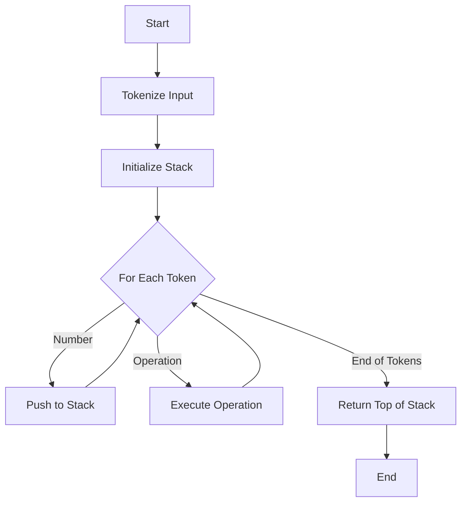

## 5.10 Bootstrapping Languages: Implementing a Forth Interpreter in Lua

In this section, we delve into the fascinating world of language implementation by creating a Forth interpreter using Lua. This exercise not only demonstrates the power and flexibility of Lua but also provides valuable insights into the workings of interpreters and language design.

### Language Implementation as a Pattern: Demonstrating Bootstrapping in Lua

Bootstrapping a language involves creating a simple interpreter or compiler for a language using another language. This process is a powerful exercise in understanding both the source and target languages. Here, we will use Lua to implement a Forth interpreter, showcasing Lua's capabilities in handling language constructs and execution.

### Understanding Forth

Forth is a stack-based, extensible programming language known for its simplicity and minimalistic syntax. It operates primarily through a stack, where operations are performed using a postfix notation (also known as Reverse Polish Notation). This means that operators follow their operands, allowing for efficient execution without the need for parentheses to dictate operation precedence.

#### Key Characteristics of Forth

- **Stack-Based Execution**: Forth uses a stack to hold data and perform operations. This stack-based approach simplifies the language's syntax and execution model.
- **Postfix Notation**: Operations are written in postfix notation, which eliminates the need for parentheses and operator precedence rules.
- **Extensibility**: Forth allows users to define new words (functions) easily, making it highly extensible.
- **Minimalistic Syntax**: The language has a very simple syntax, which makes it easy to parse and execute.

### Building the Interpreter

To build a Forth interpreter in Lua, we will follow a structured approach that involves parsing Forth code, managing a stack, and executing operations. Let's break down the process into manageable steps.

#### Step 1: Setting Up the Environment

First, ensure that you have Lua installed on your system. You can download and install Lua from the [official Lua website](https://www.lua.org/download.html).

#### Step 2: Parsing Forth Code

Parsing is the process of analyzing a sequence of tokens to determine its grammatical structure. In our Forth interpreter, we will parse the input code into tokens that represent numbers and operations.

```lua
-- Tokenize the input string into words
function tokenize(input)
    local tokens = {}
    for word in string.gmatch(input, "%S+") do
        table.insert(tokens, word)
    end
    return tokens
end
```

#### Step 3: Implementing the Stack

The stack is a fundamental component of Forth. We will implement a simple stack using Lua tables.

```lua
-- Stack implementation using Lua tables
Stack = {}
function Stack:new()
    local stack = {items = {}}
    setmetatable(stack, self)
    self.__index = self
    return stack
end

function Stack:push(item)
    table.insert(self.items, item)
end

function Stack:pop()
    return table.remove(self.items)
end

function Stack:peek()
    return self.items[#self.items]
end
```

#### Step 4: Executing Forth Operations

Next, we need to define the operations that our interpreter will support. These operations will manipulate the stack based on the Forth code.

```lua
-- Define basic Forth operations
function execute(stack, token)
    if tonumber(token) then
        stack:push(tonumber(token))
    elseif token == "+" then
        local b = stack:pop()
        local a = stack:pop()
        stack:push(a + b)
    elseif token == "-" then
        local b = stack:pop()
        local a = stack:pop()
        stack:push(a - b)
    elseif token == "*" then
        local b = stack:pop()
        local a = stack:pop()
        stack:push(a * b)
    elseif token == "/" then
        local b = stack:pop()
        local a = stack:pop()
        stack:push(a / b)
    else
        error("Unknown operation: " .. token)
    end
end
```

#### Step 5: Running the Interpreter

With the stack and operations in place, we can now run the interpreter by processing each token in the input.

```lua
-- Run the Forth interpreter
function runForth(input)
    local tokens = tokenize(input)
    local stack = Stack:new()
    for _, token in ipairs(tokens) do
        execute(stack, token)
    end
    return stack:peek()
end

-- Example usage
local result = runForth("3 4 + 2 *")
print("Result:", result)  -- Output: Result: 14
```

### Educational Insights

Implementing a Forth interpreter in Lua provides several educational benefits:

- **Understanding Interpreters**: This exercise helps you understand how interpreters work, including parsing, execution, and error handling.
- **Language Design**: You gain insights into language design principles, such as stack-based execution and extensibility.
- **Lua's Flexibility**: This project showcases Lua's flexibility in handling different programming paradigms and language constructs.

### Visualizing the Forth Interpreter

To better understand the flow of our Forth interpreter, let's visualize the process using a flowchart.



### Try It Yourself

Now that you have a basic Forth interpreter, try extending it with additional operations or features. Here are some ideas:

- **Add More Operations**: Implement additional arithmetic operations, such as modulus or exponentiation.
- **Define New Words**: Allow users to define new words (functions) in Forth.
- **Implement Control Structures**: Add support for conditional statements and loops.

### References and Links

For further reading on Forth and language implementation, consider the following resources:

- [Forth Programming Language](https://en.wikipedia.org/wiki/Forth_(programming_language))
- [Lua Official Documentation](https://www.lua.org/manual/5.4/)
- [Building Language Interpreters](https://craftinginterpreters.com/)

### Knowledge Check

Before we conclude, let's test your understanding with a few questions:

1. What is the primary data structure used in Forth?
2. How does postfix notation differ from infix notation?
3. What are some benefits of implementing a language interpreter?

### Embrace the Journey

Remember, this is just the beginning. As you progress, you'll build more complex language interpreters and compilers. Keep experimenting, stay curious, and enjoy the journey!

## Quiz Time!



### What is the primary data structure used in Forth?

- [x] Stack
- [ ] Queue
- [ ] Array
- [ ] Linked List

> **Explanation:** Forth is a stack-based language, meaning it primarily uses a stack to hold data and perform operations.

### How does postfix notation differ from infix notation?

- [x] Operators follow operands
- [ ] Operators precede operands
- [ ] Operands are separated by commas
- [ ] Parentheses are required

> **Explanation:** In postfix notation, operators follow their operands, eliminating the need for parentheses to dictate operation precedence.

### What is a key characteristic of Forth?

- [x] Extensibility
- [ ] Strong typing
- [ ] Object-oriented
- [ ] Static typing

> **Explanation:** Forth is known for its extensibility, allowing users to easily define new words (functions).

### What is the role of the stack in a Forth interpreter?

- [x] To hold data and perform operations
- [ ] To manage memory allocation
- [ ] To store variables
- [ ] To handle input/output

> **Explanation:** The stack in a Forth interpreter is used to hold data and perform operations, which is central to the language's execution model.

### Which language feature is demonstrated by implementing a Forth interpreter in Lua?

- [x] Flexibility
- [ ] Static typing
- [ ] Strong typing
- [ ] Object-oriented programming

> **Explanation:** Implementing a Forth interpreter in Lua demonstrates Lua's flexibility in handling different programming paradigms and language constructs.

### What is the first step in building a Forth interpreter?

- [x] Tokenizing the input
- [ ] Executing operations
- [ ] Initializing the stack
- [ ] Parsing the syntax tree

> **Explanation:** The first step in building a Forth interpreter is to tokenize the input, breaking it down into manageable pieces for further processing.

### What is a benefit of implementing a language interpreter?

- [x] Understanding language design principles
- [ ] Improving memory management
- [ ] Enhancing user interface design
- [ ] Increasing network security

> **Explanation:** Implementing a language interpreter helps in understanding language design principles, such as parsing and execution.

### What does the `execute` function do in the Forth interpreter?

- [x] Executes operations on the stack
- [ ] Initializes the stack
- [ ] Tokenizes the input
- [ ] Parses the syntax tree

> **Explanation:** The `execute` function in the Forth interpreter is responsible for executing operations on the stack based on the parsed tokens.

### What is a potential extension for the Forth interpreter?

- [x] Implementing control structures
- [ ] Adding graphical user interface
- [ ] Enhancing network capabilities
- [ ] Improving database connectivity

> **Explanation:** A potential extension for the Forth interpreter is to implement control structures, such as conditional statements and loops.

### True or False: Forth uses infix notation for operations.

- [ ] True
- [x] False

> **Explanation:** Forth uses postfix notation, where operators follow their operands, unlike infix notation where operators are placed between operands.


