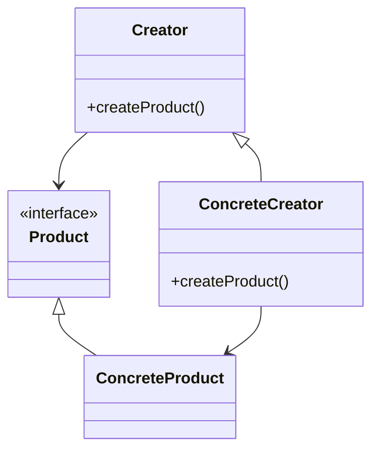

## 5.2 Factory Method Pattern

The Factory Method Pattern is a creational design pattern that provides an interface for creating objects in a superclass, but allows subclasses to alter the type of objects that will be created. This pattern is particularly useful in Lua, where it can help manage the creation of complex objects and promote code reusability and flexibility.

### Defining an Interface for Creation

The core idea of the Factory Method Pattern is to define an interface for creating an object, but let subclasses decide which class to instantiate. This pattern delegates the responsibility of object instantiation to subclasses, promoting loose coupling and scalability.

#### Implementing Factory Method in Lua

In Lua, implementing the Factory Method Pattern involves using functions to create objects, encapsulating the object creation logic, and extending factories for new product types. Let's break down these components:

1. **Using Functions to Create Objects**: Lua's first-class functions make it an ideal language for implementing factory methods. You can define a function that returns a new object, encapsulating the creation logic within the function.

2. **Encapsulating Object Creation Logic**: By encapsulating the creation logic, you can change the way objects are created without affecting the rest of your code. This is particularly useful for managing dependencies and ensuring that objects are created consistently.

3. **Extending Factories for New Product Types**: As your application grows, you may need to create new types of objects. The Factory Method Pattern allows you to extend your factories to handle new product types without modifying existing code.

#### Example: Creating Different Types of Game Objects

Let's consider a scenario where we need to create different types of game objects, such as enemies and power-ups. We can use the Factory Method Pattern to manage the creation of these objects.

```lua
-- Define a base class for game objects
GameObject = {}
GameObject.__index = GameObject

function GameObject:new(type)
    local obj = setmetatable({}, self)
    obj.type = type or "generic"
    return obj
end

function GameObject:describe()
    print("This is a " .. self.type .. " game object.")
end

-- Define a factory method for creating game objects
function createGameObject(type)
    if type == "enemy" then
        return GameObject:new("enemy")
    elseif type == "power-up" then
        return GameObject:new("power-up")
    else
        return GameObject:new()
    end
end

-- Usage
local enemy = createGameObject("enemy")
enemy:describe()  -- Output: This is a enemy game object.

local powerUp = createGameObject("power-up")
powerUp:describe()  -- Output: This is a power-up game object.
```

In this example, the `createGameObject` function acts as a factory method, creating different types of game objects based on the input type.

### Factory Kit Pattern

The Factory Kit Pattern is an extension of the Factory Method Pattern that groups related factory methods together. This pattern simplifies the addition of new products by organizing factory methods into a cohesive unit.

#### Implementing the Factory Kit Pattern

To implement the Factory Kit Pattern in Lua, you can create a table that contains multiple factory methods, each responsible for creating a specific type of object. This approach provides a centralized location for all factory methods, making it easier to manage and extend.

```lua
-- Define a factory kit for game objects
GameObjectFactory = {
    createEnemy = function()
        return GameObject:new("enemy")
    end,
    createPowerUp = function()
        return GameObject:new("power-up")
    end,
    createGeneric = function()
        return GameObject:new()
    end
}

-- Usage
local enemy = GameObjectFactory.createEnemy()
enemy:describe()  -- Output: This is a enemy game object.

local powerUp = GameObjectFactory.createPowerUp()
powerUp:describe()  -- Output: This is a power-up game object.
```

In this example, the `GameObjectFactory` table acts as a factory kit, grouping related factory methods together. This approach makes it easy to add new factory methods as needed.

### Use Cases and Examples

The Factory Method Pattern is versatile and can be applied to various scenarios. Here are some common use cases:

1. **Creating Different Types of Game Objects**: As demonstrated in the examples above, the Factory Method Pattern is ideal for managing the creation of different types of game objects, such as enemies, power-ups, and NPCs.

2. **Managing Different GUI Components**: In GUI applications, you may need to create different types of components, such as buttons, text fields, and sliders. The Factory Method Pattern can help manage the creation of these components, ensuring consistency and flexibility.

3. **Extending Libraries or Frameworks**: When working with libraries or frameworks, you may need to extend existing classes or create new ones. The Factory Method Pattern allows you to encapsulate the creation logic, making it easier to integrate with existing code.

### Visualizing the Factory Method Pattern

To better understand the Factory Method Pattern, let's visualize the relationships between the components using a class diagram.



In this diagram, the `Creator` class defines the factory method `createProduct`, which is overridden by the `ConcreteCreator` class to create instances of `ConcreteProduct`. The `Product` interface represents the type of objects created by the factory method.

### Design Considerations

When implementing the Factory Method Pattern in Lua, consider the following design considerations:

- **When to Use**: Use the Factory Method Pattern when you need to delegate the responsibility of object creation to subclasses. This pattern is particularly useful when the exact type of object to be created is not known until runtime.

- **Encapsulation**: Encapsulate the object creation logic within factory methods to promote code reusability and maintainability.

- **Extensibility**: Design your factories to be easily extensible, allowing new product types to be added without modifying existing code.

- **Performance**: Consider the performance implications of using factory methods, especially in performance-critical applications. While the pattern promotes flexibility, it may introduce additional overhead.

### Differences and Similarities

The Factory Method Pattern is often confused with other creational patterns, such as the Abstract Factory Pattern. Here are some key differences and similarities:

- **Factory Method vs. Abstract Factory**: The Factory Method Pattern focuses on creating a single product, while the Abstract Factory Pattern provides an interface for creating families of related products. The Abstract Factory Pattern is more complex and is used when multiple related products need to be created.

- **Similarities**: Both patterns promote loose coupling and encapsulate object creation logic. They are used to manage the creation of objects and promote code reusability.

### Try It Yourself

To deepen your understanding of the Factory Method Pattern, try modifying the code examples provided:

- **Add New Game Object Types**: Extend the `createGameObject` function or `GameObjectFactory` table to support new types of game objects, such as "boss" or "ally".

- **Implement a GUI Component Factory**: Create a factory method for managing the creation of different GUI components, such as buttons and sliders.

- **Experiment with Performance**: Measure the performance of your factory methods in a large-scale application and explore ways to optimize them.

### Knowledge Check

To reinforce your understanding of the Factory Method Pattern, consider the following questions:

- What is the primary purpose of the Factory Method Pattern?
- How does the Factory Method Pattern promote code reusability and flexibility?
- What are some common use cases for the Factory Method Pattern?
- How does the Factory Method Pattern differ from the Abstract Factory Pattern?

### Embrace the Journey

Remember, mastering design patterns is a journey. As you continue to explore and experiment with the Factory Method Pattern, you'll gain a deeper understanding of its benefits and applications. Keep experimenting, stay curious, and enjoy the journey!

## Quiz Time!



### What is the primary purpose of the Factory Method Pattern?

- [x] To define an interface for creating objects, allowing subclasses to decide instantiation.
- [ ] To create a single instance of a class.
- [ ] To provide a way to access elements of an aggregate object sequentially.
- [ ] To separate the construction of a complex object from its representation.

> **Explanation:** The Factory Method Pattern defines an interface for creating objects, but lets subclasses decide which class to instantiate.

### How does the Factory Method Pattern promote code reusability?

- [x] By encapsulating object creation logic within factory methods.
- [ ] By creating a single instance of a class.
- [ ] By providing a way to access elements of an aggregate object sequentially.
- [ ] By separating the construction of a complex object from its representation.

> **Explanation:** The Factory Method Pattern encapsulates object creation logic, promoting code reusability and maintainability.

### What is a common use case for the Factory Method Pattern?

- [x] Creating different types of game objects.
- [ ] Managing a single instance of a class.
- [ ] Accessing elements of an aggregate object sequentially.
- [ ] Separating the construction of a complex object from its representation.

> **Explanation:** The Factory Method Pattern is commonly used to manage the creation of different types of objects, such as game objects.

### How does the Factory Method Pattern differ from the Abstract Factory Pattern?

- [x] The Factory Method Pattern focuses on creating a single product, while the Abstract Factory Pattern creates families of related products.
- [ ] The Factory Method Pattern creates a single instance of a class, while the Abstract Factory Pattern provides a way to access elements of an aggregate object sequentially.
- [ ] The Factory Method Pattern separates the construction of a complex object from its representation, while the Abstract Factory Pattern defines an interface for creating objects.
- [ ] The Factory Method Pattern provides a way to access elements of an aggregate object sequentially, while the Abstract Factory Pattern creates a single instance of a class.

> **Explanation:** The Factory Method Pattern focuses on creating a single product, while the Abstract Factory Pattern provides an interface for creating families of related products.

### What is the Factory Kit Pattern?

- [x] A pattern that groups related factory methods together.
- [ ] A pattern that creates a single instance of a class.
- [ ] A pattern that provides a way to access elements of an aggregate object sequentially.
- [ ] A pattern that separates the construction of a complex object from its representation.

> **Explanation:** The Factory Kit Pattern groups related factory methods together, simplifying the addition of new products.

### What is a benefit of using the Factory Method Pattern?

- [x] It promotes loose coupling and scalability.
- [ ] It creates a single instance of a class.
- [ ] It provides a way to access elements of an aggregate object sequentially.
- [ ] It separates the construction of a complex object from its representation.

> **Explanation:** The Factory Method Pattern promotes loose coupling and scalability by delegating object creation to subclasses.

### When should you use the Factory Method Pattern?

- [x] When you need to delegate the responsibility of object creation to subclasses.
- [ ] When you need to create a single instance of a class.
- [ ] When you need to access elements of an aggregate object sequentially.
- [ ] When you need to separate the construction of a complex object from its representation.

> **Explanation:** Use the Factory Method Pattern when you need to delegate the responsibility of object creation to subclasses.

### What is a key design consideration for the Factory Method Pattern?

- [x] Encapsulating object creation logic within factory methods.
- [ ] Creating a single instance of a class.
- [ ] Providing a way to access elements of an aggregate object sequentially.
- [ ] Separating the construction of a complex object from its representation.

> **Explanation:** Encapsulating object creation logic within factory methods is a key design consideration for the Factory Method Pattern.

### How can you extend a factory to handle new product types?

- [x] By adding new factory methods to the factory.
- [ ] By creating a single instance of a class.
- [ ] By providing a way to access elements of an aggregate object sequentially.
- [ ] By separating the construction of a complex object from its representation.

> **Explanation:** You can extend a factory to handle new product types by adding new factory methods to the factory.

### True or False: The Factory Method Pattern is only applicable to game development.

- [ ] True
- [x] False

> **Explanation:** False. The Factory Method Pattern is versatile and can be applied to various scenarios, not just game development.


