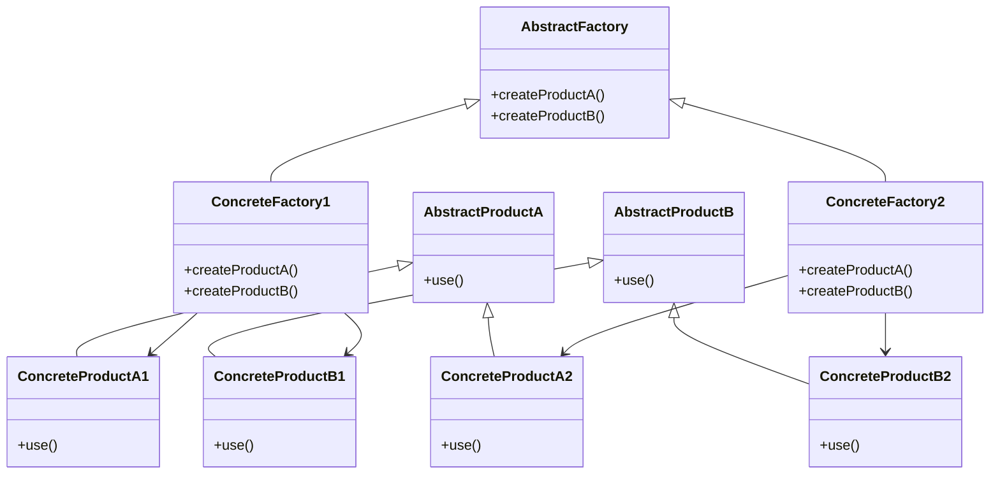

## 5.3 Abstract Factory Pattern

The Abstract Factory Pattern is a creational design pattern that provides an interface for creating families of related or dependent objects without specifying their concrete classes. This pattern is particularly useful when a system needs to be independent of how its objects are created, composed, and represented. In Lua, implementing the Abstract Factory Pattern can help manage complexity by encapsulating the creation logic of related objects, making it easier to maintain and extend.

### Intent

The main intent of the Abstract Factory Pattern is to:

- Provide an interface for creating families of related or dependent objects.
- Ensure that the created objects are used together, maintaining consistency across the product family.
- Allow the system to be independent of the concrete classes of the objects it creates.

### Key Participants

1. **Abstract Factory**: Declares an interface for operations that create abstract product objects.
2. **Concrete Factory**: Implements the operations to create concrete product objects.
3. **Abstract Product**: Declares an interface for a type of product object.
4. **Concrete Product**: Defines a product object to be created by the corresponding concrete factory.
5. **Client**: Uses only interfaces declared by the abstract factory and abstract product classes.

### Implementing Abstract Factory in Lua

In Lua, we can implement the Abstract Factory Pattern by defining abstract factories and concrete implementations. Let's explore how to handle multiple product families and ensure that products of a family are used together.

#### Defining Abstract Factories and Concrete Implementations

To implement the Abstract Factory Pattern in Lua, we start by defining the abstract factory and product interfaces. Then, we create concrete factories and products that implement these interfaces.

```lua
-- Abstract Factory
AbstractFactory = {}
function AbstractFactory:new()
    local instance = {}
    setmetatable(instance, self)
    self.__index = self
    return instance
end

function AbstractFactory:createProductA()
    error("This method should be overridden")
end

function AbstractFactory:createProductB()
    error("This method should be overridden")
end

-- Concrete Factory 1
ConcreteFactory1 = AbstractFactory:new()
function ConcreteFactory1:createProductA()
    return ConcreteProductA1:new()
end

function ConcreteFactory1:createProductB()
    return ConcreteProductB1:new()
end

-- Concrete Factory 2
ConcreteFactory2 = AbstractFactory:new()
function ConcreteFactory2:createProductA()
    return ConcreteProductA2:new()
end

function ConcreteFactory2:createProductB()
    return ConcreteProductB2:new()
end

-- Abstract Product A
AbstractProductA = {}
function AbstractProductA:new()
    local instance = {}
    setmetatable(instance, self)
    self.__index = self
    return instance
end

function AbstractProductA:use()
    error("This method should be overridden")
end

-- Concrete Product A1
ConcreteProductA1 = AbstractProductA:new()
function ConcreteProductA1:use()
    print("Using ConcreteProductA1")
end

-- Concrete Product A2
ConcreteProductA2 = AbstractProductA:new()
function ConcreteProductA2:use()
    print("Using ConcreteProductA2")
end

-- Abstract Product B
AbstractProductB = {}
function AbstractProductB:new()
    local instance = {}
    setmetatable(instance, self)
    self.__index = self
    return instance
end

function AbstractProductB:use()
    error("This method should be overridden")
end

-- Concrete Product B1
ConcreteProductB1 = AbstractProductB:new()
function ConcreteProductB1:use()
    print("Using ConcreteProductB1")
end

-- Concrete Product B2
ConcreteProductB2 = AbstractProductB:new()
function ConcreteProductB2:use()
    print("Using ConcreteProductB2")
end

-- Client Code
function client(factory)
    local productA = factory:createProductA()
    local productB = factory:createProductB()
    productA:use()
    productB:use()
end

-- Usage
local factory1 = ConcreteFactory1:new()
client(factory1)

local factory2 = ConcreteFactory2:new()
client(factory2)
```

In this example, we define an `AbstractFactory` with methods `createProductA` and `createProductB`. The `ConcreteFactory1` and `ConcreteFactory2` classes implement these methods to create specific products. The `AbstractProductA` and `AbstractProductB` interfaces are implemented by `ConcreteProductA1`, `ConcreteProductA2`, `ConcreteProductB1`, and `ConcreteProductB2`.

#### Handling Multiple Product Families

The Abstract Factory Pattern is particularly useful when dealing with multiple product families. Each concrete factory corresponds to a specific product family, ensuring that the products created are compatible with each other.

```lua
-- Additional Concrete Factory for a new product family
ConcreteFactory3 = AbstractFactory:new()
function ConcreteFactory3:createProductA()
    return ConcreteProductA3:new()
end

function ConcreteFactory3:createProductB()
    return ConcreteProductB3:new()
end

-- Concrete Product A3
ConcreteProductA3 = AbstractProductA:new()
function ConcreteProductA3:use()
    print("Using ConcreteProductA3")
end

-- Concrete Product B3
ConcreteProductB3 = AbstractProductB:new()
function ConcreteProductB3:use()
    print("Using ConcreteProductB3")
end

-- Usage
local factory3 = ConcreteFactory3:new()
client(factory3)
```

By adding `ConcreteFactory3`, `ConcreteProductA3`, and `ConcreteProductB3`, we introduce a new product family. This demonstrates the flexibility of the Abstract Factory Pattern in handling multiple product families.

### Use Cases and Examples

The Abstract Factory Pattern is widely used in scenarios where a system needs to be independent of how its objects are created. Here are some common use cases:

#### Cross-Platform UI Components

In cross-platform applications, the Abstract Factory Pattern can be used to create UI components that are specific to each platform. This ensures that the application maintains a consistent look and feel across different platforms.

```lua
-- Abstract Factory for UI Components
UIFactory = AbstractFactory:new()
function UIFactory:createButton()
    error("This method should be overridden")
end

function UIFactory:createCheckbox()
    error("This method should be overridden")
end

-- Concrete Factory for Windows
WindowsUIFactory = UIFactory:new()
function WindowsUIFactory:createButton()
    return WindowsButton:new()
end

function WindowsUIFactory:createCheckbox()
    return WindowsCheckbox:new()
end

-- Concrete Factory for MacOS
MacOSUIFactory = UIFactory:new()
function MacOSUIFactory:createButton()
    return MacOSButton:new()
end

function MacOSUIFactory:createCheckbox()
    return MacOSCheckbox:new()
end

-- Abstract Product for Button
Button = {}
function Button:new()
    local instance = {}
    setmetatable(instance, self)
    self.__index = self
    return instance
end

function Button:click()
    error("This method should be overridden")
end

-- Concrete Product for Windows Button
WindowsButton = Button:new()
function WindowsButton:click()
    print("Windows Button Clicked")
end

-- Concrete Product for MacOS Button
MacOSButton = Button:new()
function MacOSButton:click()
    print("MacOS Button Clicked")
end

-- Abstract Product for Checkbox
Checkbox = {}
function Checkbox:new()
    local instance = {}
    setmetatable(instance, self)
    self.__index = self
    return instance
end

function Checkbox:check()
    error("This method should be overridden")
end

-- Concrete Product for Windows Checkbox
WindowsCheckbox = Checkbox:new()
function WindowsCheckbox:check()
    print("Windows Checkbox Checked")
end

-- Concrete Product for MacOS Checkbox
MacOSCheckbox = Checkbox:new()
function MacOSCheckbox:check()
    print("MacOS Checkbox Checked")
end

-- Client Code
function uiClient(factory)
    local button = factory:createButton()
    local checkbox = factory:createCheckbox()
    button:click()
    checkbox:check()
end

-- Usage
local windowsFactory = WindowsUIFactory:new()
uiClient(windowsFactory)

local macFactory = MacOSUIFactory:new()
uiClient(macFactory)
```

In this example, we define an `UIFactory` for creating UI components like buttons and checkboxes. The `WindowsUIFactory` and `MacOSUIFactory` create platform-specific components, ensuring consistency across platforms.

#### Theming Systems

The Abstract Factory Pattern can also be used in theming systems, where different themes require different sets of UI components.

```lua
-- Concrete Factory for Dark Theme
DarkThemeFactory = UIFactory:new()
function DarkThemeFactory:createButton()
    return DarkButton:new()
end

function DarkThemeFactory:createCheckbox()
    return DarkCheckbox:new()
end

-- Concrete Product for Dark Button
DarkButton = Button:new()
function DarkButton:click()
    print("Dark Button Clicked")
end

-- Concrete Product for Dark Checkbox
DarkCheckbox = Checkbox:new()
function DarkCheckbox:check()
    print("Dark Checkbox Checked")
end

-- Usage
local darkThemeFactory = DarkThemeFactory:new()
uiClient(darkThemeFactory)
```

By introducing `DarkThemeFactory`, `DarkButton`, and `DarkCheckbox`, we demonstrate how the Abstract Factory Pattern can be used to implement theming systems.

### Design Considerations

When using the Abstract Factory Pattern, consider the following:

- **Complexity**: The pattern can introduce complexity due to the number of classes involved. Ensure that the benefits outweigh the added complexity.
- **Consistency**: The pattern ensures that products from the same family are used together, maintaining consistency across the application.
- **Extensibility**: The pattern makes it easy to introduce new product families by adding new concrete factories and products.

### Differences and Similarities

The Abstract Factory Pattern is often confused with the Factory Method Pattern. While both patterns deal with object creation, the Abstract Factory Pattern focuses on creating families of related objects, whereas the Factory Method Pattern deals with creating a single product.

### Try It Yourself

Experiment with the code examples by:

- Adding a new product type (e.g., `Slider`) and implementing it across all factories.
- Creating a new theme or platform and adding corresponding factories and products.
- Modifying the client code to dynamically choose a factory based on user input or configuration.

### Visualizing the Abstract Factory Pattern



This diagram illustrates the relationships between the abstract factory, concrete factories, abstract products, and concrete products.

### Knowledge Check

- What is the main intent of the Abstract Factory Pattern?
- How does the Abstract Factory Pattern ensure consistency across product families?
- What are some common use cases for the Abstract Factory Pattern?
- How does the Abstract Factory Pattern differ from the Factory Method Pattern?

### Embrace the Journey

Remember, mastering design patterns is a journey. As you explore the Abstract Factory Pattern, you'll gain insights into creating flexible and maintainable software architectures. Keep experimenting, stay curious, and enjoy the journey!

## Quiz Time!



### What is the primary purpose of the Abstract Factory Pattern?

- [x] To provide an interface for creating families of related objects
- [ ] To create a single object with a factory method
- [ ] To define a one-to-one mapping between interfaces and implementations
- [ ] To encapsulate object creation logic in a single class

> **Explanation:** The Abstract Factory Pattern provides an interface for creating families of related or dependent objects without specifying their concrete classes.

### Which of the following is a key participant in the Abstract Factory Pattern?

- [x] Abstract Factory
- [ ] Singleton
- [ ] Observer
- [ ] Decorator

> **Explanation:** The Abstract Factory is a key participant that declares an interface for operations that create abstract product objects.

### How does the Abstract Factory Pattern ensure consistency across product families?

- [x] By using concrete factories that create related products
- [ ] By using a single factory method for all products
- [ ] By enforcing a strict inheritance hierarchy
- [ ] By using global variables to store product instances

> **Explanation:** Concrete factories in the Abstract Factory Pattern create related products, ensuring that products from the same family are used together.

### What is a common use case for the Abstract Factory Pattern?

- [x] Cross-platform UI components
- [ ] Logging system
- [ ] Singleton instance management
- [ ] Event handling

> **Explanation:** The Abstract Factory Pattern is commonly used for creating cross-platform UI components, ensuring consistency across different platforms.

### How does the Abstract Factory Pattern differ from the Factory Method Pattern?

- [x] Abstract Factory creates families of related objects, while Factory Method creates a single product
- [ ] Abstract Factory uses inheritance, while Factory Method uses composition
- [ ] Abstract Factory is a behavioral pattern, while Factory Method is a structural pattern
- [ ] Abstract Factory is used for singleton instances, while Factory Method is used for multiple instances

> **Explanation:** The Abstract Factory Pattern focuses on creating families of related objects, whereas the Factory Method Pattern deals with creating a single product.

### What is a potential drawback of using the Abstract Factory Pattern?

- [x] Increased complexity due to multiple classes
- [ ] Difficulty in creating new product families
- [ ] Lack of flexibility in product creation
- [ ] Inability to enforce product consistency

> **Explanation:** The Abstract Factory Pattern can introduce complexity due to the number of classes involved, but it provides flexibility and consistency in product creation.

### Which of the following is NOT a component of the Abstract Factory Pattern?

- [ ] Concrete Factory
- [ ] Abstract Product
- [x] Singleton
- [ ] Concrete Product

> **Explanation:** Singleton is not a component of the Abstract Factory Pattern. The pattern involves abstract and concrete factories and products.

### In the context of the Abstract Factory Pattern, what is a "product family"?

- [x] A group of related products that are designed to be used together
- [ ] A single product with multiple variations
- [ ] A collection of unrelated products
- [ ] A set of products that share the same interface

> **Explanation:** A product family is a group of related products that are designed to be used together, ensuring consistency across the application.

### What is the role of the client in the Abstract Factory Pattern?

- [x] To use interfaces declared by the abstract factory and abstract product classes
- [ ] To create concrete products directly
- [ ] To manage the lifecycle of product instances
- [ ] To define the concrete factory implementations

> **Explanation:** The client uses only interfaces declared by the abstract factory and abstract product classes, without knowing the concrete implementations.

### True or False: The Abstract Factory Pattern can be used to implement theming systems.

- [x] True
- [ ] False

> **Explanation:** True. The Abstract Factory Pattern can be used to implement theming systems by creating different sets of UI components for each theme.




