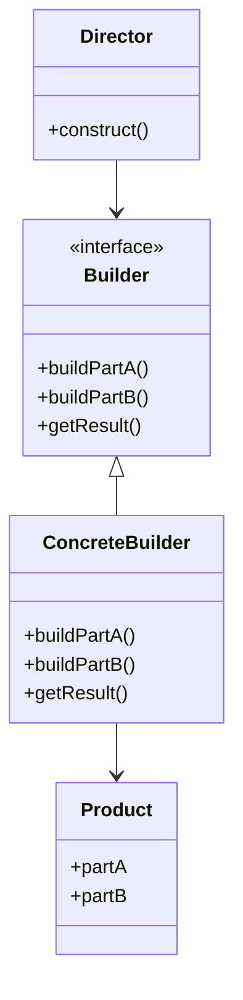

## 5.4 Builder Pattern

In the realm of software design, the Builder Pattern stands out as a robust creational pattern that separates the construction of a complex object from its representation. This pattern is particularly useful when dealing with objects that require numerous steps to construct or have multiple configurations. In this section, we will delve into the intricacies of the Builder Pattern in Lua, exploring its implementation, use cases, and benefits.

### Intent of the Builder Pattern

The primary intent of the Builder Pattern is to provide a flexible solution for constructing complex objects. By decoupling the construction process from the final representation, the pattern allows for the creation of different representations of an object using the same construction code.

### Key Participants

1. **Builder**: Defines the interface for creating parts of a Product object.
2. **ConcreteBuilder**: Implements the Builder interface and constructs and assembles parts of the product.
3. **Director**: Constructs an object using the Builder interface.
4. **Product**: Represents the complex object under construction.

### Applicability

The Builder Pattern is applicable when:

- The construction process of an object is complex and involves multiple steps.
- Different representations of the constructed object are required.
- The algorithm for creating a complex object should be independent of the parts that make up the object.

### Implementing Builder in Lua

Lua, with its dynamic typing and flexible table structures, provides a unique environment for implementing the Builder Pattern. Let's explore how to implement this pattern using method chaining, the Step Builder Pattern, and Fluent Interfaces.

#### Method Chaining

Method chaining is a technique where each method returns the object itself, allowing multiple method calls to be chained together. This approach is particularly useful in implementing the Builder Pattern, as it enhances readability and provides a fluent interface.

```lua
-- Define the Product
local Car = {}
Car.__index = Car

function Car:new()
    local instance = {
        make = "",
        model = "",
        year = 0,
        color = ""
    }
    setmetatable(instance, Car)
    return instance
end

function Car:__tostring()
    return string.format("Car: %s %s (%d) in %s", self.make, self.model, self.year, self.color)
end

-- Define the Builder
local CarBuilder = {}
CarBuilder.__index = CarBuilder

function CarBuilder:new()
    local instance = {
        car = Car:new()
    }
    setmetatable(instance, CarBuilder)
    return instance
end

function CarBuilder:setMake(make)
    self.car.make = make
    return self
end

function CarBuilder:setModel(model)
    self.car.model = model
    return self
end

function CarBuilder:setYear(year)
    self.car.year = year
    return self
end

function CarBuilder:setColor(color)
    self.car.color = color
    return self
end

function CarBuilder:build()
    return self.car
end

-- Usage
local builder = CarBuilder:new()
local car = builder:setMake("Toyota")
                 :setModel("Corolla")
                 :setYear(2020)
                 :setColor("Red")
                 :build()

print(car)
```

In this example, we define a `Car` class and a `CarBuilder` class. The `CarBuilder` class provides methods to set various properties of the `Car` object, and each method returns the builder itself, allowing for method chaining.

#### Step Builder Pattern

The Step Builder Pattern is a variation of the Builder Pattern that enforces a specific order of method calls. This pattern is useful when certain steps in the construction process must be executed in a particular sequence.

```lua
-- Define the Product
local Computer = {}
Computer.__index = Computer

function Computer:new()
    local instance = {
        cpu = "",
        ram = "",
        storage = "",
        gpu = ""
    }
    setmetatable(instance, Computer)
    return instance
end

function Computer:__tostring()
    return string.format("Computer: CPU=%s, RAM=%s, Storage=%s, GPU=%s", self.cpu, self.ram, self.storage, self.gpu)
end

-- Define the Builder
local ComputerBuilder = {}
ComputerBuilder.__index = ComputerBuilder

function ComputerBuilder:new()
    local instance = {
        computer = Computer:new()
    }
    setmetatable(instance, ComputerBuilder)
    return instance
end

function ComputerBuilder:setCPU(cpu)
    self.computer.cpu = cpu
    return self
end

function ComputerBuilder:setRAM(ram)
    self.computer.ram = ram
    return self
end

function ComputerBuilder:setStorage(storage)
    self.computer.storage = storage
    return self
end

function ComputerBuilder:setGPU(gpu)
    self.computer.gpu = gpu
    return self
end

function ComputerBuilder:build()
    return self.computer
end

-- Usage
local builder = ComputerBuilder:new()
local computer = builder:setCPU("Intel i7")
                       :setRAM("16GB")
                       :setStorage("512GB SSD")
                       :setGPU("NVIDIA GTX 1660")
                       :build()

print(computer)
```

In this example, the `ComputerBuilder` class enforces a specific order of method calls, ensuring that the CPU, RAM, storage, and GPU are set in sequence.

#### Fluent Interfaces

Fluent Interfaces are a design pattern used to create more readable code by chaining method calls. This approach is particularly effective in implementing the Builder Pattern, as it allows for a more natural and expressive way of constructing objects.

```lua
-- Define the Product
local House = {}
House.__index = House

function House:new()
    local instance = {
        floors = 0,
        rooms = 0,
        hasGarage = false,
        hasGarden = false
    }
    setmetatable(instance, House)
    return instance
end

function House:__tostring()
    return string.format("House: %d floors, %d rooms, Garage=%s, Garden=%s", self.floors, self.rooms, tostring(self.hasGarage), tostring(self.hasGarden))
end

-- Define the Builder
local HouseBuilder = {}
HouseBuilder.__index = HouseBuilder

function HouseBuilder:new()
    local instance = {
        house = House:new()
    }
    setmetatable(instance, HouseBuilder)
    return instance
end

function HouseBuilder:setFloors(floors)
    self.house.floors = floors
    return self
end

function HouseBuilder:setRooms(rooms)
    self.house.rooms = rooms
    return self
end

function HouseBuilder:addGarage()
    self.house.hasGarage = true
    return self
end

function HouseBuilder:addGarden()
    self.house.hasGarden = true
    return self
end

function HouseBuilder:build()
    return self.house
end

-- Usage
local builder = HouseBuilder:new()
local house = builder:setFloors(2)
                    :setRooms(5)
                    :addGarage()
                    :addGarden()
                    :build()

print(house)
```

In this example, the `HouseBuilder` class uses a fluent interface to construct a `House` object. The method chaining allows for a more readable and expressive way of setting the properties of the `House`.

### Use Cases and Examples

The Builder Pattern is particularly useful in scenarios where objects have numerous optional parameters or require a complex construction process. Let's explore some common use cases and examples.

#### Constructing Complex Data Structures

The Builder Pattern is ideal for constructing complex data structures, such as JSON objects or XML documents, where the structure may vary based on the input data.

```lua
-- Define a JSON Builder
local JSONBuilder = {}
JSONBuilder.__index = JSONBuilder

function JSONBuilder:new()
    local instance = {
        json = {}
    }
    setmetatable(instance, JSONBuilder)
    return instance
end

function JSONBuilder:addString(key, value)
    self.json[key] = value
    return self
end

function JSONBuilder:addNumber(key, value)
    self.json[key] = value
    return self
end

function JSONBuilder:addBoolean(key, value)
    self.json[key] = value
    return self
end

function JSONBuilder:addArray(key, value)
    self.json[key] = value
    return self
end

function JSONBuilder:build()
    return self.json
end

-- Usage
local builder = JSONBuilder:new()
local json = builder:addString("name", "John Doe")
                   :addNumber("age", 30)
                   :addBoolean("isEmployed", true)
                   :addArray("skills", {"Lua", "Python", "JavaScript"})
                   :build()

for k, v in pairs(json) do
    print(k, v)
end
```

In this example, the `JSONBuilder` class provides methods to add various types of data to a JSON object. The method chaining allows for a flexible and readable way of constructing the JSON structure.

#### Configuring Objects with Many Optional Parameters

The Builder Pattern is also useful for configuring objects with many optional parameters, such as GUI components or network requests.

```lua
-- Define a Network Request
local NetworkRequest = {}
NetworkRequest.__index = NetworkRequest

function NetworkRequest:new()
    local instance = {
        url = "",
        method = "GET",
        headers = {},
        body = ""
    }
    setmetatable(instance, NetworkRequest)
    return instance
end

function NetworkRequest:__tostring()
    return string.format("NetworkRequest: %s %s", self.method, self.url)
end

-- Define the Builder
local NetworkRequestBuilder = {}
NetworkRequestBuilder.__index = NetworkRequestBuilder

function NetworkRequestBuilder:new()
    local instance = {
        request = NetworkRequest:new()
    }
    setmetatable(instance, NetworkRequestBuilder)
    return instance
end

function NetworkRequestBuilder:setURL(url)
    self.request.url = url
    return self
end

function NetworkRequestBuilder:setMethod(method)
    self.request.method = method
    return self
end

function NetworkRequestBuilder:addHeader(key, value)
    self.request.headers[key] = value
    return self
end

function NetworkRequestBuilder:setBody(body)
    self.request.body = body
    return self
end

function NetworkRequestBuilder:build()
    return self.request
end

-- Usage
local builder = NetworkRequestBuilder:new()
local request = builder:setURL("https://api.example.com/data")
                      :setMethod("POST")
                      :addHeader("Content-Type", "application/json")
                      :setBody('{"key": "value"}')
                      :build()

print(request)
```

In this example, the `NetworkRequestBuilder` class provides methods to configure various aspects of a network request. The method chaining allows for a flexible and readable way of setting the request parameters.

### Design Considerations

When implementing the Builder Pattern in Lua, consider the following design considerations:

- **Flexibility**: The Builder Pattern provides flexibility in constructing complex objects, allowing for different configurations and representations.
- **Readability**: Method chaining and fluent interfaces enhance the readability of the code, making it easier to understand and maintain.
- **Complexity**: While the Builder Pattern simplifies the construction process, it may introduce additional complexity in the codebase. Ensure that the benefits outweigh the added complexity.
- **Performance**: Consider the performance implications of using the Builder Pattern, especially in performance-critical applications.

### Differences and Similarities

The Builder Pattern is often confused with other creational patterns, such as the Factory Method and Abstract Factory patterns. Here are some key differences and similarities:

- **Builder vs. Factory Method**: The Factory Method pattern focuses on creating objects through a single method, while the Builder Pattern involves a step-by-step construction process.
- **Builder vs. Abstract Factory**: The Abstract Factory pattern provides an interface for creating families of related objects, while the Builder Pattern focuses on constructing a single complex object.

### Visualizing the Builder Pattern

To better understand the Builder Pattern, let's visualize the process using a class diagram.



In this diagram, the `Director` class uses the `Builder` interface to construct a `Product` object. The `ConcreteBuilder` class implements the `Builder` interface and provides the specific construction logic.

### Try It Yourself

Now that we've explored the Builder Pattern in Lua, try modifying the code examples to suit your needs. Experiment with different configurations and representations to see how the pattern can be applied in various scenarios.

### Knowledge Check

- What is the primary intent of the Builder Pattern?
- How does method chaining enhance the readability of code?
- What are some common use cases for the Builder Pattern?
- How does the Builder Pattern differ from the Factory Method pattern?
- What are some design considerations when implementing the Builder Pattern in Lua?

### Embrace the Journey

Remember, mastering design patterns is a journey. As you continue to explore and experiment with the Builder Pattern, you'll gain a deeper understanding of its benefits and applications. Keep experimenting, stay curious, and enjoy the journey!

## Quiz Time!



### What is the primary intent of the Builder Pattern?

- [x] To separate the construction of a complex object from its representation.
- [ ] To create a single method for constructing objects.
- [ ] To provide an interface for creating families of related objects.
- [ ] To enhance the performance of object construction.

> **Explanation:** The Builder Pattern's primary intent is to separate the construction of a complex object from its representation, allowing for different configurations and representations.

### How does method chaining enhance the readability of code?

- [x] By allowing multiple method calls to be chained together.
- [ ] By reducing the number of lines of code.
- [ ] By enforcing a specific order of method calls.
- [ ] By providing an interface for creating related objects.

> **Explanation:** Method chaining enhances readability by allowing multiple method calls to be chained together, creating a more fluent and expressive interface.

### What are some common use cases for the Builder Pattern?

- [x] Constructing complex data structures.
- [x] Configuring objects with many optional parameters.
- [ ] Creating a single method for object construction.
- [ ] Enhancing the performance of object construction.

> **Explanation:** The Builder Pattern is commonly used for constructing complex data structures and configuring objects with many optional parameters.

### How does the Builder Pattern differ from the Factory Method pattern?

- [x] The Builder Pattern involves a step-by-step construction process.
- [ ] The Builder Pattern provides an interface for creating related objects.
- [ ] The Builder Pattern focuses on creating objects through a single method.
- [ ] The Builder Pattern enhances the performance of object construction.

> **Explanation:** The Builder Pattern differs from the Factory Method pattern by involving a step-by-step construction process, while the Factory Method focuses on creating objects through a single method.

### What are some design considerations when implementing the Builder Pattern in Lua?

- [x] Flexibility and readability.
- [x] Complexity and performance.
- [ ] Creating a single method for object construction.
- [ ] Providing an interface for creating related objects.

> **Explanation:** When implementing the Builder Pattern in Lua, consider flexibility, readability, complexity, and performance.

### Which of the following is a key participant in the Builder Pattern?

- [x] Builder
- [ ] Singleton
- [ ] Adapter
- [ ] Observer

> **Explanation:** The Builder is a key participant in the Builder Pattern, defining the interface for creating parts of a Product object.

### What is a Fluent Interface?

- [x] A design pattern that allows for more readable code by chaining method calls.
- [ ] A method for creating objects through a single method.
- [ ] An interface for creating families of related objects.
- [ ] A technique for enhancing the performance of object construction.

> **Explanation:** A Fluent Interface is a design pattern that allows for more readable code by chaining method calls, creating a more natural and expressive way of constructing objects.

### What is the Step Builder Pattern?

- [x] A variation of the Builder Pattern that enforces a specific order of method calls.
- [ ] A method for creating objects through a single method.
- [ ] An interface for creating families of related objects.
- [ ] A technique for enhancing the performance of object construction.

> **Explanation:** The Step Builder Pattern is a variation of the Builder Pattern that enforces a specific order of method calls, ensuring that certain steps are executed in sequence.

### How can the Builder Pattern be used in constructing JSON objects?

- [x] By providing methods to add various types of data to a JSON object.
- [ ] By creating a single method for constructing JSON objects.
- [ ] By providing an interface for creating related JSON objects.
- [ ] By enhancing the performance of JSON object construction.

> **Explanation:** The Builder Pattern can be used in constructing JSON objects by providing methods to add various types of data to a JSON object, allowing for a flexible and readable construction process.

### True or False: The Builder Pattern is often confused with the Singleton Pattern.

- [ ] True
- [x] False

> **Explanation:** The Builder Pattern is not typically confused with the Singleton Pattern. It is more commonly confused with other creational patterns like the Factory Method and Abstract Factory patterns.




