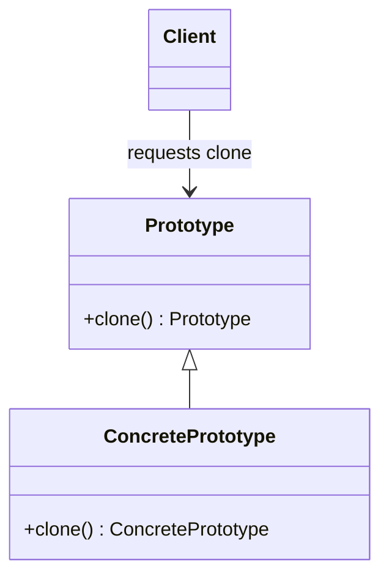

## 5.5 Prototype Pattern

In the realm of software design, the Prototype Pattern is a creational design pattern that allows for the creation of new objects by copying existing ones, known as prototypes. This pattern is particularly useful in scenarios where the cost of creating a new instance of a class is more expensive than copying an existing instance. In Lua, a language known for its flexibility and simplicity, implementing the Prototype Pattern can be both efficient and elegant.

### Intent

The primary intent of the Prototype Pattern is to enable the creation of new objects by duplicating existing ones. This approach can be more efficient than creating objects from scratch, especially when the initialization process is complex or resource-intensive. By cloning a prototype, you can bypass the overhead associated with object creation and initialization.

### Key Participants

- **Prototype**: The original object that serves as a template for creating new objects.
- **Client**: The entity that requests the creation of a new object by cloning the prototype.
- **Cloning Mechanism**: The process or method used to duplicate the prototype.

### Implementing Prototype in Lua

Lua's dynamic nature and powerful table manipulation capabilities make it an ideal language for implementing the Prototype Pattern. Let's explore how to achieve this using Lua's features.

#### Using `table.insert()` and `table.copy()` for Cloning

In Lua, tables are the primary data structure used to represent objects. To implement the Prototype Pattern, we need to clone these tables. Lua does not provide a built-in `table.copy()` function, but we can create our own to handle both shallow and deep copies.

```lua
-- Function to perform a shallow copy of a table
function shallowCopy(original)
    local copy = {}
    for key, value in pairs(original) do
        copy[key] = value
    end
    return copy
end

-- Function to perform a deep copy of a table
function deepCopy(original)
    local copy = {}
    for key, value in pairs(original) do
        if type(value) == "table" then
            copy[key] = deepCopy(value)
        else
            copy[key] = value
        end
    end
    return copy
end
```

#### Handling Deep vs. Shallow Copies

- **Shallow Copy**: Copies the top-level elements of a table. Nested tables are not duplicated; instead, references to them are copied.
- **Deep Copy**: Recursively copies all elements, including nested tables, ensuring that the entire structure is duplicated.

#### Using Metatables to Manage Prototypes

Metatables in Lua provide a mechanism to change the behavior of tables. We can use metatables to manage prototypes and facilitate cloning.

```lua
-- Prototype object with a metatable
Prototype = {name = "Prototype"}

-- Metatable with a clone method
PrototypeMeta = {
    __index = Prototype,
    clone = function(self)
        return deepCopy(self)
    end
}

-- Set the metatable for the prototype
setmetatable(Prototype, PrototypeMeta)

-- Create a new object by cloning the prototype
local newObject = Prototype:clone()
newObject.name = "Cloned Object"

print(newObject.name)  -- Output: Cloned Object
```

### Use Cases and Examples

The Prototype Pattern is particularly useful in scenarios where:

- **Efficiently Creating Similar Objects**: When you need to create multiple objects with similar properties, cloning a prototype can be more efficient than initializing each object individually.
- **Avoiding the Overhead of Object Initialization**: In cases where object initialization is resource-intensive, cloning a pre-initialized prototype can save time and resources.

#### Example: Game Development

In game development, you might have a prototype for a character with default attributes. Cloning this prototype allows you to create new characters with the same base attributes, which can then be customized.

```lua
-- Character prototype
CharacterPrototype = {
    health = 100,
    strength = 50,
    agility = 30
}

-- Set metatable for cloning
setmetatable(CharacterPrototype, {
    __index = CharacterPrototype,
    clone = function(self)
        return deepCopy(self)
    end
})

-- Create a new character by cloning the prototype
local newCharacter = CharacterPrototype:clone()
newCharacter.name = "Hero"
newCharacter.strength = 75

print(newCharacter.name)  -- Output: Hero
print(newCharacter.strength)  -- Output: 75
```

### Design Considerations

When implementing the Prototype Pattern in Lua, consider the following:

- **Memory Usage**: Cloning objects can increase memory usage, especially with deep copies. Ensure that this approach is justified by the performance gains.
- **Complexity**: While cloning can simplify object creation, it can also introduce complexity in managing object states. Ensure that the benefits outweigh the added complexity.
- **Best Practices**: Use metatables to encapsulate cloning logic, and prefer deep copies when object integrity is critical.

### Differences and Similarities

The Prototype Pattern is often compared to other creational patterns like the Factory Method and Abstract Factory. Unlike these patterns, which create objects through interfaces, the Prototype Pattern creates objects by copying existing ones. This distinction makes it particularly useful when object creation is costly or complex.

### Visualizing the Prototype Pattern

To better understand the Prototype Pattern, let's visualize the process of cloning objects using a class diagram.



In this diagram, the `Prototype` class defines a `clone` method, which is implemented by the `ConcretePrototype`. The `Client` interacts with the `Prototype` to request a clone.

### Try It Yourself

Experiment with the Prototype Pattern by modifying the code examples. Try creating different prototypes with various attributes and clone them to see how changes affect the cloned objects. Consider implementing additional methods in the prototypes to enhance functionality.

### References and Links

For further reading on the Prototype Pattern and Lua programming, consider the following resources:

- [Lua 5.4 Reference Manual](https://www.lua.org/manual/5.4/)
- [Design Patterns: Elements of Reusable Object-Oriented Software](https://en.wikipedia.org/wiki/Design_Patterns) by Erich Gamma et al.
- [Lua Programming Guide](https://www.lua.org/pil/)

### Knowledge Check

To reinforce your understanding of the Prototype Pattern, consider the following questions:

- What are the key benefits of using the Prototype Pattern?
- How does the Prototype Pattern differ from other creational patterns?
- What are the potential drawbacks of using deep copies in Lua?

### Embrace the Journey

Remember, mastering design patterns is a journey. As you explore the Prototype Pattern, you'll gain insights into efficient object creation and management. Keep experimenting, stay curious, and enjoy the process of learning and applying design patterns in your Lua projects.

## Quiz Time!



### What is the primary intent of the Prototype Pattern?

- [x] To create new objects by duplicating existing ones
- [ ] To initialize objects from scratch
- [ ] To manage object lifecycles
- [ ] To define object interfaces

> **Explanation:** The Prototype Pattern's primary intent is to create new objects by duplicating existing ones, which can be more efficient than creating objects from scratch.

### Which Lua feature is particularly useful for implementing the Prototype Pattern?

- [x] Metatables
- [ ] Coroutines
- [ ] Functions
- [ ] Loops

> **Explanation:** Metatables in Lua provide a mechanism to change the behavior of tables, making them useful for managing prototypes and facilitating cloning.

### What is a shallow copy in Lua?

- [x] A copy that duplicates top-level elements but not nested tables
- [ ] A copy that duplicates all elements, including nested tables
- [ ] A copy that only duplicates primitive data types
- [ ] A copy that duplicates the entire table structure

> **Explanation:** A shallow copy duplicates the top-level elements of a table, but nested tables are not duplicated; instead, references to them are copied.

### What is a deep copy in Lua?

- [x] A copy that duplicates all elements, including nested tables
- [ ] A copy that duplicates top-level elements but not nested tables
- [ ] A copy that only duplicates primitive data types
- [ ] A copy that duplicates the entire table structure

> **Explanation:** A deep copy recursively copies all elements, including nested tables, ensuring that the entire structure is duplicated.

### What is a potential drawback of using deep copies?

- [x] Increased memory usage
- [ ] Reduced object integrity
- [ ] Simplified object management
- [ ] Improved performance

> **Explanation:** Deep copies can increase memory usage, especially when duplicating large or complex structures.

### How does the Prototype Pattern differ from the Factory Method Pattern?

- [x] It creates objects by copying existing ones
- [ ] It defines interfaces for object creation
- [ ] It manages object lifecycles
- [ ] It initializes objects from scratch

> **Explanation:** The Prototype Pattern creates objects by copying existing ones, while the Factory Method Pattern defines interfaces for object creation.

### What is a key benefit of using the Prototype Pattern?

- [x] Efficient object creation
- [ ] Simplified object initialization
- [ ] Reduced memory usage
- [ ] Enhanced object interfaces

> **Explanation:** The Prototype Pattern allows for efficient object creation by duplicating existing objects, which can be more efficient than initializing objects from scratch.

### Which method is used to clone a prototype in the provided Lua example?

- [x] `clone()`
- [ ] `copy()`
- [ ] `duplicate()`
- [ ] `replicate()`

> **Explanation:** The `clone()` method is used in the provided Lua example to duplicate the prototype.

### What is the role of the Client in the Prototype Pattern?

- [x] To request the creation of a new object by cloning the prototype
- [ ] To define the prototype's attributes
- [ ] To manage the prototype's lifecycle
- [ ] To initialize the prototype

> **Explanation:** The Client requests the creation of a new object by cloning the prototype, interacting with the Prototype to achieve this.

### True or False: The Prototype Pattern is useful when object initialization is resource-intensive.

- [x] True
- [ ] False

> **Explanation:** True. The Prototype Pattern is particularly useful in scenarios where object initialization is resource-intensive, as it allows for the creation of new objects by duplicating existing ones.


