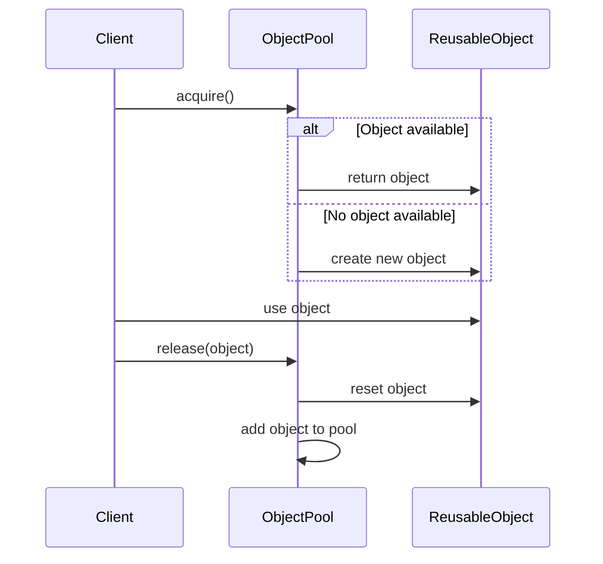

## 5.6 Object Pool Pattern

In the realm of software engineering, performance optimization is a critical concern, especially when dealing with resource-intensive operations. The Object Pool Pattern is a creational design pattern that addresses this concern by managing a pool of reusable objects, thereby reducing the overhead of object creation and destruction. This pattern is particularly useful in scenarios where the cost of initializing an object is high, and the number of instantiations is frequent.

### **Intent**

The primary intent of the Object Pool Pattern is to improve performance by reusing objects that are expensive to create. By maintaining a pool of objects, the pattern allows for efficient allocation and release of resources, minimizing the need for repeated instantiation and garbage collection.

### **Key Participants**

1. **Object Pool**: Manages the pool of reusable objects. It handles the allocation and release of objects, ensuring that resources are efficiently utilized.
2. **Reusable Object**: The object that is being pooled. It should be designed to be resettable and reusable.
3. **Client**: The entity that requests and uses objects from the pool.

### **Applicability**

The Object Pool Pattern is applicable in scenarios where:

- The cost of creating and destroying objects is high.
- There is a need to manage a limited number of resources, such as database connections or network sockets.
- Objects can be reused without significant reinitialization.

### **Implementing Object Pool in Lua**

Let's delve into the implementation of the Object Pool Pattern in Lua. We'll explore how to create and maintain a pool of objects, and how to efficiently allocate and release these objects.

#### **Creating and Maintaining a Pool of Objects**

To implement an object pool, we first need to define a pool manager that will handle the creation, allocation, and release of objects. Here's a basic implementation in Lua:

```lua
-- ObjectPool.lua
local ObjectPool = {}
ObjectPool.__index = ObjectPool

-- Constructor for creating a new object pool
function ObjectPool:new(createFunc, maxObjects)
    local pool = setmetatable({}, ObjectPool)
    pool.createFunc = createFunc
    pool.maxObjects = maxObjects or 10
    pool.pool = {}
    pool.activeObjects = 0
    return pool
end

-- Method to acquire an object from the pool
function ObjectPool:acquire()
    if #self.pool > 0 then
        local obj = table.remove(self.pool)
        self.activeObjects = self.activeObjects + 1
        return obj
    elseif self.activeObjects < self.maxObjects then
        local obj = self.createFunc()
        self.activeObjects = self.activeObjects + 1
        return obj
    else
        error("No available objects in the pool")
    end
end

-- Method to release an object back to the pool
function ObjectPool:release(obj)
    table.insert(self.pool, obj)
    self.activeObjects = self.activeObjects - 1
end

return ObjectPool
```

In this implementation, we define an `ObjectPool` class with methods to acquire and release objects. The `createFunc` parameter is a function that creates new objects when the pool is empty, and `maxObjects` defines the maximum number of objects that can be active at any time.

#### **Allocating and Releasing Objects Efficiently**

The `acquire` method checks if there are any available objects in the pool. If so, it removes an object from the pool and returns it. If the pool is empty but the maximum number of active objects has not been reached, it creates a new object using the `createFunc`. If neither condition is met, it raises an error indicating that no objects are available.

The `release` method returns an object to the pool, making it available for future use. This method also decrements the count of active objects.

### **Use Cases and Examples**

The Object Pool Pattern is widely used in various domains, including game development and resource management. Let's explore some practical use cases and examples.

#### **Managing Database or Network Connections**

In applications that require frequent database or network access, managing connections efficiently is crucial. The Object Pool Pattern can be used to maintain a pool of connections, reducing the overhead of establishing and closing connections repeatedly.

```lua
-- ConnectionPool.lua
local Connection = {}
Connection.__index = Connection

function Connection:new()
    local conn = setmetatable({}, Connection)
    -- Simulate connection setup
    print("Establishing new connection...")
    return conn
end

function Connection:close()
    -- Simulate connection teardown
    print("Closing connection...")
end

local connectionPool = ObjectPool:new(function() return Connection:new() end, 5)

-- Acquire a connection
local conn1 = connectionPool:acquire()

-- Use the connection
-- ...

-- Release the connection back to the pool
connectionPool:release(conn1)
```

In this example, we define a `Connection` class with methods to simulate connection setup and teardown. The `ConnectionPool` uses the Object Pool Pattern to manage a pool of connections, allowing for efficient allocation and release.

#### **Reusing Game Entities Like Bullets or Particles**

In game development, objects such as bullets or particles are frequently created and destroyed. The Object Pool Pattern can be used to manage these entities, improving performance by reusing objects rather than creating new ones each time.

```lua
-- BulletPool.lua
local Bullet = {}
Bullet.__index = Bullet

function Bullet:new()
    local bullet = setmetatable({}, Bullet)
    bullet.active = false
    return bullet
end

function Bullet:fire(x, y)
    self.active = true
    self.x = x
    self.y = y
    print("Bullet fired at position:", x, y)
end

function Bullet:reset()
    self.active = false
    print("Bullet reset")
end

local bulletPool = ObjectPool:new(function() return Bullet:new() end, 20)

-- Fire a bullet
local bullet = bulletPool:acquire()
bullet:fire(10, 20)

-- Reset and release the bullet back to the pool
bullet:reset()
bulletPool:release(bullet)
```

In this example, we define a `Bullet` class with methods to fire and reset bullets. The `BulletPool` manages a pool of bullets, allowing for efficient reuse and performance optimization.

### **Design Considerations**

When implementing the Object Pool Pattern, consider the following:

- **Thread Safety**: If your application is multi-threaded, ensure that the object pool is thread-safe to prevent race conditions.
- **Object State**: Ensure that objects are properly reset before being returned to the pool to avoid unintended side effects.
- **Pool Size**: Choose an appropriate pool size based on the application's requirements and resource constraints.

### **Differences and Similarities**

The Object Pool Pattern is often compared to other creational patterns like the Singleton Pattern. While both patterns manage object creation, the Object Pool Pattern focuses on reusing multiple instances, whereas the Singleton Pattern restricts instantiation to a single instance.

### **Try It Yourself**

To deepen your understanding of the Object Pool Pattern, try modifying the code examples provided:

- Experiment with different pool sizes and observe the impact on performance.
- Implement an object pool for a different type of resource, such as file handles or threads.
- Add logging to track object allocation and release, and analyze the pool's behavior under different workloads.

### **Visualizing the Object Pool Pattern**

To better understand the Object Pool Pattern, let's visualize the process of acquiring and releasing objects using a sequence diagram.



**Diagram Description**: The sequence diagram illustrates the interaction between the client, the object pool, and the reusable object. The client requests an object from the pool, which either returns an available object or creates a new one. After using the object, the client releases it back to the pool, where it is reset and added back to the pool for future use.

### **Knowledge Check**

To reinforce your understanding of the Object Pool Pattern, consider the following questions:

- What are the primary benefits of using the Object Pool Pattern?
- How does the Object Pool Pattern differ from the Singleton Pattern?
- What are some potential pitfalls to avoid when implementing an object pool?

### **Embrace the Journey**

Remember, mastering design patterns is a journey. The Object Pool Pattern is just one of many tools in your software engineering toolkit. As you continue to explore and experiment with different patterns, you'll gain a deeper understanding of how to architect robust and efficient applications. Keep experimenting, stay curious, and enjoy the journey!

## Quiz Time!



### What is the primary intent of the Object Pool Pattern?

- [x] To improve performance by reusing objects that are expensive to create.
- [ ] To ensure only one instance of an object exists.
- [ ] To separate the construction of a complex object from its representation.
- [ ] To provide a way to access the elements of an aggregate object sequentially.

> **Explanation:** The Object Pool Pattern aims to improve performance by reusing objects that are expensive to create, reducing the overhead of repeated instantiation.

### Which of the following is a key participant in the Object Pool Pattern?

- [x] Object Pool
- [ ] Singleton
- [ ] Factory
- [ ] Adapter

> **Explanation:** The Object Pool is a key participant in the Object Pool Pattern, managing the pool of reusable objects.

### In which scenario is the Object Pool Pattern most applicable?

- [x] When the cost of creating and destroying objects is high.
- [ ] When only one instance of an object is needed.
- [ ] When objects need to be created in a specific sequence.
- [ ] When objects need to be accessed in a specific order.

> **Explanation:** The Object Pool Pattern is most applicable when the cost of creating and destroying objects is high, and objects can be reused.

### What should be considered when implementing an object pool?

- [x] Thread safety
- [x] Object state
- [x] Pool size
- [ ] Object immutability

> **Explanation:** When implementing an object pool, consider thread safety, object state, and pool size to ensure efficient and safe resource management.

### How does the Object Pool Pattern differ from the Singleton Pattern?

- [x] The Object Pool Pattern manages multiple instances, while the Singleton Pattern restricts to one instance.
- [ ] The Object Pool Pattern restricts to one instance, while the Singleton Pattern manages multiple instances.
- [ ] Both patterns manage multiple instances.
- [ ] Both patterns restrict to one instance.

> **Explanation:** The Object Pool Pattern manages multiple instances for reuse, while the Singleton Pattern restricts instantiation to a single instance.

### What is a potential pitfall of the Object Pool Pattern?

- [x] Objects not being properly reset before reuse.
- [ ] Objects being created too frequently.
- [ ] Objects being accessed in a specific order.
- [ ] Objects being immutable.

> **Explanation:** A potential pitfall of the Object Pool Pattern is objects not being properly reset before reuse, leading to unintended side effects.

### What is the role of the client in the Object Pool Pattern?

- [x] To request and use objects from the pool.
- [ ] To manage the pool of objects.
- [ ] To create new objects when needed.
- [ ] To ensure only one instance of an object exists.

> **Explanation:** The client requests and uses objects from the pool, relying on the pool to manage object allocation and release.

### What is the purpose of the `release` method in an object pool?

- [x] To return an object to the pool for future use.
- [ ] To create a new object in the pool.
- [ ] To remove an object from the pool permanently.
- [ ] To ensure an object is used only once.

> **Explanation:** The `release` method returns an object to the pool for future use, making it available for reuse.

### What is a common use case for the Object Pool Pattern in game development?

- [x] Reusing game entities like bullets or particles.
- [ ] Managing game levels.
- [ ] Creating new game characters.
- [ ] Ensuring only one game instance exists.

> **Explanation:** A common use case for the Object Pool Pattern in game development is reusing game entities like bullets or particles to improve performance.

### True or False: The Object Pool Pattern is only applicable in single-threaded applications.

- [ ] True
- [x] False

> **Explanation:** False. The Object Pool Pattern can be applied in both single-threaded and multi-threaded applications, but thread safety must be considered in the latter.




