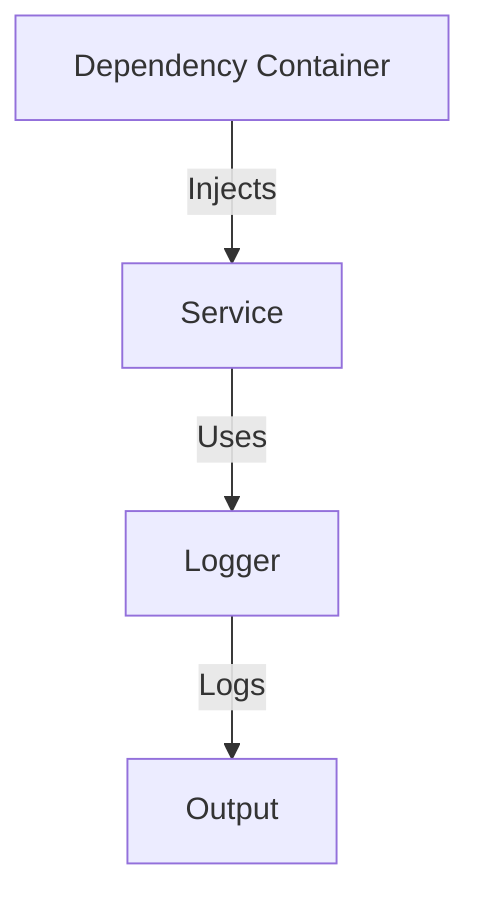

## 5.7 Dependency Injection Pattern

In the world of software engineering, achieving flexibility and maintainability in code is paramount. The Dependency Injection (DI) pattern is a powerful design pattern that helps achieve these goals by decoupling components and promoting loose coupling. In this section, we will explore how to implement the Dependency Injection pattern in Lua, understand its benefits, and examine practical use cases.

### Understanding Dependency Injection

**Dependency Injection** is a design pattern used to implement IoC (Inversion of Control), allowing a program to follow the Dependency Inversion Principle. It involves injecting dependencies into a component rather than hard-coding them, which enhances flexibility and testability.

#### Key Concepts

- **Decoupling Components**: By injecting dependencies, we separate the creation of a dependency from its usage, reducing the coupling between components.
- **Inversion of Control**: The control of dependency creation is inverted from the component to an external entity, such as a DI container or framework.
- **Flexibility and Testability**: Components become more flexible and easier to test as they can be configured with different dependencies.

### Implementing Dependency Injection in Lua

Lua, being a lightweight and flexible scripting language, offers several ways to implement Dependency Injection. Let's explore some common methods:

#### Passing Dependencies via Function Parameters

One of the simplest ways to implement DI in Lua is by passing dependencies as function parameters. This approach is straightforward and works well for small-scale applications.

```lua
-- Define a Logger dependency
local Logger = {}
function Logger:log(message)
    print("Log: " .. message)
end

-- Define a Service that depends on Logger
local function Service(logger)
    return {
        performTask = function()
            logger:log("Task performed")
        end
    }
end

-- Inject the Logger dependency
local logger = Logger
local service = Service(logger)
service.performTask()
```

**Explanation**: In this example, the `Service` function receives a `logger` as a parameter, allowing us to inject any logger implementation.

#### Using Tables to Manage Dependencies

For more complex applications, managing dependencies using tables can be effective. This approach allows for better organization and scalability.

```lua
-- Define a Dependency Container
local DependencyContainer = {
    logger = Logger
}

-- Define a Service that retrieves dependencies from the container
local function Service(container)
    return {
        performTask = function()
            container.logger:log("Task performed")
        end
    }
end

-- Use the Dependency Container to inject dependencies
local service = Service(DependencyContainer)
service.performTask()
```

**Explanation**: Here, we use a `DependencyContainer` table to manage dependencies, making it easy to swap implementations.

#### Constructor and Setter Injection Methods

Constructor and setter injection methods provide more structured ways to inject dependencies, especially useful in object-oriented designs.

**Constructor Injection**:

```lua
-- Define a Service class with constructor injection
local Service = {}
Service.__index = Service

function Service:new(logger)
    local instance = setmetatable({}, self)
    instance.logger = logger
    return instance
end

function Service:performTask()
    self.logger:log("Task performed")
end

-- Inject the Logger dependency via constructor
local service = Service:new(Logger)
service:performTask()
```

**Setter Injection**:

```lua
-- Define a Service class with setter injection
local Service = {}
Service.__index = Service

function Service:new()
    local instance = setmetatable({}, self)
    return instance
end

function Service:setLogger(logger)
    self.logger = logger
end

function Service:performTask()
    if self.logger then
        self.logger:log("Task performed")
    else
        print("No logger available")
    end
end

-- Inject the Logger dependency via setter
local service = Service:new()
service:setLogger(Logger)
service:performTask()
```

**Explanation**: Constructor injection involves passing dependencies during object creation, while setter injection allows setting dependencies after object creation.

### Use Cases and Examples

Dependency Injection is widely used in various scenarios to enhance the flexibility and testability of applications.

#### Enhancing Testability of Modules

By decoupling components, DI makes it easier to test individual modules in isolation. Mock dependencies can be injected during testing, allowing for comprehensive unit tests.

```lua
-- Define a Mock Logger for testing
local MockLogger = {}
function MockLogger:log(message)
    print("Mock Log: " .. message)
end

-- Inject the Mock Logger for testing
local testService = Service:new(MockLogger)
testService:performTask()
```

**Explanation**: In this example, we inject a `MockLogger` to test the `Service` without relying on the real logger implementation.

#### Promoting Loose Coupling Between Components

Loose coupling is crucial for building scalable and maintainable systems. DI helps achieve this by allowing components to interact through interfaces rather than concrete implementations.

```lua
-- Define an Interface for Logger
local ILogger = {}
function ILogger:log(message) end

-- Define a FileLogger that implements ILogger
local FileLogger = {}
function FileLogger:log(message)
    -- Code to write log to a file
    print("File Log: " .. message)
end

-- Inject the FileLogger as a dependency
local fileLogger = FileLogger
local service = Service:new(fileLogger)
service:performTask()
```

**Explanation**: By defining an interface (`ILogger`), we can inject different logger implementations (`FileLogger`) without modifying the `Service` code.

### Visualizing Dependency Injection

To better understand the flow of Dependency Injection, let's visualize it using a diagram.



**Diagram Explanation**: The diagram illustrates how the `Dependency Container` injects the `Logger` into the `Service`, which then uses the logger to produce an output.

### Design Considerations

When implementing Dependency Injection in Lua, consider the following:

- **Simplicity vs. Complexity**: Choose the simplest DI method that meets your needs. Overcomplicating DI can lead to unnecessary complexity.
- **Performance**: Be mindful of performance implications, especially in resource-constrained environments.
- **Flexibility**: Ensure that your DI implementation allows for easy swapping of dependencies.

### Differences and Similarities

Dependency Injection is often compared to other patterns like Service Locator. While both manage dependencies, DI injects them directly, whereas Service Locator retrieves them from a central registry.

### Try It Yourself

Experiment with the code examples provided. Try modifying the logger implementation or adding new dependencies to see how DI facilitates these changes.

### References and Links

For further reading on Dependency Injection and related concepts, consider exploring the following resources:

- [Martin Fowler's Inversion of Control Containers and the Dependency Injection pattern](https://martinfowler.com/articles/injection.html)
- [Lua Programming Guide](https://www.lua.org/manual/5.4/)

### Knowledge Check

To reinforce your understanding of Dependency Injection in Lua, consider the following questions and exercises.

## Quiz Time!



### What is the primary goal of Dependency Injection?

- [x] To decouple components and promote loose coupling
- [ ] To increase the complexity of the code
- [ ] To hard-code dependencies within components
- [ ] To reduce the flexibility of the system

> **Explanation:** Dependency Injection aims to decouple components, making them more flexible and easier to test.

### Which of the following is a method of implementing Dependency Injection in Lua?

- [x] Passing dependencies via function parameters
- [ ] Hard-coding dependencies within functions
- [ ] Using global variables for dependencies
- [ ] Ignoring dependencies altogether

> **Explanation:** Passing dependencies via function parameters is a common method of implementing DI in Lua.

### What is the benefit of using tables to manage dependencies in Lua?

- [x] It allows for better organization and scalability
- [ ] It makes the code more complex and harder to read
- [ ] It reduces the flexibility of the system
- [ ] It forces dependencies to be hard-coded

> **Explanation:** Using tables to manage dependencies helps organize and scale the application.

### What is constructor injection?

- [x] Passing dependencies during object creation
- [ ] Setting dependencies after object creation
- [ ] Ignoring dependencies during object creation
- [ ] Hard-coding dependencies within the constructor

> **Explanation:** Constructor injection involves passing dependencies when creating an object.

### How does Dependency Injection enhance testability?

- [x] By allowing mock dependencies to be injected during testing
- [ ] By making the code more complex and harder to test
- [ ] By forcing dependencies to be hard-coded
- [ ] By reducing the flexibility of the system

> **Explanation:** DI enhances testability by allowing mock dependencies to be injected, facilitating isolated testing.

### What is the difference between Dependency Injection and Service Locator?

- [x] DI injects dependencies directly, while Service Locator retrieves them from a central registry
- [ ] DI retrieves dependencies from a central registry, while Service Locator injects them directly
- [ ] DI and Service Locator are the same
- [ ] DI and Service Locator both hard-code dependencies

> **Explanation:** DI injects dependencies directly, whereas Service Locator retrieves them from a central registry.

### Which of the following is a benefit of loose coupling?

- [x] It makes the system more flexible and maintainable
- [ ] It increases the complexity of the code
- [ ] It forces dependencies to be hard-coded
- [ ] It reduces the flexibility of the system

> **Explanation:** Loose coupling enhances flexibility and maintainability by reducing dependencies between components.

### What is setter injection?

- [x] Setting dependencies after object creation
- [ ] Passing dependencies during object creation
- [ ] Ignoring dependencies after object creation
- [ ] Hard-coding dependencies within the setter

> **Explanation:** Setter injection involves setting dependencies after the object has been created.

### Why is it important to consider performance when implementing Dependency Injection?

- [x] Because DI can have performance implications, especially in resource-constrained environments
- [ ] Because DI always improves performance
- [ ] Because DI has no impact on performance
- [ ] Because DI reduces the complexity of the code

> **Explanation:** DI can impact performance, so it's important to consider this in resource-constrained environments.

### True or False: Dependency Injection can be used to enhance the flexibility and testability of Lua applications.

- [x] True
- [ ] False

> **Explanation:** True. DI enhances flexibility and testability by decoupling components and allowing for easy swapping of dependencies.



Remember, this is just the beginning. As you progress, you'll build more complex and interactive Lua applications. Keep experimenting, stay curious, and enjoy the journey!
