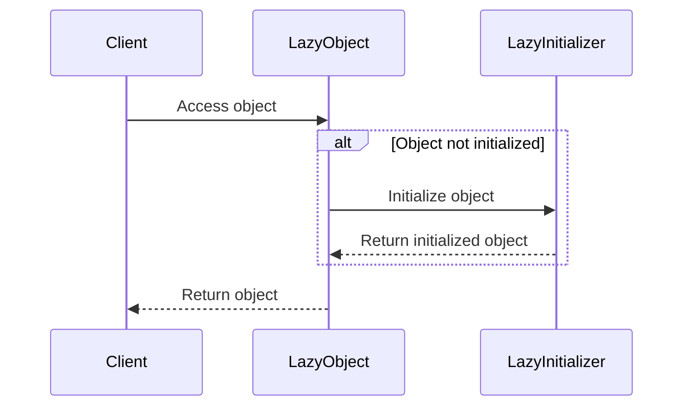

## 5.8 Lazy Initialization Pattern

In the world of software engineering, efficient resource management is crucial, especially when dealing with resource-intensive applications. The Lazy Initialization Pattern is a creational design pattern that addresses this need by delaying the creation of an object until it is actually needed. This approach can significantly enhance performance and resource utilization, particularly in environments where resources are limited or expensive to initialize.

### Intent

The primary intent of the Lazy Initialization Pattern is to improve performance and resource utilization by deferring the creation of objects until they are required. This pattern is particularly useful in scenarios where the cost of creating an object is high, or when the object may not be needed at all during the execution of a program.

### Key Participants

- **Lazy Object**: The object whose creation is deferred until it is needed.
- **Lazy Initializer**: The mechanism that checks whether the object has been initialized and performs the initialization if necessary.
- **Client**: The code that accesses the object and triggers its initialization.

### Applicability

Use the Lazy Initialization Pattern when:

- You have objects that are expensive to create and may not always be needed.
- You want to optimize memory usage by only allocating resources when necessary.
- You need to improve the startup time of an application by deferring the initialization of certain components.

### Implementing Lazy Initialization in Lua

In Lua, lazy initialization can be effectively implemented using metatables. Metatables provide a way to define custom behavior for tables, allowing us to intercept access to uninitialized objects and perform the necessary initialization.

#### Using Metatables for On-Demand Loading

Let's explore how we can use metatables to implement lazy initialization in Lua.

```lua
-- Define a table to hold our lazy-loaded objects
local LazyObject = {}

-- Metatable to handle lazy initialization
local lazyMetatable = {
    __index = function(table, key)
        print("Initializing object for key:", key)
        -- Perform the initialization
        local value = "Initialized Value for " .. key
        -- Store the initialized value in the table
        rawset(table, key, value)
        return value
    end
}

-- Set the metatable for the LazyObject
setmetatable(LazyObject, lazyMetatable)

-- Accessing the object triggers initialization
print(LazyObject["Resource1"]) -- Output: Initializing object for key: Resource1
                               --         Initialized Value for Resource1

-- Subsequent access does not trigger initialization
print(LazyObject["Resource1"]) -- Output: Initialized Value for Resource1
```

In this example, we define a `LazyObject` table and assign it a metatable with an `__index` metamethod. The `__index` metamethod is called whenever an attempt is made to access a key that does not exist in the table. This allows us to perform the initialization only when the object is accessed for the first time.

#### Managing Resource-Intensive Objects Efficiently

Lazy initialization is particularly useful for managing resource-intensive objects, such as large data structures, database connections, or network resources. By deferring their creation, we can reduce the initial load time and memory footprint of our application.

Consider a scenario where we need to load large assets in a game. Using lazy initialization, we can defer the loading of these assets until they are actually needed, improving the overall performance of the game.

```lua
-- Define a table to hold game assets
local GameAssets = {}

-- Metatable for lazy loading of assets
local assetMetatable = {
    __index = function(table, assetName)
        print("Loading asset:", assetName)
        -- Simulate loading a large asset
        local asset = "Large Asset Data for " .. assetName
        -- Store the loaded asset in the table
        rawset(table, assetName, asset)
        return asset
    end
}

-- Set the metatable for the GameAssets
setmetatable(GameAssets, assetMetatable)

-- Accessing an asset triggers loading
print(GameAssets["Texture1"]) -- Output: Loading asset: Texture1
                              --         Large Asset Data for Texture1

-- Subsequent access does not trigger loading
print(GameAssets["Texture1"]) -- Output: Large Asset Data for Texture1
```

In this example, we use lazy initialization to load game assets only when they are accessed for the first time. This approach can significantly reduce the initial load time of the game and improve the overall user experience.

### Use Cases and Examples

The Lazy Initialization Pattern is widely used in various domains, including game development, database management, and network programming. Let's explore some common use cases and examples.

#### Loading Large Assets in Games

In game development, it is common to have large assets, such as textures, models, and sounds, that are not needed immediately. By using lazy initialization, we can defer the loading of these assets until they are actually required, reducing the initial load time and memory usage of the game.

#### Deferring Database Connections Until Required

In database-driven applications, establishing a connection to the database can be an expensive operation. By using lazy initialization, we can defer the creation of database connections until they are actually needed, improving the performance and scalability of the application.

```lua
-- Define a table to hold database connections
local DatabaseConnections = {}

-- Metatable for lazy initialization of database connections
local dbMetatable = {
    __index = function(table, dbName)
        print("Connecting to database:", dbName)
        -- Simulate establishing a database connection
        local connection = "Database Connection for " .. dbName
        -- Store the connection in the table
        rawset(table, dbName, connection)
        return connection
    end
}

-- Set the metatable for the DatabaseConnections
setmetatable(DatabaseConnections, dbMetatable)

-- Accessing a database connection triggers initialization
print(DatabaseConnections["MainDB"]) -- Output: Connecting to database: MainDB
                                     --         Database Connection for MainDB

-- Subsequent access does not trigger initialization
print(DatabaseConnections["MainDB"]) -- Output: Database Connection for MainDB
```

In this example, we use lazy initialization to establish database connections only when they are accessed for the first time. This approach can improve the performance and scalability of database-driven applications.

### Design Considerations

When implementing the Lazy Initialization Pattern, it is important to consider the following design considerations:

- **Thread Safety**: In multi-threaded environments, ensure that the lazy initialization logic is thread-safe to avoid race conditions and inconsistent states.
- **Error Handling**: Handle errors gracefully during the initialization process to prevent the application from crashing or entering an inconsistent state.
- **Performance Trade-offs**: While lazy initialization can improve performance by deferring object creation, it may introduce a slight delay when the object is accessed for the first time. Consider the trade-offs between initial load time and access time.

### Differences and Similarities

The Lazy Initialization Pattern is often confused with other creational patterns, such as the Singleton Pattern and the Factory Method Pattern. While these patterns share some similarities, they serve different purposes:

- **Singleton Pattern**: Ensures that a class has only one instance and provides a global point of access to it. Lazy initialization can be used in conjunction with the Singleton Pattern to defer the creation of the singleton instance.
- **Factory Method Pattern**: Provides an interface for creating objects in a superclass, but allows subclasses to alter the type of objects that will be created. Lazy initialization can be used within a factory method to defer object creation.

### Visualizing Lazy Initialization

To better understand the Lazy Initialization Pattern, let's visualize the process using a sequence diagram.



In this sequence diagram, the client accesses the lazy object, triggering the lazy initializer to perform the initialization if the object has not been initialized yet. Once initialized, the object is returned to the client.

### Try It Yourself

Now that we've explored the Lazy Initialization Pattern, let's encourage you to experiment with the code examples provided. Try modifying the examples to implement lazy initialization for different types of resources, such as network connections or file handles. Experiment with different scenarios and observe how lazy initialization can improve the performance and resource utilization of your applications.

### Knowledge Check

To reinforce your understanding of the Lazy Initialization Pattern, let's pose some questions and challenges:

- What are the key benefits of using the Lazy Initialization Pattern?
- How can metatables be used to implement lazy initialization in Lua?
- What are some common use cases for the Lazy Initialization Pattern?
- How does lazy initialization differ from other creational patterns, such as the Singleton Pattern and the Factory Method Pattern?
- What are some design considerations to keep in mind when implementing lazy initialization?

### Embrace the Journey

Remember, this is just the beginning. As you progress in your journey of mastering Lua design patterns, you'll discover more advanced techniques and patterns that can help you build robust and efficient applications. Keep experimenting, stay curious, and enjoy the journey!

## Quiz Time!



### What is the primary intent of the Lazy Initialization Pattern?

- [x] To improve performance and resource utilization by deferring object creation until needed.
- [ ] To ensure a class has only one instance.
- [ ] To provide an interface for creating objects in a superclass.
- [ ] To separate the construction of a complex object from its representation.

> **Explanation:** The Lazy Initialization Pattern aims to improve performance and resource utilization by deferring the creation of objects until they are actually needed.

### How can metatables be used in Lua to implement lazy initialization?

- [x] By defining an `__index` metamethod to intercept access to uninitialized objects.
- [ ] By using the `__newindex` metamethod to prevent object creation.
- [ ] By overriding the `__call` metamethod to create objects.
- [ ] By setting a metatable with an `__add` metamethod.

> **Explanation:** Metatables can be used to implement lazy initialization by defining an `__index` metamethod that intercepts access to uninitialized objects and performs the necessary initialization.

### Which of the following is a common use case for the Lazy Initialization Pattern?

- [x] Loading large assets in games.
- [ ] Ensuring a class has only one instance.
- [ ] Providing an interface for creating objects in a superclass.
- [ ] Separating the construction of a complex object from its representation.

> **Explanation:** A common use case for the Lazy Initialization Pattern is loading large assets in games, where the loading is deferred until the assets are actually needed.

### What is a potential trade-off when using lazy initialization?

- [x] A slight delay when the object is accessed for the first time.
- [ ] Increased memory usage due to early object creation.
- [ ] Reduced performance due to constant object initialization.
- [ ] Difficulty in maintaining a single instance of a class.

> **Explanation:** A potential trade-off when using lazy initialization is a slight delay when the object is accessed for the first time, as the initialization occurs at that moment.

### How does lazy initialization differ from the Singleton Pattern?

- [x] Lazy initialization defers object creation, while Singleton ensures a single instance.
- [ ] Lazy initialization ensures a single instance, while Singleton defers object creation.
- [ ] Both patterns defer object creation.
- [ ] Both patterns ensure a single instance.

> **Explanation:** Lazy initialization defers object creation until needed, while the Singleton Pattern ensures that a class has only one instance.

### What is a key design consideration when implementing lazy initialization?

- [x] Ensuring thread safety in multi-threaded environments.
- [ ] Ensuring that a class has only one instance.
- [ ] Providing an interface for creating objects in a superclass.
- [ ] Separating the construction of a complex object from its representation.

> **Explanation:** A key design consideration when implementing lazy initialization is ensuring thread safety in multi-threaded environments to avoid race conditions.

### Which metamethod is used in Lua to intercept access to uninitialized objects?

- [x] `__index`
- [ ] `__newindex`
- [ ] `__call`
- [ ] `__add`

> **Explanation:** The `__index` metamethod is used in Lua to intercept access to uninitialized objects and perform the necessary initialization.

### What is the role of the Lazy Initializer in the Lazy Initialization Pattern?

- [x] To check whether the object has been initialized and perform initialization if necessary.
- [ ] To ensure a class has only one instance.
- [ ] To provide an interface for creating objects in a superclass.
- [ ] To separate the construction of a complex object from its representation.

> **Explanation:** The Lazy Initializer checks whether the object has been initialized and performs the initialization if necessary.

### Which of the following is NOT a benefit of using the Lazy Initialization Pattern?

- [ ] Improved performance by deferring object creation.
- [ ] Optimized memory usage by only allocating resources when necessary.
- [ ] Reduced startup time by deferring initialization of components.
- [x] Ensuring a class has only one instance.

> **Explanation:** Ensuring a class has only one instance is a benefit of the Singleton Pattern, not the Lazy Initialization Pattern.

### True or False: Lazy initialization can be used in conjunction with the Singleton Pattern.

- [x] True
- [ ] False

> **Explanation:** Lazy initialization can be used in conjunction with the Singleton Pattern to defer the creation of the singleton instance until it is needed.


