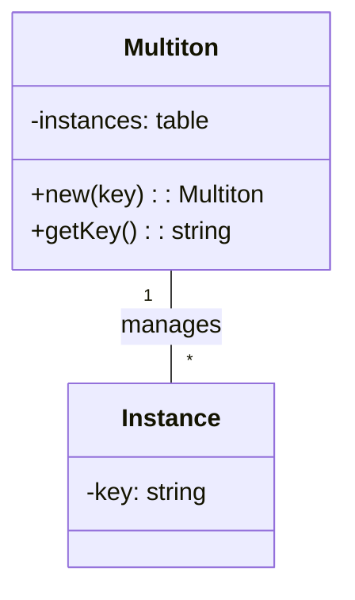

## 5.9 Multiton Pattern

In the realm of software design patterns, the Multiton pattern stands out as a sophisticated approach to managing multiple instances of a class, each identified by a unique key. This pattern is particularly useful when you need to control the number of instances and ensure that each key corresponds to a single instance. In this section, we will delve into the Multiton pattern, its implementation in Lua, and explore its practical applications.

### Understanding the Multiton Pattern

The Multiton pattern is an extension of the Singleton pattern. While the Singleton pattern restricts the instantiation of a class to a single object, the Multiton pattern allows for multiple instances, each associated with a unique key. This pattern is ideal for scenarios where you need to manage a fixed number of instances, such as configuration settings for different environments or managing connections to different databases.

#### Key Characteristics of the Multiton Pattern

- **Controlled Instance Creation**: Instances are created only when requested with a unique key.
- **Centralized Management**: All instances are managed centrally, typically within a table or dictionary.
- **Key-Based Access**: Each instance is accessed via a unique key, ensuring organized and predictable instance management.

### Implementing the Multiton Pattern in Lua

Lua, with its flexible table structures and dynamic typing, provides an excellent platform for implementing the Multiton pattern. Let's explore how to implement this pattern step by step.

#### Step 1: Define the Multiton Class

First, we need to define a class that will serve as the blueprint for our instances. In Lua, we can simulate classes using tables and metatables.

```lua
-- Define the Multiton class
local Multiton = {}
Multiton.__index = Multiton

-- Table to hold instances
local instances = {}

-- Constructor for the Multiton class
function Multiton:new(key)
    -- Check if an instance with the given key already exists
    if instances[key] then
        return instances[key]
    end

    -- Create a new instance
    local instance = setmetatable({}, Multiton)
    instance.key = key
    -- Store the instance in the instances table
    instances[key] = instance
    return instance
end

-- Method to get the key of the instance
function Multiton:getKey()
    return self.key
end

return Multiton
```

#### Step 2: Accessing Instances

With the Multiton class defined, we can now create and access instances using unique keys. The `new` method ensures that only one instance per key is created.

```lua
-- Import the Multiton class
local Multiton = require("Multiton")

-- Create instances with unique keys
local instance1 = Multiton:new("config1")
local instance2 = Multiton:new("config2")

-- Access the same instance using the same key
local sameInstance1 = Multiton:new("config1")

-- Verify that the instances are the same
print(instance1 == sameInstance1)  -- Output: true
print(instance1:getKey())          -- Output: config1
print(instance2:getKey())          -- Output: config2
```

### Visualizing the Multiton Pattern

To better understand the Multiton pattern, let's visualize the relationship between keys and instances using a class diagram.



**Diagram Description**: The diagram illustrates the Multiton class managing multiple instances, each associated with a unique key. The `instances` table holds these key-instance pairs, ensuring controlled access and creation.

### Use Cases and Examples

The Multiton pattern is versatile and can be applied in various scenarios. Let's explore some practical use cases.

#### Use Case 1: Configuration Management

In applications with multiple environments (e.g., development, testing, production), the Multiton pattern can manage configuration settings for each environment.

```lua
-- Configuration class using Multiton pattern
local Configuration = require("Multiton")

-- Create configurations for different environments
local devConfig = Configuration:new("development")
local testConfig = Configuration:new("testing")
local prodConfig = Configuration:new("production")

-- Set and get configuration values
devConfig.database = "dev_db"
testConfig.database = "test_db"
prodConfig.database = "prod_db"

print(devConfig.database)  -- Output: dev_db
print(testConfig.database) -- Output: test_db
print(prodConfig.database) -- Output: prod_db
```

#### Use Case 2: Database Connection Pooling

When dealing with multiple databases, the Multiton pattern can manage connections, ensuring each database has a single connection instance.

```lua
-- Database connection class using Multiton pattern
local DatabaseConnection = require("Multiton")

-- Create connections for different databases
local userDB = DatabaseConnection:new("userDB")
local orderDB = DatabaseConnection:new("orderDB")

-- Set connection details
userDB.connectionString = "user_db_connection"
orderDB.connectionString = "order_db_connection"

print(userDB.connectionString)  -- Output: user_db_connection
print(orderDB.connectionString) -- Output: order_db_connection
```

### Design Considerations

When implementing the Multiton pattern, consider the following:

- **Memory Management**: Ensure that instances are properly managed and released when no longer needed to avoid memory leaks.
- **Thread Safety**: In multi-threaded environments, consider synchronization mechanisms to ensure thread safety.
- **Key Management**: Choose a robust key management strategy to avoid collisions and ensure uniqueness.

### Differences and Similarities with Other Patterns

The Multiton pattern is often compared to the Singleton pattern. Here are some key differences and similarities:

- **Similarity**: Both patterns control the instantiation of a class.
- **Difference**: Singleton restricts to a single instance, while Multiton allows multiple instances, each identified by a key.
- **Use Case**: Use Singleton for global state management and Multiton for managing multiple instances with unique identifiers.

### Try It Yourself

To deepen your understanding of the Multiton pattern, try modifying the code examples:

- **Experiment with Different Keys**: Create instances with different keys and observe how they are managed.
- **Add Methods**: Extend the Multiton class with additional methods to manipulate instance data.
- **Implement Thread Safety**: If you're working in a multi-threaded environment, implement synchronization to ensure thread safety.

### References and Links

For further reading on design patterns and Lua programming, consider the following resources:

- [Design Patterns: Elements of Reusable Object-Oriented Software](https://en.wikipedia.org/wiki/Design_Patterns) - A foundational book on design patterns.
- [Lua Programming Guide](https://www.lua.org/manual/5.4/) - Official Lua documentation.
- [Singleton Pattern](https://refactoring.guru/design-patterns/singleton) - Understanding the Singleton pattern.

### Knowledge Check

Before moving on, let's reinforce what we've learned with a few questions.

- **What is the primary purpose of the Multiton pattern?**
- **How does the Multiton pattern differ from the Singleton pattern?**
- **What are some practical use cases for the Multiton pattern?**

### Embrace the Journey

Remember, mastering design patterns is a journey. As you continue to explore and implement these patterns, you'll gain a deeper understanding of software architecture and design. Keep experimenting, stay curious, and enjoy the process!

## Quiz Time!



### What is the primary purpose of the Multiton pattern?

- [x] To manage multiple instances of a class using unique keys
- [ ] To restrict a class to a single instance
- [ ] To create instances without using a constructor
- [ ] To manage memory allocation for instances

> **Explanation:** The Multiton pattern is designed to manage multiple instances of a class, each identified by a unique key.

### How does the Multiton pattern differ from the Singleton pattern?

- [x] Multiton allows multiple instances, Singleton restricts to one
- [ ] Singleton allows multiple instances, Multiton restricts to one
- [ ] Both patterns allow multiple instances
- [ ] Both patterns restrict to a single instance

> **Explanation:** The Singleton pattern restricts a class to a single instance, while the Multiton pattern allows for multiple instances, each associated with a unique key.

### Which data structure is commonly used to implement the Multiton pattern in Lua?

- [x] Table
- [ ] Array
- [ ] Linked List
- [ ] Stack

> **Explanation:** In Lua, tables are commonly used to implement the Multiton pattern, as they can store key-value pairs efficiently.

### What is a practical use case for the Multiton pattern?

- [x] Managing configuration settings for different environments
- [ ] Implementing a global logging system
- [ ] Creating a single database connection
- [ ] Managing user sessions in a web application

> **Explanation:** The Multiton pattern is ideal for managing configuration settings for different environments, where each environment is identified by a unique key.

### What should be considered when implementing the Multiton pattern?

- [x] Memory management and thread safety
- [ ] Only memory management
- [ ] Only thread safety
- [ ] Neither memory management nor thread safety

> **Explanation:** When implementing the Multiton pattern, it's important to consider both memory management and thread safety to ensure efficient and safe operation.

### In what scenario would you use the Multiton pattern over the Singleton pattern?

- [x] When multiple instances are needed, each identified by a key
- [ ] When only one instance is needed globally
- [ ] When instances need to be created dynamically
- [ ] When instances need to be destroyed frequently

> **Explanation:** The Multiton pattern is used when multiple instances are needed, each identified by a unique key, unlike the Singleton pattern which is used for a single global instance.

### What is a key characteristic of the Multiton pattern?

- [x] Key-based access to instances
- [ ] Random access to instances
- [ ] Sequential access to instances
- [ ] No access control for instances

> **Explanation:** The Multiton pattern provides key-based access to instances, ensuring organized and predictable management.

### Which of the following is a similarity between the Multiton and Singleton patterns?

- [x] Both control the instantiation of a class
- [ ] Both allow multiple instances
- [ ] Both use arrays for instance management
- [ ] Both are used for database connections

> **Explanation:** Both the Multiton and Singleton patterns control the instantiation of a class, but in different ways.

### Can the Multiton pattern be used for database connection pooling?

- [x] Yes
- [ ] No

> **Explanation:** Yes, the Multiton pattern can be used for database connection pooling by managing connections with unique keys for each database.

### True or False: The Multiton pattern is a type of creational design pattern.

- [x] True
- [ ] False

> **Explanation:** True, the Multiton pattern is a creational design pattern that focuses on the creation of instances based on unique keys.


