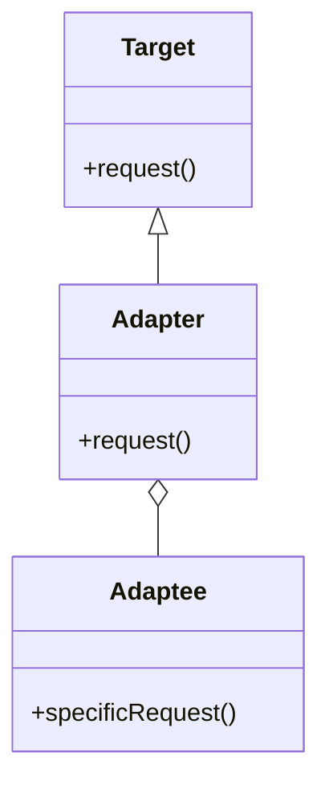

## 6.1 Adapter Pattern

The Adapter Pattern is a structural design pattern that allows objects with incompatible interfaces to work together. It acts as a bridge between two incompatible interfaces, enabling them to communicate effectively. In Lua, this pattern can be implemented using various techniques such as wrapper functions, adapter tables, and metatables. Let's delve into the details of the Adapter Pattern and explore how it can be effectively utilized in Lua programming.

### Intent

The primary intent of the Adapter Pattern is to convert the interface of a class into another interface that clients expect. This pattern allows classes to work together that couldn't otherwise because of incompatible interfaces. By using an adapter, we can integrate third-party libraries, allow legacy code to interact with new systems, and convert data formats between different systems.

### Key Participants

1. **Target Interface**: The interface that the client expects.
2. **Adaptee**: The existing interface that needs adapting.
3. **Adapter**: The class that bridges the gap between the Target and the Adaptee.
4. **Client**: The entity that interacts with the Target interface.

### Implementing Adapter in Lua

#### Wrapper Functions

Wrapper functions are a straightforward way to implement the Adapter Pattern in Lua. These functions act as intermediaries that translate or map function calls from one interface to another.

```lua
-- Adaptee: The existing interface
local OldInterface = {}

function OldInterface.oldMethod()
    print("Old method executed")
end

-- Adapter: A wrapper function that adapts the old interface to the new one
local function newMethodAdapter()
    OldInterface.oldMethod()
end

-- Client: Using the new interface
newMethodAdapter()  -- Output: Old method executed
```

In this example, `newMethodAdapter` acts as an adapter that allows the client to use the `oldMethod` through a new interface.

#### Adapter Tables

Adapter tables use Lua's table data structure to represent objects and adapt their methods to match expected interfaces. This approach is particularly useful when dealing with multiple methods.

```lua
-- Adaptee: The existing interface
local OldInterface = {
    oldMethod1 = function() print("Old method 1 executed") end,
    oldMethod2 = function() print("Old method 2 executed") end
}

-- Adapter: A table that adapts the old interface to the new one
local Adapter = {
    newMethod1 = function() OldInterface.oldMethod1() end,
    newMethod2 = function() OldInterface.oldMethod2() end
}

-- Client: Using the new interface
Adapter.newMethod1()  -- Output: Old method 1 executed
Adapter.newMethod2()  -- Output: Old method 2 executed
```

Here, the `Adapter` table provides a new interface (`newMethod1` and `newMethod2`) that internally calls the methods of the `OldInterface`.

#### Metatables and Metamethods

Metatables and metamethods in Lua provide a powerful mechanism to intercept and redirect method calls, making them ideal for implementing the Adapter Pattern.

```lua
-- Adaptee: The existing interface
local OldInterface = {
    oldMethod = function() print("Old method executed") end
}

-- Adapter: Using metatables to adapt the old interface
local Adapter = {}
setmetatable(Adapter, {
    __index = function(_, key)
        if key == "newMethod" then
            return OldInterface.oldMethod
        end
    end
})

-- Client: Using the new interface
Adapter.newMethod()  -- Output: Old method executed
```

In this example, the `__index` metamethod is used to redirect calls to `newMethod` to the `oldMethod` of the `OldInterface`.

### Use Cases and Examples

#### Integrating Third-Party Libraries

When integrating third-party libraries with different interfaces, the Adapter Pattern can be used to create a uniform interface for the client.

```lua
-- Third-party library with a different interface
local ThirdPartyLib = {
    execute = function() print("Third-party execution") end
}

-- Adapter: Adapting the third-party interface
local Adapter = {
    run = function() ThirdPartyLib.execute() end
}

-- Client: Using the adapted interface
Adapter.run()  -- Output: Third-party execution
```

#### Allowing Legacy Code to Interact with New Systems

Legacy systems often have interfaces that do not match modern requirements. The Adapter Pattern can bridge this gap.

```lua
-- Legacy system with an old interface
local LegacySystem = {
    legacyOperation = function() print("Legacy operation") end
}

-- Adapter: Adapting the legacy interface
local Adapter = {
    modernOperation = function() LegacySystem.legacyOperation() end
}

-- Client: Using the modern interface
Adapter.modernOperation()  -- Output: Legacy operation
```

#### Converting Data Formats Between Systems

The Adapter Pattern can also be used to convert data formats between different systems, ensuring compatibility.

```lua
-- System A with a specific data format
local SystemA = {
    getData = function() return {name = "Alice", age = 30} end
}

-- Adapter: Converting data format for System B
local Adapter = {
    getFormattedData = function()
        local data = SystemA.getData()
        return string.format("Name: %s, Age: %d", data.name, data.age)
    end
}

-- Client: Using the formatted data
print(Adapter.getFormattedData())  -- Output: Name: Alice, Age: 30
```

### Design Considerations

- **When to Use**: Use the Adapter Pattern when you need to integrate incompatible interfaces, especially when dealing with legacy systems or third-party libraries.
- **Performance**: Consider the performance implications of using adapters, particularly when using metatables, as they may introduce overhead.
- **Complexity**: Avoid unnecessary complexity by using the simplest form of adapter that meets your needs, such as wrapper functions for straightforward adaptations.

### Differences and Similarities

The Adapter Pattern is often confused with the Decorator Pattern, as both involve wrapping objects. However, the Adapter Pattern focuses on converting interfaces, while the Decorator Pattern adds new behavior to existing objects without altering their interface.

### Visualizing the Adapter Pattern



**Diagram Description**: This class diagram illustrates the relationship between the Target, Adapter, and Adaptee. The Adapter implements the Target interface and holds a reference to the Adaptee, allowing it to convert calls to the Target's `request()` method into calls to the Adaptee's `specificRequest()` method.

### Try It Yourself

Experiment with the provided code examples by modifying the adapter functions or tables to adapt different methods or interfaces. Try creating an adapter for a different third-party library or legacy system to see how the pattern can be applied in various scenarios.

### Knowledge Check

- What is the primary purpose of the Adapter Pattern?
- How can wrapper functions be used to implement the Adapter Pattern in Lua?
- What role do metatables play in the Adapter Pattern?
- How does the Adapter Pattern differ from the Decorator Pattern?

### Embrace the Journey

Remember, mastering design patterns like the Adapter Pattern is a journey. As you continue to explore and experiment with these patterns, you'll gain a deeper understanding of how to create flexible and maintainable software architectures. Keep experimenting, stay curious, and enjoy the journey!

## Quiz Time!



### What is the primary purpose of the Adapter Pattern?

- [x] To convert the interface of a class into another interface that clients expect.
- [ ] To add new behavior to existing objects without altering their interface.
- [ ] To provide a way to access the elements of an aggregate object sequentially.
- [ ] To define a family of algorithms and make them interchangeable.

> **Explanation:** The Adapter Pattern is used to convert the interface of a class into another interface that clients expect, allowing incompatible interfaces to work together.

### Which of the following is a method to implement the Adapter Pattern in Lua?

- [x] Wrapper functions
- [x] Adapter tables
- [x] Metatables and metamethods
- [ ] Singleton pattern

> **Explanation:** The Adapter Pattern in Lua can be implemented using wrapper functions, adapter tables, and metatables and metamethods.

### What is the role of the Adapter in the Adapter Pattern?

- [x] It bridges the gap between the Target and the Adaptee.
- [ ] It defines a family of algorithms and makes them interchangeable.
- [ ] It provides a way to access the elements of an aggregate object sequentially.
- [ ] It adds new behavior to existing objects without altering their interface.

> **Explanation:** The Adapter acts as a bridge between the Target and the Adaptee, allowing them to work together despite incompatible interfaces.

### How does the Adapter Pattern differ from the Decorator Pattern?

- [x] The Adapter Pattern focuses on converting interfaces, while the Decorator Pattern adds new behavior.
- [ ] The Adapter Pattern adds new behavior, while the Decorator Pattern converts interfaces.
- [ ] Both patterns focus on converting interfaces.
- [ ] Both patterns add new behavior to existing objects.

> **Explanation:** The Adapter Pattern focuses on converting interfaces, while the Decorator Pattern adds new behavior to existing objects without altering their interface.

### What is a potential performance consideration when using the Adapter Pattern?

- [x] Metatables may introduce overhead.
- [ ] Wrapper functions may introduce overhead.
- [ ] Adapter tables may introduce overhead.
- [ ] The Adapter Pattern does not have any performance considerations.

> **Explanation:** Using metatables in the Adapter Pattern may introduce overhead, so it's important to consider performance implications.

### When should you use the Adapter Pattern?

- [x] When you need to integrate incompatible interfaces.
- [ ] When you need to add new behavior to existing objects.
- [ ] When you need to provide a way to access the elements of an aggregate object sequentially.
- [ ] When you need to define a family of algorithms and make them interchangeable.

> **Explanation:** The Adapter Pattern is used when you need to integrate incompatible interfaces, such as when dealing with legacy systems or third-party libraries.

### Which of the following is NOT a key participant in the Adapter Pattern?

- [ ] Target Interface
- [ ] Adaptee
- [x] Decorator
- [ ] Client

> **Explanation:** The Decorator is not a key participant in the Adapter Pattern. The key participants are the Target Interface, Adaptee, Adapter, and Client.

### What is the role of the Client in the Adapter Pattern?

- [x] It interacts with the Target interface.
- [ ] It bridges the gap between the Target and the Adaptee.
- [ ] It defines a family of algorithms and makes them interchangeable.
- [ ] It provides a way to access the elements of an aggregate object sequentially.

> **Explanation:** The Client interacts with the Target interface, which is adapted by the Adapter to work with the Adaptee.

### True or False: The Adapter Pattern can be used to convert data formats between systems.

- [x] True
- [ ] False

> **Explanation:** True. The Adapter Pattern can be used to convert data formats between systems, ensuring compatibility.

### True or False: The Adapter Pattern is often confused with the Singleton Pattern.

- [ ] True
- [x] False

> **Explanation:** False. The Adapter Pattern is often confused with the Decorator Pattern, not the Singleton Pattern.


