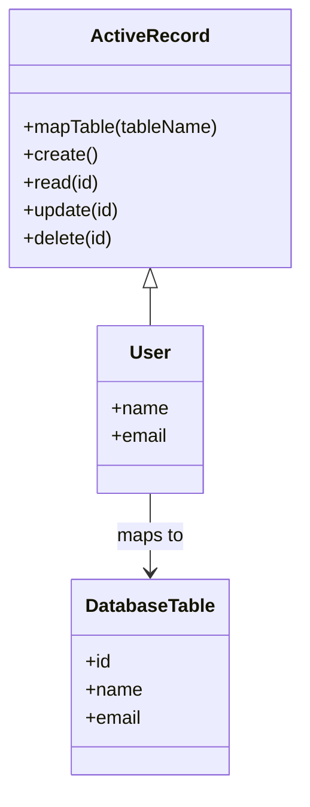

## 6.10.1 Active Record Pattern

The Active Record pattern is a cornerstone of Object-Relational Mapping (ORM) techniques, providing a seamless bridge between object-oriented programming and relational databases. In Lua, this pattern encapsulates database access within objects that represent data, offering a streamlined approach to interacting with databases. This section will guide you through the intricacies of implementing the Active Record pattern in Lua, covering everything from mapping tables to classes, performing CRUD operations, and abstracting SQL interactions.

### Object-Relational Mapping (ORM)

Object-Relational Mapping (ORM) is a programming technique that allows developers to interact with a database using objects rather than SQL queries. This abstraction layer simplifies database operations, making it easier to manage data within an application. The Active Record pattern is a popular ORM approach where each database table is represented by a class, and each row in the table corresponds to an instance of that class.

#### Key Concepts of Active Record

- **Encapsulation**: The Active Record pattern encapsulates database access logic within objects, promoting a clean separation of concerns.
- **CRUD Operations**: Active Record provides methods for Create, Read, Update, and Delete operations, simplifying data manipulation.
- **SQL Abstraction**: By abstracting SQL queries, Active Record allows developers to focus on business logic rather than database syntax.

### Implementing Active Record in Lua

Implementing the Active Record pattern in Lua involves several key steps, including mapping tables to classes, defining CRUD operations, and abstracting SQL interactions. Let's explore each of these components in detail.

#### Mapping Tables to Classes

In the Active Record pattern, each database table is represented by a class. This class encapsulates the table's structure and provides methods for interacting with the data.

```lua
-- Define a base class for Active Record
local ActiveRecord = {}
ActiveRecord.__index = ActiveRecord

-- Constructor for creating a new instance
function ActiveRecord:new(data)
    local instance = setmetatable({}, self)
    instance.data = data or {}
    return instance
end

-- Method to map a table to a class
function ActiveRecord:mapTable(tableName)
    self.tableName = tableName
end

-- Example usage
local User = setmetatable({}, ActiveRecord)
User:mapTable("users")
```

In this example, we define a base `ActiveRecord` class with a `mapTable` method to associate a class with a specific database table. The `User` class is then created as an instance of `ActiveRecord`, mapped to the "users" table.

#### CRUD Operations

CRUD operations are fundamental to the Active Record pattern, providing a standardized way to interact with database records.

```lua
-- Method to create a new record
function ActiveRecord:create()
    local columns, values = {}, {}
    for column, value in pairs(self.data) do
        table.insert(columns, column)
        table.insert(values, "'" .. value .. "'")
    end
    local sql = string.format("INSERT INTO %s (%s) VALUES (%s)", self.tableName, table.concat(columns, ", "), table.concat(values, ", "))
    -- Execute SQL (pseudo-code)
    executeSQL(sql)
end

-- Method to read records
function ActiveRecord:read(id)
    local sql = string.format("SELECT * FROM %s WHERE id = %d", self.tableName, id)
    -- Execute SQL and fetch result (pseudo-code)
    local result = executeSQL(sql)
    return result
end

-- Method to update a record
function ActiveRecord:update(id)
    local updates = {}
    for column, value in pairs(self.data) do
        table.insert(updates, string.format("%s = '%s'", column, value))
    end
    local sql = string.format("UPDATE %s SET %s WHERE id = %d", self.tableName, table.concat(updates, ", "), id)
    -- Execute SQL (pseudo-code)
    executeSQL(sql)
end

-- Method to delete a record
function ActiveRecord:delete(id)
    local sql = string.format("DELETE FROM %s WHERE id = %d", self.tableName, id)
    -- Execute SQL (pseudo-code)
    executeSQL(sql)
end

-- Example usage
local user = User:new({name = "John Doe", email = "john@example.com"})
user:create()
local fetchedUser = user:read(1)
user:update(1)
user:delete(1)
```

In this code snippet, we define methods for creating, reading, updating, and deleting records. Each method constructs an SQL query based on the table name and data, demonstrating how Active Record abstracts SQL interactions.

#### SQL Abstraction

One of the key benefits of the Active Record pattern is its ability to abstract SQL queries, allowing developers to focus on application logic rather than database syntax.

```lua
-- Abstract SQL execution (pseudo-code)
function executeSQL(sql)
    -- Connect to database and execute SQL
    -- Return result or handle errors
end
```

The `executeSQL` function serves as a placeholder for executing SQL queries. In a real-world application, this function would connect to a database, execute the query, and handle any errors that occur.

### Use Cases and Examples

The Active Record pattern is particularly useful in scenarios where rapid application development is a priority. By simplifying database interactions, Active Record allows developers to focus on building features rather than managing data access.

#### Simplifying Database Code

Active Record reduces the complexity of database code by encapsulating SQL queries within objects. This approach promotes code reusability and maintainability, making it easier to manage changes to the database schema.

#### Rapid Application Development

In environments where time-to-market is critical, the Active Record pattern enables rapid application development by providing a straightforward way to interact with databases. This simplicity allows developers to iterate quickly and deliver features faster.

### Visualizing Active Record Pattern

To better understand the Active Record pattern, let's visualize the relationship between classes, objects, and database tables.



This class diagram illustrates how the `User` class inherits from `ActiveRecord` and maps to a `DatabaseTable`. Each method in the `ActiveRecord` class corresponds to a CRUD operation on the database table.

### Design Considerations

When implementing the Active Record pattern in Lua, consider the following design considerations:

- **Performance**: While Active Record simplifies database interactions, it may introduce performance overhead due to the abstraction layer. Optimize SQL queries and use indexing to mitigate performance issues.
- **Scalability**: For applications with complex data relationships, consider using a more sophisticated ORM framework that supports advanced features like lazy loading and caching.
- **Security**: Ensure that SQL queries are properly sanitized to prevent SQL injection attacks. Use parameterized queries or ORM features that handle query sanitization.

### Differences and Similarities

The Active Record pattern is often compared to the Data Mapper pattern, another ORM approach. While both patterns aim to abstract database interactions, they differ in their implementation:

- **Active Record**: Encapsulates database access within objects, providing a simple and intuitive interface for CRUD operations. Suitable for applications with straightforward data models.
- **Data Mapper**: Separates database access logic from domain objects, offering greater flexibility and control over data interactions. Ideal for complex applications with intricate data relationships.

### Try It Yourself

To deepen your understanding of the Active Record pattern, try modifying the code examples provided. Experiment with different table structures, add new methods to the `ActiveRecord` class, or integrate the pattern into a sample application. By exploring these variations, you'll gain a better grasp of how Active Record can be applied in real-world scenarios.

### References and Links

For further reading on the Active Record pattern and ORM techniques, consider exploring the following resources:

- [Active Record on Wikipedia](https://en.wikipedia.org/wiki/Active_record_pattern)
- [Lua Programming Guide](https://www.lua.org/manual/5.4/)
- [SQL Injection Prevention](https://owasp.org/www-community/attacks/SQL_Injection)

### Knowledge Check

Before moving on, take a moment to review the key concepts covered in this section. Consider the following questions:

- How does the Active Record pattern encapsulate database access?
- What are the benefits of using Active Record for rapid application development?
- How can you optimize SQL queries in an Active Record implementation?

### Embrace the Journey

Remember, mastering the Active Record pattern is just one step in your journey as a software engineer. As you continue to explore Lua design patterns, you'll discover new ways to build robust, efficient applications. Keep experimenting, stay curious, and enjoy the journey!

## Quiz Time!



### What is the primary purpose of the Active Record pattern?

- [x] To encapsulate database access within objects
- [ ] To separate database access logic from domain objects
- [ ] To provide a graphical user interface for database operations
- [ ] To optimize database performance

> **Explanation:** The Active Record pattern encapsulates database access within objects, providing a simple interface for CRUD operations.

### Which method in the Active Record pattern is used to create a new record?

- [x] create()
- [ ] read()
- [ ] update()
- [ ] delete()

> **Explanation:** The `create()` method is used to insert a new record into the database.

### What does ORM stand for?

- [x] Object-Relational Mapping
- [ ] Object-Resource Management
- [ ] Online Resource Management
- [ ] Object-Relational Model

> **Explanation:** ORM stands for Object-Relational Mapping, a technique for interacting with databases using objects.

### In the Active Record pattern, what does each class represent?

- [x] A database table
- [ ] A database column
- [ ] A database row
- [ ] A database index

> **Explanation:** In Active Record, each class represents a database table, and each instance corresponds to a row in that table.

### What is a key benefit of using Active Record for rapid application development?

- [x] Simplifies database interactions
- [ ] Increases database complexity
- [ ] Requires extensive SQL knowledge
- [ ] Slows down development process

> **Explanation:** Active Record simplifies database interactions, allowing developers to focus on building features quickly.

### How can you prevent SQL injection attacks in an Active Record implementation?

- [x] Use parameterized queries
- [ ] Use plain SQL strings
- [ ] Disable database indexing
- [ ] Avoid using SQL altogether

> **Explanation:** Parameterized queries help prevent SQL injection by ensuring that user input is properly sanitized.

### What is a potential drawback of the Active Record pattern?

- [x] Performance overhead due to abstraction
- [ ] Lack of encapsulation
- [ ] Inability to perform CRUD operations
- [ ] Requires extensive database knowledge

> **Explanation:** The abstraction layer in Active Record can introduce performance overhead, especially in complex applications.

### Which pattern is often compared to Active Record?

- [x] Data Mapper
- [ ] Singleton
- [ ] Observer
- [ ] Factory Method

> **Explanation:** The Data Mapper pattern is often compared to Active Record, as both are ORM techniques with different approaches.

### True or False: The Active Record pattern is suitable for applications with complex data relationships.

- [ ] True
- [x] False

> **Explanation:** Active Record is more suitable for applications with straightforward data models. For complex relationships, Data Mapper may be more appropriate.

### What is the role of the `mapTable` method in the Active Record pattern?

- [x] To associate a class with a database table
- [ ] To execute SQL queries
- [ ] To update database records
- [ ] To delete database records

> **Explanation:** The `mapTable` method associates a class with a specific database table, enabling CRUD operations on that table.


