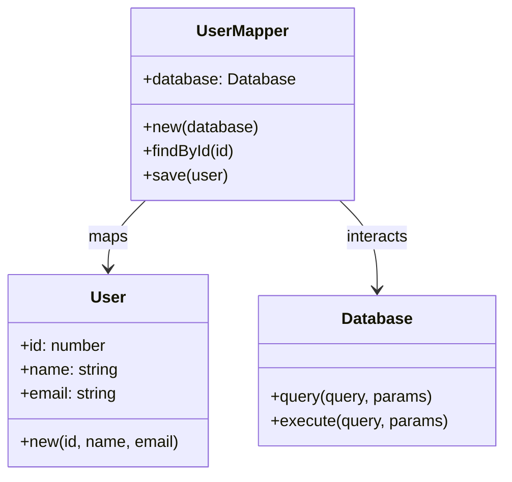

## 6.10.2 Data Mapper Pattern

In the realm of software design, the Data Mapper Pattern is a powerful structural design pattern that plays a crucial role in separating data and domain logic. By mapping objects to the database without requiring the objects to know about the database, this pattern provides a clean separation of concerns, enhancing the flexibility and maintainability of your application. In this section, we will delve into the intricacies of implementing the Data Mapper Pattern in Lua, explore its use cases, and provide practical examples to solidify your understanding.

### Intent

The primary intent of the Data Mapper Pattern is to separate the in-memory representation of data from the database, allowing domain objects to remain unaware of the underlying data storage mechanisms. This separation facilitates the implementation of complex business logic without being constrained by the specifics of data access.

### Key Participants

1. **Domain Objects**: These are the objects that represent the business logic and are independent of the database.
2. **Mapper Objects**: These are responsible for transferring data between the domain objects and the database.
3. **Database**: The storage system where data is persisted.

### Applicability

The Data Mapper Pattern is particularly useful in scenarios where:
- Complex business logic needs to be implemented without being tightly coupled to data storage.
- Flexibility in data storage is required, allowing for changes in the database schema without affecting the domain logic.
- A clear separation of concerns is desired to enhance maintainability and testability.

### Implementing Data Mapper in Lua

#### Mapper Objects

Mapper objects are the backbone of the Data Mapper Pattern. They are responsible for handling the data access logic, including CRUD (Create, Read, Update, Delete) operations. In Lua, we can implement mapper objects using tables and functions.

```lua
-- Define a simple User domain object
User = {}
User.__index = User

function User:new(id, name, email)
    local user = setmetatable({}, User)
    user.id = id
    user.name = name
    user.email = email
    return user
end

-- Define a UserMapper responsible for data access
UserMapper = {}
UserMapper.__index = UserMapper

function UserMapper:new(database)
    local mapper = setmetatable({}, UserMapper)
    mapper.database = database
    return mapper
end

function UserMapper:findById(id)
    -- Simulate a database query
    local userData = self.database:query("SELECT * FROM users WHERE id = ?", id)
    if userData then
        return User:new(userData.id, userData.name, userData.email)
    end
    return nil
end

function UserMapper:save(user)
    -- Simulate saving to the database
    self.database:execute("INSERT INTO users (id, name, email) VALUES (?, ?, ?)", user.id, user.name, user.email)
end
```

In this example, the `UserMapper` class is responsible for interacting with the database, while the `User` class remains unaware of how data is stored or retrieved.

#### Decoupling Domain Objects

One of the main advantages of the Data Mapper Pattern is the decoupling of domain objects from data storage. This decoupling allows for greater flexibility and easier testing, as domain objects can be tested independently of the database.

```lua
-- Test the User domain object independently
local user = User:new(1, "John Doe", "john.doe@example.com")
assert(user.name == "John Doe")

-- Test the UserMapper with a mock database
local mockDatabase = {
    query = function(_, query, id)
        if id == 1 then
            return {id = 1, name = "John Doe", email = "john.doe@example.com"}
        end
        return nil
    end,
    execute = function(_, query, id, name, email)
        print("User saved:", id, name, email)
    end
}

local userMapper = UserMapper:new(mockDatabase)
local retrievedUser = userMapper:findById(1)
assert(retrievedUser.name == "John Doe")
```

In this test, we use a mock database to verify the functionality of the `UserMapper` without relying on an actual database connection.

### Use Cases and Examples

#### Complex Business Logic

The Data Mapper Pattern is ideal for applications with complex business logic that should not be tightly coupled to data storage. For instance, in a financial application, business rules and calculations can be encapsulated within domain objects, while data access is handled by mapper objects.

#### Applications Requiring Flexibility in Data Storage

Applications that require flexibility in data storage, such as those that may switch between different database systems, benefit greatly from the Data Mapper Pattern. By isolating data access logic within mapper objects, changes to the database schema or technology can be made with minimal impact on the domain logic.

### Design Considerations

When implementing the Data Mapper Pattern in Lua, consider the following:

- **Performance**: Ensure that the data access logic is optimized for performance, especially when dealing with large datasets.
- **Complexity**: While the pattern provides a clean separation of concerns, it can introduce additional complexity. Ensure that the benefits outweigh the costs in your specific use case.
- **Testing**: Take advantage of the decoupling to write comprehensive tests for both domain objects and mapper objects.

### Differences and Similarities

The Data Mapper Pattern is often compared to the Active Record Pattern. While both patterns deal with data access, they have distinct differences:

- **Data Mapper**: Separates data access logic from domain objects, providing greater flexibility and decoupling.
- **Active Record**: Combines data access logic with domain objects, simplifying implementation but potentially leading to tighter coupling.

### Visualizing the Data Mapper Pattern

To better understand the Data Mapper Pattern, let's visualize the interaction between domain objects, mapper objects, and the database.



In this diagram, the `UserMapper` class maps the `User` domain object to the `Database`, handling all data access logic.

### Try It Yourself

To deepen your understanding of the Data Mapper Pattern, try modifying the code examples:

- Add additional fields to the `User` class and update the `UserMapper` to handle these fields.
- Implement additional methods in the `UserMapper`, such as `update` and `delete`.
- Experiment with different database backends by modifying the `mockDatabase` implementation.

### References and Links

For further reading on the Data Mapper Pattern and related topics, consider the following resources:

- [Martin Fowler's Patterns of Enterprise Application Architecture](https://martinfowler.com/eaaCatalog/dataMapper.html)
- [Lua Programming Guide](https://www.lua.org/manual/5.4/)
- [Design Patterns in Lua](https://www.lua.org/pil/16.html)

### Knowledge Check

Before moving on, let's summarize the key takeaways:

- The Data Mapper Pattern separates data access logic from domain objects, enhancing flexibility and maintainability.
- Mapper objects handle all interactions with the database, allowing domain objects to focus on business logic.
- This pattern is ideal for applications with complex business logic or those requiring flexibility in data storage.

## Quiz Time!



### What is the primary intent of the Data Mapper Pattern?

- [x] To separate data access logic from domain objects
- [ ] To combine data access logic with domain objects
- [ ] To simplify database interactions
- [ ] To enhance database performance

> **Explanation:** The Data Mapper Pattern aims to separate data access logic from domain objects, allowing for greater flexibility and maintainability.

### Which of the following is a key participant in the Data Mapper Pattern?

- [x] Mapper Objects
- [ ] Controller Objects
- [ ] View Objects
- [ ] Service Objects

> **Explanation:** Mapper Objects are responsible for transferring data between domain objects and the database.

### What is a benefit of using the Data Mapper Pattern?

- [x] Flexibility in data storage
- [ ] Tighter coupling between domain and data
- [ ] Simplified domain logic
- [ ] Enhanced database performance

> **Explanation:** The Data Mapper Pattern provides flexibility in data storage by decoupling domain objects from data access logic.

### How does the Data Mapper Pattern differ from the Active Record Pattern?

- [x] It separates data access logic from domain objects
- [ ] It combines data access logic with domain objects
- [ ] It simplifies implementation
- [ ] It enhances database performance

> **Explanation:** The Data Mapper Pattern separates data access logic from domain objects, unlike the Active Record Pattern, which combines them.

### What is a potential drawback of the Data Mapper Pattern?

- [x] Increased complexity
- [ ] Tighter coupling
- [ ] Reduced flexibility
- [ ] Simplified testing

> **Explanation:** The Data Mapper Pattern can introduce additional complexity due to the separation of concerns.

### In the provided code example, what does the `UserMapper:findById` method do?

- [x] Retrieves a user from the database by ID
- [ ] Saves a user to the database
- [ ] Updates a user in the database
- [ ] Deletes a user from the database

> **Explanation:** The `UserMapper:findById` method retrieves a user from the database by their ID.

### What is the role of the `mockDatabase` in the code example?

- [x] To simulate database interactions for testing
- [ ] To store user data permanently
- [ ] To enhance database performance
- [ ] To simplify domain logic

> **Explanation:** The `mockDatabase` simulates database interactions for testing purposes.

### Which of the following is a use case for the Data Mapper Pattern?

- [x] Applications with complex business logic
- [ ] Simple CRUD applications
- [ ] Applications with no database
- [ ] Applications with static data

> **Explanation:** The Data Mapper Pattern is ideal for applications with complex business logic that should not be tightly coupled to data storage.

### True or False: The Data Mapper Pattern requires domain objects to know about the database.

- [ ] True
- [x] False

> **Explanation:** The Data Mapper Pattern ensures that domain objects remain unaware of the database, focusing solely on business logic.

### What is a key advantage of decoupling domain objects from data storage?

- [x] Easier testing and maintainability
- [ ] Increased database performance
- [ ] Simplified domain logic
- [ ] Reduced flexibility

> **Explanation:** Decoupling domain objects from data storage allows for easier testing and maintainability.



Remember, mastering the Data Mapper Pattern is just one step in your journey to becoming a proficient Lua developer. Keep experimenting, stay curious, and enjoy the process of learning and applying design patterns in your projects!
